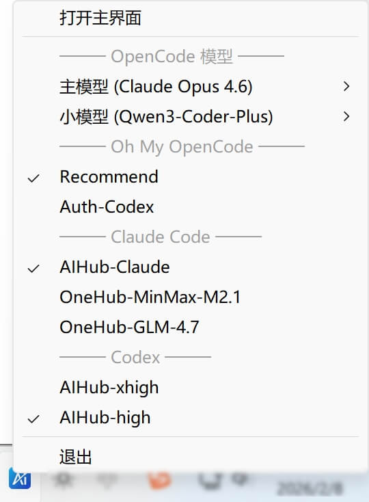

# AI Toolbox

<p align="center">
  
</p>

<p align="center">
  <strong>个人 AI 工具箱</strong> - 一站式管理 AI 编程助手配置
</p>

<p align="center">
  <a href="https://github.com/coulsontl/ai-toolbox/releases">
    
  </a>
  <a href="https://github.com/coulsontl/ai-toolbox/blob/main/LICENSE">
    
  </a>
  <a href="https://github.com/coulsontl/ai-toolbox/releases">
    
  </a>
</p>

---

## 简介

AI Toolbox 是一个跨平台桌面应用，旨在帮助开发者高效管理各类 AI 编程助手的配置。支持 **Windows**、**macOS** 和 **Linux**。

### 主要功能

- **OpenCode 配置管理** - 可视化管理 OpenCode 的供应商和模型配置，支持列表页快速启停
- **Oh-My-OpenCode / Slim 插件配置管理** - 可视化管理 Oh-My-OpenCode 及 Oh-My-OpenCode Slim 插件的配置
- **Claude Code 配置管理** - 一键切换 Claude Code 的 API 供应商配置，支持动态获取模型列表
- **供应商管理** - 统一管理多个 AI 供应商（OpenAI、Anthropic、自定义代理等）
- **数据备份** - 支持本地备份和 WebDAV 云端备份
- **多语言** - 支持中文和英文界面
- **自动更新检查** - 启动时自动检查新版本

## 截图

<p align="center">
  
  
  
  <br>
  <em>OpenCode和Oh-My-OpenCode 插件配置管理</em>
</p>

<p align="center">
  
  <br>
  <em>Claude Code 配置管理</em>
</p>

<p align="center">
  
  <br>
  <em>设置页面</em>
</p>

## 下载安装

前往 [Releases](https://github.com/coulsontl/ai-toolbox/releases) 页面下载适合您系统的安装包：

| 系统 | 安装包 |
|------|--------|
| Windows | `.msi` / `.exe` |
| macOS | `.dmg` |
| Linux | `.deb` / `.AppImage` |

## 技术栈

| 类别 | 技术 |
|------|------|
| **桌面框架** | Tauri 2.x |
| **前端** | React 19 + TypeScript 5 |
| **UI 组件库** | Ant Design 5 |
| **状态管理** | Zustand |
| **国际化** | i18next (中文/英文) |
| **数据库** | SurrealDB 2.x (嵌入式 SurrealKV) |
| **构建工具** | Vite 7 |
| **包管理器** | pnpm |

## 项目结构

```
ai-toolbox/
├── web/                          # 前端源码
│   ├── app/                      # 应用层（App、路由、Provider）
│   ├── components/               # 通用组件
│   │   └── layout/               # 布局组件（MainLayout）
│   ├── features/                 # 功能模块（按业务划分）
│   │   ├── daily/                # 【日常】模块
│   │   │   └── notes/            # 笔记功能（Markdown）
│   │   ├── coding/               # 【编码】模块
│   │   │   ├── opencode/         # OpenCode 配置管理
│   │   │   └── claudecode/       # Claude Code 配置管理
│   │   └── settings/             # 【设置】模块
│   ├── stores/                   # 全局状态（Zustand）
│   ├── services/                 # API 服务层
│   ├── i18n/                     # 国际化配置
│   ├── constants/                # 常量（模块配置）
│   ├── hooks/                    # 全局 Hooks
│   ├── types/                    # 全局类型定义
│   └── utils/                    # 工具函数
├── tauri/                        # Tauri 后端 (Rust)
│   ├── src/
│   │   ├── main.rs               # 入口
│   │   └── lib.rs                # 库入口、命令注册
│   ├── Cargo.toml                # Rust 依赖
│   └── tauri.conf.json           # Tauri 配置
├── package.json                  # 前端依赖
├── vite.config.ts                # Vite 配置
└── tsconfig.json                 # TypeScript 配置
```

## 界面布局

```
┌──────────────────────────────────────────────────────┐
│ ┌────────┐ ┌─────────────────────────────────────────┤
│ │        │ │  [OpenCode]  [Claude Code]  ← 顶部子Tab │
│ │  日常  │ ├─────────────────────────────────────────┤
│ │        │ │                                         │
│ ├────────┤ │                                         │
│ │        │ │           主内容区域                     │
│ │  编码  │ │                                         │
│ │        │ │                                         │
│ ├────────┤ │                                         │
│ │        │ │                                         │
│ │  ...   │ │                                         │
│ │        │ │                                         │
│ ├────────┤ │                                         │
│ │ ⚙ 设置 │ │                                         │
│ └────────┘ └─────────────────────────────────────────┘
   侧边栏                    内容区
```

## 开发指南

### 前置要求

- Node.js 18+
- pnpm 9+
- Rust 1.86+ (SurrealDB 2.x 需要)
- 参考 [Tauri 前置要求](https://tauri.app/start/prerequisites/)

### 安装依赖

```bash
pnpm install
```

### 启动开发服务器

```bash
pnpm tauri dev
```

### 构建生产版本

```bash
pnpm tauri build
```

### 代码检查

```bash
# TypeScript 类型检查
pnpm tsc --noEmit

# Rust 代码检查
cd tauri && cargo check
```

## 功能模块

| 模块 | 子模块 | 状态 | 描述 |
|------|--------|------|------|
| 日常 | 笔记 | 🚧 开发中 | Markdown 笔记管理、搜索 |
| 编码 | OpenCode | ✅ 完成 | OpenCode 供应商/模型配置管理 |
| 编码 | Claude Code | ✅ 完成 | Claude Code API 配置切换 |
| 设置 | 通用设置 | ✅ 完成 | 语言切换、版本更新检查 |
| 设置 | 备份设置 | ✅ 完成 | 本地/WebDAV 数据备份恢复 |
| 设置 | S3 设置 | ✅ 完成 | S3 兼容存储配置（为绘图功能预留） |
| 设置 | 供应商设置 | ✅ 完成 | AI 供应商统一管理 |
| - | 绘图 | ⏳ 计划中 | AI 绘图功能 |

## 数据存储

使用 SurrealDB 嵌入式模式（SurrealKV 引擎），数据存储在本地应用数据目录。

### 设计原则

- **本地优先**：所有数据存储在本地，保护隐私
- **服务层 API**：前端通过服务层与后端交互，不直接使用 localStorage
- **灵活备份**：支持本地 ZIP 和 WebDAV 云端备份

### 数据表

| 表名 | 描述 |
|------|------|
| `note` | 笔记数据 |
| `settings` | 应用设置 |
| `provider` | AI 供应商配置 |
| `opencode_provider` | OpenCode 供应商配置 |
| `claude_provider` | Claude Code 供应商配置 |

## 贡献

欢迎提交 Issue 和 Pull Request！

1. Fork 本仓库
2. 创建特性分支 (`git checkout -b feature/amazing-feature`)
3. 提交更改 (`git commit -m 'Add some amazing feature'`)
4. 推送到分支 (`git push origin feature/amazing-feature`)
5. 提交 Pull Request

## 推荐 IDE 配置

- [VS Code](https://code.visualstudio.com/)
- [Tauri 插件](https://marketplace.visualstudio.com/items?itemName=tauri-apps.tauri-vscode)
- [rust-analyzer](https://marketplace.visualstudio.com/items?itemName=rust-lang.rust-analyzer)

## License

[MIT](LICENSE)
