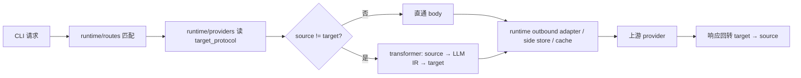
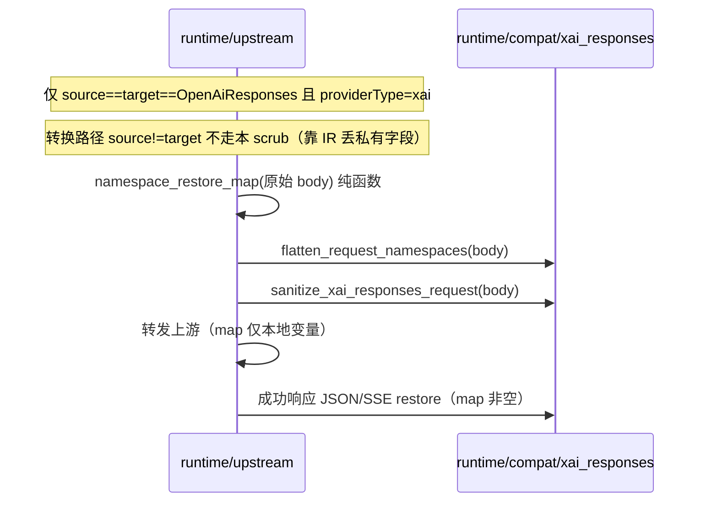

# cc-switch 网关协议转换合并研究（审核稿）

> **文档状态**：研究 / 跨 AI 审核稿，**有条件批准**；**P0-A/B/C 已实现**（见 §0.7）。  
> **撰写日期**：2026-07-23  
> **二次审核修订**：2026-07-23（补全出处、修正字段名/白名单细节、纳入 xAI 官方 Responses endpoint）  
> **三次审核修订**：2026-07-24（补 P0-A 用例表、P0-B restore/SSE 挂点、compat 单规则推荐、P0-C 仅 codex endpoint、P1 策略收紧、填入审核结论）  
> **四次审核修订**：2026-07-24（深读 CS `forwarder`/`handlers`/namespace/sanitize 调用链后修正：restore map 重推导、仅原生直通门控、flatten 改写 input/tool_choice、碰撞 fail-closed、命名算法已与 AT 对齐）  
> **五次审核修订**：2026-07-24（实现后对照：门控收紧为显式 `source==OpenAiResponses`；compat 规则定为 catalog 登记 + `providerType=xai` 硬绑，与现有 xAI Chat scrub 同模式）  
> **参考仓库基线**：
>
> | 仓库 | 路径 | HEAD / 版本 | 出处 |
> |---|---|---|---|
> | AI Toolbox（研究时点） | `/mnt/d/GitHub/ai-toolbox` | `c6b7eac` — `chore(tauri): 更新版本号至 1.0.7` | 2026-07-23 `git rev-parse HEAD` |
> | AI Toolbox（三/四次审核时点） | 同上 | `5ab98b3` — `feat(provider): open baseUrl origin from channel titles` | 2026-07-24；其后相对 `c6b7eac` 的两笔提交与协议转换无关，锚点行号仍以研究时点为准 |
> | cc-switch | `/mnt/d/GitHub/cc-switch` | `a377d793` — docs sync v3.18.0；`package.json` `"version": "3.18.0"`；`CHANGELOG.md` `## [3.18.0] - 2026-07-21` | `git pull --ff-only origin main` 后与 `origin/main` 同步 |
>
> **cc-switch 远端**：`git@github.com:farion1231/cc-switch.git`  
> **研究窗口**：约 2026-06-23 → 2026-07-23（近一个月）  
> **相关既有文档**（实现时以代码与模块 `AGENTS.md` 为准）：
>
> - `docs/gateway-protocol-conversion.md` — AI Toolbox 协议转换架构事实源说明
> - `docs/proxy-gateway-settings-switches.md` — 网关设置与 runtime 开关边界
> - `tauri/src/coding/proxy_gateway/AGENTS.md`
> - `tauri/src/coding/proxy_gateway/transformer/AGENTS.md`

### 出处约定

本文对关键论断尽量给出 **仓库 + 路径 + 符号/行号 + commit/issue**。行号为 2026-07-23 研究时点快照，实现前应用 `rg`/编辑器再核对。

| 前缀 | 含义 |
|---|---|
| **AT** | AI Toolbox 当前代码 |
| **CS** | cc-switch 当前代码 |
| **CS#** | GitHub issue（farion1231/cc-switch） |
| **CS@** | cc-switch git commit |

---

## 0. 文档目的与审核目标

### 0.1 目的

把同级项目 **cc-switch** 近一个月与「网关协议转换」相关的改动，对照 AI Toolbox 现有 **Proxy Gateway**（`transformer/` + `runtime/`）实现，产出：

1. **可审核**的差异清单与优先级；
2. **可落地**的融合方案（落到具体文件 / 钩子 / 测试 / profile，而不是“抄文件”）；
3. **硬约束**：任何合并都不得破坏 AI Toolbox 现有架构边界；
4. **可追溯出处**，便于其他 AI 独立复验。

### 0.2 给其他 AI 的审核问题清单

1. 是否存在本文漏判的、近一个月内仍值得合并的协议语义？
2. P0 / P1 的落点（transformer vs runtime vs profiles）是否正确？有无越界建议？
3. 「融合现有架构」是否会引入第二套协议解析 / pairwise 桥？
4. 测试与回归是否够挡住 DeepSeek tool schema、xAI Responses 直通、Kimi cache key 等真实 400？
5. 是否有本文标记为「不必合并」但其实应并入的项？
6. **P0-C（xAI 官方 Responses endpoint）** 与 **P0-B（sanitize/namespace）** 的绑定顺序是否合理？

### 0.3 本文不做的事

- **不**提交代码、不改 `transformer` / `runtime` / profiles 行为。
- **不**建议整文件拷贝 cc-switch 的 `transform_*.rs` / `streaming_*.rs`。
- **不**把 OAuth UI、usage 账单、preset 营销位等产品能力混进「协议转换合并」（可另开任务）。
- **不**把 cc-switch 的 pairwise 桥架构回退到 AI Toolbox 的统一 IR 内核。

### 0.4 二次审核相对初稿的修正摘要

| # | 初稿表述 | 复核结论 | 出处 |
|---|---|---|---|
| 1 | tool 白名单写「如 function/web_search/mcp 等」 | 应列出 **完整** `XAI_SUPPORTED_TOOL_TYPES`（含 `x_search`、`image_generation`、`shell` 等 10 项） | CS `transform_codex_responses_xai_sanitize.rs` L48–59 |
| 2 | AI Toolbox meta 复用 `prompt_cache_key` 作 mode | **危险**：`ProviderGatewayMeta.prompt_cache_key` 是 **可选字符串缓存键**，不是 mode；cc-switch 用 `meta.prompt_cache_routing` | AT `types.rs` L69；CS `codex.rs` L90–99 |
| 3 | xAI 仅缺 Responses scrub | 还缺 **catalog endpoint**：profile 只有 `openai_chat`，无 `openai_responses` | AT `gateway_provider_profiles.json` profile `id=xai`（约 L2056+） |
| 4 | 门控可参考「仅 OAuth」 | AI Toolbox 应以 **`providerType=xai` / profile compat** 为准，**不要**照搬 `is_xai_oauth` | CS `codex.rs` L218–220 仅 OAuth；AT 多为 API Key |
| 5 | 约 2 万行 transform | 复核：CS transform\*+streaming\* 合计 **20879** 行 | `wc -l` 研究时点 |
| 6 | P0 只有 schema + sanitize | 应增加 **P0-C：xAI 官方 Responses endpoint 定义**，与 P0-B 同包交付 | CS presets L1383–1410；用户确认写入 |

### 0.5 三次审核相对二次稿的修正摘要

| # | 二次稿表述 / 缺口 | 复核结论 | 出处 |
|---|---|---|---|
| 1 | §4.1.5「见初版用例表」悬空 | 在本文补最小测试矩阵（null / type:null / 缺 type+oneOf / 已是 object） | 三次审核 |
| 2 | P0-B SSE restore 挂点偏虚 | 写明 request-scoped restore map 归 runtime（**禁止**污染 `ConversionContext`）；流包装顺序 | AT `transformer/AGENTS.md` ConversionContext；`upstream.rs` 既有 stream wrapper |
| 3 | compat「二选一」未定 | **推荐单一** `xai_responses_passthrough`（内部固定 flatten→sanitize），降低顺序依赖 | CS sanitize 文件头 L20–21 顺序要求 |
| 4 | P0-C profile 示例未写清 gemini/grok | **P0 仅 `tools.codex` 新增 Responses endpoint**；gemini/grok 默认仍 Chat | 降低破坏面 |
| 5 | P1-A 仍写 host allowlist 对齐 CS | AT 优先 **profiles compat + providerType**；host sniff 仅可选 fallback | AT `proxy_gateway/AGENTS.md` 不靠 base_url 猜身份 |
| 6 | P1-B 直接改代码 | **先 diff/审计**再实现；防与现有 `merge_responses_following_item_into_reasoning_message` 双重追加 | AT `responses/mod.rs` merge 函数 |
| 7 | Chat xAI strip 仅 grok-4 / grok-3* | 关联债：Responses 默认 `grok-4.5` 时 Chat 路径 penalty/stop 清理可能漏 | AT `upstream.rs` L5983–6005 |
| 8 | 研究 HEAD `c6b7eac` 当作 tip | 标注研究时点 vs 三次审核时点 `5ab98b3` | git log |

### 0.6 四次审核：对照 CS 真实调用链后的修正

| # | 三次稿 / 前稿偏差 | 对照 CS 后的结论 | 出处 |
|---|---|---|---|
| 1 | restore map 写成「compat 返回 request-scoped state」易被理解成 flatten 后顺手返回 | CS **不**在 flatten 返回值里带 map：handlers 在 forward **前**用**原始** request body 调 `namespace_restore_map`；map 由 request tools **纯函数重推导**，forwarder 与 handler 无状态线程 | CS `handlers.rs` L815–818 / L877–886；namespace 文件头 L24–27 |
| 2 | scrub 写「直通 + 转换后出站都要」 | CS **仅**原生 Responses passthrough：`!codex_responses_to_chat && !codex_responses_to_anthropic` 且 `provider_needs_*`；Chat/Anthropic 桥路径靠桥自身丢字段，**不**再跑 flatten/sanitize | CS `forwarder.rs` L1525–1564 |
| 3 | flatten 只提「lift tools」 | 还须：改写 `input[]` 里带 `namespace` 的 `function_call`；`tool_choice.type==namespace` → `"auto"`；flat 名碰撞 **fail-closed** `TransformError` | CS namespace L106–230 |
| 4 | 命名算法「可共用」未钉死 | CS `flatten_namespace_tool_name`（`ns__name`，>64 截断 + sha256 前 4 字节 hex）与 AT `codex_tools.rs` L679–705 **已一致**；runtime 直通 flatten **必须**复用同一算法，禁止再写第二套 | CS L1097；AT `codex_tools.rs` L679 |
| 5 | AT `PipelineContext` 可塞 restore map | 当前 `PipelineContext` 字段为 provider_type / target_protocol / lossy / billing_cch，**无**通用 bag；map 应挂 **本次 forward 局部变量**（对齐 CS handlers 捕获），勿硬塞 middleware ctx 除非先扩字段 | AT `runtime/middleware.rs` L6–11 |
| 6 | 门控仅写 Xai | CS 门控函数体虽是 `is_xai_oauth()`，但 **调用方**还限制 `AppType::Codex \| GrokBuild` 且非 Chat/Anthropic 桥；AT 应用 **`providerType=xai` + target Responses + 原生直通（source==target）** 表达等价语义 | CS forwarder L1531–1556；codex.rs L218–220 |
| 7 | P1-B 与 AT merge 对照偏模糊 | CS 关键缺口是 **trailing** `attach_pending_reasoning_to_previous_assistant`（input 末尾 / user 边界回挂上一 assistant 并 **append**）；AT 仅有 **forward** merge（reasoning 与**紧随** item）。P1-B 审计应钉这两类 case | CS `transform_codex_chat.rs` L592+ / L902+；AT `responses/mod.rs` `merge_responses_following_item_into_reasoning_message` |
| 8 | sanitize 顺序只写 flatten 后 | 函数体内固定：顶层删 → grok-4.5 采样删（model 后缀/`xai/grok-4.5`）→ 递归删 → promote `additional_tools` → strip reasoning `content:null` → tool 白名单 + dangling `tool_choice` | CS sanitize L65–100 / L104–115 |

### 0.7 五次审核：实现后规格定稿

| # | 实现对照 | 定稿 |
|---|---|---|
| 1 | 门控不可仅用 `conversion_route.is_none()` | **必须** `source_protocol == Some(OpenAiResponses)` **且** `conversion_route.is_none()` **且** `target == OpenAiResponses` **且** `ProviderBodyCompat::Xai`。源协议未知时**不** scrub。 |
| 2 | 三次稿「`Xai` **或** profile compat 规则」 | **改为**：runtime **硬绑** `providerType=xai`（`ProviderBodyCompat::Xai`）。`compat.openaiResponses: ["xai_responses_passthrough"]` + `SUPPORTED_COMPAT_RULES` 为 **catalog 登记 / 文档契约**，与现有 `xai_strip_unsupported_fields` / `xai_filter_empty_delta` 同模式——**不**存在通用「读 compat 数组再 dispatch」框架。无 `providerType` 仅写规则名 → **不会**触发 scrub。 |
| 3 | restore map 输入时刻 | 实现从 **outbound pipeline 之后、flatten 之前** 的 body 推导（原生直通下 tools 通常未改写）；存 `PreparedUpstreamBody` 请求局部字段；**禁止** `ConversionContext` / side store。 |
| 4 | 请求挂点 | outbound pipeline 之后独立调用 `apply_xai_responses_passthrough`，**不**塞进 `apply_openai_responses_provider_body_compat` 的 map 级分支（碰撞可直接 `RequestSchema`）。 |

**实现锚点（2026-07-24 工作区）**：

- `runtime/compat/xai_responses.rs` — flatten / sanitize / restore / SSE
- `runtime/upstream.rs` — `should_apply_xai_responses_passthrough` / `PreparedUpstreamBody.xai_namespace_restore_map`
- `transformer/shared/tool_schema.rs` — `normalize_function_parameters` + `flatten_namespace_tool_name`
- `provider_profiles.rs` + `resources/gateway_provider_profiles.json` — 白名单 + xai codex Responses endpoint

---

## 1. 架构对照：必须先对齐的边界

### 1.1 一句话对比

| 维度 | cc-switch | AI Toolbox（必须保持） | 出处 |
|---|---|---|---|
| 核心模型 | **点对点桥** | **统一 IR**：`llm::Request`/`Response` + Inbound/Outbound + `StreamKernel` | AT `transformer/AGENTS.md`；`docs/gateway-protocol-conversion.md` §1 |
| 协议代码 | `src-tauri/src/proxy/providers/transform*.rs` + `streaming*.rs` | `proxy_gateway/transformer/**` + `runtime/**` | 两边目录结构 |
| 是否读 provider | 转换路径常直接读 `Provider` | **transformer 禁止**读 DB/Tauri/provider/settings/health/log | AT `transformer/AGENTS.md` Source of Truth |
| 同协议 | passthrough + 专用 scrub | `source == target` **直通**；runtime 可做模型改写/`[1M]`/body compat | AT `docs/gateway-protocol-conversion.md` §1、§5 |
| vendor 方言 | 散落 transform/forwarder | **runtime** `ProviderBodyCompat` + profiles compat 白名单 | AT `upstream.rs` `ProviderBodyCompat`；`provider_profiles.rs` `SUPPORTED_COMPAT_RULES` |
| request-scoped 映射 | 各桥内部状态 | `ConversionContext`（transformer 生成/消费；runtime 只携带） | AT `transformer/kernel.rs` `struct ConversionContext`（约 L27） |

### 1.2 AI Toolbox 既定分层（合并时不可推翻）



出处：`docs/gateway-protocol-conversion.md` §1 流程图与边界说明。

**硬规则（合并实现必须遵守）：**

| # | 规则 | 违反后果 | 主要出处 |
|---|---|---|---|
| R1 | 聊天协议结构互转只进 `transformer/` | pairwise 分叉，矩阵测试失效 | `transformer/AGENTS.md` |
| R2 | provider 私有字段、OAuth、URL/header/auth、跨请求 store 只进 `runtime/` | transformer 耦合 vendor | 同上 + `proxy_gateway/AGENTS.md` |
| R3 | 不新增「半套」协议或 Completion IR 只为某个上游 quirk | 边界腐蚀 | `transformer/AGENTS.md` Legacy Completion 条 |
| R4 | `apiFormat` 只走 `AiProtocol::from_api_format` | 双 parser 漂移 | `transformer/AGENTS.md`；`docs/gateway-protocol-conversion.md` §2 |
| R5 | 新 compat 名必须：runtime 实现 + 白名单 + profile 声明 + 测试 | 只写 JSON 无效 | `provider_profiles.rs` L14–40；`proxy_gateway/AGENTS.md` compat 白名单条 |
| R6 | SSE 边读边写，禁止为转换 full-buffer 上游流 | 延迟/内存回退 | `transformer/AGENTS.md` |
| R7 | 同协议直通不重写协议结构；vendor scrub 属 runtime body compat | 把「兼容」误做成「转换」 | `docs/gateway-protocol-conversion.md` §1 |

### 1.3 合并方法论（融合，不是移植）

```text
cc-switch 的「修复语义」
        │
        ▼
  判断属于：协议结构？provider 方言？还是 catalog/endpoint 配置？
        │
        ├─ 协议结构 / 多协议矩阵可见
        │     → transformer（共享 helper + 矩阵测试 + fixture）
        │
        ├─ 仅某 provider / 仅某 wire / 仅直通路径
        │     → runtime（ProviderBodyCompat / side_store / 流包装）
        │
        └─ 用户可选上游形态 / 默认 apiFormat
              → gateway_provider_profiles.json + 白名单
```

**禁止**：整文件搬 `transform_codex_anthropic.rs`；在 transformer 里 `if provider_type == xai`；为 xAI 再写一套绕过 kernel 的 Responses→Chat 桥。

**允许**：共享纯函数进 transformer；扩展 `apply_openai_*_provider_body_compat`；为 xAI **新增** `openai_responses` endpoint + `openaiResponses` compat。

---

## 2. 研究基线：cc-switch 近一个月协议相关提交

### 2.1 高相关（转换语义 / 桥 / SSE）

| 日期 | Commit | 摘要 | 主要文件 | Issue / 备注 |
|---|---|---|---|---|
| 2026-07-21 | **CS@**`08710d51` | Codex tool `parameters` → `type: "object"` | `transform_codex_chat.rs`, `transform_codex_anthropic.rs` | **CS#**5315；加强 **CS#**4706 |
| 2026-07-20 | **CS@**`dbb5bd15` | xAI 原生 Responses：namespace + sanitize + OAuth 路由 | `transform_codex_responses_namespace.rs`, `transform_codex_responses_xai_sanitize.rs`, handlers/forwarder | 文件首次出现于该 commit |
| 2026-07-19 | **CS@**`613fef70` | Responses→Chat 尾部 reasoning 回挂 | `transform_codex_chat.rs` | **CS#**5508 |
| 2026-07-14 | **CS@**`6d316c0b` | 流式 tool call 身份与 index 顺序 | `streaming_codex_chat.rs` | **CS#**5310 |
| 2026-07-14 | **CS@**`9ca1a41f` | tool parameters 规范化（早期版） | `transform_codex_chat.rs` | **CS#**4706 / #4705 |
| 2026-07-12 | **CS@**`650905af` | Responses/Anthropic 桥 fail-closed 等 | streaming_responses / transform_responses / forwarder / codex_anthropic | commit message 写明 2xx failure envelope |
| 2026-07-11 | **CS@**`a078b4b2` | Chat `prompt_cache_key` session 路由 | `codex.rs`, `forwarder.rs`, 前端 form | meta `prompt_cache_routing` |
| 2026-07-11 | **CS@**`27ce0a51` | encrypted reasoning / orphan / arguments.done | reasoning_bridge / streaming_responses / transform_responses | |
| 2026-07-10 | **CS@**`99e11e08` | Codex 上游原生 Anthropic Messages 整桥 | transform_codex_anthropic + streaming_codex_anthropic | **CS#**5071 |

验证方式（研究时点）：

```bash
cd /mnt/d/GitHub/cc-switch
git log -1 --format='%h %ad %s' --date=short 08710d51   # 2026-07-21
# … 同上对其余 hash
git log --diff-filter=A --format='%h %ad %s' --date=short \
  -- src-tauri/src/proxy/providers/transform_codex_responses_xai_sanitize.rs
# → dbb5bd15 2026-07-20
```

### 2.2 中相关（默认不进本合并包）

- zstd 解压转发、媒体 fallback、usage/cache TTL、Copilot 代理、请求 override  
- xAI/Grok OAuth device flow、Grok Build preset、managed OAuth 账号选择器  

**说明**：OAuth **产品**可另开；但 **xAI Responses 官方 endpoint + wire scrub** 属于本合并 P0（见 §4.2–4.3）。

### 2.3 cc-switch 侧代码形态（对照用，非目标架构）

```
src-tauri/src/proxy/providers/
  transform.rs
  transform_codex_chat.rs           # normalize_function_parameters @ L1146
  transform_codex_anthropic.rs      # input_schema 强制 type=object @ L447–450
  transform_responses.rs
  transform_gemini.rs
  transform_codex_responses_namespace.rs      # CS@dbb5bd15 新增
  transform_codex_responses_xai_sanitize.rs   # CS@dbb5bd15 新增
  streaming_*.rs
  reasoning_bridge.rs
```

transform\* + streaming\* 合计约 **20879** 行（研究时点 `wc -l`）。语义价值在行为，不在文件结构。

---

## 3. AI Toolbox 现状覆盖矩阵

### 3.1 已较好覆盖（默认「不整段搬迁」）

| 能力 | AI Toolbox 证据 | 对应 CS | 说明 |
|---|---|---|---|
| 四协议 JSON/SSE/error 矩阵 | `transformer/kernel.rs` + `fixtures/reference/` | 多桥合计 | IR 已覆盖互转 |
| Codex → Anthropic 上游 | conversion_route + cache inject + history enrich | **CS@**`99e11e08` | **不需要**搬 pairwise 桥 |
| namespace / tool_search（**转 Chat**） | `transformer/openai/codex_tools.rs` + `ConversionContext` | namespace 文件语义子集 | 仅转换路径 |
| Responses `prompt_cache_key` session fallback | `apply_openai_responses_prompt_cache_key_fallback` @ **AT** `upstream.rs` L4617 | 部分对齐 **CS@**`a078b4b2` | **仅 Responses 目标** |
| encrypted reasoning / cipher | stream + `side_stores/responses_cipher` + settings | **CS@**`27ce0a51` 方向 | |
| `response.failed` / `incomplete` 映射 | `transformer/stream.rs` | streaming_responses | 事件映射有；2xx fail-closed 需 P2 审计 |
| xAI **Chat** 兼容 | profiles + `strip_xai_unsupported_openai_chat_fields` @ L5983 | Chat 侧部分 | **无** Responses 直通 scrub |
| tool-call reasoning 占位 | `backfill_tool_call_reasoning_content` @ L6008；Moonshot L5023 / Mimo L5047 | 弱于 **CS@**`613fef70` | 仅占位 `"tool call"` |
| Anthropic cache 注入 | `runtime/cache_injector` + settings | cache 相关 | |

### 3.2 关键代码锚点（实现时优先改这里）

| 主题 | 路径 | 符号 / 行号（研究时点） |
|---|---|---|
| Chat 工具 parameters 出站 | `transformer/openai/chat.rs` | L449 `function.parameters.unwrap_or_else(\|\| json!({}))` |
| Responses→Chat Codex tools | `transformer/openai/codex_tools.rs` | L591 `responses_function_tool_to_chat_tool`；嵌套 function **直接 clone**；扁平 L613 `unwrap_or_else(\|\| json!({}))` |
| Responses 出站 function schema | `transformer/openai/responses/mod.rs` | L1519 `responses_function_parameters`：仅当 **已是** type=object 时补 properties |
| Anthropic 出站 input_schema | `transformer/anthropic/outbound.rs` | L232 `input_schema: function.parameters.unwrap_or_else(\|\| json!({}))` |
| Chat 通用兼容删 prompt_cache_key | `runtime/upstream.rs` | L6223 `normalize_openai_chat_for_provider_compat`；L6232 `remove("prompt_cache_key")` |
| Responses session cache key | `runtime/upstream.rs` | L4617 `apply_openai_responses_prompt_cache_key_fallback` |
| Chat vendor 分支含 Xai | `runtime/upstream.rs` | `apply_openai_chat_provider_body_compat_before_generic` → Xai → L5983 strip |
| Responses vendor 分支 | `runtime/upstream.rs` | L5078 `apply_openai_responses_provider_body_compat`：**CodexOfficial / Copilot / Doubao / ModelScope，无 Xai** |
| compat 白名单 | `provider_profiles.rs` | L14–40；含 `xai_strip_unsupported_fields` / `xai_filter_empty_delta` |
| xAI profile | `tauri/resources/gateway_provider_profiles.json` | profile `id: "xai"`（约 L2056）；compat 约 L2103–2104 **仅 openaiChat\*** |
| tool-call reasoning 占位 | `runtime/upstream.rs` | L6008；调用方 Moonshot/Mimo |
| ConversionContext | `transformer/kernel.rs` | 约 L27 |
| meta.prompt_cache_key | `proxy_gateway/types.rs` | L69：`Option<String>` 缓存键，**不是** routing mode |

### 3.3 xAI catalog 现状（AT vs CS）

**AI Toolbox**（`gateway_provider_profiles.json` → `profiles[id=xai]`）：

- tools.codex / gemini / grok：均仅 endpoint `openai_chat`，`apiFormat: "openai_chat"`，`baseUrl: "https://api.x.ai/v1"`，默认模型 `grok-4`
- `compat`：仅 `openaiChat` / `openaiChatStream`
- **无** `openai_responses` endpoint，**无** `openaiResponses` compat

**cc-switch**（`src/config/codexProviderPresets.ts`）：

- 普通 xAI 预设约 L1383–1399：`apiFormat: "openai_responses"`，模型 `grok-4.5`，`base https://api.x.ai/v1`
- 注释（约 L1385–1388）：xAI 官方以 `/v1/responses` 为一等端点；Codex 依赖的 store:false / include reasoning.encrypted_content / reasoning effort 均支持；**原生 Responses，无需路由接管转换**（注：仍需 private 字段 scrub，见 P0-B）
- OAuth 预设约 L1403–1422：`providerType: "xai_oauth"`，同样 `apiFormat: "openai_responses"`

---

## 4. 可合并项详细分析（含融合设计）

### 4.1 P0-A：Function tool `parameters` 规范化为 `type: "object"`

#### 4.1.1 问题

Codex / 部分 Responses 工具会出现 `parameters: null`、`type: null`、缺 type 仅 oneOf。严格 OpenAI 兼容上游（如 DeepSeek）要求根 schema `{"type":"object","properties":{...}}`，否则 HTTP 400。

#### 4.1.2 cc-switch 语义与出处

| 项 | 出处 |
|---|---|
| 主修复 | **CS@**`08710d51`（2026-07-21），**CS#**5315 |
| 早期版 | **CS@**`9ca1a41f`（2026-07-14），**CS#**4706 / #4705 |
| Chat 实现 | CS `transform_codex_chat.rs` L1146–1159 `normalize_function_parameters` |
| Anthropic 实现 | CS `transform_codex_anthropic.rs` L447–450：缺省 `{type:object,properties:{}}`，非 object 的 type 强制为 `"object"`；oneOf 用例 L1552+ |

语义（概念，非直接拷贝）：

```rust
// null / 非 object → {"type":"object","properties":{}}
// object 且 type != "object"（含 type:null）→ 强制 type = "object"
// 保留其余字段（含 oneOf）
```

#### 4.1.3 AI Toolbox 缺口与出处

| 位置 | 当前行为 | 出处 |
|---|---|---|
| `responses_function_parameters` | 仅当 **已是** type=object 且缺 properties 时补 `{}`；strict 补 additionalProperties/required；**非 object 直接原样返回** | AT `responses/mod.rs` L1519–1556 |
| `responses_function_tool_to_chat_tool` | 嵌套 `function`：**clone 不 normalize**；扁平：L613 `unwrap_or_else(\|\| json!({}))` | AT `codex_tools.rs` L591–623 |
| Chat outbound | L449 `unwrap_or_else(\|\| json!({}))` | AT `chat.rs` |
| Anthropic outbound | L232 `unwrap_or_else(\|\| json!({}))` | AT `anthropic/outbound.rs` |
| runtime Chat tools sanitize | 只 retain type=function 且有 name，**不**改 parameters | AT `upstream.rs` L6245–6267 |

#### 4.1.4 融合方案

**层：`transformer`（协议出站规范化，与 provider 无关）**

1. 新建 `transformer/shared/tool_schema.rs`（目录已有 `shared/`，风格匹配）实现 `normalize_function_parameters`。  
2. 调用点（**两条 parameters 形态都要挂**）：  
   - `codex_tools`：**嵌套** `function.parameters`（当前 clone 不 normalize）与**扁平** `parameters`；  
   - `chat` outbound 写 `function.parameters`；  
   - `responses_function_parameters`（在 strict 逻辑**之前**）；  
   - `anthropic/outbound` 写 `input_schema`。  
3. **不要**放进 DeepSeek/Xai runtime 分支。  
4. **非 P0**：Gemini outbound `functionDeclarations` schema 规范化不进本包；若后续严格上游出现同类 400，再单开任务。

#### 4.1.5 测试 / 风险

**最小用例矩阵（实现时落到单测；仅处理 tool 根 parameters / input_schema，不递归改嵌套 schema）：**

| # | 输入 parameters | 期望输出 |
|---|---|---|
| 1 | `null` / 缺失 | `{"type":"object","properties":{}}` |
| 2 | 非 object（数组 / 字符串等） | `{"type":"object","properties":{}}` |
| 3 | `{"type":null,"properties":{...}}` 或 type 缺失 | 强制 `type:"object"`，**保留** properties / oneOf 等其余字段 |
| 4 | `{"oneOf":[...]}` 无 type | 补 `type:"object"`，**保留** oneOf |
| 5 | 已是 `{"type":"object","properties":{...}}` | 结构不变（idempotent） |
| 6 | nested `function.parameters` + flat `parameters` 各跑一遍 | 两分支均 normalize |

**风险**：仅根 schema；不递归改 `properties` 内嵌套 object 的 type。  
**回归**：kernel 矩阵 / fixture 不因本 helper 引入 shape 漂移。

---

### 4.2 P0-B：xAI 原生 Responses 直通兼容（namespace + sanitize）

#### 4.2.1 问题

Codex 0.142+ 对 xAI 走 Responses 时，body 含 OpenAI 后端私有字段 / 私有 tool；xAI `api.x.ai/v1/responses` 严格 serde → 400/422。转换路径会自然丢掉部分字段；**Responses→Responses 直通**不会。

#### 4.2.2 cc-switch 语义与出处

| 模块 | 路径 | 关键符号 | Commit |
|---|---|---|---|
| Namespace | `transform_codex_responses_namespace.rs` | `namespace_restore_map` L50；`flatten_request_namespaces` L95；`restore_response_namespaces` L227；`create_namespace_restore_sse_stream` L341 | **CS@**`dbb5bd15` |
| Sanitize | `transform_codex_responses_xai_sanitize.rs` | `sanitize_xai_responses_request` L65；文件头 port sub2api `patchGrokResponsesBody` | **CS@**`dbb5bd15` |
| 请求侧门控+顺序 | `forwarder.rs` L1525–1564 | 仅 `AppType::Codex\|GrokBuild` 且 **非** Chat/Anthropic 桥；先 flatten 再 sanitize；均靠 `provider_needs_responses_namespace_flatten` | 同上 |
| 响应侧 restore | `handlers.rs` L815–818、L877–886、L1034+ | **forward 前**对**原始** body 建 map；成功响应才 restore；错误体走通用 passthrough | 同上 |
| 门控函数 | `codex.rs` L218–220 | `provider_needs_responses_namespace_flatten` → `is_xai_oauth()`（CS 产品面；AT 勿照搬） | 同上 |
| 命名 | `transform_codex_chat.rs` L1097 | `flatten_namespace_tool_name`；namespace 模块 import 共用 | 与 Chat 桥一致 |

**CS 请求路径（原生 Responses 直通，概念）：**

```text
入站 Codex /responses body（原始）
  ├─ handlers: namespace_restore_map(原始 body)  // 纯函数，不 mutate
  └─ forwarder:
       if 非 Chat/Anthropic 桥 && needs_xai:
         1) flatten_request_namespaces(body)   // 可 Result::Err 碰撞
         2) sanitize_xai_responses_request(body)
       → 上游
  ← 上游响应
  handlers: if needs_xai && !map.is_empty():
    成功 + SSE  → create_namespace_restore_sse_stream
    成功 + JSON → restore_response_namespaces
    非成功      → 不 restore，通用错误处理
```

**Namespace flatten 必须覆盖（缺一不可）：**

| 步骤 | 行为 |
|---|---|
| tools | `type=namespace` 的 children lift 为顶层 `function`，`name=flatten(ns, child)` |
| 碰撞 | flat 名与顶层 function/custom **冲突**，或两 child 撞名 → **fail-closed**（CS `TransformError`） |
| input 历史 | 带 `namespace` 字段的 `function_call` → 改写为 flat `name` 并 **remove namespace** |
| tool_choice | `type=="namespace"` → `"auto"`；带 namespace 的 function choice 同步 rewrite |
| 命名算法 | `format!("{ns}__{name}")`；`len>64` 时 prefix + `__` + sha256 前 4 字节 hex（与 AT Chat 路径**已相同**） |

**Sanitize 字段表（完整，实现前再 `git show dbb5bd15` 核对）：**

| 类别 | 值 | 出处 |
|---|---|---|
| 递归删除 | `external_web_access` | L29 `RECURSIVE_UNSUPPORTED_FIELDS` |
| 顶层删除 | `prompt_cache_retention`, `safety_identifier` | L32 `TOP_LEVEL_UNSUPPORTED_FIELDS` |
| grok-4.5 额外 | `presence_penalty`, `presencePenalty`, `frequency_penalty`, `frequencyPenalty`, `stop` | L35–41；匹配 `request_targets_grok_45`（**后缀**/`xai/grok-4.5`） |
| tool type 白名单 | `function`, `web_search`, `x_search`, `image_generation`, `collections_search`, `file_search`, `code_execution`, `code_interpreter`, `mcp`, `shell` | L48–59 `XAI_SUPPORTED_TOOL_TYPES` |
| 其它步骤 | promote `additional_tools`（从 input 抬到 tools，dedup）；strip reasoning `content:null`；dangling `tool_choice` 清理 | L65+ 函数体与单测 |

**顺序硬约束：**

1. **模块间**：先 namespace flatten，再 sanitize（sanitize 文件头 L20–21：flatten 后的 function 才能过白名单）。  
2. **sanitize 内**：顶层删 → grok-4.5 采样删 → 递归删 → promote additional_tools → strip null reasoning content → filter tools + tool_choice。

#### 4.2.3 AI Toolbox 缺口与出处

| 能力 | 现状 | 出处 |
|---|---|---|
| namespace/tool_search | 仅 Responses→**Chat** 经 `codex_tools` + `ConversionContext`；命名算法已对齐 CS | AT `codex_tools.rs` L679–705；kernel 测试 |
| Responses 直通 | 不展平、不 scrub、不 restore | 直通不调 kernel |
| xAI Chat scrub | 按模型删 reasoning_effort/penalty/stop（**仅** `grok-4` / `grok-3*`，无 4.5 后缀匹配） | AT `upstream.rs` L5983–6005 |
| xAI Chat SSE | empty delta filter | `maybe_filter_xai_openai_chat_sse_stream` 等 |
| Responses body compat | 无 Xai 分支 | AT `upstream.rs` L5078–5096 |
| profiles | 无 openaiResponses compat | `gateway_provider_profiles.json` xai compat L2103–2104 |
| request 局部状态 | `PipelineContext` **无** restore map 字段；`ConversionContext` 仅结构转换 | AT `middleware.rs` L6–11；`kernel.rs` ConversionContext |

#### 4.2.4 融合方案（严格 runtime）



1. 新建 `runtime/compat/xai_responses.rs`（对齐 `codex_responses_compact.rs` 先例），内含：  
   - `namespace_restore_map` / `flatten_request_namespaces` / `restore_*` / SSE wrapper  
   - `sanitize_xai_responses_request`  
   - **命名**：抽/复用与 `codex_tools::flatten_namespace_tool_name` **同一算法**（优先 shared 可见 helper 或复制常量+单测锁定，禁止第三套哈希截断）。  
2. **请求挂点（修正）**：  
   - 主路径是 **原生直通**：`source == target == OpenAiResponses` 且 Xai 门控。  
   - 实现上可在 `apply_openai_responses_provider_body_compat(Xai)` / 直通 body 定稿前调用；**不要**对「已经过 IR 的 Chat/Anthropic 源」默认再跑全量 flatten（与 CS 一致）。  
   - 若未来非 Codex 客户端直打 xAI Responses 且带 namespace，再评估是否放宽；**P0 对齐 CS：Codex 原生直通**。  
3. **Restore map 生命周期（对齐 CS，修正三次稿）**  
   - **纯函数重推导**：`namespace_restore_map(原始入站 body)`，与 flatten 使用同一命名规则；**不要求** flatten 返回 map。  
   - 存 **本次 forward 局部变量**（handlers 风格），请求结束丢弃。  
   - **禁止**写入 transformer `ConversionContext`。  
   - **禁止**落库 / 跨请求 side store。  
   - **不要**默认塞进当前 `PipelineContext`（字段不够）；若未来要 middleware 化，先扩字段再迁。  
4. **SSE / 响应 restore**  
   - 仅当 map **非空**且上游 **成功** 时 restore（CS：非成功不 restore）。  
   - 顺序建议：  
     ```text
     raw upstream body stream
       → xAI Responses namespace restore（边读 SSE block，改 data JSON 内 function_call）
       → 既有 cipher / empty-detection / usage 等 wrapper
       → 写回客户端
     ```  
     原生直通 **无** 协议转换 SSE 段；若将来 source!=target，本 P0 不把 namespace restore 叠在转换路径上。  
   - **禁止** full-buffer。  
5. 门控（AT，五次定稿）：  
   ```text
   source_protocol == Some(OpenAiResponses)
   && conversion_route.is_none()
   && target_protocol == OpenAiResponses
   && ProviderBodyCompat::from_provider_meta(...) == Some(Xai)
   ```  
   - runtime **硬绑** `providerType=xai`；**不要**仅 OAuth。  
   - profile 规则名 `xai_responses_passthrough` 仅 **catalog 登记**（`SUPPORTED_COMPAT_RULES` + JSON `compat.openaiResponses`），**不**作为 runtime 二次开关（与 xAI Chat scrub 同模式）。  
   - 源协议未知（`source_protocol == None`）时 **不** scrub，避免误伤 OpenCode 等边缘路由。  
6. Chat 路径继续 `codex_tools` + `ConversionContext`；与 runtime 共用命名算法 + fixture。  
7. 第三方对照：sub2api `patchGrokResponsesBody` / `responses_namespace.go`（CS 文件头注释）。  
8. flatten 碰撞：应返回 **可映射为本地 4xx/schema 类** 的失败（对齐 CS fail-closed），**不要**静默丢 tool。

#### 4.2.5 测试 / 风险

| # | 用例 | 期望 |
|---|---|---|
| 1 | 非 Xai / 非 Responses / Chat 桥路径 | body 与 stream **零 diff**（本 scrub 不触发） |
| 2 | Xai 原生 Responses：namespace + 私有字段 + tool_search | flatten 后 sanitize；function 保留；tool_search 删除 |
| 3 | input 历史带 `namespace` 的 function_call | 出站为 flat name、无 namespace 字段 |
| 4 | tool_choice type=namespace | 出站 `"auto"` |
| 5 | flat 名碰撞 | fail-closed，不静默 |
| 6 | 字段表黄金样例 | 含 `xai/grok-4.5` 后缀；非 4.5 保留 sampling knobs（若无其它删项） |
| 7 | restore map 仅从**原始** tools 推导 | 与 flatten 后 body 独立；map 空则不包装 SSE |
| 8 | SSE restore | function_call 名还原为 `{name,namespace}`；非 JSON data / `[DONE]` 透传 |
| 9 | 非 2xx 响应 | **不** restore |
| 10 | sanitize 二次调用 | idempotent |
| 11 | 命名截断 | 长 `ns__name` 与 AT Chat `flatten_namespace_tool_name` 结果一致 |

**风险**：Chat 转换 namespace 与 Responses 直通双实现漂移 → **强制同一命名算法** + 共用 fixture。  
**风险**：误把 scrub 挂到转换后出站 → 与 CS 行为分叉、浪费且可能改写已合法 body。

---

### 4.3 P0-C：新增 xAI 官方 Responses 渠道定义（profiles endpoint）

> 本节为二次审核后根据产品讨论 **正式纳入 P0**。仅 P0-B 而无 catalog 入口 → 能力对用户不可达；仅加 endpoint 而无 P0-B → 直通易 400。

#### 4.3.1 为什么必须加

| 理由 | 出处 |
|---|---|
| CS 已默认/提供 Responses | `codexProviderPresets.ts` L1383–1410 `apiFormat: "openai_responses"` |
| 官方 wire 以 `/v1/responses` 为一等端点 | 同文件注释 L1385–1388 |
| AT catalog 只有 Chat | `gateway_provider_profiles.json` xai 仅 `openai_chat` |
| target protocol 来自 endpoint.apiFormat | `docs/gateway-protocol-conversion.md` §4；`runtime/providers.rs` |

#### 4.3.2 推荐 profile 形态（示意，实现时按仓库 JSON 风格落地）

在现有 `profiles[id=xai]` 上 **扩展**，不另起假 provider。

**P0 范围（写死）**：

| tool | P0 是否新增 `openai_responses` endpoint | defaultEndpointId（第一刀） |
|---|---|---|
| **codex** | **是** | 仍为 `openai_chat` |
| grok | **否**（仍仅 Chat；Grok 真实 wire 再评估） | `openai_chat` |
| gemini | **否**（收益低，扩大面无必要） | `openai_chat` |

```json
{
  "id": "xai",
  "providerType": "xai",
  "tools": {
    "codex": {
      "defaultEndpointId": "openai_chat",
      "endpoints": [
        {
          "id": "openai_responses",
          "label": "OpenAI Responses",
          "apiFormat": "openai_responses",
          "baseUrl": "https://api.x.ai/v1",
          "configProviderId": "xai",
          "model": "grok-4.5"
        },
        {
          "id": "openai_chat",
          "label": "OpenAI Chat",
          "apiFormat": "openai_chat",
          "baseUrl": "https://api.x.ai/v1",
          "configProviderId": "xai",
          "model": "grok-4"
        }
      ]
    }
  },
  "compat": {
    "openaiChat": ["xai_strip_unsupported_fields"],
    "openaiChatStream": ["xai_filter_empty_delta"],
    "openaiResponses": ["xai_responses_passthrough"]
  }
}
```

**compat 命名（三次审核定稿）**：

| 方案 | 结论 |
|---|---|
| 双规则 `xai_responses_namespace_flatten` + `xai_responses_sanitize` | 不推荐：依赖数组执行顺序，易漂移 |
| **单规则 `xai_responses_passthrough`** | **推荐**：adapter 内部固定 **flatten → sanitize** |

该名 **必须**写入 `provider_profiles.rs` 的 `SUPPORTED_COMPAT_RULES`，并有 **runtime 实现 + 测试**；只写 JSON 无效。

**runtime 绑定方式（五次定稿）**：AT 当前 **没有**「读 profile `compat` 数组再 dispatch」的通用框架。本规则与 `xai_strip_unsupported_fields` / `xai_filter_empty_delta` 一样：

| 层 | 职责 |
|---|---|
| JSON `compat.openaiResponses` | catalog 文档 / 校验：声明 xAI Responses 走 passthrough scrub |
| `SUPPORTED_COMPAT_RULES` | 阻止未知规则名进入 catalog |
| runtime | **`providerType=xai` + 原生 Responses 直通** 时硬绑执行 `apply_xai_responses_passthrough` |

因此：**有 `providerType=xai` 且用户选 Responses endpoint → 会 scrub**；仅写规则名而无 type → **不会** scrub。

#### 4.3.3 默认 endpoint 策略（降低破坏面）

| 阶段 | 建议 |
|---|---|
| 第一刀（P0-C） | **仅 codex** 新增 `openai_responses` + compat；`defaultEndpointId` **仍保持** `openai_chat` |
| 第二刀（T10，可选） | P0-B 单测 + 真机冒烟通过后，再将 **Codex** 的 `defaultEndpointId` 改为 `openai_responses`（对齐 CS） |
| Grok / Gemini | P0 **不**加 Responses endpoint；保持 Chat |

**禁止**：在 P0-B 未合并前把默认切到 Responses。

#### 4.3.4 与 P0-B 的交付绑定

```text
P0-B runtime compat 实现（xai_responses_passthrough）
    +
P0-C profiles endpoint + 白名单 + compat 声明（仅 codex）
    = 可对用户开启的「xAI 官方 Responses」渠道
```

- B/C **宜同 PR**，或 B 可测后立即合 C；禁止 catalog 漂半个月无 scrub。  
- OAuth / managed 账号 UI **不**阻塞本 P0；API Key 渠道同样需要 sanitize。  
- **T6 验收**：`tool_search` 等被 scrub 丢弃时的产品说明或引导走 Chat 上游。

#### 4.3.5 测试

- profile 解析：Codex 选 `openai_responses` → `target_protocol == OpenAiResponses`  
- 未知 compat 名：白名单校验失败（不得静默忽略）  
- 选 Chat 时行为与现网一致  
- gemini/grok tool 配置无 Responses endpoint（P0 不扩大面）  

---

### 4.4 P1-A：Responses→Chat 后 `prompt_cache_key` 的 provider-aware 策略

#### 4.4.1 问题

转 Chat 后丢失 `prompt_cache_key` 会破坏 Kimi Coding 等 session 缓存亲和。

#### 4.4.2 cc-switch 语义与出处

| 项 | 出处 |
|---|---|
| 注入 | CS `codex.rs` L136–160 `inject_codex_chat_prompt_cache_key` |
| 门控 | L90–131 `should_send_codex_chat_prompt_cache_key`：`meta.prompt_cache_routing` 默认 `"auto"`；`enabled`/`disabled`；auto 时 host `api.openai.com` 或 `api.kimi.com` 且 path `/coding` |
| 调用点 | CS `forwarder.rs` L1440：转换后注入；explicit key > session；**不用**随机 UUID |
| Commit | **CS@**`a078b4b2`（2026-07-11） |

#### 4.4.3 AI Toolbox 缺口与出处

| 环节 | 行为 | 出处 |
|---|---|---|
| IR | 可保留字段 | transformer openai chat/responses；kernel 测试 |
| Responses 目标 | session fallback | AT `upstream.rs` L4617 |
| Chat 目标 | **无条件删除** | AT `upstream.rs` L6232 |
| meta | `prompt_cache_key: Option<String>` | AT `types.rs` L69 — **勿当作 mode** |

#### 4.4.4 融合方案

**层：仅 runtime**

1. 默认保持 Chat 路径 strip（严格网关安全）。  
2. 在 Chat generic strip **之后**，按策略再注入：`explicit > session`，**禁止**随机 UUID。  
3. 配置优先级（三次审核定稿）：  
   - **推荐 B（默认实现路径）**：profiles compat + 明确 `providerType`（如 Kimi / 官方 OpenAI Chat），与 AT「不靠 base_url / 模型名猜身份」一致。  
   - **可选 A**：新增**独立** meta 字段（命名可对齐 CS `prompt_cache_routing`：`auto` / `enabled` / `disabled`），**绝对不要**覆写现有 `ProviderGatewayMeta.prompt_cache_key`（字符串缓存键）语义。  
   - **host allowlist**（CS：`api.openai.com`；`api.kimi.com` + path `/coding`）仅作 **auto 的可选 fallback**，禁止用 base_url 乱猜 Anthropic 或其它 vendor。  
4. transformer 可继续在 IR / Chat outbound 携带字段；最终是否发给上游由 runtime 决定。

#### 4.4.5 测试

| # | 场景 | 期望 |
|---|---|---|
| 1 | 默认 Chat 路径（无 compat / 未 allowlist） | body **无** `prompt_cache_key` |
| 2 | allowlist provider + 请求已有 explicit key | 保留 explicit |
| 3 | allowlist provider + 无 key + 有 session 线索 | 注入 session，非 UUID |
| 4 | allowlist provider + 无 key + 无 session | **不**写 `"default"` / 不写随机 |
| 5 | 非 Chat target | 不套本策略（Responses 继续用既有 fallback） |

---

### 4.5 P1-B：尾部 reasoning 回挂到 assistant

#### 4.5.1 cc-switch 出处

| 项 | 出处 |
|---|---|
| Commit | **CS@**`613fef70`（2026-07-19），**CS#**5508 |
| 追加 | CS `codex_chat_common.rs` L105 `append_reasoning_content`；L126 `attach_reasoning_content_field` |
| 历史折叠 / 占位 | CS `transform_codex_chat.rs` 约 L592+、L885、L902、L912 `ensure_tool_call_reasoning_content` |
| 单测 | 同文件 L2635、L2697、L2826 等 |

#### 4.5.2 AI Toolbox 现状

- runtime：`backfill_tool_call_reasoning_content`（L6008）缺则 `"tool call"`；Moonshot/Mimo 占位（对齐 CS `ensure_tool_call_reasoning_content` 的**兜底**，不是 trailing）  
- transformer Responses→LLM：**仅 forward merge**  
  `merge_responses_following_item_into_reasoning_message`：`reasoning` 与**紧随其后的** function/custom/message 合并进同一 assistant  
- **未实现 CS trailing 路径**（对照 CS 后钉死）：  
  - `attach_pending_reasoning_to_previous_assistant`：input 处理完 / user 边界时，把 **pending trailing reasoning append** 到 **上一条** assistant  
  - 与 embedded reasoning 并存时 **追加**（`append_reasoning_content`），不是覆盖  
  - 占位 `backfill_tool_call_reasoning_placeholders` 必须在 trailing 回挂**之后**（CS 注释：过早占位会被 append 污染真实思考）

#### 4.5.3 融合（先审计再改）

1. **T8a（审计）**：至少复现 CS 单测意图：  
   - trailing reasoning → 上一 assistant  
   - trailing 在 embedded 之后仍 append  
   - trailing → 带 tool_call 的 assistant  
   - forward 到 following assistant（CS `attaches_reasoning_forward_to_following_assistant`）与 AT 现有 merge 的差异表  
2. **T8b（实现）**：在 **transformer** Responses→LLM（或 LLM→Chat 消息折叠）补 trailing；runtime 占位仅兜底且顺序在后。  
3. **硬约束**：不得双重追加；不得把 trailing 误做成再跑一遍 forward merge。  
4. 优先级：**低于 P1-A**；P0 完成后再做。
---

### 4.6 P2：加固对齐（先审计，有差异再改）

| 项 | CS 出处 | AT 对照方向 |
|---|---|---|
| 流式 tool 身份与顺序 | **CS@**`6d316c0b`；`streaming_codex_chat.rs` L78/L404 `next_tool_index_to_add` / late identity | `transformer/stream.rs` Chat source |
| 2xx failure envelope fail-closed | **CS@**`650905af`；forwarder 增 `responses_error_envelope_message` 等 | `GatewayFailureKind::EmptyResponse`；connectivity 已识别 `response.failed`；审计 200+`status:failed` 是否进 failover |
| encrypted / incomplete / arguments.done | **CS@**`27ce0a51` | 已有 cipher/stream；补 diff 清单与缺测 |

P2 **只出审计清单 + 缺测**，有明确回归 diff 再改代码；避免与现有 empty-response / cipher 重复造轮子。

### 4.7 关联债（不进本合并 P0，登记以免遗忘）

| 项 | 说明 | 建议 |
|---|---|---|
| Chat xAI strip 模型面 | `strip_xai_unsupported_openai_chat_fields` 仅识别 `grok-4` / `grok-3*`；Responses 默认将用 `grok-4.5` | 用户若 Chat 也切 4.5，penalty/stop 可能未 scrub；可随 T6 后小修或单开 |
| sub2api 对照 | CS sanitize 注释 port 自 sub2api `patchGrokResponsesBody` | 后续 xAI 新 400 时第三参照 |
| tool_search 产品文案 | sanitize 白名单会丢 `tool_search` | T6 验收项 |

---

## 5. 明确不建议合并的项

| 项 | 原因 |
|---|---|
| 整文件 `transform_codex_anthropic` / streaming 对应物 | IR 已覆盖；重复 pairwise 破坏架构 |
| 整文件 `transform_codex_chat` / streaming 对应物 | 只吸收语义 |
| xAI OAuth device flow / managed UI | 产品鉴权另开；**不**阻塞 P0-B/C |
| Grok Build 营销 preset | 非协议 |
| usage / zstd / 媒体 fallback / 请求 override | 运行时周边 |
| Gemini 本月无协议增量 | 无可合并点 |
| 改回 pairwise 桥 | **否决** |

---

## 6. 推荐实施顺序与任务切片

### 6.1 总序

```text
P0-A  tool parameters normalize（transformer）
  ↓
P0-B  xAI Responses passthrough（runtime/compat：flatten+sanitize+restore）
  ↓
P0-C  xAI 官方 Responses endpoint + 白名单 + 单 compat 声明（仅 codex）
      （B/C 宜同 PR；B 逻辑必须先可测；C 勿在 B 前改 default）
  ↓
P1-A  Chat prompt_cache_key provider-aware（runtime，profiles/providerType 优先）
  ↓
P1-B  trailing reasoning：先审计再补洞（transformer 为主）
  ↓
P2    流式 identity / 2xx fail-closed / encrypted 审计
  ↓
（可选）Codex defaultEndpointId → openai_responses
```

### 6.2 任务切片

| ID | 标题 | 层 | 主要落点 | 依赖 | 主要出处 |
|---|---|---|---|---|---|
| T1 | `normalize_function_parameters` + §4.1.5 用例单测 | transformer | `shared/tool_schema.rs` | 无 | CS L1146；**CS@**`08710d51` |
| T2 | 挂到 codex_tools **两分支** / chat / responses / anthropic | transformer | 见 §3.2 行号 | T1 | AT 缺口表 |
| T3 | sanitize + grok-4.5 后缀匹配 + 字段表单测 | runtime | `compat/xai_responses.rs` | 无 | CS sanitize L65+ |
| T4 | flatten（tools/input/tool_choice/碰撞）+ `namespace_restore_map` 纯函数 + JSON/SSE restore | runtime | 同上；命名=AT codex_tools 算法 | flatten 先于 sanitize | CS namespace L50/L95/L227/L341；handlers L815 |
| T5 | 仅 **原生直通** 挂 Xai：`source==target==Responses` + compat；map 为 forward 局部变量 | runtime | 直通 body 路径 / `apply_openai_responses_provider_body_compat` | T3/T4 | CS forwarder L1525–1564 |
| T6 | **仅 codex** 增 Responses endpoint + 白名单 + `xai_responses_passthrough` + tool_search 说明 | resources + profiles_rs | `gateway_provider_profiles.json`；`SUPPORTED_COMPAT_RULES` | T5 宜同交付 | CS presets；AT xai profile |
| T7 | Chat prompt_cache_key：默认 strip + profiles/providerType 注入 | runtime | `upstream.rs` L6223+ | 可与 P0 后并行 | **CS@**`a078b4b2` |
| T8a | trailing reasoning **审计**（对照 CS 单测 / 现有 merge） | 测试 / 文档 | Responses→Chat 路径 | 建议 P0 后 | **CS@**`613fef70` |
| T8b | trailing reasoning **补洞**（有 diff 再改） | transformer ± runtime | 同上 | T8a | 同上 |
| T9 | P2 审计与补测 | 测试 | stream/upstream | P0/P1 后 | **CS@**`650905af` 等 |
| T10 | （可选）Codex 默认切 Responses | profiles | `defaultEndpointId` | T6+冒烟 | CS 默认策略 |

### 6.3 最小验证

```bash
# 以 tauri crate 实际 package 名为准
cargo test -p <pkg> normalize_function_parameters
cargo test -p <pkg> xai_responses
cargo test -p <pkg> prompt_cache_key
cargo test -p <pkg> transformer   # 矩阵不回归
```

### 6.4 文档同步（实现后）

- `tauri/src/coding/proxy_gateway/transformer/AGENTS.md`（T1/T2/T8b）  
- `tauri/src/coding/proxy_gateway/AGENTS.md`（T3–T7）  
- 可选更新 `docs/gateway-protocol-conversion.md` 增加「xAI Responses 直通 + profile endpoint」  
- 本审核稿状态改为 implemented 或另开 changelog，避免与代码分叉  

---

## 7. 架构融合检查表（实现 PR 自检）

| # | 检查项 |
|---|---|
| 1 | 未新增 pairwise 桥替代 kernel？ |
| 2 | transformer 未引用 providerType / DB / settings / base_url？ |
| 3 | vendor 字段删除/白名单只在 runtime 或 profile compat？ |
| 4 | 新 compat 名已进白名单 + profiles + 实现 + 测试？ |
| 5 | `source==target` 直通未误走结构转换？ |
| 6 | SSE 未 full-buffer？ |
| 7 | 非目标 provider 单测证明零 diff？ |
| 8 | kernel 矩阵 / fixture 测试通过？ |
| 9 | 未引入第二套 `apiFormat` 解析？ |
| 10 | 未在 P0-B 完成前把 xAI 默认 endpoint 切到 Responses？ |
| 11 | 未把 `ProviderGatewayMeta.prompt_cache_key` 误用作 routing mode？ |
| 12 | restore map **纯函数**自原始 body 重推导；**未**写入 `ConversionContext` / side store / 默认 `PipelineContext`？ |
| 13 | P0-C 仅扩展 **codex** Responses endpoint，未擅自扩大 gemini/grok 面？ |
| 14 | compat 为单一 `xai_responses_passthrough`，内部顺序 flatten→sanitize？规则名已进白名单 + JSON；runtime 按 `providerType=xai` 硬绑？ |
| 15 | scrub/restore **仅**挂原生直通（`source==Some(Responses)` + `conversion_route.is_none()` + target Responses + Xai），**未**误挂 Chat/Anthropic 桥出站 / 源协议未知路径？ |
| 16 | flatten 覆盖 input 历史 rewrite、tool_choice namespace→auto、碰撞 fail-closed？ |
| 17 | flat 命名与 `codex_tools::flatten_namespace_tool_name` 单测一致？ |
| 18 | 非 2xx 响应不 restore；map 空不包装 SSE？ |

---

## 8. 风险总表

| 风险 | 级别 | 缓解 |
|---|---|---|
| Chat vs Responses 双实现 namespace 漂移 | 中 | 共用命名纯函数 + 共用 fixture |
| Chat 默认保留 prompt_cache_key → 严格网关 400 | 高 | 默认 strip；profiles/providerType allowlist 才注入 |
| sanitize 过滤 tool_search | 中 | T6 UI/文档说明；或引导 Chat 上游 |
| 仅改 profile 无 scrub | **高** | P0-B/C 绑定；禁止提前改 default |
| restore map 污染 ConversionContext / 跨请求泄漏 | 中高 | 纯函数重推导 + forward 局部变量；§7 #12 |
| scrub 误挂转换后出站 | 中 | 对齐 CS：仅原生直通；§7 #15 |
| flatten 缺 input/tool_choice/碰撞 | 高 | 按 §4.2.2 清单实现 + 单测 |
| 命名算法双实现漂移 | 中高 | 与 AT Chat 共用算法；§7 #17 |
| parameters 规范化过宽 | 低 | 仅 tool 根 schema |
| Chat 路径 grok-4.5 字段清理漏 | 低–中 | §4.7 关联债；T6 后小修 |
| P1-B 与现有 forward merge 混淆 / 双重追加 | 中 | T8a 先钉 trailing vs forward 差异表 |
| 大 PR 难审 | 中 | 按 T1–T10 切片 |

---

## 9. 审核结论

### 9.1 已填写结论（2026-07-24 三次 + 四次审核）

```markdown
## 审核结论

- 审核者：Claude Code（对照 AT main `5ab98b3` + 本地 cc-switch `a377d793` 调用链）
- 日期：2026-07-24
- 总体：有条件批准（四次审核后仍成立；P0-B 实现规格已按 CS 调用链收紧）

### 对优先级的意见
- P0-A（tool schema）：批准，最先落地；§4.1.5 用例表
- P0-B（xAI Responses scrub/namespace）：批准，严格 runtime；**仅原生直通**；map 纯函数重推导；flatten 含 input/tool_choice/碰撞
- P0-C（xAI Responses endpoint）：批准，与 B 绑定；默认仍 chat；仅 codex；`xai_responses_passthrough`
- P1-A：有条件批准，优先 profiles/providerType
- P1-B：先审计 trailing vs AT forward merge；优先级低于 P1-A
- P2：先 diff 再改

### 架构越界风险
- 未发现鼓励 pairwise 回退
- restore 禁止进 ConversionContext / side store / 默认 PipelineContext
- 禁止把 scrub 误挂到 Chat/Anthropic 转换出站（对齐 CS）

### 建议修改的落点
- P0-A：`transformer/shared/tool_schema.rs` + 出站调用点
- P0-B：`runtime/compat/xai_responses.rs` + 原生直通 body/SSE 挂点；命名复用 codex_tools 算法
- P0-C：`gateway_provider_profiles.json`（仅 codex）+ `SUPPORTED_COMPAT_RULES`
- P1-A：runtime Chat strip 后按 compat 再注入

### 遗漏的可合并项 / 四次新发现
- CS restore map **不**线程状态，handlers 重推导（前稿表述易误导）
- flatten 必须改写 input/tool_choice 且碰撞 fail-closed（前稿偏 tools-only）
- scrub 仅原生直通，非「凡 Responses 出站」（前稿过宽）
- 命名算法 AT Chat 已对齐 CS，runtime 不得再写第二套
- 关联债仍见 §4.7

### 出处是否可复验
- forwarder L1525–1564、handlers L815+/L1034+、namespace/sanitize 全文可复验
- 研究 HEAD `c6b7eac` / 审核 tip `5ab98b3` 已在文首区分
```

### 9.2 模板（供后续审核追加）

```markdown
## 审核结论

- 审核者：
- 日期：
- 总体：批准 / 有条件批准 / 驳回

### 对优先级的意见
- P0-A（tool schema）：
- P0-B（xAI Responses scrub/namespace）：
- P0-C（xAI Responses endpoint 定义）：
- P1-A / P1-B / P2：

### 架构越界风险
- …

### 建议修改的落点
- …

### 遗漏的可合并项
- …

### 出处是否可复验
- …
```

### 9.3 对 §0.2 六个审核问题的答复摘要

1. **漏判语义？** 主价值点已覆盖；四次审核补上 flatten 全清单 / map 重推导 / 仅直通门控；关联债 §4.7。  
2. **落点？** P0/P1 分层正确；P0-B 仅 runtime 原生直通；restore 不得进 `ConversionContext`。  
3. **第二套解析 / pairwise？** 按本文实现不会；命名必须与 Chat 共用算法防双实现。  
4. **测试是否够？** §4.1.5 / §4.2.5（含碰撞、input rewrite、非 2xx 不 restore）/ §4.4.5。  
5. **不必合并是否误杀？** OAuth UI 等排除合理；CS 的 GrokBuild app type 不单独产品合并，AT 用 providerType+protocol 表达。  
6. **B/C 顺序？** 先 scrub 可测再暴露 endpoint；禁止提前改 default；宜同 PR。

---

## 10. 附录：出处速查

### 10.1 cc-switch

| 主题 | 路径 | 符号 / 行 | Commit / Issue |
|---|---|---|---|
| tool parameters | `transform_codex_chat.rs` | `normalize_function_parameters` L1146 | **CS@**`08710d51` **CS#**5315 |
| Anthropic schema | `transform_codex_anthropic.rs` | L447–450 | 同上 |
| namespace | `transform_codex_responses_namespace.rs` | L50 map / L95 flatten / L227 restore / L341 SSE | **CS@**`dbb5bd15` |
| xAI sanitize | `transform_codex_responses_xai_sanitize.rs` | L29–59 字段表；L65 入口 | **CS@**`dbb5bd15`；sub2api 注释 L11 |
| 请求侧挂点 | `forwarder.rs` | L1525–1564 仅原生直通 flatten+sanitize | 同上 |
| 响应侧挂点 | `handlers.rs` | L815 map；L877 restore 分发；L1034 handler | 同上 |
| OAuth 门控 | `codex.rs` | L218–220 `is_xai_oauth`（AT 勿照搬） | 同上 |
| 命名算法 | `transform_codex_chat.rs` | L1097 `flatten_namespace_tool_name` | 与 AT codex_tools 对齐 |
| prompt_cache_key | `codex.rs` | L90 / L136；`forwarder.rs` L1440 | **CS@**`a078b4b2` |
| trailing reasoning | `transform_codex_chat.rs` + `codex_chat_common.rs` | 见 §4.5 | **CS@**`613fef70` **CS#**5508 |
| stream tool order | `streaming_codex_chat.rs` | L78 / L404 | **CS@**`6d316c0b` **CS#**5310 |
| 2xx fail-closed | `forwarder.rs` 等 | `responses_error_envelope_message` | **CS@**`650905af` |
| xAI Responses 预设 | `src/config/codexProviderPresets.ts` | L1383–1422 | 与 dbb5bd15 同期产品面 |
| 版本 | `package.json` / `CHANGELOG.md` | 3.18.0 / 2026-07-21 | HEAD `a377d793` |

### 10.2 AI Toolbox

| 主题 | 路径 | 行 / 符号 |
|---|---|---|
| 架构说明 | `docs/gateway-protocol-conversion.md` | 全文 |
| Chat params | `transformer/openai/chat.rs` | L449 |
| codex tools | `transformer/openai/codex_tools.rs` | L591–623；命名 L679–705 |
| PipelineContext | `runtime/middleware.rs` | L6–11（无 restore map 字段） |
| responses params | `transformer/openai/responses/mod.rs` | L1519 |
| anthropic schema | `transformer/anthropic/outbound.rs` | L232 |
| Chat strip cache key | `runtime/upstream.rs` | L6223 / L6232 |
| Responses cache fallback | `runtime/upstream.rs` | L4617 |
| Responses body compat | `runtime/upstream.rs` | L5078 |
| xAI Chat strip | `runtime/upstream.rs` | L5983 |
| reasoning 占位 | `runtime/upstream.rs` | L6008；调用 L5023/L5047 |
| compat 白名单 | `provider_profiles.rs` | L14–40 |
| xAI profile | `tauri/resources/gateway_provider_profiles.json` | ~L2056 id=xai；~L2103 compat |
| meta.prompt_cache_key | `types.rs` | L69 |
| compact 先例 | `runtime/compat/codex_responses_compact.rs` | 模块级 |
| Responses reasoning merge | `transformer/openai/responses/mod.rs` | `merge_responses_following_item_into_reasoning_message` |
| Outbound compat 挂点 | `runtime/upstream.rs` | `OutboundAdapterCompatMiddleware` / `apply_provider_body_compat_*` |
| 研究时 HEAD | git | `c6b7eac`（2026-07-23） |
| 三次审核 tip | git | `5ab98b3`（2026-07-24；与协议无关漂移） |

### 10.3 与 `docs/gateway-protocol-conversion.md` 的关系

| 文档 | 角色 |
|---|---|
| `gateway-protocol-conversion.md` | **当前实现**架构事实 |
| **本文** | **候选变更**研究 + 出处 + 审核输入（**有条件批准**） |

冲突时：以**当前代码**解释现状；以**本文 + §9 审核结论**规划变更；落地后回写模块 `AGENTS.md`。

### 10.4 复验命令备忘

```bash
# cc-switch 提交与版本
cd /mnt/d/GitHub/cc-switch && git log -1 --oneline && git log -1 --format='%h %ad %s' --date=short 08710d51

# AI Toolbox 锚点
rg -n 'fn responses_function_parameters|normalize_openai_chat_for_provider_compat|apply_openai_responses_provider_body_compat' \
  tauri/src/coding/proxy_gateway

# xAI profile
rg -n '"id": "xai"|xai_strip' tauri/resources/gateway_provider_profiles.json

# 当前 tip（相对研究 HEAD 的无关提交）
cd /mnt/d/GitHub/ai-toolbox && git log --oneline c6b7eac..HEAD
```

---

## 11. 一句话总结

> cc-switch 近一个月协议增量的核心价值在 **DeepSeek 级 tool schema 硬化（P0-A）**、**xAI 原生 Responses 直通 scrub+namespace（P0-B，仅 passthrough；map 纯函数重推导；单规则 `xai_responses_passthrough`）**、**catalog 仅对 Codex 暴露官方 Responses endpoint（P0-C）**、以及 **Chat 缓存亲和（P1-A）/ trailing reasoning 先审计（P1-B）**。AI Toolbox 必须用 **IR + runtime compat + gateway_provider_profiles** 吸收语义，**禁止**搬 pairwise 桥；命名与 Chat 共用 `flatten_namespace_tool_name`；restore **不得**进 `ConversionContext`。P0-B 与 P0-C 绑定交付；**先 scrub 再默认切 Responses**。门控：`source==Some(Responses)` + 无 conversion + target Responses + `providerType=xai` 硬绑（compat 规则名为 catalog 登记）。四/五次审核结论：**有条件批准**；P0-A/B/C 已在工作区落地。所有论断以 §10 出处表为准，合入前请复验行号与 HEAD。

---

**下一步**：有条件批准已写入 §9 → 按 §6 **T1–T6** 增量实现（用户确认后开工）；P1/P2 不阻塞 P0。