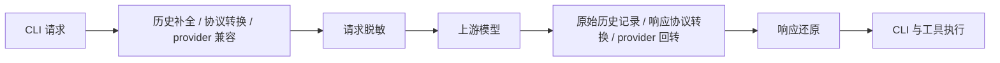

# Gateway 数据脱敏（issue #347）

## 行为与入口

默认关闭。在 **网关 → 设置** 的右列，“接管状态”与“日志与统计”之间提供“数据脱敏”。总开关自动保存；原生 Modal 提供内置规则、自定义字面量/正则、精确值白名单和本地测试。规则弹窗一次保存，不覆盖总开关；关闭时仍能编辑与测试。测试不调用模型，不保存测试文本。

启用后，用随机占位符替换发往上游的敏感业务文本，并在返回客户端前还原响应文本及工具参数。只覆盖经过本机网关的请求，不修改原始 CLI 文件或已在上游保存的历史。请求详情只展示实际命中、还原或失败的信息，不增加列表列或统计图表。

内置默认启用凭据/访问令牌、PEM/OpenSSH 私钥、密码赋值和含密码的连接串；邮箱与 IPv4 按需启用。它是明确规则驱动的文本处理，不承诺识别所有自然语言个人信息。文本规则优先级越高越先匹配，重叠范围只替换一次；自定义正则替换完整匹配，命名捕获组不会缩小替换范围。启用密码规则时，结构化业务对象的凭据字段按整个值处理。白名单比较命中值，不使用通配符。

## 处理顺序

- `privacy/` 负责配置、编译规则、结构遍历、有界内存映射和事件还原；不依赖 provider 数据库解析、鉴权或 URL 构造。接线位于 runtime，不改 transformer 或转换矩阵。
- HTTP 在请求入口固定策略快照，在 `send_upstream_request` 完成出站兼容后替换正文。签名整流会从原请求重建正文，必须再次脱敏；其余整流从已经脱敏的出站副本派生。普通重试和 failover 复用同一请求映射。
- HTTP 响应在现有 provider/协议处理之后还原。原始 provider side store 在还原之前记录数据，不能用客户端还原副本覆盖上游历史。
- Codex 同协议 Responses WebSocket 继续使用现有连接，**不会因为启用脱敏改成 426**。每个 `response.create` 单独固定策略和逻辑事件还原器。原有不兼容协议的握手回退保持有效。
- 关闭路径只检查独立策略状态，不运行文本匹配、额外 JSON 解析/序列化，不创建映射或 SSE/WS 还原器。运行态读取只复制 `Arc`，普通 settings 不包含大规则列表。不声称绝对零耗时。

## 协议与流边界

结构遍历区分 envelope、消息、content block、工具定义、JSON Schema 和业务对象。model、role、工具名称、关联 ID 等协议身份保持不变；工具业务对象里的 `name`、`url` 等普通字段仍参与扫描。工具结果以 JSON 文本返回时先解码业务对象，确保 Claude/Chat/Responses/Gemini 的密码字段采用相同规则；Responses namespace 内嵌工具也扫描描述与 schema 文本，保留命名空间和工具名称。

工具参数中的 JSON 字符串先解码，再处理字符串值，最后正确转义。SSE/WS 参数分片按逻辑通道等待完整的 JSON 字符串值，用同一业务 JSON 遍历还原；支持参数中的文件内容再次嵌套 JSON、Unicode 转义的占位符和跨分片转义，不改写对象键。长字符串保留扫描位置，避免每个新分片重复扫描已缓冲部分。该字符串会在收齐后交付，仍受 2 MiB 事件等待上限约束。

媒体、签名、密文不是可任意改写的业务文本。签名绑定对象只要需要替换或还原就明确失败，避免把失效签名发送到下一跳；流式 thinking 的签名可能晚于文本到达，因此还需要记录通道的签名属性及是否已还原。不同分片不能绕过此边界。不扫描图片像素、音频或不透明加密内容。响应如果包含未知/丢失的完整占位符，不猜原值、不原样交给工具执行。

共享事件还原器按 Chat choice/tool index、Anthropic block index、Responses item/content/summary、Gemini candidate/part 分通道。普通文本只等待尚未完整的占位符后缀，普通 `{` 不会被当作占位符吞掉。保留事件顺序、SSE `event/id/retry`、LF/CRLF 与 UTF-8 分片；兼容已知的扁平 SSE 事件。`error: null`、空字符串或空对象不是终态，不提前冲刷分片。终态前必须完成对应通道的等待；未完成的占位符产生明确错误，不能提前把终态算成功。

WebSocket 仍先记录上游 usage，再还原、发送、记录实际送达，最后完成该轮。启用期间只接受已知的 `response.create` 和不携带正文的 `response.cancel` 控制事件；未知正文、二进制正文或无法关联到请求的上游事件明确失败，待处理请求为空时也不能绕过。受保护轮次的重复终态在关闭后仍丢弃，防止旧占位符透传或消费下一轮。关闭后的新轮次沿用原有兼容行为。

## 状态与持久化

- 配置使用现有 SQLite JSONB `proxy_gateway_settings` 表内独立的 `privacy` 记录；普通配置仍用 `gateway`。全库备份/恢复随既有数据库链路处理该记录，不新增物理列。自定义字面量与白名单属于用户保存的配置，可能包含用户主动填写的敏感值；截获的请求原值不落库。
- 独立 Tauri get/update/preview 命令。更新与 start/restart 共用 manager 串行边界：合并部分更新 → 校验/编译 → 保存成功 → 发布运行态快照；不调用普通 `update_settings`，不清 provider cache。保存或校验失败不切换有效策略。
- 请求开始固定策略；已发出的 HTTP/WS 轮在关闭后仍使用原映射完成还原。切换开关创建新代次，旧轮稍后返回的 response ID 不能重新接入新代次。
- session 只取明确会话标识（含 Codex session/turn metadata）；WS 缺省按连接与 stream lane 隔离。没有会话身份的 HTTP 请求使用独立映射。认证身份仅用于作用域隔离，不能单独当作一个全局会话。
- `previous_response_id` 必须在相同身份、会话和 provider 内找到映射。缺失、过期或换 provider 时拒绝继续引用，不猜测。映射缓存最多 128 组，每组最多 2,048 个不同值、1 MiB 原文；闲置 30 分钟过期。最多 2,048 个 response ID 使用弱引用，不让别名无界保留原文；活动请求持有自己的强引用至结束。TTL 清理跳过仍被请求持有的映射，收到响应时刷新其闲置时间，避免长请求刚结束就无法继续；容量驱逐仍受 128 组上限约束。
- 流式事件等待缓冲上限 2 MiB；正则与规则数、预览输入也有限额，超限明确失败。限额处理不会退回原文发送。

应用重启、网关重启、保护模式切换或过期后，仅引用上游旧历史的对话可能不能还原，需要新建对话。关闭本地开关不能重写上游已保存的占位符历史。

## 日志与观测

继续遵守现有 request log、headers/body、截断和保留设置。启用时日志保存独立脱敏副本，详情带 `privacy` 元数据（命中规则 ID、不同值数量、还原次数、失败与日志标记），不保存反向映射。流式日志可以合并同一逻辑通道的片段后保存为诊断 JSON；它不等同于原始 wire 重放。截断、不完整工具 JSON 或不能安全解析的正文以省略说明替代，不能回退保存原文。

响应还原失败属于本地处理失败，不对 provider 健康计分。已经收到的真实 usage 与成功状态分开处理；SSE/WS 成功继续由实际送达的终态判定，HTTP 200 或解析到 usage 不能代替成功。

日志中已知原值的替换只匹配原始文本范围，保护已有占位符，生成的占位符不再参与替换。单字符密码等短值不能递归改写 token 前缀或使日志反复膨胀；超出匹配限额时省略正文。

## 验证与参考

核心回归位于 `privacy/tests.rs`；真实本机 HTTP/WS 往返位于 `runtime/websocket/privacy_tests.rs`。覆盖四种目标协议的请求转换与 JSON 工具还原、SSE 转换、内嵌 JSON 转义、多路分片、UTF-8、元数据、扁平 SSE、会话与代次隔离、previous response、映射限额、日志脱敏和失败不记成功。现有 WebSocket、协议转换、SQLite 与全量测试仍是交付门禁。

审查补充了 JSON 工具结果、namespace 定义、跨协议嵌套工具参数与 Unicode 转义、空 error 非终态、短值日志替换、活动请求 TTL、自定义正则完整匹配与重叠优先级，以及 Anthropic 完整响应的媒体/签名边界回归。SQLite 用例覆盖部分更新保留开关与真实只读写失败；WS 往返覆盖关闭时在途还原、旧轮次重复终态及没有待处理请求时的未关联事件。浏览器检查在真实设置分区样式中验证固定选项完整显示和按钮与下方说明的外部间距。

前端行为与视觉回归可运行 `node scripts/verify-gateway-privacy.mjs`（需要本机 Chrome/Edge；可用 `--browser` 指定）。该夹具挂载真实组件、用模拟 Tauri 命令检验表单读写、保存失败、并发开关、预览过期和亮/暗/system/窄窗口，并将截图和结果写入系统临时目录；它不替代 Rust 后端往返测试或真实第三方模型联调。

本次参考已拉到相对兄弟目录：`../veil`（`e2a98a8`）、`../cpa-plugin-privacyfilter`（`a3db9d1`）、`../privacy-filter`（`64b8de3`）、`../maskit`（`898bdd3`）、`../CosyRedactGateway`（`b3dc290`）。吸收规则/内存映射分离和逻辑流通道的行为约束，没有复制其网关架构；AGPL 的 Maskit 只参考行为和测试。

同时定点核对 `../cc-switch`（`e0982799`）的工具流分片与 `../axonhub`（`dfbe2259`）的真实终态生命周期。本次不是完整参考项目增量同步，不推进协议主文档里的 baseline。
