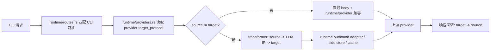
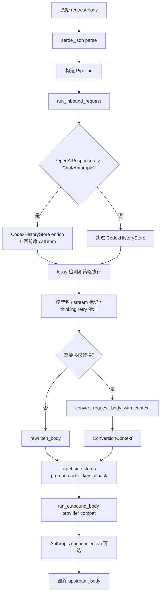
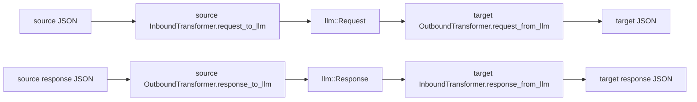

# Proxy Gateway 协议转换架构

本文描述当前代码里的 Proxy Gateway 协议转换实现。事实源是 `tauri/src/coding/proxy_gateway/runtime/**` 和 `tauri/src/coding/proxy_gateway/transformer/**`，不是历史设计稿或参考项目文档。

## 0. 产品场景与设计动机

Proxy Gateway 的目标不是提供一个通用云端 API 网关，而是在本机接管 Claude Code、Codex、Gemini CLI 这类 AI Coding CLI 的固定运行时协议，再把请求转发到用户选择的任意上游 provider。客户端协议、上游真实 wire API、provider metadata、特殊 endpoint 和运行时状态共同决定是否需要协议转换。

典型组合：

| 客户端 | 入站协议 | 上游可能需要的目标协议 |
|---|---|---|
| Claude Code | Anthropic Messages | OpenAI Chat、OpenAI Responses、Gemini Native、Anthropic-compatible |
| Codex | OpenAI Responses / OpenAI Chat | Anthropic Messages、OpenAI Chat、Gemini Native、OpenAI Responses-compatible |
| Gemini CLI | Gemini Native | Anthropic Messages、OpenAI Chat、OpenAI Responses、Gemini-compatible |

因此本模块必须同时解决两类问题：

- **协议结构互转**：例如 Anthropic `tool_use`、Responses `function_call`、Chat `tool_calls`、Gemini `functionCall` 之间的 JSON/SSE 映射。
- **最终上游兼容**：例如 DeepSeek thinking 门控、OpenRouter `reasoning.effort`、Codex official forced SSE、Copilot header/token、Ollama `/api/chat` wire format、Bedrock/Vertex path/header/body 差异。

这两类问题不能混在同一个层里。当前代码把可复用的公共协议转换收敛在 `transformer/`，把 provider 方言、特殊 endpoint、跨请求缓存、鉴权/header、URL 和 failover 留在 `runtime/`。旧审计文档里有价值的细节点已经按这个边界合并到本文；若本文与旧文档冲突，以当前代码和本文件为准。

## 1. 总体边界

Proxy Gateway 的协议转换由两层组成：

1. `runtime/`：请求编排层。负责匹配入站路由、读取 provider、确定 source/target 协议、选择是否转换、拼上游 URL/header/auth、执行 provider 兼容、记录日志/统计、处理重试/failover、维护跨请求兼容缓存。
2. `transformer/`：纯协议载荷转换层。负责 Anthropic Messages、OpenAI Chat Completions、OpenAI Responses、Gemini Native 四种聊天协议的 JSON body、错误 body 和 SSE 流互转。

`transformer` 模块有明确边界：

- 不读数据库。
- 不依赖 Tauri command/app handle。
- 不读取 provider 表、provider type、model health、request log 或 Gateway settings。
- 不拼 URL，不注入 API key，不处理 Bedrock/Vertex/Copilot/Ollama 等 provider 平台差异。
- 只接收 `ConversionRoute { source, target }` 和 payload，输出转换后的 payload。

同协议请求不进入结构转换器。`ConversionRoute` 只有在 `source_protocol != provider.target_protocol` 时才创建；source 与 target 相同则走直通链路，但 runtime 仍可能做模型名改写、`[1M]` 标记剥离、header/auth 注入和 provider 兼容。



## 2. 支持的协议

协议枚举在 `transformer/types.rs`：

| `AiProtocol` | 代码字符串 | 典型 wire API |
|---|---|---|
| `AnthropicMessages` | `anthropic_messages` | Anthropic `/v1/messages` |
| `OpenAiResponses` | `openai_responses` | OpenAI `/v1/responses` |
| `OpenAiChat` | `openai_chat` | OpenAI `/v1/chat/completions` |
| `GeminiNative` | `gemini_native` | Gemini `generateContent` / `streamGenerateContent` |

`AiProtocol::from_api_format()` 是 API format 别名解析入口。它支持 snake_case、slash、dash 等形式，例如：

- `anthropic`、`anthropic_messages`、`anthropic/messages`、`claude`
- `openai_responses`、`openai/responses`、`responses`
- `openai_chat`、`openai-chat`、`chat_completions`、`chat`
- `gemini_native`、`gemini-native`、`gemini`
- `ollama`、`ollama_chat`、`ollama/chat` 会解析成 `OpenAiChat`

注意：Ollama 在 Gateway 中不是第五种 transformer 协议。它由 runtime 把最终 OpenAI Chat body 投影到 Ollama `/api/chat` wire format，再把 Ollama 响应转回 OpenAI Chat 形态，之后继续复用已有 response conversion。

## 3. 入站路由与 source protocol

入站 HTTP 路由先由 `runtime/routes.rs::match_gateway_route()` 匹配 CLI 前缀：

| 前缀 | CLI | `route_name` | forwarded path 示例 |
|---|---|---|---|
| `/anthropic` | Claude Code | `anthropic` | `/v1/messages` |
| `/openai` | Codex / OpenAI-compatible | `openai-compatible` | `/v1/responses`、`/v1/chat/completions` |
| `/gemini` | Gemini CLI | `gemini` | `/v1beta/models/...:generateContent` |

随后 `runtime/upstream.rs::source_protocol_from_route()` 按 CLI 和 forwarded path 推导 source protocol：

| CLI | 条件 | source protocol |
|---|---|---|
| Claude | `/v1/messages` 或 `/messages` | `AnthropicMessages` |
| Codex | `/v1/chat/completions` 或 `/chat/completions` | `OpenAiChat` |
| Codex | `/v1/responses`、`/responses`、`/v1/responses/compact`、`/responses/compact` | `OpenAiResponses` |
| Gemini | path 包含 `:generateContent` 或 `:streamGenerateContent` | `GeminiNative` |

如果 route 无法推导 source protocol，则不会创建 `ConversionRoute`，请求只能走 runtime 的普通转发/兼容路径。

## 4. Provider target protocol

provider 读取在 `runtime/providers.rs`。`load_candidate_providers*()` 从对应 CLI provider 表加载记录，跳过 disabled provider 和 `category=official` provider，然后构造 `UpstreamProvider`。

`UpstreamProvider.target_protocol` 的来源按 CLI 分开：

| CLI | 优先级 | fallback |
|---|---|---|
| Claude | `gatewayProfile` 解析出的 effective `apiFormat` -> legacy `data.meta.api_format/apiFormat` -> `settings_config.api_format/apiFormat` -> `openrouter_compat_mode=true` | `AnthropicMessages` |
| Codex | `gatewayProfile` 解析出的 effective `apiFormat` -> legacy `data.meta.api_format/apiFormat` -> `settings_config.api_format/apiFormat` -> `config.toml` 的 `wire_api` / `api_format` -> base URL 是否是 `/chat/completions` | 非 Chat URL 默认 `OpenAiResponses` |
| Gemini | `gatewayProfile` 解析出的 effective `apiFormat` -> legacy `data.meta.api_format/apiFormat` -> `settings_config.api_format/apiFormat` | `GeminiNative` |

`provider_protocol.rs::provider_needs_gateway_proxy()` 使用同一类语义判断“普通 apply 是否需要 Gateway 接管”：官方订阅 provider 不参与代理；非官方 provider 如果 target protocol 与 CLI native protocol 不一致，就需要网关代理。

Copilot 是一个 runtime 特例：`effective_upstream_provider_for_request()` 会根据本次模型名把 Copilot provider 的 effective target protocol 动态切到 `OpenAiResponses` 或 `OpenAiChat`。这只影响本次请求，不改 provider 记录。

## 5. ConversionRoute 决策

`runtime/upstream.rs::conversion_route()` 的逻辑非常窄：

```rust
(source_protocol != provider.target_protocol).then_some(ConversionRoute::new(
    source_protocol,
    provider.target_protocol,
))
```

也就是说：

- source 与 target 相同：无结构转换。
- source 与 target 不同：请求 body 按 source -> target 转换，响应 body/SSE 按 target -> source 转回。
- route 的 reverse 只用于响应：`response_conversion_route = conversion_route.map(ConversionRoute::reverse)`。

OpenAI Responses `/responses/compact` 是例外边界：它不进入普通 4×4 聊天转换矩阵，也不新增 `AiProtocol`。runtime 的 `CodexResponsesCompactCompat` 单独识别 Codex compact endpoint：OpenAI Responses target 保持原 compact path；OpenAI Chat、Anthropic Messages、Gemini Native target 通过 compact 专项 facade 转换请求，并把上游响应转回 `response.compaction`。显式 streaming compact 请求仍在发送上游前拒绝。

## 6. 请求转换链路

主入口是 `runtime/upstream.rs::send_upstream_request()`。每次 provider attempt 大致按这个顺序构造上游请求：

1. 计算 effective provider 和 effective upstream model。
2. 从 route 推导 source protocol。
3. 如果 source 与 provider target 不同，创建 `ConversionRoute`。
4. 调 `build_upstream_body_for_provider()` 构造最终上游 body。
5. 调 `build_upstream_headers()` 构造上游 header/auth。
6. 调 `upstream_forwarded_path()` 和 `build_provider_target_url()` 构造上游 URL。
7. 发出上游请求。

`build_upstream_body_for_provider()` 是请求 body 的核心流水线，当前顺序如下：



关键细节：

- 入站 middleware 在协议转换前运行。目前包括 `BillingHeaderCchMiddleware`，它会从 Claude Code billing header 文本里剥离动态 `cch=...` 并放入 `PipelineContext`。
- `CodexHistoryStore` enrich 只在 `OpenAiResponses -> OpenAiChat` 和 `OpenAiResponses -> AnthropicMessages` 请求转换前运行，用于补回 Codex follow-up 请求缺失的前序 function/custom tool call item。Chat target 需要前序 assistant `tool_calls`，Anthropic target 需要前序 assistant `tool_use`；二者都可以先在源 Responses body 中补回 call item，再交给 transformer 转成目标协议形态。
- 有损检测在转换前运行，调用 `transformer::check_lossy_conversion(route, value)`。默认只返回 warnings；只有 `ProxyGatewaySettings.lossy_rejection_enabled=true` 且请求没有 `X-Allow-Lossy: true` 时才返回本地 400。
- runtime 在转换前改写源 body 的 `model` 字段为 provider 映射后的上游模型，并剥离 `[1M]` / `[1m]` 上下文标记。Gemini source 如果 body 没有 `model`，转换前会补一个。
- Gemini source 的 stream route 转到非 Gemini target 时，runtime 会在 body 里写 `stream=true`。
- `strip_thinking_for_retry` 只用于 thinking/signature 兼容 4xx 后的重试，不是正常转换前的默认行为。
- 真正结构转换只发生在 `convert_request_body_with_context()`。
- 转换后如果 target 是 Gemini，runtime 可能用 `GeminiShadowStore` 回放上一轮带 `thoughtSignature` 的 model functionCall。
- 转换后如果 target 是 OpenAI Responses，runtime 可能补 `prompt_cache_key` fallback。
- 转换后统一跑 outbound provider pipeline，包括 provider body 兼容、billing CCH 回填、显式 `defaultMaxTokens` 限制。
- target 是 Anthropic 且 `cache_injection_enabled=true` 时，最后注入 `cache_control`。

## 7. Transformer 内核

公开入口在 `transformer/mod.rs`：

- `convert_request_body()` / `convert_request_body_with_context()`
- `convert_response_body()` / `convert_response_body_with_context()`
- `convert_error_response_body()`
- `convert_sse_stream()` / `convert_sse_stream_with_context()`
- `check_lossy_conversion()`

转换内核在 `transformer/kernel.rs`，采用统一中间模型：



这里的 trait 命名含义是：

- `InboundTransformer`：把某协议的 request 转成 LLM IR；或把 LLM response 写回该协议。
- `OutboundTransformer`：把 LLM request 写成某协议；或把某协议 response 转成 LLM IR。

请求转换代码路径：

1. `serde_json::from_slice::<Value>()`
2. `inbound_transformer(route.source).request_to_llm(value)`
3. `outbound_transformer(route.target).request_from_llm(request)`
4. `serde_json::to_vec()`

响应转换代码路径：

1. `serde_json::from_slice::<Value>()`
2. `outbound_transformer(route.source).response_to_llm(value)`
3. `inbound_transformer(route.target).response_from_llm(response)`
4. `serde_json::to_vec()`

错误响应转换更保守：JSON parse 失败或序列化失败时返回原始 body；parse 成功时先 `error_to_llm()`，再 `error_from_llm()`。

## 8. LLM IR

IR 定义在 `transformer/llm/model.rs` 和 `transformer/llm/tools.rs`。它不是数据库模型，也不是对外 API；只是转换过程内部的协议中间层。

`llm::Request` 主要承载：

- `messages`
- `model`
- token 上限：`max_tokens`、`max_completion_tokens`
- reasoning：`reasoning_effort`
- 采样参数：`temperature`、`top_p`、penalty、seed
- OpenAI 兼容参数：`service_tier`、`logprobs`、`top_logprobs`、`logit_bias`、`verbosity`、`user`
- `stop`
- `stream` / `stream_options`
- `tools` / `tool_choice` / `parallel_tool_calls`
- `response_format`
- `previous_response_id`
- `prompt_cache_key`
- `metadata`
- `extra_body`
- `request_type` / `api_format`
- `transformer_metadata`

`llm::Message` 主要承载：

- `role`
- text/parts content
- image/document content
- tool call / tool result
- `reasoning_content` / `reasoning`
- provider-local `reasoning_signature`
- Anthropic `redacted_reasoning_content`
- `cache_control`
- `annotations`
- `transformer_metadata`

`llm::Response` 主要承载：

- `id`、`object`、`created`、`model`
- `choices`
- `previous_response_id`
- `usage`
- normalized error
- `transformer_metadata`

IR 通过 `transformer_metadata` 保留少量 provider-local roundtrip 信息，但不做跨请求持久化。跨请求补全状态属于 runtime side stores。

## 9. ConversionContext

`ConversionContext` 定义在 `transformer/kernel.rs`：

```rust
pub struct ConversionContext {
    pub codex_tool_context: Option<CodexToolContext>,
    pub lossy_warnings: Vec<String>,
}
```

它是单次请求作用域状态：

- request 转换时生成。
- 同一次 response JSON 或 SSE 转换时由 runtime 原样带回。
- 不落库。
- 不跨请求复用。
- runtime 不解释 `codex_tool_context` 的协议细节。

当前只有 `OpenAiResponses -> OpenAiChat` 请求转换会生成 `CodexToolContext`。作用是把 Codex Responses 的 `tool_search`、namespace tool 和 custom tool 暂时展平成 Chat function tool，让普通 Chat provider 能返回工具调用；响应从 Chat 转回 Responses 时，再用同一个 context 还原成 Codex 能识别的 Responses item。

注意不要把 `CodexToolContext` 和 `CodexHistoryStore` 混在一起：

- `CodexToolContext` 是同一次 HTTP request/response 内的工具定义和名称映射，只服务 Responses <-> Chat 的工具展平/还原。
- `CodexHistoryStore` 是跨 HTTP 请求的 runtime side store，记录上一轮最终返回给 Codex 的 Responses call item，下一轮 Codex 只带 `previous_response_id` / `function_call_output` 时再补回缺失的 assistant call item。
- 参考项目的 Codex history 实现主要覆盖 Codex Responses bridged to Chat Completions；AI Toolbox 这里扩到 Responses -> Anthropic 的依据是：补全发生在源 Responses body 上，补完后的 `function_call + function_call_output` 已能由现有 transformer 自然输出为 Anthropic `assistant tool_use + user tool_result`。

`lossy_warnings` 由 runtime 在转换前通过 lossy detector 填入，响应阶段用于追加 `X-Transformer-Lossy` header。

## 10. SSE 转换链路

流式转换入口是 `convert_sse_stream_with_context()`。如果 route 是 identity，直接返回原 stream；否则创建 `StreamKernel` 包装 inner stream。

`StreamKernel` 的处理模型：

1. `append_utf8_safe()` 处理 UTF-8 跨 chunk 边界。
2. `take_sse_block()` 按 `\n\n` 或 `\r\n\r\n` 切 SSE block。
3. `parse_sse_block()` 提取 `event:` 和多行 `data:`。
4. source parser 把各协议 SSE 解析成 `UnifiedStreamEvent`。
5. target writer 把 `UnifiedStreamEvent` 写成目标协议 SSE。

统一事件类型包括：

- `Start`
- `TextDelta`
- `ReasoningDelta`
- `ReasoningSignature`
- `ToolCallSignature`
- `ToolCall`
- `RawAnthropicContentBlock`
- `StreamError`
- `Finish`

source state 会维护必要的流式状态，例如：

- OpenAI Chat tool call name/id 和 arguments 累积。
- OpenAI Chat leading `<think>...</think>` 跨 chunk FSM。
- Anthropic content block/tool block 状态。
- OpenAI Responses item/tool call 状态。
- Gemini 累计文本和 reasoning 前缀差值。
- finish reason 和 usage 的延迟合成。

SSE 转换要求边读边写，不 full-buffer。结束事件要幂等处理，例如 OpenAI `[DONE]`、Anthropic `message_stop`、Responses `response.completed`、Chat `finish_reason` 和 Gemini finish chunk 可能重复或组合出现。

runtime 在进入 transformer 前后还会包一些 provider/runtime stream adapter：

- Gemini target 的原始 SSE 会被 `record_gemini_sse_stream()` 旁路记录到 `GeminiShadowStore`。
- Bailian/DashScope OpenAI Chat SSE 会先经过 provider-specific filter。
- Ollama NDJSON stream 会先转成 OpenAI Chat SSE。
- 如果响应最终转回 OpenAI Responses，`record_responses_sse_stream()` 会记录 Codex tool call 历史。

## 11. 响应回转链路

响应构造入口是 `runtime/upstream.rs::build_gateway_response()`。它先计算：

```rust
let response_conversion_route = conversion_route.map(ConversionRoute::reverse);
```

### 11.1 非流客户端遇到上游 SSE

如果客户端本身没有请求流式，但上游返回 `text/event-stream`，runtime 会按 target protocol 聚合上游 SSE 为同协议 JSON：

1. `aggregate_sse_stream_for_non_streaming_client()`
2. 得到 target protocol JSON body。
3. 如果需要 response conversion，则调用 `convert_response_body_with_context(reverse_route, ...)` 转回客户端 source protocol。
4. 设置 `Content-Type: application/json`。
5. 记录 side store。

这条路径用于“上游被 provider/runtime 强制流式，但客户端要非流 JSON”的场景。

### 11.2 客户端流式

如果 `should_stream_response()` 判定应该流式返回：

1. 必要时设置 `Content-Type: text/event-stream`。
2. 按设置创建 bounded upstream response snapshot。
3. 先执行 Gemini shadow 记录、Bailian SSE filter、Ollama NDJSON -> Chat SSE 等 runtime adapter。
4. 如果存在 `response_conversion_route`，调用 `convert_sse_stream_with_context()` 做 target -> source SSE 转换。
5. 如果最终目标是 OpenAI Responses，旁路记录 Codex response history。

### 11.3 普通 JSON 响应

非流 JSON 响应路径：

1. 读取 upstream response body。
2. 如果 provider 是 Ollama，把 Ollama JSON 先转成 OpenAI Chat JSON。
3. 如果存在 `response_conversion_route`：
   - 2xx/3xx：`convert_response_body_with_context()`
   - 非 2xx/3xx：`convert_error_response_body()`
4. 记录 side store。
5. 用最终返回给客户端的 body 解析 usage。

## 12. 上游 URL、query 与 auth

协议转换不只影响 body，也会影响上游 endpoint。相关逻辑在 `runtime/upstream.rs`。

转换场景下的默认 forwarded path：

| target protocol | upstream path |
|---|---|
| `AnthropicMessages` | `/v1/messages` |
| `OpenAiResponses` | `/v1/responses` |
| `OpenAiChat` | `/v1/chat/completions` |
| `GeminiNative` | `/{api_version}/models/{model}:generateContent` 或 `:streamGenerateContent` |

特殊规则：

- provider `is_full_url=true` 或 base URL 用 RawURL 语义时，runtime 不追加协议默认 path，只合并 query。
- Gemini target 的 API version 从 provider base URL 推断，支持 `v1` / `v1beta` / `v1alpha`；没有显式版本时默认 `v1beta`。
- Gemini source 转非 Gemini target 时，转换后的 query 会过滤 `alt=sse` 和 `key=`。
- 转 Gemini target 且目标流式时，query 会补 `alt=sse`。
- 所有 converted route query 会过滤 `beta=`。
- Anthropic Bedrock/Vertex target 会按 platform 改写 path：Bedrock 使用 `/model/{model}/invoke*`，Vertex 使用 `/publishers/anthropic/models/{model}:rawPredict|streamRawPredict`。
- DeepSeek legacy completion 和 Ollama `/api/chat` 是 runtime 特殊路径，不属于 transformer 协议矩阵。

header/auth 由 `build_upstream_headers()` 处理：

- 先保留允许转发的入站 header。
- 强制 `Accept-Encoding: identity`。
- 按 provider `auth_strategy` 注入鉴权。
- `OpenAiChat` / `OpenAiResponses` 默认 Bearer。
- Gemini 根据 key 形态使用 Google API key 或 OAuth。
- Anthropic target 保持 Anthropic API key 或 provider meta 指定的 Bearer 语义。
- Anthropic platform、Codex official、Copilot 会继续注入各自 runtime adapter 需要的 header。

## 13. Runtime side stores

跨 HTTP 请求的兼容状态不在 transformer 内，统一放在 `runtime/side_stores/`。

### 13.1 CodexHistoryStore

文件：`runtime/side_stores/codex_history.rs`

职责：

- 记录 OpenAI Responses response 中的 `function_call`、`custom_tool_call`、`tool_search_call` 等 call item。
- 用 response id 做主索引，用 call id 做二级索引。
- 后续 Codex request 如果只带 `previous_response_id` / `function_call_output`，或只有可唯一匹配的 call id，则在转换前补回前序 assistant call item。
- 当前补全目标是 `OpenAiResponses -> OpenAiChat` 和 `OpenAiResponses -> AnthropicMessages`。这两个 target 都要求工具结果前有同轮可见的 assistant 工具调用；Responses 上游本身可以靠 `previous_response_id` 取服务端历史，所以同协议 Responses target 不补。Gemini target 使用 `GeminiShadowStore` 在转换后的 Gemini body 上回放上一轮 model `functionCall`，不复用 `CodexHistoryStore`。

边界：

- 只作为 runtime 兼容缓存。
- 不写数据库。
- 不进入 request log 的 Source of Truth。
- 容量上限是 512 个 cached responses。

### 13.2 GeminiShadowStore

文件：`runtime/side_stores/gemini_shadow.rs`

职责：

- 记录 Gemini response candidates 中带 `thoughtSignature` 的 model content/functionCall。
- 后续发往同 provider/session 的 Gemini request 如果只有 `functionResponse` 且缺少对应 model `functionCall`，就在 `functionResponse` 前插入最近匹配的 signed model turn。

session key 来源：

- `x-ai-toolbox-session-id`
- `x-session-id`
- `x-conversation-id`
- `chatgpt-conversation-id`
- `chatgpt-account-id`
- body JSON Pointer：`/metadata/session_id`
- body JSON Pointer：`/metadata/conversation_id`
- body JSON Pointer：`/extra_body/session_id`
- body JSON Pointer：`/previous_response_id`
- body JSON Pointer：`/cachedContent`

边界：

- 只在有可靠会话线索时记录/回放。
- 不使用 `"default"` 之类全局 session，避免跨会话污染。
- 容量上限是 200 sessions，每个 session 64 turns。

## 14. Provider 兼容不属于 transformer

很多“看起来像协议转换”的逻辑实际在 runtime provider adapter 层。当前代码的分界是：

| 能力 | 所在层 | 原因 |
|---|---|---|
| Anthropic <-> Chat/Responses/Gemini 结构互转 | `transformer` | 协议 payload 语义 |
| `apiFormat=ollama/chat` | `runtime` | 最后一跳 wire format 是 Ollama `/api/chat`，IR 仍按 OpenAI Chat |
| Copilot Chat/Responses 动态切换 | `runtime` | 取决于 provider type、模型名、token/header |
| Copilot token exchange 和 fingerprint headers | `runtime` | Provider auth/header 行为 |
| Anthropic Bedrock/Vertex URL/header/body 清理 | `runtime` | 平台差异，不是 Anthropic Messages 协议本身 |
| Codex official Responses body/header 兼容 | `runtime` | 官方上游约束，不是通用 Responses 协议 |
| DeepSeek legacy `/beta/completions` | `runtime` | Legacy completions 不属于聊天转换矩阵 |
| Bailian Chat SSE 过滤 | `runtime` | Provider stream quirk |
| OpenAI Chat `reasoningField` 策略 | `runtime` | provider meta 决定最终字段 |
| Codex -> Chat 多 vendor reasoning/thinking 参数矩阵 | `runtime` | provider meta/provider type 兼容 |
| text-only 模型图片块替换 | `runtime` | provider/model 能力策略 |
| `defaultMaxTokens` 限制 | `runtime` middleware | provider meta 策略 |
| 有损转换检测 | `transformer` 检测，`runtime` 执行策略 | detector 是纯函数；是否拒绝取决于 settings/header |

新增 provider-specific 规则时，优先放 runtime/provider adapter 或 middleware；不要把 provider type、base URL、API key 字段、model catalog 等信息引入 `transformer`。

### 14.1 渠道定义如何进入 runtime

Claude / Codex / Gemini CLI 渠道表单里的内置供应商 profile 使用同一份 Gateway profile catalog。仓库内的 bundled 默认数据是 `tauri/resources/gateway_provider_profiles.json`，后端 `provider_profiles.rs` 会优先读取 app data 下缓存的 `gateway_provider_profiles.json`，缓存无效或不存在时再 fallback 到 bundled 默认数据；`web/app/providers.tsx` 启动时先 `loadCachedGatewayProviderProfiles()`，再后台 `fetchRemoteGatewayProviderProfiles()` 刷新前端共享 store。

前端共享类型 `GatewayProviderToolKey` 当前覆盖 `claude | codex | gemini`。`gateway_provider_profiles.json` 的 `tools.<tool>` 节点分别描述各 CLI 表单可选的 endpoint：Claude / Codex / Gemini CLI 表单都从共享 catalog 生成内置渠道选项。渠道下拉本身就是关联内置渠道的入口，不需要额外“关联内置渠道”按钮。

用户选择某个 Claude / Codex / Gemini profile endpoint 并保存 provider 时，provider `data.meta` 不再固化 endpoint/profile 上的派生兼容快照，而是保存稳定引用：

```json
{
  "gatewayProfile": {
    "tool": "gemini",
    "profileId": "deepseek",
    "endpointId": "openai_chat"
  }
}
```

Base URL 是用户可编辑连接地址，仍保存在各 CLI 自己的 `settingsConfig` 中；它不是 endpoint 身份，也不参与内置渠道回显或刷新判断。`providerType + apiFormat` 也不是内置渠道身份，因为同一供应商类型和同一 API 格式下可能存在 cn/global/coding 等多个 profile 或 endpoint 变体。它只作为 legacy provider 的唯一匹配辅助：旧 provider 没有 `gatewayProfile` 时，前端最多在 `providerType + apiFormat` 唯一命中一个 endpoint 时自动回显内置渠道；多匹配或缺字段时回显为自定义渠道，等待用户从渠道下拉显式选择。

后续 runtime 每次读取 provider 时，`runtime/providers.rs::provider_meta_from_record()` 会先解析 `data.meta.gatewayProfile`，再从当前 app data cache 或 bundled `gateway_provider_profiles.json` 动态 resolve profile/endpoint，生成本次请求使用的 effective meta：

- `providerType`：来自 `profile.providerType`，例如 `deepseek`、`openrouter`、`bailian`、`ollama`、`github_copilot`。这是供应商专属兼容的主要识别键，但它是解析结果，不是 UI 渠道身份。
- `apiFormat`：来自 `endpoint.apiFormat`，例如 `openai_chat`、`openai_responses`、`anthropic_messages`、`gemini_native`，以及 `ollama/chat` 这类 runtime wire adapter 信号。它决定 `UpstreamProvider.target_protocol`，不表示入站 CLI 协议。
- `apiKeyField`：优先 `endpoint.apiKeyField`，再 fallback `profile.apiKeyField`。
- `reasoningField`：优先 `endpoint.reasoningField`，再 fallback `profile.reasoningField`。
- `codexChatReasoning`：只在 `gatewayProfile.tool === "codex"` 时从 endpoint/profile 解析；Gemini CLI 即使复用 Codex 同 target endpoint，也不能应用或持久化这个 Codex-only 配置。
- `defaultMaxTokens`：优先 endpoint，再 fallback profile，由 runtime middleware 在最终目标协议 body 上补齐或截断对应 token 字段。
- `imageInputPolicy`、`textOnlyModels`、`imageCapableModels`、`allowTextOnlyModelHeuristic`：优先 endpoint，再 fallback profile，驱动发送前预测式图片兼容策略。
- `isFullUrl`、`promptCacheKey`、`costMultiplier`、`pricingModelSource`：继续作为 provider 自身的用户/运行态覆盖项保存在 `data.meta`，不会被 profile 覆盖。

如果 `gatewayProfile` 缺失、tool 不匹配、profile/endpoint 已不存在或 catalog 解析失败，runtime 保留 legacy `data.meta.providerType` / `apiFormat` / `reasoningField` / `codexChatReasoning` 等旧字段，保证存量数据继续可用；但新保存的内置渠道不应再写这些派生快照。

前端合并点：

- `web/features/coding/claudecode/components/ClaudeProviderFormModal.tsx::mergeGatewayMetaIntoProviderMeta()`
- `web/features/coding/codex/components/CodexProviderFormModal.tsx::mergeGatewayMetaIntoProviderMeta()`
- `web/features/coding/geminicli/components/GeminiCliProviderFormModal.tsx::mergeGatewayMetaIntoProviderMeta()`

后端读取点是 `runtime/providers.rs::provider_meta_from_record()`，它同时兼容 snake_case 和 camelCase 字段，把 JSONB 中的 `data.meta` 解析成 `ProviderGatewayMeta`。如果 effective `providerType` 为空，当前代码会 fallback 到 provider record 的 `category`；这个 fallback 只用于 legacy 兼容，自定义渠道不要靠模型名或 base URL 伪造供应商身份。

`gateway_provider_profiles.json` 里的 `compat` 对象只是 profile/catalog 层的描述信息，例如 `openaiChat: ["deepseek_json_schema", "deepseek_thinking"]`；runtime 不直接读取这个对象执行逻辑。真正触发规则的是由 `gatewayProfile` 动态解析出的 effective `providerType`、`apiFormat`、`reasoningField`、`codexChatReasoning` 等字段，或 legacy provider 已显式保存的同名 meta 字段。

### 14.2 执行位置和顺序

`build_upstream_body_for_provider()` 会先构造 request-scoped pipeline，并在协议转换前运行 inbound middleware；真正的 provider-specific body 兼容发生在协议转换完成后、发送给上游前的 outbound body 阶段。pipeline 构造入口是：

```rust
build_provider_pipeline(provider_meta, conversion_route, target_protocol, skip_outbound_adapter)
```

当前 pipeline 的 outbound body middleware 顺序是：

1. `OutboundAdapterCompatMiddleware`
2. `BillingHeaderCchMiddleware`
3. `EnsureMaxTokensMiddleware`，仅当 provider meta 显式声明 `defaultMaxTokens > 0` 时加入

`OutboundAdapterCompatMiddleware` 调用：

```rust
apply_outbound_adapter_compat_value(
    body,
    conversion_route,
    target_protocol,
    provider_meta,
)
```

它处理的是“最终发给上游 provider 的 body”。因此无论请求是直通、Claude -> Chat、Codex Responses -> Chat、Gemini -> Anthropic，provider-specific 规则都只看最终 `target_protocol` 和当前 `provider_meta`。这也是为什么 DeepSeek Chat 的差异不属于 transformer：transformer 只负责把 payload 转成 OpenAI Chat 形态；DeepSeek 是否接受某些 Chat 字段，是上游渠道兼容问题，由 runtime adapter 最后一跳处理。

`apply_outbound_adapter_compat_value()` 的大致顺序：

1. `filter_private_outbound_fields()` 移除 `_` 开头的内部私有字段，但保留 JSON Schema 里的属性名。
2. `ProviderBodyCompat::from_provider_meta()` 根据 `providerType + target_protocol` 识别供应商方言。
3. `ReasoningFieldPolicy::from_provider_meta()` 根据 `reasoningField` 和 provider fallback 计算 Chat reasoning 字段策略。
4. 读取 effective meta 中的 `codexChatReasoning`；没有配置时，才根据明确的 effective `providerType/apiFormat` 做窄范围推导。
5. `apply_provider_body_compat_before_generic()` 先做 provider 专属 body 改写。
6. 如果 target 是 OpenAI Chat，执行 Codex -> Chat 多供应商 reasoning/thinking 参数映射。
7. 如果 target 是 OpenAI Chat，执行通用第三方 Chat 兼容清理，例如 `developer` 转 `system`、system 合并到首条、过滤 Responses custom tool、清理常见不支持字段。
8. 对发生协议转换的请求，清理无 tools 时的 `tool_choice` / `parallel_tool_calls` 等控制字段。
9. `apply_provider_body_compat_after_generic()` 做必须在通用清理后执行的 provider 规则。
10. 如果 target 是 OpenAI Chat，执行 `reasoningField` 策略和 DeepSeek 最终 reasoning 门控。
11. 执行图片/多模态预测式替换策略。
12. 如果是 Ollama，最后把 OpenAI Chat body 投影成 Ollama `/api/chat` wire format。

### 14.3 供应商方言识别

`runtime/upstream.rs::ProviderBodyCompat` 是当前 provider-specific body 兼容的核心枚举。`ProviderBodyCompat::from_provider_meta()` 先看 `providerType`，并且会结合 `target_protocol` 判断某些同名 provider type 的实际平台：

| `providerType` / 条件 | target protocol | `ProviderBodyCompat` | 说明 |
|---|---|---|---|
| `deepseek` | 任意相关 target | `DeepSeek` | DeepSeek Chat / Anthropic 兼容规则 |
| `moonshot`、`kimi` | 任意相关 target | `Moonshot` | Kimi/Moonshot Chat/Anthropic 兼容和 usage 语义 |
| `zai`、`zhipu`、`glm`、`bigmodel` | OpenAI Chat 等 | `Zai` | GLM/Z.ai Chat 参数兼容 |
| `doubao`、`volces` | OpenAI Chat/Responses | `Doubao` | 火山/豆包 metadata、thinking 字段兼容 |
| `xai`、`grok` | OpenAI Chat | `Xai` | xAI/Grok 不支持字段清理 |
| `longcat` | OpenAI Chat/Anthropic | `Longcat` | LongCat 平台差异 |
| `modelscope` | OpenAI Chat/Responses | `ModelScope` | ModelScope 不支持 metadata 等字段 |
| `bailian`、`dashscope`、`aliyun` | OpenAI Chat | `Bailian` | DashScope/Bailian tool call 和 SSE 过滤 |
| `mimo`、`xiaomi-mimo` | OpenAI Chat/Anthropic | `Mimo` | MiMo reasoning/tool thinking 兼容 |
| `openrouter` | OpenAI Chat | `OpenRouter` | reasoning object / reasoning field 策略 |
| `bedrock`、`anthropic-bedrock`、`aws-bedrock` | Anthropic Messages | `AnthropicBedrock` | Bedrock Claude Messages path/body/header 兼容 |
| `vertex`、`anthropic-vertex`、`claude-vertex` | Anthropic Messages | `AnthropicVertex` | Anthropic Vertex path/body/header 兼容 |
| `vertex`、`google-vertex`、`gemini-vertex` | Gemini Native | `GeminiVertex` | Gemini Vertex function id 清理 |
| `codex`、`openai-codex`、`chatgpt-codex`、`codex-official` | OpenAI Responses | `CodexOfficial` | Codex 官方上游 Responses body/header 兼容 |
| `copilot`、`github-copilot`、`githubcopilot` | Chat/Responses dynamic | `Copilot` | Copilot 动态 target、token exchange、fingerprint header、body 兼容 |
| `ollama` 或 `apiFormat=ollama/chat` | OpenAI Chat | `Ollama` | 最后一跳投影到 Ollama `/api/chat` |

注意 `providerType=vertex` 不是单独足够的信息：Anthropic target 下是 Anthropic Vertex，Gemini target 下是 Gemini Vertex。判断必须带上 target protocol。

### 14.4 DeepSeek OpenAI Chat 示例

选择 DeepSeek 的 Codex OpenAI Chat endpoint 时，provider 只持久化引用：

```json
{
  "gatewayProfile": {
    "tool": "codex",
    "profileId": "deepseek",
    "endpointId": "openai_chat"
  }
}
```

runtime 读取 provider 时会从当前 profile catalog 解析出本次请求使用的 effective meta：

```json
{
  "providerType": "deepseek",
  "apiFormat": "openai_chat",
  "codexChatReasoning": {
    "supportsThinking": true,
    "supportsEffort": true,
    "thinkingParam": "thinking",
    "effortParam": "reasoning_effort",
    "effortValueMode": "deepseek",
    "outputFormat": "reasoning_content"
  }
}
```

这条请求的链路是：

1. `runtime/providers.rs` 先把 `gatewayProfile` 解析为 effective `apiFormat=openai_chat`，再得到 `UpstreamProvider.target_protocol = OpenAiChat`。
2. 如果入站不是 OpenAI Chat，例如 Codex Responses，则先由 transformer 做普通 `OpenAiResponses -> OpenAiChat` 结构转换。
3. 转换后的 Chat body 进入 `OutboundAdapterCompatMiddleware`。
4. `ProviderBodyCompat::from_provider_meta()` 看到 `providerType=deepseek`，得到 `ProviderBodyCompat::DeepSeek`。
5. DeepSeek Chat 专属规则开始执行。

当前 DeepSeek OpenAI Chat body 兼容包括：

- `response_format.type=json_schema` 改写成 `json_object`，并移除 `json_schema` payload，避免 DeepSeek Chat 兼容接口不接受 OpenAI JSON Schema wrapper。
- 根据 `reasoning_effort` 写入 `thinking.type`：
  - `none` / `off` / `disabled` -> `thinking.type="disabled"`，同时移除 `reasoning_effort` 并清理 assistant 历史 reasoning 字段。
  - 其它值 -> `thinking.type="enabled"`，并把 Codex/OpenAI effort 映射成 DeepSeek 接受的 `high` 或 `max`。
- 通用 Chat 清理时，DeepSeek 是少数会保留 `reasoning_effort` 的 provider；其它普通 Chat provider 默认会删除该字段，除非显式 `codexChatReasoning` 声明需要保留。
- 通用 Chat 清理后，DeepSeek 还会再做一轮 assistant 历史 reasoning 门控：
  - assistant 历史里有非空 `tool_calls` 时，保留或回填 `reasoning_content`，缺失时用 `"tool call"` 兜底。
  - assistant 历史没有 tool call 时，移除 `reasoning_content` 和 `reasoning`，避免纯文本 assistant 历史在 DeepSeek Chat 里触发 schema 兼容错误。
- Responses custom tool 的 Chat 兼容扩展会在通用 Chat 清理中被过滤，只保留普通 OpenAI Chat `function` tools/tool_calls。

DeepSeek Anthropic target 也属于 runtime provider body compat，不属于 transformer。`providerType=deepseek` 且 target 是 Anthropic Messages 时，runtime 会：

- 规范化 Anthropic tool thinking 历史，避免工具调用历史里的 thinking/signature 形态被供应商拒绝。
- 当 `thinking.type="disabled"` 时，移除 `reasoning_effort` 和 `output_config.effort`，保留其它 `output_config` 字段。
- 过滤非 Direct/非 Bedrock 平台不支持的 Anthropic native `web_search` tool。

DeepSeek legacy OpenAI Completion API 更不是 transformer 路径。Codex/OpenAI `/v1/completions` 或 `/completions` 入站走 runtime passthrough；当 provider 是 DeepSeek 时，URL 会从普通 `/v1/completions` 改到 DeepSeek `/beta/completions`，且不会套 OpenAI Chat body adapter。

### 14.5 参考项目对照下的供应商兼容清单

对照参考项目后，结论不是“把参考实现的所有启发式都塞进 transformer”，而是要把每个上游供应商的 wire/API 方言明确落在 Gateway runtime/provider compat 层。参考项目里大量规则通过 provider name、base URL、model id 启发式触发；AI Toolbox 当前更保守：Claude / Codex / Gemini CLI 内置渠道只在 provider `data.meta.gatewayProfile` 保存 profile/endpoint 引用，runtime 再从最新 profile catalog 解析出 `providerType/apiFormat`、Codex Chat reasoning、图片策略等 effective meta；自定义渠道默认不靠模型名或 Base URL 猜供应商。

因此判断“是否缺失”要分两类：

| 类型 | AI Toolbox 当前状态 | 说明 |
|---|---|---|
| Claude / Codex / Gemini CLI 内置 profile 里已有 `providerType` 的供应商 | 基本已有 runtime 触发点 | 用户选择内置 endpoint 并保存后，provider `data.meta.gatewayProfile` 会记录 profile/endpoint 引用；runtime 按当前 catalog 动态解析供应商身份和兼容参数。Gemini CLI 共享同一份 `tools.gemini` endpoint，但 runtime 不会给 Gemini 应用 Codex 专属 `codexChatReasoning`。 |
| Gemini CLI 表单里的普通自定义渠道 | 只写 `meta.apiFormat`，不写 `gatewayProfile` | 如果用户手动填 DeepSeek/OpenRouter/Qwen 兼容 endpoint 但没有选择内置 profile，通常不会得到 effective `providerType`，因此只能获得通用协议转换，不能获得单供应商方言兼容。 |
| 用户手动创建的 custom provider | 默认只做通用协议转换和通用 provider compat | 即使模型名包含 `deepseek`、`qwen`、`glm`、`minimax`，也不会自动套内置供应商规则；这是为了避免把聚合商或私有中转误判成官方方言。 |

当前需要记录的供应商兼容如下：

| 供应商 / 平台 | 参考项目行为 | AI Toolbox 当前放置位置和兼容逻辑 | 缺口 / 注意事项 |
|---|---|---|---|
| DeepSeek | Claude Anthropic endpoint 会修正 tool_use 历史 thinking；OpenAI Chat 会处理 JSON schema、thinking/reasoning；legacy completions 转 `/beta/completions`。 | `ProviderBodyCompat::DeepSeek`。Chat target：`response_format.type=json_schema` 降成 `json_object`；按 `reasoning_effort` 写 `thinking.type`；映射 effort 到 `high/max`；保留或回填 assistant tool call 的 `reasoning_content`，纯文本 assistant 历史移除 reasoning 字段。Anthropic target：规范化 tool thinking 历史，`thinking.disabled` 时移除 `output_config.effort` / `reasoning_effort`。Legacy completions：runtime 改写 URL 到 `/beta/completions`。 | Claude/Codex/Gemini 内置 DeepSeek profile 已覆盖。自定义 DeepSeek-like Chat 如果没有 `providerType=deepseek`，只会走通用 Chat 清理，不会套 DeepSeek 最终 reasoning 门控。 |
| Moonshot / Kimi | reasoning vendor hints 下保留 tool-call reasoning_content；Anthropic 历史 tool_use 前补 thinking。 | `ProviderBodyCompat::Moonshot`。Chat target：JSON schema 降成 `json_object`，assistant tool call 缺 `reasoning_content` 时补 `"tool call"`。Anthropic target：规范化 tool thinking 历史。usage 解析层还对 Moonshot/Kimi Anthropic-compatible 的 `cached_tokens` 和负 input token 折扣做 provider-aware 处理。Codex -> Chat reasoning 矩阵使用 `thinking` + `reasoning_content`。 | 已覆盖 Claude/Codex/Gemini profile。注意 usage 兼容不属于 transformer，也不应在成本层二次扣减缓存 token。 |
| Z.ai / GLM / 智谱 | Codex Responses -> Chat 时按 GLM/Zhipu thinking 方言写 `thinking`。 | `ProviderBodyCompat::Zai`。Chat target：JSON schema 降成 `json_object`；`metadata.user_id/request_id` 提升为供应商顶层字段；没有 request_id 时生成 `req_<timestamp>`；`tool_choice` 强制 `auto`；按 `reasoning_effort` 写 `thinking.type`。Codex -> Chat reasoning 矩阵使用 `thinking` + `reasoning_content`。 | 已覆盖内置 profile。`tool_choice` 强制 auto 是 provider 方言，不应挪到通用 transformer。 |
| Doubao / Volces / 火山 | Chat/Responses 接口对 metadata、thinking 字段有差异。 | `ProviderBodyCompat::Doubao`。Chat target：`metadata.user_id/request_id` 提升，补 request_id，按 `reasoning_effort` 写 `thinking.type`，后续通用清理会移除顶层 `reasoning_effort`。Responses target：移除 `metadata`。 | profile 当前主要提供 Anthropic 或 Responses endpoint；若后续新增 Doubao Chat endpoint，可复用已有 Chat compat。 |
| Bailian / DashScope / Qwen / Aliyun | Qwen/DashScope Chat thinking 使用 `enable_thinking`；Bailian SSE tool call 后的文本 delta 需要过滤/重排。 | `ProviderBodyCompat::Bailian`。Chat target：合并连续 assistant tool-call-only message。Stream adapter：Bailian OpenAI Chat SSE 在进入 response conversion 前过滤，见 `maybe_filter_bailian_openai_chat_sse_stream()`。Codex -> Chat reasoning 矩阵使用 `enable_thinking` + `reasoning_content`。 | profile 目前内置 Anthropic/Responses endpoint；Chat compat 已在 runtime 可用。SSE 过滤必须保持在 runtime raw stream adapter，不能下沉到 transformer。 |
| OpenRouter | 参考项目现在默认可走 Claude-compatible passthrough，但旧 Chat/Responses 路径需要 OpenRouter 原生 `reasoning.effort`。 | `ProviderBodyCompat::OpenRouter`。Chat target：把顶层 `reasoning_effort` 移入 `reasoning.effort`，`max/xhigh` 归一为 `xhigh`；默认 `reasoningField=reasoning`；Codex -> Chat reasoning 矩阵使用 `thinkingParam=none`、`effortParam=reasoning.effort`，disabled 时写 `{"reasoning":{"effort":"none"}}`。 | 已覆盖 OpenRouter Chat profile。OpenRouter 已支持 Claude-compatible endpoint 这件事只是 endpoint 选择，不改变 Chat 方言仍需 runtime 兼容。 |
| SiliconFlow | 参考项目按平台 name/base URL 优先，Codex Chat reasoning 写 `enable_thinking`，不发 `reasoning_effort`。 | 没有单独 `ProviderBodyCompat` 枚举；通过 `gatewayProfile` 动态解析出的 Codex `codexChatReasoning` 或 `infer_codex_chat_reasoning_config()` 的 effective `providerType/apiFormat` 平台识别覆盖。Chat target 写 `enable_thinking`，输出 reasoning 期望为 `reasoning_content`，不传 effort。 | 内置 SiliconFlow 目前在 Codex/Gemini profile 中出现；Gemini 不应用 Codex 专属 `codexChatReasoning`。若未来给 Claude 增加同平台 endpoint，也必须放入 profile catalog，由 runtime 解析 effective meta，而不是靠模型名推断。 |
| StepFun | 参考项目只在 StepFun 平台或 `step-3.5-flash-2603` 模型下启用；2603 支持 low/high effort，其它 step 模型不发 effort。 | 没有单独 `ProviderBodyCompat`；通过 `codexChatReasoning` 矩阵覆盖。`thinkingParam=none`，`effortParam=reasoning_effort`，`effortValueMode=low_high`，且 fallback 只有 provider 已识别为 `stepfun` 后才用模型名 `2603` 做能力细分。 | 内置 StepFun 当前在 Codex/Gemini profile 中出现；模型名只作为已识别 provider 内的能力细分，不作为 custom provider 的供应商识别来源。 |
| MiniMax | 参考项目对 MiniMax Chat reasoning 使用 `reasoning_split`，响应 reasoning 常见为 `reasoning_details`。 | 没有单独 `ProviderBodyCompat`；通过 `codexChatReasoning` 矩阵写 `reasoning_split`，输出格式声明为 `reasoning_details`。通用 Chat/stream transformer 已能提取 `reasoning_details`。text-only 图片预测启发式名单包含 `minimax-m2.7` 前缀，但只有 `allowTextOnlyModelHeuristic=true` 时才启用。 | 内置 MiniMax profile 已有 Chat/Anthropic endpoint。若某个 MiniMax endpoint 还需要额外 body 字段清理，应新增 runtime adapter 和 profile meta。 |
| MiMo | 参考项目把 MiMo 作为 reasoning vendor，tool-call 历史需要非空 reasoning_content；Anthropic tool thinking 也要规范化。 | `ProviderBodyCompat::Mimo`。Chat target：assistant tool call 缺 `reasoning_content` 时补 `"tool call"`。Anthropic target：规范化 tool thinking 历史。Codex -> Chat reasoning 矩阵使用 `thinking` + `reasoning_content`。text-only 启发式名单含 `mimo-v2.5-pro`，默认不启用启发式。 | 已覆盖内置 profile。 |
| LongCat | 参考项目侧主要作为 Anthropic-compatible / OpenAI-compatible 供应商；消息 content 形态严格。 | `ProviderBodyCompat::Longcat`。Chat target：把 message `content` 规范成 block array，string/null/object 都转成数组形态。Anthropic target 作为 `AnthropicPlatform::LongCat`，使用 Bearer auth，并按非 Direct/非 Bedrock 平台过滤 native web_search。 | LongCat Anthropic target 的 path/header/auth 是 runtime 平台兼容，不是 Anthropic transformer 行为。 |
| ModelScope | metadata 等 OpenAI 字段兼容性更严格。 | `ProviderBodyCompat::ModelScope`。Chat / Responses target 都会移除 `metadata`。profile 还可带 Codex -> Chat reasoning 配置。 | 已覆盖内置 profile。 |
| xAI / Grok | 参考项目资料里主要是 OpenAI Chat 方言；profile 声明了 body 字段和 stream 空 delta 兼容。 | `ProviderBodyCompat::Xai`。Chat target 按模型清理不支持字段：`grok-4` 移除 `reasoning_effort`、presence/frequency penalty、`stop`；`grok-3` / `grok-3-mini` 移除 penalties 和 `stop`。Stream adapter：xAI OpenAI Chat SSE 在进入 response conversion 前过滤空 `delta` 事件，见 `maybe_filter_xai_openai_chat_sse_stream()`。 | `xai_filter_empty_delta` 已有 runtime adapter 和回归测试。 |
| Anthropic Bedrock | 参考项目和各平台要求 Bedrock Claude Messages path、version、body 字段不同。 | `ProviderBodyCompat::AnthropicBedrock` + `AnthropicPlatform::Bedrock`。URL 使用 `/model/{model}/invoke` 或 `/invoke-with-response-stream`；body 写 `anthropic_version=bedrock-2023-05-31`，移除 `model` 和 `stream`；native web_search 可保留并写 `anthropic_beta=["web-search-2025-03-05"]`；header 使用 Bedrock Anthropic version。 | 只在 target protocol 是 Anthropic Messages 时触发。不能只看 `providerType=bedrock`，必须带 target protocol 判断。 |
| Anthropic Vertex | Vertex Claude Messages 需要 project/location publisher path 和 Vertex version。 | `ProviderBodyCompat::AnthropicVertex` + `AnthropicPlatform::Vertex`。URL 使用 base URL 中的 project/location 前缀拼 `publishers/anthropic/models/{model}:rawPredict` 或 `:streamRawPredict`；body/header 写 `anthropic_version=vertex-2023-10-16`；native web_search 会被过滤。 | 与 Gemini Vertex 是两套规则，同一个 `vertex` 字符串必须结合 target protocol 判断。 |
| Gemini Vertex | Gemini Vertex 不接受 Gemini function call/response id。 | `ProviderBodyCompat::GeminiVertex`。Gemini Native target 下移除 `contents[].parts[].functionCall.id` 和 `functionResponse.id`；Gemini URL/version 仍由 runtime path 拼接处理。 | 只在 target protocol 是 Gemini Native 时触发，不改变 transformer 内部 synthetic id / thoughtSignature 语义。 |
| Codex official / Codex OAuth 对照 | 参考项目的 Codex OAuth 路径强制走 ChatGPT Codex backend `/responses`，body 需要 `store=false`、`include=["reasoning.encrypted_content"]` 等，并有 OAuth account manager。 | `ProviderBodyCompat::CodexOfficial`。OpenAI Responses target 下强制 `stream=true`、`store=false`、`parallel_tool_calls=true`，移除 `max_tokens` / `max_completion_tokens` / `metadata`，默认补 `include:["reasoning.encrypted_content"]` 和 `reasoning.summary="auto"`；headers 补 `Accept: text/event-stream`、缺省 `Originator: ai-toolbox`，并保留客户端已有 Codex passthrough headers。非流客户端遇到官方 forced SSE 时由 runtime 聚合同协议 JSON 后再按需 response conversion。 | AI Toolbox 这里是 official Codex upstream body/header 兼容，不包含参考项目的 Codex OAuth device/account 管理。`category=official` provider 仍不进入 Gateway 候选；要代理必须有可转发 bearer token。 |
| GitHub Copilot | 参考项目将 Copilot 作为 provider adapter：token exchange、fingerprint headers、模型 id 归一化、Chat/Responses 动态路由。 | `ProviderBodyCompat::Copilot` + auth/header runtime adapter。本次请求按模型动态选择 OpenAI Chat 或 Responses target；GitHub token 可 exchange 成 Copilot bearer token并缓存；注入/覆盖 Copilot fingerprint headers、`X-Initiator`、interaction/request ids；Claude 4.x 模型 id 归一化；Chat/Responses orphan tool result 降级；Responses function_call item id 修正；Chat target 会移除 Anthropic thinking block。 | 不包含参考项目的 GitHub device-code 登录 UI、账号存储或 live model list fallback。Copilot profile 必须保存 origin base URL，不能固定 full URL 到 `/chat/completions`，否则会绕过动态 Responses endpoint。 |
| Ollama | 参考项目和本地模型类接口不是 OpenAI Chat 协议本体，最后一跳是 Ollama `/api/chat`。 | `ProviderBodyCompat::Ollama` 或 `apiFormat=ollama/chat`。Gateway target protocol 仍视为 OpenAI Chat；发送前把 Chat body 投影成 Ollama `model/messages/options/format/stream`，图片 data URL 去前缀写 `images[]`，token/stop/format 映射到 Ollama 字段；非流 JSON response 先转回 OpenAI Chat，流式 NDJSON 先转 Chat SSE，再进入已有 response conversion。 | 不是第五种 transformer 协议，不需要扩展 5x5 矩阵。 |
| text-only 图片 / 多模态降级 | 参考项目有发送前 text-only 模型图片替换和上游错误后的反应式重试。 | runtime 发送前预测式替换由 provider meta 或 model catalog 显式能力驱动：`imageInputPolicy`、`textOnlyModels`、`imageCapableModels`、`supportsImage=false` 等；`allowTextOnlyModelHeuristic=true` 时才启用参考项目风格模型名名单。上游 400/415/422/501 且错误文本明确 image/media/vision unsupported 时，同 provider 重试一次并把图片块替换为 `[Unsupported Image]`。 | 启发式默认关闭。不要因为模型名像 text-only 就静默剥图片，除非 profile/meta 明确允许。 |
| Direct Anthropic native web_search | 参考项目会处理 Anthropic native/server tool 与 beta header。 | Anthropic target 下，Direct provider 保留 native `web_search` tool，并在 header 注入 `anthropic-beta: web-search-2025-03-05`；Bedrock 通过 body `anthropic_beta` 保留；Vertex/LongCat/普通非 Direct 平台会过滤 native web_search，避免上游拒绝。 | 这是 provider platform 兼容。Anthropic native block 的协议保真在 transformer 中可 roundtrip，但能否发给上游由 runtime provider platform 决定。 |
| `defaultMaxTokens` / prompt cache / billing CCH | 参考项目也有 provider/session cache key、usage、billing 相关兼容。 | `EnsureMaxTokensMiddleware` 只在 effective provider meta 显式 `defaultMaxTokens > 0` 时补齐/截断目标协议 token 字段；OpenAI Responses target 缺 `prompt_cache_key` 时 runtime 可从稳定 session 线索 fallback；Claude Code billing header 中动态 `cch=...` 由 middleware 剥离，Anthropic target 可回填。 | 这些是 runtime policy，不是供应商协议结构转换。无显式 meta 时不得默认改变用户请求。 |

当前真正需要警惕的缺口有两个：

1. **legacy/custom provider 没有关联引用**：已保存且带 `gatewayProfile` 的 provider 会自动跟随最新 profile catalog；没有 `gatewayProfile` 的旧 provider 仍走 legacy meta。前端只在 `providerType + apiFormat` 唯一命中时辅助回显内置渠道，多匹配时不猜测，用户需要从渠道下拉显式选择后才会写入引用。
2. **profile `compat` 名称和 runtime 实现要保持一致**：`provider_profiles.rs` 对 bundled/remote catalog 做 schema 校验和 compat 白名单检查，但新增 compat 名称时仍必须同步补 runtime adapter/测试和文档，不能只改 JSON 描述。

### 14.6 新增或调整渠道兼容时的放置规则

新增供应商或 endpoint 时，按这条顺序维护：

1. 在 `gateway_provider_profiles.json` 增加或修正 profile/endpoint，明确 `providerType`、`apiFormat`、`baseUrl`，以及必要的 `reasoningField`、`codexChatReasoning`、`defaultMaxTokens`、图片策略字段。`codexChatReasoning` 只用于 Codex endpoint；即使 Gemini endpoint 从 Codex endpoint 派生，也不能复制或应用该字段。
2. 确认前端表单保存内置 endpoint 时只写 `data.meta.gatewayProfile` 引用和用户覆盖项，不写 profile 派生快照；Claude/Codex/Gemini CLI 内置 endpoint 走对应 `mergeGatewayMetaIntoProviderMeta()`。
3. 如果只是已有 provider type 的新 endpoint，优先复用现有 `ProviderBodyCompat`。
4. 如果是新供应商方言，在 `runtime/upstream.rs::ProviderBodyCompat` 增加识别和最小 body/stream/header 兼容逻辑。
5. 如果是 provider-agnostic 的协议结构互转，才改 `transformer`。
6. 新规则必须补 runtime 回归测试，尤其覆盖“自定义 provider 即使模型名像 DeepSeek/Qwen/GLM，也不会误套内置供应商规则”的负例。

不要把这些信息放进 transformer：

- `gatewayProfile` / `providerType`
- base URL / full URL / endpoint path
- API key 字段和鉴权策略
- `gateway_provider_profiles.json` profile/endpoint
- provider model catalog
- 供应商方言字段，比如 DeepSeek `thinking`、OpenRouter `reasoning.effort`、Doubao `thinking.type`、Ollama `/api/chat`

transformer 只应该表达协议之间可互通的公共语义；provider adapter 负责让“最终目标供应商”接受这份 payload。

## 15. 有损转换策略

检测函数在 `transformer/shared/lossy.rs`：

```rust
check_lossy_conversion(route, value) -> Vec<LossyConversionIssue>
```

它只检测，不决策。runtime 决策在 `check_lossy_conversion_policy()`：

- 没有 issue：继续。
- 有 issue 且 `lossy_rejection_enabled=false`：继续，并把 warnings 写入 `ConversionContext.lossy_warnings`。
- 有 issue 且 `lossy_rejection_enabled=true`，但请求头 `X-Allow-Lossy: true|1|yes`：继续，并写 warnings。
- 有 issue 且显式开启拒绝、请求头未绕过：返回本地 `RequestSchema` 错误。

允许通过的 lossy warning 会在最终响应 header 里追加：

```http
X-Transformer-Lossy: /path: message | /path2: message
```

当前 detector 覆盖的高风险项包括：

- OpenAI Chat audio/modalities、非 text/image content part、无法表达的 parallel tool calls。
- OpenAI Responses code/computer/local shell/file search/web search/image generation/MCP/compact item，以及无法表达的 hosted tool。
- Anthropic native/server tool definition 和 provider-local content block。
- Gemini native tools、Gemini-only generation config、cachedContent、safetySettings、非图片媒体等。

## 16. 当前转换矩阵

四种协议两两非 identity 转换均由 transformer 支持。JSON request、JSON response、error body 和 SSE stream 都走同一套 `ConversionRoute` 语义。

| source | target | 状态 |
|---|---|---|
| `AnthropicMessages` | `OpenAiChat` | 支持 |
| `OpenAiChat` | `AnthropicMessages` | 支持 |
| `AnthropicMessages` | `OpenAiResponses` | 支持 |
| `OpenAiResponses` | `AnthropicMessages` | 支持 |
| `OpenAiChat` | `OpenAiResponses` | 支持 |
| `OpenAiResponses` | `OpenAiChat` | 支持 |
| `AnthropicMessages` | `GeminiNative` | 支持 |
| `GeminiNative` | `AnthropicMessages` | 支持 |
| `OpenAiChat` | `GeminiNative` | 支持 |
| `GeminiNative` | `OpenAiChat` | 支持 |
| `OpenAiResponses` | `GeminiNative` | 支持 |
| `GeminiNative` | `OpenAiResponses` | 支持 |

明确不在当前 transformer 矩阵内：

- OpenAI legacy Completions API。
- OpenAI Responses `/responses/compact` 普通矩阵转换；compact 只允许通过 runtime compact compat 的专项 facade 处理。
- Embedding、image generation、video、rerank 等非聊天协议。
- Provider 平台 transport，例如 WebSocket executor。
- Provider 账号登录、token exchange、model list fallback。

## 17. 主要文件索引

### Runtime 编排

| 文件 | 职责 |
|---|---|
| `tauri/src/coding/proxy_gateway/runtime/upstream.rs` | 上游请求主编排、conversion route、body/header/path、response 回转、provider compat、lossy policy |
| `tauri/src/coding/proxy_gateway/runtime/routes.rs` | CLI 路由匹配、forwarded path、基础 URL 拼接 |
| `tauri/src/coding/proxy_gateway/runtime/providers.rs` | provider 读取、target protocol、auth strategy、model mapping |
| `tauri/src/coding/proxy_gateway/runtime/middleware.rs` | request-scoped middleware context 和 middleware 实现 |
| `tauri/src/coding/proxy_gateway/runtime/pipeline.rs` | middleware pipeline 与 executor customizer 骨架 |
| `tauri/src/coding/proxy_gateway/runtime/side_stores/codex_history.rs` | Codex Responses tool call 跨请求补全 |
| `tauri/src/coding/proxy_gateway/runtime/side_stores/gemini_shadow.rs` | Gemini thoughtSignature shadow 回放 |

### Transformer

| 文件 | 职责 |
|---|---|
| `tauri/src/coding/proxy_gateway/transformer/mod.rs` | public API 和模块边界 |
| `tauri/src/coding/proxy_gateway/transformer/types.rs` | `AiProtocol`、`ConversionRoute`、api format alias |
| `tauri/src/coding/proxy_gateway/transformer/traits.rs` | `InboundTransformer` / `OutboundTransformer` |
| `tauri/src/coding/proxy_gateway/transformer/kernel.rs` | JSON/error/SSE 转换入口，`ConversionContext` |
| `tauri/src/coding/proxy_gateway/transformer/stream.rs` | `StreamKernel`、source stream state、target stream writer |
| `tauri/src/coding/proxy_gateway/transformer/sse.rs` | SSE block parser/writer |
| `tauri/src/coding/proxy_gateway/transformer/llm/model.rs` | LLM request/response/message IR |
| `tauri/src/coding/proxy_gateway/transformer/llm/tools.rs` | Tool、tool call、tool choice IR |
| `tauri/src/coding/proxy_gateway/transformer/openai/chat.rs` | OpenAI Chat inbound/outbound |
| `tauri/src/coding/proxy_gateway/transformer/openai/responses/mod.rs` | OpenAI Responses inbound/outbound |
| `tauri/src/coding/proxy_gateway/transformer/openai/codex_tools.rs` | Codex Responses -> Chat tool context 展平/还原 |
| `tauri/src/coding/proxy_gateway/transformer/anthropic/inbound.rs` | Anthropic request/response -> IR |
| `tauri/src/coding/proxy_gateway/transformer/anthropic/outbound.rs` | IR -> Anthropic request/response |
| `tauri/src/coding/proxy_gateway/transformer/gemini/inbound.rs` | Gemini request/response -> IR |
| `tauri/src/coding/proxy_gateway/transformer/gemini/outbound.rs` | IR -> Gemini request/response 入口 |
| `tauri/src/coding/proxy_gateway/transformer/gemini/stream.rs` | Gemini stream error helper |
| `tauri/src/coding/proxy_gateway/transformer/shared/signature.rs` | provider-local signature marker/heuristic |
| `tauri/src/coding/proxy_gateway/transformer/shared/lossy.rs` | 有损转换纯检测 |
| `tauri/src/coding/proxy_gateway/transformer/shared/thinking_config.rs` | Gemini thinking budget / effort 标准映射 |

## 18. 与参考项目架构差异

本节记录 AI Toolbox 与参考项目的架构取舍差异。参考项目用于提供行为和边界对照，不是逐行移植目标；长期文档不记录某次本地 checkout、commit 或脏工作树状态。

两者相同的基础思想是：都使用统一中间模型，把入站协议转换成统一 request/response，再由出站 transformer 写成 provider 协议；流式响应也都存在“provider stream -> 统一事件/响应 -> client stream”的双向转换。

但当前实现边界不同：

| 维度 | AI Toolbox Proxy Gateway | 参考项目 |
|---|---|---|
| 产品定位 | 本机 CLI 接管网关，服务 Claude Code、Codex、Gemini CLI 的运行时代理 | 通用 API gateway，面向多渠道、多 endpoint、多请求类型 |
| 协议范围 | 只把 Anthropic Messages、OpenAI Chat、OpenAI Responses、Gemini Native 四种聊天协议纳入 transformer 矩阵 | `llm.Request` 覆盖 chat、compact、completion、embedding、image、video、speech、transcription、translation、rerank 等 |
| source 选择 | `runtime/routes.rs` 按 `/anthropic`、`/openai`、`/gemini` 前缀和 forwarded path 推导 source protocol | 不同 API handler 绑定不同 inbound transformer；inbound transformer 把原始 HTTP request 转成 `llm.Request` 并写入 `RequestType` / `APIFormat` |
| target 选择 | `runtime/providers.rs` 从 provider meta/settings/config.toml 推导 `UpstreamProvider.target_protocol` | `SelectAPIFormat()` 根据 request type、入站 API format 和 channel endpoints 选择 candidate API format，再由 `selectOutboundForCandidate()` 取对应 outbound transformer |
| 是否转换 | `conversion_route()` 只有 `source_protocol != provider.target_protocol` 时创建；相同协议不进结构转换器 | pipeline 总是走 inbound -> unified -> outbound；如果启用 pass-through 且 API format 对齐，可以在 raw request/response/stream middleware 中回用原始 provider body |
| transformer 职责 | 纯 payload 转换：JSON body、错误 body、SSE；不读 DB，不拼 URL/header/auth，不接触 provider type | transformer 接收/返回 `httpclient.Request/Response`，出站 transformer 会构造 provider HTTP request；endpoint、headers、auth finalization、custom executor 与 pipeline 更紧密 |
| 编排位置 | 主编排集中在 `runtime/upstream.rs`：路由、候选 provider、模型改写、URL/header/auth、provider compat、side store、日志统计、failover | 主编排在 `llm/pipeline` + `internal/server/orchestrator`：middleware、candidate/channel retry、executor customization、持久化、pass-through、性能/限流/熔断等 |
| middleware 粒度 | 当前 runtime `Pipeline` 只有 `on_inbound_request`、`on_outbound_body`、`on_stream_chunk`、`on_error`，主要处理 request-scoped body 兼容 | 参考项目 middleware 有 inbound LLM request、inbound raw response/stream、outbound raw request/error/response/stream、outbound LLM response/stream 等多个钩子 |
| retry/failover | Gateway runtime 按 CLI manifest single/failover 和 provider attempt 处理，转换上下文随一次 attempt 的 request/response/SSE 传递 | pipeline 内建 same-channel retry、cross-channel switch、empty response detection、first event/non-stream timeout，并由 outbound transformer 状态推进 candidate/model |
| 跨请求状态 | `CodexHistoryStore`、`GeminiShadowStore` 是 runtime side store，不进入 transformer | orchestrator 的 `PersistenceState`、request execution、pass-through stream state、channel/model state 包装在 persistent transformer 和 middleware 周围 |
| 非聊天协议 | OpenAI legacy completion、embedding、image、video、rerank 等明确不属于当前 transformer 矩阵 | 非聊天请求是统一模型和 endpoint selection 的一等路径，部分 outbound transformer 内部按 `RequestType` 分发到子转换器 |

因此，AI Toolbox 当前不是参考项目的完整 pipeline port。更准确的定位是：

- 借鉴参考项目的 Inbound/Outbound + 统一 IR 思路，但把 transformer 收窄成本机 CLI 网关的纯聊天协议转换层。
- 把 provider 兼容、CLI 接管、URL/header/auth、日志统计、side store 和 settings 决策留在 runtime，而不是让 transformer 直接成为可执行 HTTP pipeline。
- 对同协议请求使用 runtime 直通语义，不引入参考项目那种可配置 raw body/response pass-through；这样能继续保留 AI Toolbox 对模型名、`[1M]` 标记、provider meta、billing CCH、cache injection 等本机 CLI 兼容处理。
- 如果未来要扩展 embedding/image/video/rerank，不能只在现有 `AiProtocol` 上加枚举；需要先决定是否把当前聊天专用 IR 扩展成通用网关式多 request type IR，还是在 Gateway 外另建非聊天代理路径。
- 如果未来要引入更完整的参考项目 pipeline 能力，应优先明确 runtime 与 transformer 的职责边界，避免把数据库、provider 表、auth、URL 和 executor 逻辑下沉到当前 transformer 模块。

## 19. 参考项目同步与审计清单

参考项目的价值主要是行为对照和 fixture 对照，不是代码翻译。同步时应以“当前代码是否仍满足同一 wire behavior”为标准，而不是以目录名、函数名或中间模型字段名是否相同为标准。

### 19.1 行为同步策略

| 同步对象 | 可自动化程度 | 当前建议 |
|---|---|---|
| JSON / JSONL fixture | 高 | 可用脚本 dry-run 检查参考 fixture 差异，确认后再写入；同步后必须重新分类 fixture，并补精确断言。 |
| Provider quirk | 低 | 人工 review 参考项目 diff，理解供应商要求后放入 `runtime` provider compat 或 profile meta，不逐行翻译。 |
| IR 字段扩展 | 中 | 先判断是否属于四种聊天协议的公共语义；只有公共语义才进入 `llm::Request` / `llm::Response`，provider-local 片段优先放 `transformer_metadata`。 |
| Pipeline / middleware | 低 | 只移植适合本机 CLI 网关的挂载点；不要把数据库、auth、URL executor 下沉进 `transformer`。 |
| 非聊天协议 | 低 | 不直接扩展当前 4×4 聊天矩阵；需要先决定新增通用 request type，还是另建非聊天代理路径。 |

同步产出至少要包含三件事：行为差异说明、Rust 实现位置、回归测试或 fixture 断言。若只能证明“参考项目有某段代码”，但不能证明 AI Toolbox 当前用户路径会触发同类 wire behavior，就不要把它写成缺陷。

### 19.2 Go/Rust 对照审计点

参考项目中很多行为来自 Go struct tag、`omitempty`、`json.RawMessage` 和 stream aggregator。迁移到 Rust 时最容易产生偏差的点如下：

| 审计点 | Rust 当前放置原则 | 常见偏差 |
|---|---|---|
| struct tag / `omitempty` | 在具体 outbound 函数里逐字段 `if let Some(...)` 或 `if !items.is_empty()` 插入；Rust struct 可用 `#[serde(skip_serializing_if = ...)]`，但最终 provider JSON 多数仍是 `serde_json::Value` 手工构造。 | 写一个全局“删除空值/null”函数会误删协议允许的显式 `null`、空数组或空对象，也会破坏 JSON Schema 中合法的空结构。 |
| Raw message / provider extension | request-scoped 保真放 `ConversionContext`；协议内 roundtrip 或 provider-local fragment 放 `transformer_metadata`；跨请求补全放 `runtime/side_stores/`。 | 把未知 item 降级成空 message，或把 provider-local raw block 当成公共 IR 字段跨 provider 泄漏。 |
| SSE 状态机 | `StreamKernel` 负责 source parser 和 target writer；runtime provider stream adapter 只处理 raw upstream SSE quirk，例如 Bailian/xAI 过滤。 | 把流全量 buffer 后再转换；把 usage-only、empty finish、heartbeat、ping、block stop 当成真实文本或完成事件；重复输出完成事件。 |
| 错误转换 | `convert_error_response_body()` 只在 JSON 可解析时归一化，失败时返回原始 body；runtime 本地 schema/lossy/compact 错误要按客户端协议返回合适 envelope。 | 非 JSON 错误被替换成网关私有 shape；特殊 endpoint 本地拒绝返回了客户端不认识的 `{error,message}`。 |
| 特殊 endpoint | `/responses/compact`、legacy `/completions`、Ollama `/api/chat`、Codex official forced SSE、Copilot dynamic Chat/Responses 都属于 runtime compat，不新增普通 `AiProtocol` 行。 | 为单个 endpoint quirk 扩展 5×5 协议矩阵，导致 transformer 承担 path/header/auth/transport 责任。 |
| provider 方言 | 由 `gatewayProfile` 解析出的 effective `providerType/apiFormat`、`reasoningField`、`codexChatReasoning` 和图片策略驱动。 | 仅凭模型名或 base URL 猜供应商，导致 custom provider 被误套 DeepSeek/Qwen/GLM/MiniMax 等规则。 |
| 跨请求状态 | `CodexHistoryStore` 和 `GeminiShadowStore` 必须有容量上限，并且依赖可靠 session key。 | 使用 `"default"` 之类兜底 session 导致跨会话污染，或把跨请求缓存塞进 transformer。 |
| 有损转换 | `shared/lossy.rs` 做纯检测，runtime settings/header 决定拒绝、放过和 `X-Transformer-Lossy`。 | 在 transformer 中静默丢弃高风险字段，或默认把所有 best-effort 降级都当成 hard reject。 |

### 19.3 当前已合并的细节清单

这些细节点已经在本文对应章节落位，后续不要再回到旧文档里找重复定义：

- `ReasoningField`、DeepSeek reasoning/tool_calls 门控、OpenRouter reasoning object、Codex -> Chat 多供应商 reasoning 矩阵：见 14 节 runtime provider compat。
- Gemini `thoughtSignature` 跨请求回放、Codex Responses history 补全：见 13 节 runtime side stores。
- `<think>` 标签、tool arguments JSON5/轻量 repair、Responses custom tool / namespace 展平、provider-local signature marker：见 7 到 10 节 transformer 内核和 stream。
- 有损转换检测与 `X-Allow-Lossy` / `X-Transformer-Lossy` 策略：见 15 节。
- OpenAI Responses `/responses/compact`、Codex official forced SSE 聚合、Copilot 动态 target、Ollama wire adapter：见 5、11、14、16 节。
- 参考项目架构差异、为什么不做完整 pipeline port：见 18 节。

### 19.4 删除旧审计文档后的验收基线

旧审计文档删除后，长期验收以本文和代码测试为准。当前必须保留的回归基线：

| 类别 | 基线 |
|---|---|
| 参考 fixture 分类 | `reference_all_copied_fixtures_are_classified` 固定要求 reference fixture corpus 为 118 个，新增或删除 fixture 必须同步更新分类逻辑和断言原因。 |
| 参考 request fixture | supported request fixture 当前为 35 个，全部要能转换到所有非 identity target，并满足目标协议基本 shape。 |
| 参考 response fixture | supported response fixture 当前为 34 个，全部要能转换到所有非 identity target，并满足目标协议基本 shape。 |
| 参考 stream fixture | supported stream fixture 当前为 43 个，全部要能转换到所有非 identity target，并满足目标协议 stream 基本 shape。 |
| 语义精确断言 | system/instructions、image、stop、tool choice、strict schema、tool result 合并、reasoning、custom tool、Gemini thinking/schema/signature、Responses function arguments.done、finish 幂等等必须继续保留精确断言，不能只靠 shape 测试。 |
| Runtime provider 兼容 | 修改 `gateway_provider_profiles.json` 的 `compat` 名称时，必须同步补 runtime adapter、测试和文档；仅修改 catalog 描述不算实现。 |
| Side store | `CodexHistoryStore` 和 `GeminiShadowStore` 必须继续有容量上限、eviction 和可靠 session key；不得引入全局默认 session。 |
| Pipeline 边界 | `transformer/` 继续零 runtime/provider/db 依赖；provider 方言、鉴权/header、URL、特殊 endpoint、forced SSE 聚合、retry/failover 继续留在 `runtime/`。 |

## 20. 修改准则

新增或调整协议转换时，按实际职责选位置：

- 新协议：先扩展 `AiProtocol`、`from_api_format()`、`ConversionRoute` 测试，再实现 inbound/outbound transformer、SSE source/target、fixture/test，最后接 runtime path/header/target protocol。
- 新 provider 兼容：优先改 provider profile/meta、`runtime/providers.rs`、`ProviderBodyCompat`、outbound adapter 或 middleware。不要把 provider type 传进 transformer。
- 新 request-scoped 协议映射状态：放 `ConversionContext`，并确保 request -> response/SSE 同一次链路携带。
- 新跨请求补全状态：放 `runtime/side_stores/`，必须有容量上限和可靠 session key，不能进入 transformer。
- 新有损字段：补 `shared/lossy.rs` 检测和策略测试；是否拒绝仍由 runtime settings/header 决定。
- 新 stream 能力：保持边读边转换，不为日志、统计或转换 full-buffer 整个 SSE。

最小验证建议：

- 只改 transformer：运行相关 Rust 测试过滤项，例如 `cd tauri && cargo test transformer`。
- 改 runtime 转发、provider compat、side store、日志/统计：至少运行 `cd tauri && cargo test`。
- 改 provider UI 或设置项联动时，再补 `pnpm exec tsc --noEmit` 和 `pnpm test`。
