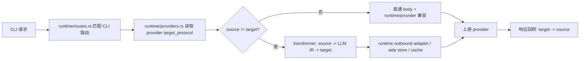
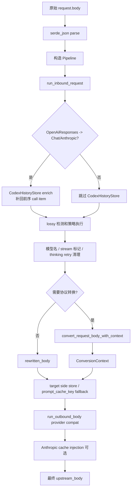
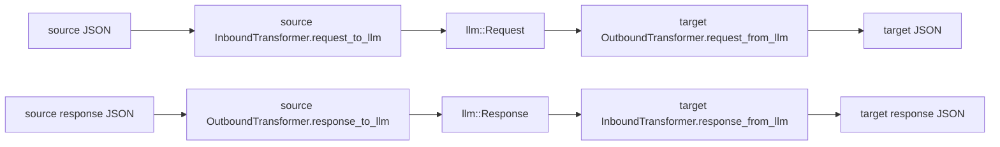

# Proxy Gateway 协议转换架构

本文描述当前代码里的 Proxy Gateway 协议转换架构，是本主题的**架构主文档**。事实源是 `tauri/src/coding/proxy_gateway/runtime/**`、`tauri/src/coding/proxy_gateway/transformer/**`、对应模块 `AGENTS.md` 和回归测试；AxonHub、cc-switch 只提供架构与行为对照，不替代当前源码和测试。Provider/channel 的逐项入参兼容、出参兼容、默认行为、开关、触发条件、源码位置和测试位置由 [`docs/gateway-provider-compatibility.md`](gateway-provider-compatibility.md) 维护。

> **维护入口**：凡涉及 Gateway 协议转换、统一 IR、协议直通/转换判定、SSE 生命周期、响应分类、runtime pipeline、side store 或参考项目吸收，必须先阅读本文，再阅读目标模块 `AGENTS.md` 和当前源码。凡涉及 provider profile、target protocol、body/header/path/auth、stream filter、rectifier、同协议直通兼容或其它 provider/channel wire 兼容，还必须阅读 [`docs/gateway-provider-compatibility.md`](gateway-provider-compatibility.md)。代码或测试改完后，必须在同一任务内重新对照源码、测试、AxonHub 和 cc-switch，并按职责更新对应文档；跨架构和渠道边界的改动要同时更新两份文档。
>
> **当前提交基线**：`7633e31d7c33e46f56cefece634842ab70ef1648`（2026-07-27）。历史协议转换修复 `1b1bea6` 的 F-1 至 F-13、`46b59ac` 的 side store earliest-delimiter / 非流 multi-reasoning，以及 `7633e31` 的 Responses `response.failed` 跨协议 error envelope、`usage_parser` 物理最早 SSE delimiter、Grok source/route 白名单对齐，均已是已提交事实。本文持续记录参考项目 baseline、增量吸收结论和仍待处理的后续能力。

## 0. 产品场景与设计动机

Proxy Gateway 的目标不是提供一个通用云端 API 网关，而是在本机接管 Claude Code、Codex、Grok CLI、Kimi CLI、Gemini CLI 这类 AI Coding CLI 的固定运行时协议，再把请求转发到用户选择的任意上游 provider。客户端协议、上游真实 wire API、provider metadata、特殊 endpoint 和运行时状态共同决定是否需要协议转换。

典型组合：

| 客户端 | 入站协议 | 上游可能需要的目标协议 |
|---|---|---|
| Claude Code | Anthropic Messages | OpenAI Chat、OpenAI Responses、Gemini Native、Anthropic-compatible |
| Codex | OpenAI Responses / OpenAI Chat | Anthropic Messages、OpenAI Chat、Gemini Native、OpenAI Responses-compatible |
| Grok CLI | OpenAI Responses | Anthropic Messages、OpenAI Chat、Gemini Native、OpenAI Responses-compatible |
| Kimi CLI | OpenAI Chat | Anthropic Messages、OpenAI Responses、Gemini Native、OpenAI-compatible |
| Gemini CLI | Gemini Native | Anthropic Messages、OpenAI Chat、OpenAI Responses、Gemini-compatible |

因此本模块必须同时解决两类问题：

- **协议结构互转**：例如 Anthropic `tool_use`、Responses `function_call`、Chat `tool_calls`、Gemini `functionCall` 之间的 JSON/SSE 映射。
- **最终上游兼容**：例如 DeepSeek thinking 门控、OpenRouter `reasoning.effort`、Codex official forced SSE、Copilot header/token、Ollama `/api/chat` wire format、Bedrock/Vertex path/header/body 差异。

这两类问题不能混在同一个层里。当前代码把可复用的公共协议转换收敛在 `transformer/`，把 provider 方言、特殊 endpoint、跨请求缓存、鉴权/header、URL 和 failover 留在 `runtime/`。历史审查得到的长期规则已经归档到本文；若本文与当前代码、模块 `AGENTS.md` 或回归测试冲突，以代码和测试为准，并在同一任务中修正文档。

## 1. 总体边界

Proxy Gateway 的协议转换由两层组成：

1. `runtime/`：请求编排层。负责匹配入站路由、读取 provider、确定 source/target 协议、选择是否转换、拼上游 URL/header/auth、执行 provider 兼容、记录日志/统计、处理重试/failover、维护跨请求兼容缓存。
2. `transformer/`：纯协议载荷转换层。负责 Anthropic Messages、OpenAI Chat Completions、OpenAI Responses、Gemini Native 四种聊天协议的 JSON body、错误 body 和 SSE 流互转。

`transformer` 模块有明确边界：

- 不读数据库。
- 不依赖 Tauri command/app handle。
- 不读取 provider 表、provider type、model health、request log 或 Gateway settings。
- 不拼 URL，不注入 API key，不处理 Bedrock/Vertex/Copilot/Ollama 等 provider 平台差异。
- 只接收 `ConversionRoute { source, target }` 和 payload，输出转换后的 payload。

同协议请求不进入结构转换器。`ConversionRoute` 只有在 `source_protocol != provider.target_protocol` 时才创建；source 与 target 相同则走直通链路，但 runtime 仍可能做模型名改写、`[1M]` 标记剥离、header/auth 注入和 provider 兼容。


```mermaid
flowchart LR
  Client[CLI 请求] --> Route[runtime/routes.rs 匹配 CLI 路由]
  Route --> Provider[runtime/providers.rs 读取 provider target_protocol]
  Provider --> Decide{source != target?}
  Decide -- 否 --> Passthrough[直通 body + runtime/provider 兼容]
  Decide -- 是 --> Transform[transformer: source -> LLM IR -> target]
  Transform --> Compat[runtime outbound adapter / side store / cache]
  Passthrough --> Upstream[上游 provider]
  Compat --> Upstream
  Upstream --> Response[响应回转: target -> source]
```

## 2. 支持的协议

协议枚举在 `transformer/types.rs`：

| `AiProtocol` | 代码字符串 | 典型 wire API |
|---|---|---|
| `AnthropicMessages` | `anthropic_messages` | Anthropic `/v1/messages` |
| `OpenAiResponses` | `openai_responses` | OpenAI `/v1/responses` |
| `OpenAiChat` | `openai_chat` | OpenAI `/v1/chat/completions` |
| `GeminiNative` | `gemini_native` | Gemini `generateContent` / `streamGenerateContent` |

`AiProtocol::from_api_format()` 是 API format 别名解析入口。它支持 snake_case、slash、dash 等形式，例如：

- `anthropic`、`anthropic_messages`、`anthropic/messages`、`claude`
- `openai_responses`、`openai/responses`、`responses`
- `openai_chat`、`openai-chat`、`chat_completions`、`chat`
- `gemini_native`、`gemini-native`、`gemini`
- `ollama`、`ollama_chat`、`ollama/chat` 会解析成 `OpenAiChat`

注意：Ollama 在 Gateway 中不是第五种 transformer 协议。它由 runtime 把最终 OpenAI Chat body 投影到 Ollama `/api/chat` wire format，再把 Ollama 响应转回 OpenAI Chat 形态，之后继续复用已有 response conversion。

## 3. 入站路由与 source protocol

入站 HTTP 路由先由 `runtime/routes.rs::match_gateway_route()` 匹配 CLI 前缀：

| 前缀 | CLI | `route_name` | forwarded path 示例 |
|---|---|---|---|
| `/anthropic` | Claude Code | `anthropic` | `/v1/messages` |
| `/openai` | Codex / OpenAI-compatible | `openai-compatible` | `/v1/responses`、`/v1/chat/completions` |
| `/grok` | Grok CLI | `grok` | `/v1/responses` |
| `/kimi` | Kimi CLI | `kimi` | `/v1/chat/completions` |
| `/gemini` | Gemini CLI | `gemini` | `/v1beta/models/...:generateContent` |

随后 `runtime/upstream.rs::source_protocol_from_route()` 按 CLI 和 forwarded path 推导 source protocol：

| CLI | 条件 | source protocol |
|---|---|---|
| Claude | `/v1/messages` 或 `/messages` | `AnthropicMessages` |
| Codex | `/v1/chat/completions` 或 `/chat/completions` | `OpenAiChat` |
| Codex | `/v1/responses`、`/responses`、`/v1/responses/compact`、`/responses/compact` | `OpenAiResponses` |
| Grok | `/v1/responses` 或 `/responses` | `OpenAiResponses` |
| Kimi | `/v1/chat/completions` 或 `/chat/completions` | `OpenAiChat` |
| Gemini | path 包含 `:generateContent` 或 `:streamGenerateContent` | `GeminiNative` |

Grok 的 `/grok/v1` 只用于 `GET`/`HEAD` 根路径探测；正式请求必须使用 `/grok/v1/responses`。当前不接受 `/grok/v1/chat/completions` 或 `/grok/v1/responses/compact`。Kimi 同理：`/kimi/v1` 只用于 `GET`/`HEAD` 根路径探测，正式请求必须使用 `/kimi/v1/chat/completions`。如果 route 无法推导 source protocol，则不会创建 `ConversionRoute`，请求只能走 runtime 的普通转发/兼容路径。

## 4. Provider target protocol

provider 读取在 `runtime/providers.rs`。`load_candidate_providers*()` 从对应 CLI provider 表加载记录，跳过 disabled provider 和 `category=official` provider，然后构造 `UpstreamProvider`。

`UpstreamProvider.target_protocol` 的来源按 CLI 分开：

| CLI | 优先级 | fallback |
|---|---|---|
| Claude | `gatewayProfile` 解析出的 effective `apiFormat` -> legacy `data.meta.api_format/apiFormat` -> `settings_config.api_format/apiFormat` -> `openrouter_compat_mode=true` | `AnthropicMessages` |
| Codex | `gatewayProfile` 解析出的 effective `apiFormat` -> legacy `data.meta.api_format/apiFormat` -> `settings_config.api_format/apiFormat` -> `config.toml` 的 `wire_api` / `api_format` -> base URL 是否是 `/chat/completions` | 非 Chat URL 默认 `OpenAiResponses` |
| Grok | effective `apiFormat` -> selected model `api_backend` | `OpenAiChat` |
| Kimi | effective `apiFormat`（`meta.api_format`） | `OpenAiChat` |
| Gemini | `gatewayProfile` 解析出的 effective `apiFormat` -> legacy `data.meta.api_format/apiFormat` -> `settings_config.api_format/apiFormat` | `GeminiNative` |

`UpstreamProvider.target_protocol`（`runtime/providers.rs`）按上表解析 Grok 等 CLI 的上游目标协议。

`provider_protocol.rs::provider_needs_gateway_proxy()` 使用另一条判定链判断“普通 apply 是否需要 Gateway 接管”：官方订阅 provider 不参与代理；非官方 provider 如果 target protocol 与 CLI native protocol 不一致，就需要网关代理。Grok 有特例：只有 `GeminiNative` target 才强制需要 gateway proxy，其它 target 不一律等同通用规则。

Copilot 是一个 runtime 特例：`effective_upstream_provider_for_request()` 会根据本次模型名把 Copilot provider 的 effective target protocol 动态切到 `OpenAiResponses` 或 `OpenAiChat`。这只影响本次请求，不改 provider 记录。Grok CLI 本身的入站协议固定为 OpenAI Responses；Grok provider 仍可通过 profile 选择其它上游 target，因此不能把 Grok CLI 路由和 xAI provider 方言混为一谈。

## 5. ConversionRoute 决策

跨工具供应商分享由 `coding/deeplink` 适配配置字段，保持上游实际 `apiFormat`，不在分享层实现请求或 SSE 转换。导入目标的 native protocol 不匹配时，预览提示需要 Gateway；数据库记录保存对应 meta，启用后继续走本节的统一转换链路。内置 profile 只映射同一 profile/协议的目标 endpoint 引用，协议、SDK 地址和持久化边界见 [`deep-link-import.md`](deep-link-import.md)。

`runtime/upstream.rs::conversion_route()` 的逻辑非常窄：

```rust
(source_protocol != provider.target_protocol).then_some(ConversionRoute::new(
    source_protocol,
    provider.target_protocol,
))
```

也就是说：

- source 与 target 相同：无结构转换。
- source 与 target 不同：请求 body 按 source -> target 转换，响应 body/SSE 按 target -> source 转回。
- route 的 reverse 只用于响应：`response_conversion_route = conversion_route.map(ConversionRoute::reverse)`。

OpenAI Responses `/responses/compact` 是例外边界：它不进入普通 4×4 聊天转换矩阵，也不新增 `AiProtocol`。runtime 的 `CodexResponsesCompactCompat` 单独识别 Codex compact endpoint：OpenAI Responses target 保持原 compact path；OpenAI Chat、Anthropic Messages、Gemini Native target 通过 compact 专项 facade 转换请求，并把上游响应转回 `response.compaction`。显式 streaming compact 请求仍在发送上游前拒绝。

## 6. 请求转换链路

主入口是 `runtime/upstream.rs::send_upstream_request()`。每次 provider attempt 大致按这个顺序构造上游请求：

1. 计算 effective provider 和 effective upstream model。
2. 从 route 推导 source protocol。
3. 如果 source 与 provider target 不同，创建 `ConversionRoute`。
4. 调 `build_upstream_body_for_provider()` 构造最终上游 body。
5. 调 `build_upstream_headers()` 构造上游 header/auth。
6. 调 `upstream_forwarded_path()` 和 `build_provider_target_url()` 构造上游 URL。
7. 发出上游请求。

`build_upstream_body_for_provider()` 是请求 body 的核心流水线，当前顺序如下：


```mermaid
flowchart TD
  A[原始 request.body] --> B[serde_json parse]
  B --> C[构造 Pipeline]
  C --> D[run_inbound_request]
  D --> E{OpenAiResponses -> Chat/Anthropic?}
  E -- 是 --> F[CodexHistoryStore enrich<br/>补回前序 call item]
  E -- 否 --> G[跳过 CodexHistoryStore]
  F --> H[lossy 检测和策略执行]
  G --> H
  H --> I[模型名 / stream 标记 / thinking retry 清理]
  I --> J{需要协议转换?}
  J -- 否 --> K[rewritten_body]
  J -- 是 --> L[convert_request_body_with_context]
  L --> M[ConversionContext]
  K --> N[target side store / prompt_cache_key fallback]
  M --> N
  N --> O[run_outbound_body provider compat]
  O --> P[Anthropic cache injection 可选]
  P --> Q[最终 upstream_body]
```

关键细节：

- 入站 middleware 在协议转换前运行。目前包括 `BillingHeaderCchMiddleware`，它会从 Claude Code billing header 文本里剥离动态 `cch=...` 并放入 `PipelineContext`。
- `CodexHistoryStore` enrich 主要在 `OpenAiResponses -> OpenAiChat` 和 `OpenAiResponses -> AnthropicMessages` 请求转换前运行，用于补回 Codex follow-up 请求缺失的前序 function/custom tool call item。Chat target 需要前序 assistant `tool_calls`，Anthropic target 需要前序 assistant `tool_use`；二者都可以先在源 Responses body 中补回 call item，再交给 transformer 转成目标协议形态。`/responses/compact` 的 Chat fallback 路径也会消费该 store。
- 有损检测在转换前运行，调用 `transformer::check_lossy_conversion(route, value)`。默认只返回 warnings；只有 `ProxyGatewaySettings.lossy_rejection_enabled=true` 且请求没有 `X-Allow-Lossy: true` 时才返回本地 400。
- runtime 在转换前改写源 body 的 `model` 字段为 provider 映射后的上游模型，并剥离 `[1M]` / `[1m]` 上下文标记。Gemini source 如果 body 没有 `model`，转换前会补一个。
- Gemini source 的 stream route 转到非 Gemini target 时，runtime 会在 body 里写 `stream=true`。
- `strip_thinking_for_retry` 只用于 thinking/signature 兼容 4xx 后的重试，不是正常转换前的默认行为。
- 真正结构转换只发生在 `convert_request_body_with_context()`。
- 转换后如果 target 是 Gemini，runtime 可能用 `GeminiShadowStore` 回放上一轮带 `thoughtSignature` 的 model functionCall。
- 转换后如果 target 是 OpenAI Responses，runtime 可能补 `prompt_cache_key` fallback。
- 转换后统一跑 outbound provider pipeline，包括 provider body 兼容、billing CCH 回填、显式 `defaultMaxTokens` 限制。
- target 是 Anthropic 且 `cache_injection_enabled=true` 时，最后注入 `cache_control`。
- `PreparedUpstreamBody` 持有本次 attempt 的 `ConversionContext`、request-scoped `Pipeline` / `PipelineContext`、`lossy_warnings` 和 xAI namespace restore map；这些状态必须跨越“上游请求 -> 客户端响应”存活，不能在响应阶段重新构造空 context。
- client-facing JSON 响应使用同一 pipeline 的 `run_outbound_response()`，SSE 使用 `run_outbound_stream()`，两者都按 middleware 逆序执行。当前 production pipeline 的 hook 是 `on_inbound_request`、`on_outbound_body`、`on_stream_chunk`、`on_outbound_response`、`on_outbound_stream`、`on_error`；stock reverse middleware 主要用于 Claude billing CCH 回填，provider body compat 仍只运行在上游 outbound body，不应反向套到客户端响应。
- lossy warning 是 runtime request preparation 的策略结果，只由 `PreparedUpstreamBody.lossy_warnings` 携带并写入 `X-Transformer-Lossy`；它不属于 `ConversionContext` 或 `PipelineContext`。

## 7. Transformer 内核

公开入口在 `transformer/mod.rs`：

- `convert_request_body()` / `convert_request_body_with_context()` / `convert_request_value()`
- `convert_response_body()` / `convert_response_body_with_context()` / `convert_response_value()`
- `convert_error_response_body()`
- `convert_sse_stream()` / `convert_sse_stream_with_context()`
- `convert_responses_compact_*` compact facade（仅 compact 端点；不进普通 4×4 矩阵）
- `check_lossy_conversion()`

转换内核在 `transformer/kernel.rs`，采用统一中间模型：


```mermaid
flowchart LR
  SourceJSON[source JSON] --> Inbound[source InboundTransformer.request_to_llm]
  Inbound --> IR[llm::Request]
  IR --> Outbound[target OutboundTransformer.request_from_llm]
  Outbound --> TargetJSON[target JSON]

  SourceResp[source response JSON] --> RespOut[source OutboundTransformer.response_to_llm]
  RespOut --> RespIR[llm::Response]
  RespIR --> RespIn[target InboundTransformer.response_from_llm]
  RespIn --> TargetResp[target response JSON]
```

这里的 trait 命名含义是：

- `InboundTransformer`：把某协议的 request 转成 LLM IR；或把 LLM response 写回该协议。
- `OutboundTransformer`：把 LLM request 写成某协议；或把某协议 response 转成 LLM IR。

请求转换代码路径：

1. `serde_json::from_slice::<Value>()`
2. `inbound_transformer(route.source).request_to_llm(value)`
3. `outbound_transformer(route.target).request_from_llm(request)`
4. `serde_json::to_vec()`

响应转换代码路径：

1. `serde_json::from_slice::<Value>()`
2. `outbound_transformer(route.source).response_to_llm(value)`
3. `inbound_transformer(route.target).response_from_llm(response)`
4. `serde_json::to_vec()`

错误响应转换更保守：JSON parse 失败或序列化失败时返回原始 body；parse 成功时先 `error_to_llm()`，再 `error_from_llm()`。

## 8. LLM IR

IR 定义在 `transformer/llm/model.rs` 和 `transformer/llm/tools.rs`。它不是数据库模型，也不是对外 API；只是转换过程内部的协议中间层。

`llm::Request` 主要承载：

- `messages`
- `model`
- token 上限：`max_tokens`、`max_completion_tokens`
- reasoning：`reasoning_effort`
- 采样参数：`temperature`、`top_p`、penalty、seed
- OpenAI 兼容参数：`service_tier`、`logprobs`、`top_logprobs`、`logit_bias`、`verbosity`、`user`
- `stop`
- `stream` / `stream_options`
- `tools` / `tool_choice` / `parallel_tool_calls`
- `response_format`
- `previous_response_id`
- `prompt_cache_key`
- `metadata`
- `extra_body`
- `request_type` / `api_format`
- `transformer_metadata`

`llm::Message` 主要承载：

- `role`
- text/parts content
- image/document content
- tool call / tool result
- `reasoning_content` / `reasoning`
- provider-local `reasoning_signature`
- Anthropic `redacted_reasoning_content`
- `cache_control`
- `annotations`
- `transformer_metadata`

`llm::Response` 主要承载：

- `id`、`object`、`created`、`model`
- `choices`
- `previous_response_id`
- `usage`
- normalized error
- `transformer_metadata`

IR 通过 `transformer_metadata` 保留少量 provider-local roundtrip 信息，但不做跨请求持久化。跨请求补全状态属于 runtime side stores。

### 8.1 Responses request-scoped raw 保真

OpenAI Responses request 中不能完整结构化表达的 raw-only `input[]` item、`tools[]` item 和复杂 `tool_choice` 使用 `transformer_metadata` sidecar 保存，并且只在当前 request/response 转换链路中使用：

- raw fragment 按原 index 合并回 Responses target，不能降级成空 message 或提升为跨请求 store。
- 只要原请求存在 raw tool fragment，就必须保存 `openai_responses_tool_signatures`；原 structured tool 集合为空时也要保存空数组 `[]`。
- 同时写入 `openai_responses_tool_signatures_complete=true`，明确区分“原 structured 集合确实为空”和“没有完整性证据”。
- merge 前重新计算当前 structured tool signatures，并要求数量、顺序和每项 `type:name` 完全一致。
- sidecar 缺失、类型异常、complete marker 缺失或非 `true`，以及任一 `function` / `custom` tool 缺少非空 name 时，全部 raw tool fragment fail-closed，只保留当前 structured tools。
- 完整匹配后才执行 raw/structured signature collision 过滤，避免 raw fragment 覆盖中间步骤已经修改过的工具身份。

### 8.2 Responses reasoning 与终态

- 连续 reasoning item 先合并，再尝试 forward merge 到紧随其后的 assistant tool/message item。
- 非流 Responses response output 中的多个 `reasoning` item 也必须按出现顺序累积 summary 文本；最后一个有效 `encrypted_content` 仍作为当前 reasoning signature，不能让后续 item 覆盖此前文本。
- trailing reasoning 只能挂回当前 user turn 内最近的 assistant；遇到 user boundary 必须重置归属。当前轮没有 assistant 时保留 standalone assistant reasoning，不能丢弃或挂到更早轮次。
- 非流 Responses `status="incomplete"` 映射为 LLM `finish_reason="length"`。
- 非流 Responses `status="cancelled"` / `"canceled"` 映射为 `finish_reason="cancelled"`；反向输出统一使用 Responses `status="canceled"`，不能退化为 `completed`。
- `failed` / `error`、`incomplete` / `length`、`cancelled` / `canceled` 是三条独立映射，不允许用默认 completed/stop 分支相互覆盖。

### 8.3 Tool-result 图片媒体

工具结果媒体不是新的协议或新的跨请求状态，而是一次 request conversion 中对统一 `MessageContent` 的目标协议投影。当前 AI Toolbox 只吸收图片路径；`llm::MessageContentPart` 虽然还承载 document，但没有完整的 file/audio tool-result IR，因此不能把 cc-switch 的 file/audio 扩展写成当前已支持能力。

共享识别入口是 `transformer/shared/tool_media.rs`：

- 识别统一 IR 中的 `image_url` / `input_image`、Anthropic `image`，以及 MCP/Responses alternate 的 `{type:"image", mimeType, data}`；
- 在最大递归深度内读取 JSON 字符串和对象的 `content`，只在确认找到图片后才重写原工具结果；
- 结构化图片 block 支持带 `data:image/...;base64,` 头且 payload 非空的 data URL 和 HTTP(S) URL；若整个 tool result 只是一个 image data URL 字符串，仅在长度至少 8 KiB 时识别为媒体，短示例或普通文本保持原样；Gemini 的 Inline scope 只接受前述非空 image data URL，远程或 malformed data URL 保留旧 function-response 表示；
- 图片被移出工具文本后，不复制 `cache_control`、`prompt_cache_breakpoint` 等工具结果缓存元数据；媒体路径中残留的大 data/base64 字符串才做有界替换，普通长 OCR/日志文本保留；
- 没有图片时返回 `None`，调用方继续原有 converter，保证旧文本/JSON 表示不因共享 helper 被重序列化。

按 target protocol 的写法：

| target | 工具结果图片位置 | 当前实现 |
|---|---|---|
| OpenAI Chat | 工具消息保留清理后的文本；同一连续工具结果批次之后追加一个 synthetic `role:"user"`，其中用 `image_url` 承载图片 | `openai/chat.rs::llm_messages_to_chat` |
| OpenAI Responses | `function_call_output.output[]` / `custom_tool_call_output.output[]` 中写 `input_text` 和 `input_image` | `openai/responses/shared.rs::responses_tool_output_with_media` |
| Anthropic Messages | `tool_result.content[]` 中写文本 block 和原生 `image` block | `anthropic/outbound.rs::tool_result_content_to_anthropic` |
| Gemini 2.x | `functionResponse` 后在同一 user content 追加 marker 与 `inlineData` | `gemini/convert.rs::llm_tool_message_to_gemini_content` |
| Gemini 3.x | `functionResponse.parts[].inlineData`，不再额外生成顶层媒体 part | 同上，按目标 model 分支 |

Anthropic tool-result 入站如果包含标准 parser 不认识的 block，必须先保留原始数组为 JSON 文本，再让共享识别入口处理 MCP/Responses alternate 形态；不能在 inbound 阶段静默丢失。该规则只对转换路径生效，同协议直通仍由 runtime 保持原始 wire body。

Gemini Native 入站同一个 `content.parts` 可以包含多个并行 `functionResponse`。请求转换必须按每个 `functionResponse` 拆成独立 tool message，并把紧随其后的 Gemini 2.x marker/顶层媒体归到前一个工具结果；不能用单个临时变量覆盖后只保留最后一个。

## 9. ConversionContext

`ConversionContext` 定义在 `transformer/kernel.rs`：

```rust
pub struct ConversionContext {
    pub codex_tool_context: Option<CodexToolContext>,
}
```

它是单次请求作用域状态：

- request 转换时生成。
- 同一次 response JSON 或 SSE 转换时由 runtime 原样带回。
- 不落库。
- 不跨请求复用。
- runtime 不解释 `codex_tool_context` 的协议细节。

当前 `OpenAiResponses` 转其它协议时会按实际扩展生成两种粒度的 `CodexToolContext`：

- 转 `OpenAiChat` 时，只有请求包含 `tool_search`、顶层 namespace tool，或历史 `tool_search_output`，才启用完整 Codex tool context。它把 `tool_search` 暴露为普通 Chat function、把 namespace child 展平成 flat function name，并把同一请求里的 custom tool 包装成 `{input:string}` function；Chat JSON/SSE 响应再用同一 context 还原 `tool_search_call`、带 namespace 的 `function_call` 或 `custom_tool_call`。
- 只有普通 function/custom tool、没有上述 Codex 扩展时，不启用专用 context，继续走通用 Responses -> Chat transformer。这样 Responses custom tool 会保留为 Chat 兼容扩展 `responses_custom_tool`，不会仅因构造了 context 就退化成普通 `function`。
- 转 `AnthropicMessages` / `GeminiNative` 时只为顶层 namespace tool 生成 namespace-only context。请求转换先把历史中带 `namespace` 的 `function_call` 和具名 `tool_choice` 改成 flat name，namespace 类型 choice 降为 `auto`；JSON/SSE 返回再用同一 context 恢复 `{namespace,name}`。namespace 展开前必须校验最终 flat name 唯一性，覆盖顶层 function/custom、不同 namespace child 以及截断/hash 后的实际碰撞，冲突直接返回 `ProtocolConversionError::Transform`。普通 function/custom tool 仍走统一 IR 的通用映射。

字段名 `codex_tool_context` 当前同时承载完整 Codex context 和 namespace-only context；两者都是 transformer 拥有的同请求映射状态，runtime 只负责透传。

注意不要把 `CodexToolContext` 和 `CodexHistoryStore` 混在一起：

- `CodexToolContext` 是同一次 HTTP request/response 内的工具定义和名称映射，服务 Responses -> Chat 的 Codex 扩展展平/还原，以及 Responses -> Anthropic/Gemini 的 namespace 名称还原。
- `CodexHistoryStore` 是跨 HTTP 请求的 runtime side store，记录上一轮最终返回给 Codex 的 Responses call item，下一轮 Codex 只带 `previous_response_id` / `function_call_output` 时再补回缺失的 assistant call item。
- 参考项目的 Codex history 实现主要覆盖 Codex Responses bridged to Chat Completions；AI Toolbox 这里扩到 Responses -> Anthropic 的依据是：补全发生在源 Responses body 上，补完后的 `function_call + function_call_output` 已能由现有 transformer 自然输出为 Anthropic `assistant tool_use + user tool_result`。

不要把三个 context 混在一起：

- `ConversionContext`：transformer 拥有的 request-scoped 协议映射状态，当前只包含 `CodexToolContext`。
- `transformer_metadata`：统一 IR 内部的 request/response roundtrip sidecar，保存 raw-only Responses fragment、reasoning context、provider-local block 等转换信息；只服务当前转换链路，不是 runtime side store。
- `PipelineContext`：runtime middleware 的 request-scoped 状态，当前包含 provider type、target protocol 和 billing CCH；它不负责保存 transformer 的工具映射。
- `PreparedUpstreamBody`：runtime request preparation 的聚合结果，持有转换 context、pipeline/context、lossy warnings 和 xAI 等 provider-local 本次 attempt 状态；它必须跨越上游请求到客户端响应链路。
- `runtime/side_stores/`：唯一允许保存跨 HTTP 请求兼容状态的位置，当前包括 Codex history、Gemini shadow 和 invalid Responses cipher 负缓存。

## 10. SSE 转换链路

流式转换入口是 `convert_sse_stream_with_context()`。如果 route 是 identity，直接返回原 stream；否则创建 `StreamKernel` 包装 inner stream。

`StreamKernel` 的处理模型：

1. `append_utf8_safe()` 处理 UTF-8 跨 chunk 边界。
2. `take_sse_block()` 同时查找 `\n\n` 和 `\r\n\r\n`，消费物理位置最早的 delimiter；不能固定优先 CRLF，否则混合行尾缓冲区会一次吞掉多个事件。
3. `parse_sse_block()` 提取 `event:` 和多行 `data:`。
4. source parser 把各协议 SSE 解析成 `UnifiedStreamEvent`。
5. target writer 把 `UnifiedStreamEvent` 写成目标协议 SSE。

统一事件类型包括：

- `Start`
- `TextDelta`
- `ReasoningDelta`
- `ReasoningSignature`
- `ToolCallSignature`
- `ToolCall`
- `RawAnthropicContentBlock`
- `StreamError`
- `Finish`

Responses `compaction` / `compaction_summary` 是 Responses-only wire item，不属于普通跨协议 `UnifiedStreamEvent`。Responses -> Responses 的流式保真依赖 identity route 原始字节直通，`StreamKernel` 不解析或重新生成 compaction；Responses -> Chat/Anthropic/Gemini 时该 item 无目标协议原生表示，普通 stream kernel 忽略它，但其它 text/tool/terminal 事件必须继续正常转换。只有独立 `/responses/compact` facade 和非流 JSON 中显式可达的 compaction helper 继续维护结构化表示，不能把 identity passthrough 测试当作 stream kernel roundtrip 证据。

source state 会维护必要的流式状态，例如：

- OpenAI Chat tool call name/id 和 arguments 累积。
- OpenAI Chat leading `<think>...</think>` 跨 chunk FSM。
- Anthropic content block/tool block 状态。
- OpenAI Responses item/tool call 状态。
- Gemini 累计文本和 reasoning 前缀差值。
- finish reason 和 usage 的延迟合成。
- source error terminal gate。

SSE 转换要求边读边写，不 full-buffer。结束事件要幂等处理，例如 OpenAI `[DONE]`、Anthropic `message_stop`、Responses terminal event、Chat `finish_reason` 和 Gemini finish chunk 可能重复或组合出现。

当前必须保持的状态机不变量：

- OpenAI Chat tool call 首次向目标协议输出 identity 前，必须同时拿到非空 name 和上游真实 id；多个 call 按 index 升序首次打开。只有 finish/EOF 时上游始终没有 id，才允许生成 `call_<index>` synthetic fallback。
- Responses source 的 `response.completed`、`response.failed`、`response.incomplete`、`response.cancelled`、`response.canceled` 都是 terminal event；取消终态写成统一 `Finish { reason: "cancelled" }`；incomplete 入站写成 `Finish { reason: "length" }`。
- **Responses `response.failed`（以及 `response.completed` + `status=failed`）必须进入统一 `StreamError` / 非流 `Response.error`**，保留上游 `error.message/type/code`；不能压成普通 `Finish { reason: "error" }` 后再走各目标成功 finish writer。
- **跨协议 failed 出站 envelope**：Anthropic → `event:error`（禁止 `message_stop` / `end_turn`）；Chat → `{error:{message,type,code}}`（禁止 `finish_reason=error` + `[DONE]`）；Gemini → Gemini error envelope（禁止 `finishReason=STOP`）；Responses target 仍发 `response.failed`。
- **Responses target writer（跨协议出站）**：`finish_reason=error` → `response.failed`；`cancelled`/`canceled` → `response.cancelled` + `status=canceled`；`length` → **`response.completed` + `status=incomplete`**（对齐 cc-switch Codex bridge，见 §18 有意差异）。不要把“length 未发 `response.incomplete` 事件名”单独判成实现疏漏。
- 一旦识别到 JSON/SSE error、空 error event、transport `fail()`、Responses failed 或 source parser `StreamError`，`StreamKernel` 必须进入 error terminal。后续 source block 被忽略，EOF 也不能再生成正常 Chat stop、Responses completed 或 Gemini finish。
- target writer 已输出 error envelope 后，正常完成事件不能再次出现；error 与 completed/stop/`message_stop` 必须保持互斥。

runtime 在进入 transformer 前后还会包一些 provider/runtime stream adapter：

- xAI native Responses passthrough 会在 2xx 响应上先恢复 request-scoped namespace tool name。
- Gemini target 的原始 SSE 会被 `record_gemini_sse_stream()` 旁路记录到 `GeminiShadowStore`。
- Bailian/DashScope OpenAI Chat SSE 会先经过 provider-specific filter。
- xAI/Grok OpenAI Chat SSE 会过滤没有 role/content/tool/finish/usage 的空 delta。
- Ollama NDJSON stream 会先转成 OpenAI Chat SSE。
- 如果响应最终转回 OpenAI Responses，`record_responses_sse_stream()` 会记录 Codex tool call 历史。
- 最终 client-facing SSE 再进入同一 request-scoped pipeline 的 reverse `on_outbound_stream()`。

reverse SSE middleware 必须保持字节保真：`needs_outbound_stream` 判定无实际工作时原 chunk 直通、零额外帧缓冲；需要解帧但没有 JSON payload 改写时，完整 block 原样透传，包括 event、id、retry、comment、多行 data、原 delimiter、空白 block 和 EOF whitespace tail。只有 middleware 真正修改 data JSON 时才替换 payload，并逐行保留原始 LF/CRLF；不能用 trim + 重新序列化把 no-op 变成 wire 变化。transport error 必须排在已读尾部之后，不能让外层 demote/终态判定看到错误却永远拿不到已读数据。

## 11. 响应回转链路

响应构造入口是 `runtime/upstream.rs::build_gateway_response()`。它先计算：

```rust
let response_conversion_route = conversion_route.map(ConversionRoute::reverse);
```

### 11.0 响应形态与 streaming 判定

`should_stream_response()` 只对 2xx/3xx 生效，并按实际上游响应优先判断：

1. `Content-Type` 包含 `text/event-stream`：进入 SSE 路径。
2. 存在明确但非 SSE 的 `Content-Type`，尤其 `application/json`：不进入通用 SSE wrapper，即使请求 body 写了 `stream:true`。
3. 没有 `Content-Type`：才兼容使用请求 `stream:true` 或 Gemini route 的 streaming 声明。

Ollama `application/x-ndjson` / `application/x-json-stream` 是单独的 provider wire adapter：只有 `ProviderBodyCompat::Ollama` 会把 NDJSON 转成 OpenAI Chat SSE。NDJSON 不能因为请求声明 streaming 就被通用 SSE parser 直接消费。

### 11.1 非流客户端遇到上游 SSE

如果客户端本身没有请求流式，但上游返回 `text/event-stream`，runtime 会按 target protocol 聚合上游 SSE 为同协议 JSON：

1. `aggregate_sse_stream_for_non_streaming_client()`
2. 得到 target protocol JSON body。
3. 如果需要 response conversion，则调用 `convert_response_body_with_context(reverse_route, ...)` 转回客户端 source protocol。
4. 设置 `Content-Type: application/json`。
5. 记录 side store。

这条路径用于“上游被 provider/runtime 强制流式，但客户端要非流 JSON”的场景。

OpenAI Responses 聚合还有额外终态约束：

- 只有收到 `response.completed`、`response.failed`、`response.incomplete`、`response.cancelled` 或 `response.canceled` 才能返回 JSON。
- 流只发送 created/in-progress/delta/output-item/[DONE] 就结束时，返回 `GatewayFailureKind::Connection`，交给既有 retry/failover；不能伪造 `completed`，也不能把截断冒充成上游明确声明的合法 `incomplete`。
- created、in-progress 和 terminal response 都可能是稀疏 snapshot。聚合器按字段浅层合并，空字符串、null、空 object、空 array 不覆盖已有 id、model、created_at、usage、error、output 等非空元数据。
- terminal `response` 缺失、为 null、空对象或非对象时保留最近的 base snapshot；terminal status 缺失或为空时按 event type 回填。
- 已收到 `response.output_item.done` 且 terminal snapshot 没有非空 output 时，用已聚合 item 重建 output，避免 created snapshot 的陈旧空数组覆盖实际完成的输出。

Chat / Anthropic / Gemini 聚合同样 fail-closed：只要缺少对应协议的 finish/stop/terminal 信号，就返回 `GatewayFailureKind::Connection` 并进入 retry/failover；即使已经收到部分内容，也不能把截断流伪装成 200 JSON，更不能把无内容截断流聚合成空成功 JSON。Gemini 的 `promptFeedback.blockReason` 是例外：安全拦截/内容过滤可以合法返回 `candidates: []` 且没有 candidate `finishReason`，聚合器和 runtime empty-response 分类都必须保留 `promptFeedback` 并视为有协议意义的响应内容，再由 transformer 在跨协议路径映射为 refusal。

### 11.2 客户端流式

如果 `should_stream_response()` 判定应该流式返回：

1. 必要时设置 `Content-Type: text/event-stream`。
2. 按设置创建 bounded upstream response snapshot（**仅转换路径**才建 upstream response stream snapshot；同协议直通不做该 snapshot）。
3. 对 xAI native Responses 2xx passthrough，先按本次请求的 restore map 恢复 namespace。
4. 执行 Gemini shadow 记录、Bailian/xAI Chat SSE filter、Ollama NDJSON -> Chat SSE 等 runtime adapter。
5. 如果存在 `response_conversion_route`，调用 `convert_sse_stream_with_context()` 做 target -> source SSE 转换。
6. 如果最终目标是 OpenAI Responses，旁路记录 Codex response history。
7. 用请求阶段保留下来的同一 `Pipeline` / `PipelineContext` 包装 client-facing reverse stream。

### 11.3 普通 JSON 响应

非流 JSON 响应路径：

1. 读取并保留原始 upstream response body。
2. 如果 provider 是 Ollama，把 Ollama JSON 先转成 OpenAI Chat JSON。
3. 如果存在 `response_conversion_route`：
   - 2xx/3xx：`convert_response_body_with_context()`
   - 非 2xx/3xx：`convert_error_response_body()`
4. 对 xAI native Responses 2xx passthrough，恢复 namespace。
5. 用同一 request-scoped pipeline 执行 client-facing `run_outbound_response()`。
6. 记录 side store，并用最终返回给客户端的 body 解析 usage。

成功状态的分类必须同时检查两个 body：

- 最终客户端 body：`DebugHttpResponse.body`。
- 转换前 provider 原始 body：`DebugHttpResponse.upstream_response_body`。

任一 body 含顶层非空 error、`response.failed`、`status=failed` 或嵌套 response error，都按 `UpstreamBadRequest` 进入既有 retry/failover，不能被协议转换隐藏。任一 body 明确是合法 `incomplete` / `cancelled` / `canceled`，即使 output 为空也算有协议意义的终态，不触发 `EmptyResponse`、provider health 扣分或故障转移。只有两个 body 都没有实际内容、没有合法终态且只是 completed/created 等控制信息时，才保留空响应失败。

### 11.4 请求日志与指标边界（issue #332）

指标采集属于 runtime observability，不进入 transformer/IR。`runtime/observability.rs` 从最终 attempt 已有的 `DebugHttpResponse.upstream_request_body` 快照，按实际 `target_protocol` 提取明确的 `reasoning_effort`，因此同协议直通、协议转换、provider 改写和 rectifier 使用同一出口；字段映射见兼容文档 §2.8。`forward_to_upstream` 在每次 attempt 进入发送层前解析实际模型和 effective provider，保证 Copilot 的动态协议、warmup 模型与成功/失败日志一致。首包失败和空响应包装继承原 response 的目标协议，连接失败和本地拒绝使用该 attempt 的 effective provider；未知协议不猜测，也不从残留的其它协议字段取值。本地 schema 拒绝且没有上游 URL/响应快照时不把原始客户端字段记作最终上游参数，已收到上游错误响应时仍可记录。

SQLite v17 只新增可空 `reasoning_effort`，列表和 SQLite 摘要详情回退都读取它；JSONL summary 用 serde default 兼容旧记录。关闭正文存储不影响该指标；`request_log_enabled || metrics_enabled` 继续控制 compact 摘要是否写入，只有 `request_log_enabled` 控制 JSONL 明细写入。不为这些指标增加流式 full-buffer 或改变 usage 幂等/终态判定。

运行状态中的 `requests_per_minute` 和 `requests_per_minute_by_cli` 来自 runtime 内存单调时钟窗口 `(now - 60s, now]`；队列同时保留 CLI，status 一次读取各 CLI 计数并求和得到总量，使两者属于同一快照。在 `route_request_with_options` 排除本地探测后、provider 选择/重试前计数。它包含失败和仍在等待的外部请求、排除内部 provider override 连通性测试，与 Session 导入、日志开关和以结束时间写入的 `created_at` 无关；重试一次外部请求仍只计一次，停止/重启后清零。

供应商 `cache_hit_rate` 在实时明细和 `usage_daily_rollups` 合并后计算：`cache_read / (fresh_input + cache_creation + cache_read)`，返回 0..1 比例；分母为零返回 `None`，零命中返回 `Some(0.0)`。前端 TPS 仅使用 output tokens；流式有首包时使用总耗时减首包等待，否则使用端到端耗时。现有 `first_token_ms` 是首个非空 chunk 写出时间，近似 TTFT，不承诺严格文字 token 计时。

本地会话用量是独立的 `session_import` 采集链路，应用启动与每 60 秒同步，不依赖网关运行，也不进入 transformer 或 runtime 请求计数。Claude/Codex/Gemini/OpenCode 及 Pi/OMP/DSH/Grok/Kimi/Hermes/OpenClaw 原生用量归一后写同一摘要表，source 为 session，缺失 HTTP 指标不推断。v18 JSONB 账本保证记录与导入状态原子提交及归档后幂等，并保存 envelope 身份；跨源匹配优先共享 envelope，明确不同的 ID 不按相同 token 合并，零用量只允许精确身份匹配。缺少共有 ID 的逐调用记录才使用唯一、精确非零 token 的实际执行区间匹配（结束时间减 duration_ms，起点前容差 10 秒，结束后落盘宽限 30 秒）；每轮重核验全部保留的 native 明细以覆盖 #340 的旧重复记录，最终用量更新会重验仍可读取的旧匹配。旧手动导入的多次快照保留全部来源身份，在同一事务内合并到一条记录。历史汇总保存有效延迟样本数，避免把本地未知延迟当零稀释网关平均值。统计工具集合与网关接管集合分开；v20 记录原生粒度、调用数及额外 Token，累计来源按变化贡献写入而不伪造逐请求。Desktop audit 的已证明重复贡献与修复快照原子回退。采集格式、去重边界与验证维护在 [Gateway 模块约束](../tauri/src/coding/proxy_gateway/AGENTS.md)。

本节指标审查对照 cc-switch `6243e20a` 的 `services/session_usage*.rs`、`services/usage_stats.rs`、`database/dao/usage_rollup.rs`，以及 AxonHub `dfbe2259` 的 `internal/server/biz/usage_log.go`、`llm/pipeline/stream/usage.go` 和 `llm/transformer/openai/copilot/outbound.go`。本次仅核对相关行为，§19.4 的协议增量同步 baseline 保持原记录。

延迟样本列由独立 v19 迁移补齐，兼容已经标记 v18 但只创建采集账本的开发数据库，并保留已有非空样本数。历史归档失败应记录告警并重试，不得阻止当前 proxy 摘要保存或已提交 native 用量的刷新事件。

回归入口：`runtime/observability.rs::tests` 的快照方言/metrics-only 往返/60 秒边界，`runtime.rs::tests` 的真实转发、转换、Copilot 失败协议/effort 往返、进行中计数、failover 和 restart，`usage_stats.rs::tests` 的列表/详情/缓存与延迟聚合，`session_import::tests` 的原生会话导入、身份冲突、旧账本/旧快照收敛和去重，`tauri/tests/sqlite_jsonb.rs` 的 v17/v18/v19/v20 迁移，以及前端 `gatewayFormatters.test.ts`。

## 12. 上游 URL、query 与 auth

协议转换不只影响 body，也会影响上游 endpoint。相关逻辑在 `runtime/upstream.rs`。

转换场景下的默认 forwarded path：

| target protocol | upstream path |
|---|---|
| `AnthropicMessages` | `/v1/messages` |
| `OpenAiResponses` | `/v1/responses` |
| `OpenAiChat` | `/v1/chat/completions` |
| `GeminiNative` | `/{api_version}/models/{model}:generateContent` 或 `:streamGenerateContent` |

特殊规则：

- provider `is_full_url=true` 或 base URL 用 RawURL 语义时，runtime 不追加协议默认 path，只合并 query。
- Gemini target 的 API version 从 provider base URL 推断，支持 `v1` / `v1beta` / `v1alpha`；没有显式版本时默认 `v1beta`。
- Gemini source 转非 Gemini target 时，转换后的 query 会过滤 `alt=sse` 和 `key=`。
- 转 Gemini target 且目标流式时，query 会补 `alt=sse`。
- converted route 与 full-URL merge 两处都会过滤 `beta=`。
- Anthropic Bedrock/Vertex target 会按 platform 改写 path：Bedrock 使用 `/model/{model}/invoke*`，Vertex 使用 `/publishers/anthropic/models/{model}:rawPredict|streamRawPredict`。
- DeepSeek legacy completion 和 Ollama `/api/chat` 是 runtime 特殊路径，不属于 transformer 协议矩阵。

header/auth 由 `build_upstream_headers()` 处理：

- 先保留允许转发的入站 header。
- 入站 `Content-Encoding` 不转发。请求体在路由前由 `runtime/content_encoding.rs` 解压为明文 JSON，再重建上游 body/header；否则 Codex Desktop 官方登录态的 `zstd` 压缩体会被中转站当 JSON 解析失败（`invalid character '('`）。
- usage 稳定键：`usage_parser` 提取 envelope id（Claude message id / OpenAI-Codex response id / Gemini responseId）；`observability` 先解析稳定 request_id，再由 `usage_stats::record_request_summary` 做同语义幂等 / collision fallback，并用最终键写 JSONL，保证列表与详情一致。若 SQLite 摘要已存在但 `detail_file` 或 `detail_offset` 任一缺失，同语义重放返回 `NeedsDetail`，只重试 JSONL/locator 挂接而不重复累计 usage 或发送 usage 事件；Session Usage 行升级时保留原 `session_id` 和已有 locator。
- 流式终态判定与落库（吸收自 axonhub `889bc8ee`，issue「流式响应提交后失败被记为成功」）：一旦 `write_response` 写出 `HTTP/1.1 200` + chunked 头，此后所有失败都在 `http_io::write_streaming_body` 内部，无法再改 status_code。成败不由 status_code 反推，改由「终态事件是否真的写给了客户端」决定。`SseUsageCollector` 逐 chunk 调用 `sse_block_classify_terminal`（平铺，不按协议分派）追踪 `terminal_kind: Option<SseTerminalKind>`（first-wins，四种 `Success`/`Failed`/`Incomplete`/`Canceled`）；只有携带终态的 chunk 三段（header/body/CRLF/flush）全部写成功后才置 `terminal_kind_delivered`，所以终态 chunk 本身的 BrokenPipe 不算「已送达」。`sse_block_classify_terminal` 语义对齐 `gateway_json_reports_error`（顶层/嵌套 `error`、`type/event=response.failed`、`status=failed`），并区分：`response.completed`+`response.status=incomplete`（项目自产跨协议 incomplete，`transformer/stream.rs`）→ `Incomplete`；`response.incomplete`/`status=incomplete` → `Incomplete`；`response.cancelled`/`canceled`/对应 status → `Canceled`；`error`/`response.failed`/`response.completed`+`status=failed`/非空 error envelope → `Failed`；`message_stop`/`[DONE]`/正常 `response.completed`/非空 `finish_reason`/`finishReason` → `Success`。`classify_stream_outcome` 把 `terminal_kind_delivered` + 写结果 + idle 超时 + 上游 stream error 映射成 `GatewayStreamOutcome`：终态已送达 → 对应枚举（`Failed`/`Completed`/`Incomplete`/`Canceled`）；无终态 + idle 超时/上游 stream error → `Failed`；无终态 + 客户端断开 → `Canceled`；无终态 + EOF 无错 → `Incomplete`。残留 buffer 中无结尾 `\n\n` 的终态由 `drain_terminal` 在分类前补判（写出全成功时才合并，不消费 buffer，留给 `finish` 合并 usage）。`GatewayStreamOutcome` 枚举持久化为 SQLite `stream_outcome` 列（migration v14，连同 `error_category`、`attempt_count`、`total_attempt_count`；`NotStreaming` 不写、NULL 旧行回退 status_code 推 success）；`from_str` 返回 `Option<Self>`，未知/损坏值返回 `None` 由查询层回退 status_code，不再误判成功。`observability` 按枚举定 `success`/`error_message`。**统计口径**：`usage_stats` 的 live summary、provider stats、rollup 写入三处 SQL 统一用 `stream_outcome='completed' OR (stream_outcome IS NULL AND status_code IN 2xx/3xx)`，不再只按 status_code；rollup 读回累加 `success_count` 自动正确。`UsageSemantic` 纳入 `stream_outcome`+`error_category`，同 envelope 同 token 同 200 但终态不同不再被当同语义重放跳过。**Broken pipe 文本落库**：`write_streaming_body` 在分类前对「终态前客户端断开」补 `error_category=client_disconnected` + note；`runtime::handle_connection` 的写失败兜底只在 `stream_outcome != Completed` 时挂 `client_write_failed`，终态后断开（stream 已成功）不挂任何失败分类。**provider health 事后修正**：首包探针通过后 `upstream.rs` 即记 `record_health_success`，但流真正消费在更晚的 `write_streaming_body`；`handle_connection` 在 `write_response` 后、`record_gateway_observability` 前调 `amend_health_after_stream`，按终态补 `record_health_failure`（`Incomplete`→`EmptyResponse`、`Failed`→`Timeout`/`Upstream5xx`、`Canceled`→`ClientCancelled` 不计分、`Completed`/`NotStreaming` 不修正）。流未正常收尾且客户端仍在线时，按 `source_protocol` 渲染协议方言 error 事件再发 `0\r\n\r\n`（Anthropic `event: error`、Responses `event: response.failed`、Gemini 复用 `transformer::gemini::gemini_stream_error` 的 `{code,message,status}` envelope、Chat/未知 通用 `{"error":{message,type,code}}`），三路优先级：显式流错误非 cancel → 发；客户端已断开 → 只记录不发；无错误无终态 → 发 `stream_incomplete` 再收尾；非成功终态已送达 → 不补发（客户端已收到上游 error envelope）。请求列表 `only_failed` 筛选 = `stream_outcome IN (incomplete/failed/canceled) OR status_code < 200 OR >= 400`，NULL 行回退 status；前端状态列按 `record.success` 着色，200+success=false 显示为失败色。`runtime::handle_connection` 的 503 busy（并发超 `MAX_CONCURRENT_CONNECTIONS`）和 `read_http_request` 失败只补 `log::warn`，仍不进请求记录（因无可用 cli_key/route/trace_id，设计上明确为日志级）。
- 退化扁平 SSE 帧（issue #318，2026-09-07 复审）：用户附件的 `response.body_after_conversion` 包含无 `\n\n`、空格分隔的 `event: ... data: {...}` 及 `codex.*` relay 事件。完整上游计费记录或 HTTP 200 都不能证明客户端收到正常终态；判定必须继续依据实际写出的事件内容。
  - 无实际 reverse SSE 改写时，`Pipeline::needs_outbound_stream` 让 `wrap_pipeline_outbound_sse_stream` 原 chunk 直通，不等待分隔符或 EOF；避免持续有上游字节却被包装层缓冲成客户端 idle。stock 中只有 Anthropic target 且捕获到非空 `billing_cch` 才需要 reverse 解帧；未知自定义 middleware 默认保留 hook。需要改写时仍按完整 SSE block 处理，并在 transport error 前冲刷已读尾部，不能先 yield 错误而丢掉尾部终态。
  - `SseUsageCollector` 不再把大网络 chunk 与旧残留分开扫描：统一分批拼接，标准帧从上次已查位置继续找分隔符，flattened 每增加约 256 KiB 经 `flattened_flush_boundary` 释放完整事件；未完成单事件允许保留到 16 MiB。超过硬上限的未闭合事件不猜测终态，丢弃到下一标准分隔符后才恢复观察；这是 collector 的明确解析上限，不是全流缓存。EOF 使用剩余完整事件合并 usage。标准分隔符包住的退化扁平事件也必须走 usage fallback，不能只补 terminal 而丢计费数据。
  - 扁平扫描用 JSON 的精确跨度跳过字符串内字段；解析遇到 EOF 型未闭合 JSON 必须停止，不能继续搜索其中的 `event: error` / `data: {}` 并制造假终态。UTF-8 非法/半字符不能用于原字节切片偏移。
  - Responses 中间事件仅忽略 item 级 `status=incomplete`；`response.*` 自定义 failure/cancel 的 `status=failed/cancelled/canceled` 及显式 error 仍是非成功终态。不得把这条 guard 扩大为忽略所有中间事件 status。合法 `response.completed`+`status=incomplete` 继续按本项目跨协议 bridge 语义处理。
  - 终态先在成功写出的 chunk 中确认。客户端当前 chunk 写失败时，只 drain 之前已写出的残留，再解析当前未送达 chunk 的 usage；后者不能反过来算送达。上游后续 transport error 不得抹去先前已送达的完整终态。移除 `response.body` 日志快照重扫兜底，保证日志关闭/1 KiB 截断/正常记录三种设置不改变成败或 token 统计。
  - 回归：`reverse_sse_noop_forwards_partial_chunk_before_eof`、`reverse_sse_flushes_complete_tail_before_transport_error`、`large_terminal_event_survives_every_network_chunk_size`、`partial_flattened_json_does_not_classify_quoted_field_tokens`、`large_flattened_terminal_reaches_client_independently_of_body_logging`、`charged_200_stream_keeps_real_non_success_terminal_outcomes`、`late_transport_error_does_not_erase_delivered_terminal_tail`。真实附件只在本地重放，不能提交包含用户对话的 fixture。补充回归：`flattened_events_with_a_final_blank_line_keep_usage`、`terminal_in_failed_write_is_not_counted_as_delivered`。
  - 历史参考判断保留：参考项目对照（2026-09，针对本条专项审查而非完整 baseline 同步）：cc-switch 透传流（`response_processor.rs::create_logged_passthrough_stream`）逐 chunk 原样直出、不做终态判定、无 stream_outcome 概念，扁平流误判在其结构上不存在但 mid-stream 失败可见性也缺失；其 usage 收集同样按 `\n\n` 分块（扁平流下同样丢 usage）且透传 buffer 无上限；`codex.rate_limits` 等中转注入事件无任何处理。其跨协议桥接缺终态三分处理（complete / incomplete 合成 max_tokens / 空 截断 `stream_truncated`，commit `6940a4b2`、`650905af`）均在本项目已记录 baseline（`ebbf141f`）之前历史内，语义已被本项目 F 系列不变量覆盖。结论：无可吸收增量；后续出站重排任务可参考其「透传零改写零缓冲」取舍（例如 pipeline 无 outbound_stream 中间件时旁路直通，不进 buffering wrapper）。axonhub 对照（2026-09-03 专项审查）：其 `IsTerminalStreamEvent` 作用于 go-sse fork 已解析的 `StreamEvent`，该 fork（`wtj-0527/go-sse`，仅改 parser EOF 幂等）的 `splitFunc` 仍是标准「两个连续换行序列」分帧，扁平流在解析层即产出零事件，`StreamCompleted` 永不置位；其缺终态打捞路径（`InboundPersistentStream.Close` 聚合 chunks 后 `isCompletedAggregated` 判完成，commit `0947871d`，注释明确针对 Codex 强制流式上游）因 `responseChunks` 为空对扁平流不生效，同样会误判 incomplete，与本条修复无冲突。其 baseline 后增量 `35133b6e`（`ErrStreamIncomplete` 预提交可重试）、`3b7e8618`（metadata-only 预提交缓冲边界 1024 事件/8MB）、`49ade6f2`（兼容中转对非流请求返回完整 JSON 时按响应 Content-Type 分派 JSON 直通/SSE 聚合）、`86f9829e`（失败流 chunks 持久化）均属既有语义等价物或不同渠道形态（JSON 文档而非扁平 SSE），不逐行移植；打捞路径与本仓库 F-9 fail-closed（不得伪造 completed）相悖，明确不吸收。
  - 本轮仅只读核对 AxonHub `llm/pipeline/middleware.go` 的无 hook 原 stream 返回和 `internal/server/orchestrator/inbound.go` 的终态观察边界，未执行完整参考增量同步、未推进 baseline。扁平协议标准化重排不在本次修复内；没有实际改写时必须保持原始 wire 字节。
- 流中途 body 解码错误 demote 为干净 EOF（2026-09 issue #318）：上游 body 的 framing/decode 层在流中途放弃时（reqwest 0.12 统一映射为 `error decoding response body`；header-preserving raw 路径与 hyper-util fallback 路径暴露原始 `hyper::Error` Display，如 `error reading a body from connection` / `connection closed before message completed`），已 yield 并转发给客户端的字节仍然有效。`write_streaming_body` 用 `is_demotable_stream_body_error()` 识别这类错误并 demote 成干净流 EOF：`write_result` 保持 `Ok`、chunked terminator 正常发出、不注入合成 error event（否则合成 envelope 会跟在真实数据后面破坏客户端 SSE 解码），成败仍由「终态事件是否送达」的判定链决定——无终态仍 `Incomplete` 标红，终态恰在最后无尾随分隔 chunk 时由 `drain_terminal` 补判转绿。demote 时把原始错误写进 `response.note` 保证请求日志可区分。idle 超时、hyper channel closed 等其他传输错误保持硬失败。客户端对照：Codex 把流缺终态视为 transient `StreamDisconnected` 自动重试，干净 EOF 与合成 error event 对它等价；cc-switch 透传流对 mid-stream 错误原样 yield（连接级中断），本仓库 demote + 终态判定是独立设计。回归测试：`runtime/http_io.rs` 的 `stream_body_decode_error_*` 与 `demotable_stream_body_error_covers_both_upstream_http_paths`。
- 强制 `Accept-Encoding: identity`。
- 按 provider `auth_strategy` 注入鉴权。
- `OpenAiChat` / `OpenAiResponses` 默认 Bearer。
- Gemini 根据 key 形态使用 Google API key 或 OAuth。
- Anthropic target 保持 Anthropic API key 或 provider meta 指定的 Bearer 语义。
- Anthropic platform、Codex official、Copilot 会继续注入各自 runtime adapter 需要的 header。

入站 content-encoding 处理：

- 支持 `gzip` / `x-gzip` / `deflate` / `br` / `zstd` / `zst`，含堆叠编码（按 RFC 9110 反向解码）。
- 每一解码层都通过 bounded `Read` helper 在读取过程中执行 16 MiB 输出上限；入站请求与非流式上游响应使用相同上限，禁止先无界 `read_to_end` / `decode_all` 再检查。
- `deflate` 先按 RFC 9110 尝试 zlib wrapper；只有格式解码失败才回退 raw deflate，输出超限必须立即返回，不能重复解码。
- 解压成功后剥离 `content-encoding`、`content-length`、`transfer-encoding`。
- 不支持或解压失败时返回 `400 invalid_request`，不能把压缩字节透传给 JSON 解析或上游。
- 非流式上游响应若仍带 content-encoding，runtime 在解析/转换前同样解压并清实体头；流式路径继续依赖 `Accept-Encoding: identity`。

## 13. Runtime side stores

跨 HTTP 请求的兼容状态不在 transformer 内，统一放在 `runtime/side_stores/`。

### 13.1 CodexHistoryStore

文件：`runtime/side_stores/codex_history.rs`

职责：

- 记录 OpenAI Responses response 中的 `function_call`、`custom_tool_call`、`tool_search_call` 等 call item。
- 用 response id 做主索引，用 call id 做二级索引。
- 后续 Codex request 如果只带 `previous_response_id` / `function_call_output`，或只有可唯一匹配的 call id，则在转换前补回前序 assistant call item。
- 当前补全目标是 `OpenAiResponses -> OpenAiChat` 和 `OpenAiResponses -> AnthropicMessages`。这两个 target 都要求工具结果前有同轮可见的 assistant 工具调用；Responses 上游本身可以靠 `previous_response_id` 取服务端历史，所以同协议 Responses target 不补。Gemini target 使用 `GeminiShadowStore` 在转换后的 Gemini body 上回放上一轮 model `functionCall`，不复用 `CodexHistoryStore`。
- Codex history 的旁路 SSE parser 与 Gemini shadow parser 都必须在 `\n\n`、`\r\n\r\n` 同时存在时消费物理位置最早的 delimiter；混合行尾不能把多个事件合并成一个 block。两个 side store 都由同名 `takes_physically_earliest_sse_delimiter` 回归测试锁定。

边界：

- 只作为 runtime 兼容缓存。
- 不写数据库。
- 不进入 request log 的 Source of Truth。
- 容量上限是 512 个 cached responses。

### 13.2 GeminiShadowStore

文件：`runtime/side_stores/gemini_shadow.rs`

职责：

- 记录 Gemini response candidates 中带 `thoughtSignature` 的 model content/functionCall。
- 后续发往同 provider/session 的 Gemini request 如果只有 `functionResponse` 且缺少对应 model `functionCall`，就在 `functionResponse` 前插入最近匹配的 signed model turn。

session key 来源：

- `x-ai-toolbox-session-id`
- `x-session-id`
- `x-conversation-id`
- `chatgpt-conversation-id`
- `chatgpt-account-id`
- body JSON Pointer：`/metadata/session_id`
- body JSON Pointer：`/metadata/conversation_id`
- body JSON Pointer：`/extra_body/session_id`
- body JSON Pointer：`/previous_response_id`
- body JSON Pointer：`/cachedContent`

边界：

- 只在有可靠会话线索时记录/回放。
- 不使用 `"default"` 之类全局 session，避免跨会话污染。
- 容量上限是 200 sessions，每个 session 64 turns。

### 13.3 InvalidResponsesCipherStore

文件：`runtime/side_stores/responses_cipher.rs`

职责：

- 在最终 target 是 OpenAI Responses 且上游明确报告 `invalid_encrypted_content` / `param=encrypted_content` 等验证错误时，记录本次被拒绝的具体 reasoning `encrypted_content`。
- 缓存键使用“provider 运行时配置指纹 + `SHA-256(encrypted_content)`”，不保存完整密文。配置指纹覆盖 provider id、CLI、Base URL、target protocol、profile/endpoint 和鉴权身份等会改变实际上游的字段。
- 后续发往同一 provider 配置的 Responses body 只预删除已知失效的 reasoning item；新密文、其它 provider 或配置变化后的同值密文继续正常探测。
- 完整 token、前后缀省略 token 和单候选 fallback 都必须唯一命中后才能写入负缓存；多候选歧义时可完成当前请求的一次性恢复，但不能批量污染跨请求缓存。

边界：

- 只驻留内存，不落数据库、不修改磁盘会话，也不成为 request log 的 Source of Truth。
- 全局容量上限是 4096 个摘要键，按插入顺序淘汰。
- 这是 runtime 反应式兼容缓存，不是 transformer 的 provider-local signature sidecar。Transformer 仍负责同 provider roundtrip 时保留 `encrypted_content`，不能主动判断某个上游能否验证它。
- xAI namespace restore map 不属于 side store；它由原始请求现场推导，保存在 `PreparedUpstreamBody`，只服务同一次 request/response。

## 14. Provider 兼容不属于 transformer

很多“看起来像协议转换”的逻辑实际在 runtime provider adapter 层。当前代码的分界是：

| 能力 | 所在层 | 原因 |
|---|---|---|
| Anthropic <-> Chat/Responses/Gemini 结构互转 | `transformer` | 协议 payload 语义 |
| `apiFormat=ollama/chat` | `runtime` | 最后一跳 wire format 是 Ollama `/api/chat`，IR 仍按 OpenAI Chat |
| Copilot Chat/Responses 动态切换 | `runtime` | 取决于 provider type、模型名、token/header |
| Copilot token exchange 和 fingerprint headers | `runtime` | Provider auth/header 行为 |
| Anthropic Bedrock/Vertex URL/header/body 清理 | `runtime` | 平台差异，不是 Anthropic Messages 协议本身 |
| Codex official Responses body/header 兼容 | `runtime` | 官方上游约束，不是通用 Responses 协议 |
| xAI native Responses namespace/sanitize | `runtime/compat/xai_responses.rs` | 只针对 xAI 严格 Responses endpoint 的 provider 方言 |
| DeepSeek legacy `/beta/completions` | `runtime` | Legacy completions 不属于聊天转换矩阵 |
| Bailian Chat SSE 过滤 | `runtime` | Provider stream quirk |
| Responses invalid encrypted content 恢复 | `runtime` rectifier + side store | 依赖上游错误和 provider 配置身份，不是公共协议映射 |
| OpenAI Chat `reasoningField` 策略 | `runtime` | provider meta 决定最终字段 |
| Codex -> Chat 多 vendor reasoning/thinking 参数矩阵 | `runtime` | provider meta/provider type 兼容 |
| text-only 模型图片块替换 | `runtime` | provider/model 能力策略 |
| `defaultMaxTokens` 限制 | `runtime` middleware | provider meta 策略 |
| 有损转换检测 | `transformer` 检测，`runtime` 执行策略 | detector 是纯函数；是否拒绝取决于 settings/header |

新增 provider-specific 规则时，优先放 runtime/provider adapter 或 middleware；不要把 provider type、base URL、API key 字段、model catalog 等信息引入 `transformer`。

### 14.1 渠道定义如何进入 runtime

Claude / Codex / Grok / Gemini CLI 渠道表单里的内置供应商 profile 使用同一份 Gateway profile catalog。仓库内的 bundled 默认数据是 `tauri/resources/gateway_provider_profiles.json`，后端 `provider_profiles.rs` 会优先读取 app data 下缓存的 `gateway_provider_profiles.json`，缓存无效或不存在时再 fallback 到 bundled 默认数据；`web/app/providers.tsx` 启动时先 `loadCachedGatewayProviderProfiles()`，再后台 `fetchRemoteGatewayProviderProfiles()` 刷新前端共享 store。

后端 `SUPPORTED_PROFILE_TOOLS`（`provider_profiles.rs`）固定为已验证内置 endpoint 的 `claude | codex | grok | gemini` 四个 tool，承担 catalog 校验与远端 diff 的工具集合不变式。`gateway_provider_profiles.json` 的 `tools.<tool>` 节点分别描述各 CLI 表单可选的 endpoint：bundled catalog 当前覆盖 claude / claude_desktop / codex / grok / gemini（Claude Desktop 复用同一 catalog 的 `tools.claude_desktop` 节点）。前端共享类型 `GatewayProviderToolKey` 额外接受 `kimi`，但 bundled catalog 没有 `tools.kimi` 节点——Kimi 暂无已验证内置 endpoint，runtime 的 `gateway_profile_tool_for_cli` 对 Kimi 返回 `None`，已保存的 `gatewayProfile` 引用不会解析；后续为 Kimi 提供内置 endpoint 时，必须同时补 `SUPPORTED_PROFILE_TOOLS`、catalog `tools.kimi` 节点和该函数，不能只改一端。渠道下拉本身就是关联内置渠道的入口，不需要额外“关联内置渠道”按钮。

用户选择某个 Claude / Codex / Grok / Gemini profile endpoint 并保存 provider 时，provider `data.meta` 不再固化 endpoint/profile 上的派生兼容快照，而是保存稳定引用：

```json
{
  "gatewayProfile": {
    "tool": "gemini",
    "profileId": "deepseek",
    "endpointId": "openai_chat"
  }
}
```

`profileId`、`tool` 和 `endpointId` 因此是持久化公共 ID，不是可随意重命名的展示字段。`provider_profiles.rs::validate_gateway_provider_profile_compatibility()` 要求新 catalog 保留上一份有效 catalog 中已有的 profile、受支持 tool 和 endpoint ID：允许新增 ID，也允许修改 label、Base URL、providerType、默认 endpoint 和其它非 ID 元数据；删除或 rename 既有 ID 会拒绝远端 catalog 激活，并继续使用上一份 active/cache/bundled catalog。不兼容缓存会记录 warning 并回退 bundled defaults。确需 breaking rename 时必须先提供 alias 或显式 migration，不能让 reference-only provider 静默退化到 `category=custom`。

Base URL 是用户可编辑连接地址，仍保存在各 CLI 自己的 `settingsConfig` 中；它不是 endpoint 身份，也不参与内置渠道回显或刷新判断。`providerType + apiFormat` 也不是内置渠道身份，因为同一供应商类型和同一 API 格式下可能存在 cn/global/coding 等多个 profile 或 endpoint 变体。它只作为 legacy provider 的唯一匹配辅助：旧 provider 没有 `gatewayProfile` 时，前端最多在 `providerType + apiFormat` 唯一命中一个 endpoint 时自动回显内置渠道；多匹配或缺字段时回显为自定义渠道，等待用户从渠道下拉显式选择。

后续 runtime 每次读取 provider 时，`runtime/providers.rs::provider_meta_from_record()` 会先解析 `data.meta.gatewayProfile`，再从当前 app data cache 或 bundled `gateway_provider_profiles.json` 动态 resolve profile/endpoint，生成本次请求使用的 effective meta：

- `providerType`：来自 `profile.providerType`，例如 `deepseek`、`openrouter`、`bailian`、`ollama`、`github_copilot`。这是供应商专属兼容的主要识别键，但它是解析结果，不是 UI 渠道身份。
- `apiFormat`：来自 `endpoint.apiFormat`，例如 `openai_chat`、`openai_responses`、`anthropic_messages`、`gemini_native`，以及 `ollama/chat` 这类 runtime wire adapter 信号。它决定 `UpstreamProvider.target_protocol`，不表示入站 CLI 协议。
- `apiKeyField`：优先 `endpoint.apiKeyField`，再 fallback `profile.apiKeyField`。
- `reasoningField`：优先 `endpoint.reasoningField`，再 fallback `profile.reasoningField`。
- `codexChatReasoning`：只在 `gatewayProfile.tool === "codex"` 时从 endpoint/profile 解析；Gemini CLI 即使复用 Codex 同 target endpoint，也不能从 profile 应用或持久化这个 Codex-only 配置。后续 fallback inference 仍可由明确 effective `providerType/apiFormat` 触发。
- `defaultMaxTokens`：优先 endpoint，再 fallback profile，由 runtime middleware 在最终目标协议 body 上补齐或截断对应 token 字段。
- `imageInputPolicy`、`textOnlyModels`、`imageCapableModels`、`allowTextOnlyModelHeuristic`：优先 endpoint，再 fallback profile，驱动发送前预测式图片兼容策略。
- `isFullUrl`、`promptCacheKey`、`costMultiplier`、`pricingModelSource`：继续作为 provider 自身的用户/运行态覆盖项保存在 `data.meta`，不会被 profile 覆盖。

如果 `gatewayProfile` 缺失、tool 不匹配或 catalog 解析失败，runtime 保留 legacy `data.meta.providerType` / `apiFormat` / `reasoningField` / `codexChatReasoning` 等旧字段，保证存量数据继续可用；但新保存的内置渠道不应再写这些派生快照。正常 catalog 更新不能再造成 profile/endpoint 消失，因为不兼容更新会在激活前被拒绝。

前端合并点：

- `web/features/coding/claudecode/components/ClaudeProviderFormModal.tsx::mergeGatewayMetaIntoProviderMeta()`
- `web/features/coding/codex/components/CodexProviderFormModal.tsx::mergeGatewayMetaIntoProviderMeta()`
- `web/features/coding/grok/components/GrokProviderFormModal.tsx::mergeGatewayMetaIntoProviderMeta()`
- `web/features/coding/geminicli/components/GeminiCliProviderFormModal.tsx::mergeGatewayMetaIntoProviderMeta()`

后端读取点是 `runtime/providers.rs::provider_meta_from_record()`，它同时兼容 snake_case 和 camelCase 字段，把 JSONB 中的 `data.meta` 解析成 `ProviderGatewayMeta`。如果 effective `providerType` 为空，当前代码会 fallback 到 provider record 的 `category`；这个 fallback 只用于 legacy 兼容，自定义渠道不要靠模型名或 base URL 伪造供应商身份。

`gateway_provider_profiles.json` 里的 `compat` 对象只是 profile/catalog 层的描述信息，例如 `openaiChat: ["deepseek_json_schema", "deepseek_thinking"]`；runtime 不直接读取这个对象执行逻辑。`provider_profiles.rs::SUPPORTED_COMPAT_RULES` 为每个 tag 静态登记 `runtime_owner + test_name`，catalog 校验要求登记证据非空，单元测试还会确认名称唯一且 owner/test 符号确实存在于 runtime 源码。真正触发规则的仍是由 `gatewayProfile` 动态解析出的 effective `providerType`、`apiFormat`、`reasoningField`、`codexChatReasoning` 等字段，或 legacy provider 已显式保存的同名 meta 字段；静态登记不能演变成 JSON 驱动的动态执行引擎。

### 14.2 执行位置和顺序

`build_upstream_body_for_provider()` 会先构造 request-scoped pipeline，并在协议转换前运行 inbound middleware；真正的 provider-specific body 兼容发生在协议转换完成后、发送给上游前的 outbound body 阶段。pipeline 构造入口是：

```rust
build_provider_pipeline(provider_meta, conversion_route, target_protocol, skip_outbound_adapter)
```

当前 pipeline 的 outbound body middleware 顺序是：

1. `OutboundAdapterCompatMiddleware`
2. `BillingHeaderCchMiddleware`
3. `EnsureMaxTokensMiddleware`，仅当 provider meta 显式声明 `defaultMaxTokens > 0` 时加入

`OutboundAdapterCompatMiddleware` 调用：

```rust
apply_outbound_adapter_compat_value(
    body,
    conversion_route,
    target_protocol,
    provider_meta,
)
```

它处理的是“最终发给上游 provider 的 body”。因此无论请求是直通、Claude -> Chat、Codex Responses -> Chat、Gemini -> Anthropic，provider-specific 规则都只看最终 `target_protocol` 和当前 `provider_meta`。这也是为什么 DeepSeek Chat 的差异不属于 transformer：transformer 只负责把 payload 转成 OpenAI Chat 形态；DeepSeek 是否接受某些 Chat 字段，是上游渠道兼容问题，由 runtime adapter 最后一跳处理。

`apply_outbound_adapter_compat_value()` 的大致顺序：

1. `filter_private_outbound_fields()` 移除 `_` 开头的内部私有字段，但保留 JSON Schema 里的属性名。
2. `runtime/compat/provider_kind.rs::ProviderBodyCompat::from_provider_meta()` 根据 `providerType + target_protocol` 识别供应商方言；target guard 与 alias 集中在该小模块，`upstream.rs` 保留请求/响应主编排。
3. `ReasoningFieldPolicy::from_provider_meta()` 根据 `reasoningField` 和 provider fallback 计算 Chat reasoning 字段策略。
4. 读取 effective meta 中的 `codexChatReasoning`；没有配置时，才根据明确的 effective `providerType/apiFormat` 做窄范围推导。
5. `apply_provider_body_compat_before_generic()` 先做 provider 专属 body 改写。
6. 如果 target 是 OpenAI Chat，执行 Codex -> Chat 多供应商 reasoning/thinking 参数映射。
7. 如果 target 是 OpenAI Chat，执行通用第三方 Chat 兼容清理，例如 `developer` 转 `system`、system 合并到首条、过滤 Responses custom tool、清理常见不支持字段。
8. 对发生协议转换的请求，清理无 tools 时的 `tool_choice` / `parallel_tool_calls` 等控制字段。
9. `apply_provider_body_compat_after_generic()` 做必须在通用清理后执行的 provider 规则。
10. 如果 target 是 OpenAI Chat，执行 `reasoningField` 策略和 DeepSeek 最终 reasoning 门控。
11. 执行图片/多模态预测式替换策略。
12. 如果是 Ollama，最后把 OpenAI Chat body 投影成 Ollama `/api/chat` wire format。

### 14.3 供应商方言识别

`runtime/compat/provider_kind.rs::ProviderBodyCompat` 是当前 provider-specific body 兼容的核心枚举。`ProviderBodyCompat::from_provider_meta()` 先看 `providerType`，并且会结合 `target_protocol` 判断某些同名 provider type 的实际平台：

| `providerType` / 条件 | target protocol | `ProviderBodyCompat` | 说明 |
|---|---|---|---|
| `deepseek` | 任意相关 target | `DeepSeek` | DeepSeek Chat / Anthropic 兼容规则 |
| `moonshot`、`kimi` | 任意相关 target | `Moonshot` | Kimi/Moonshot Chat/Anthropic 兼容和 usage 语义 |
| `zai`、`zhipu`、`glm`、`bigmodel` | OpenAI Chat 等 | `Zai` | GLM/Z.ai Chat 参数兼容 |
| `doubao`、`volces` | OpenAI Chat/Responses | `Doubao` | 火山/豆包 metadata、thinking 字段兼容 |
| `xai`、`grok` | OpenAI Chat | `Xai` | xAI/Grok Chat 不支持字段清理和空 delta 过滤 |
| `xai`、`grok` | OpenAI Responses native passthrough | `Xai` + `runtime/compat/xai_responses.rs` | namespace 展平/恢复、严格字段和 tool type 清理 |
| `longcat` | OpenAI Chat/Anthropic | `Longcat` | LongCat 平台差异 |
| `modelscope` | OpenAI Chat/Responses | `ModelScope` | ModelScope 不支持 metadata 等字段 |
| `bailian`、`dashscope`、`aliyun` | OpenAI Chat | `Bailian` | DashScope/Bailian tool call 和 SSE 过滤 |
| `mimo`、`xiaomi-mimo` | OpenAI Chat/Anthropic | `Mimo` | MiMo reasoning/tool thinking 兼容 |
| `openrouter` | OpenAI Chat | `OpenRouter` | reasoning object / reasoning field 策略 |
| `bedrock`、`anthropic-bedrock`、`aws-bedrock` | Anthropic Messages | `AnthropicBedrock` | Bedrock Claude Messages path/body/header 兼容 |
| `vertex`、`anthropic-vertex`、`claude-vertex` | Anthropic Messages | `AnthropicVertex` | Anthropic Vertex path/body/header 兼容 |
| `vertex`、`google-vertex`、`gemini-vertex` | Gemini Native | `GeminiVertex` | Gemini Vertex function id 清理 |
| `codex`、`openai-codex`、`chatgpt-codex`、`codex-official` | OpenAI Responses | `CodexOfficial` | Codex 官方上游 Responses body/header 兼容 |
| `copilot`、`github-copilot`、`githubcopilot` | Chat/Responses dynamic | `Copilot` | Copilot 动态 target、token exchange、fingerprint header、body 兼容 |
| `ollama` 或 `apiFormat=ollama/chat` | OpenAI Chat | `Ollama` | 最后一跳投影到 Ollama `/api/chat` |

注意 `providerType=vertex` 不是单独足够的信息：Anthropic target 下是 Anthropic Vertex，Gemini target 下是 Gemini Vertex。判断必须带上 target protocol。

### 14.4 DeepSeek OpenAI Chat 示例

选择 DeepSeek 的 Codex OpenAI Chat endpoint 时，provider 只持久化引用：

```json
{
  "gatewayProfile": {
    "tool": "codex",
    "profileId": "deepseek",
    "endpointId": "openai_chat"
  }
}
```

runtime 读取 provider 时会从当前 profile catalog 解析出本次请求使用的 effective meta：

```json
{
  "providerType": "deepseek",
  "apiFormat": "openai_chat",
  "codexChatReasoning": {
    "supportsThinking": true,
    "supportsEffort": true,
    "thinkingParam": "thinking",
    "effortParam": "reasoning_effort",
    "effortValueMode": "deepseek",
    "outputFormat": "reasoning_content"
  }
}
```

这条请求的链路是：

1. `runtime/providers.rs` 先把 `gatewayProfile` 解析为 effective `apiFormat=openai_chat`，再得到 `UpstreamProvider.target_protocol = OpenAiChat`。
2. 如果入站不是 OpenAI Chat，例如 Codex Responses，则先由 transformer 做普通 `OpenAiResponses -> OpenAiChat` 结构转换。
3. 转换后的 Chat body 进入 `OutboundAdapterCompatMiddleware`。
4. `ProviderBodyCompat::from_provider_meta()` 看到 `providerType=deepseek`，得到 `ProviderBodyCompat::DeepSeek`。
5. DeepSeek Chat 专属规则开始执行。

当前 DeepSeek OpenAI Chat body 兼容包括：

- `response_format.type=json_schema` 改写成 `json_object`，并移除 `json_schema` payload，避免 DeepSeek Chat 兼容接口不接受 OpenAI JSON Schema wrapper。
- 根据 `reasoning_effort` 写入 `thinking.type`：
  - `none` / `off` / `disabled` -> `thinking.type="disabled"`，同时移除 `reasoning_effort` 并清理 assistant 历史 reasoning 字段。
  - 其它值 -> `thinking.type="enabled"`，并把 Codex/OpenAI effort 映射成 DeepSeek 接受的 `high` 或 `max`。
- 通用 Chat 清理时，DeepSeek 是少数会保留 `reasoning_effort` 的 provider；其它普通 Chat provider 默认会删除该字段，除非显式 `codexChatReasoning` 声明需要保留。
- 通用 Chat 清理后，DeepSeek 还会再做一轮 assistant 历史 reasoning 门控：
  - assistant 历史里有非空 `tool_calls` 时，保留或回填 `reasoning_content`，缺失时用 `"tool call"` 兜底。
  - assistant 历史没有 tool call 时，移除 `reasoning_content` 和 `reasoning`，避免纯文本 assistant 历史在 DeepSeek Chat 里触发 schema 兼容错误。
- Responses custom tool 的 Chat 兼容扩展会在通用 Chat 清理中被过滤，只保留普通 OpenAI Chat `function` tools/tool_calls。

DeepSeek Anthropic target 也属于 runtime provider body compat，不属于 transformer。`providerType=deepseek` 且 target 是 Anthropic Messages 时，runtime 会：

- 规范化 Anthropic tool thinking 历史，避免工具调用历史里的 thinking/signature 形态被供应商拒绝。
- 当 `thinking.type="disabled"` 时，移除 `reasoning_effort` 和 `output_config.effort`，保留其它 `output_config` 字段。
- 过滤非 Direct/非 Bedrock 平台不支持的 Anthropic native `web_search` tool。

DeepSeek legacy OpenAI Completion API 更不是 transformer 路径。Codex/OpenAI `/v1/completions` 或 `/completions` 入站走 runtime passthrough；当 provider 是 DeepSeek 时，URL 会从普通 `/v1/completions` 改到 DeepSeek `/beta/completions`，且不会套 OpenAI Chat body adapter。

### 14.5 Provider 兼容架构摘要

逐 provider/channel 的当前入参兼容、出参兼容、默认行为、开关、源码位置和测试位置以 [`docs/gateway-provider-compatibility.md`](gateway-provider-compatibility.md) 为准。本节只保留架构层结论：参考项目里的供应商 wire/API 方言要明确落在 Gateway runtime/provider compat 层，不能把 provider type、base URL、model catalog、header/auth 或 endpoint 差异下沉到 `transformer`。

对照参考项目后，结论不是“把参考实现的所有启发式都塞进 transformer”。参考项目里大量规则通过 provider name、base URL、model id 启发式触发；AI Toolbox 当前更保守：Claude / Codex / Grok / Gemini CLI 内置渠道只在 provider `data.meta.gatewayProfile` 保存 profile/endpoint 引用，runtime 再从最新 profile catalog 解析出 `providerType/apiFormat`、Codex Chat reasoning、图片策略等 effective meta；自定义渠道默认不靠模型名或 Base URL 猜供应商。

因此判断“是否缺失”要分两类：

| 类型 | AI Toolbox 当前状态 | 说明 |
|---|---|---|
| Claude / Codex / Grok / Gemini CLI 内置 profile 里已有 `providerType` 的供应商 | 基本已有 runtime 触发点 | 用户选择内置 endpoint 并保存后，provider `data.meta.gatewayProfile` 会记录 profile/endpoint 引用；runtime 按当前 catalog 动态解析供应商身份和兼容参数。Gemini CLI 共享同一份 `tools.gemini` endpoint，但 runtime 不会从 profile 给 Gemini 应用 Codex 专属 `codexChatReasoning`；OpenAI Chat target 的 fallback inference 仍以明确 `providerType/apiFormat` 为准。 |
| Gemini CLI 表单里的普通自定义渠道 | 只写 `meta.apiFormat`，不写 `gatewayProfile` | 如果用户手动填 DeepSeek/OpenRouter/Qwen 兼容 endpoint 但没有选择内置 profile，通常不会得到 effective `providerType`，因此只能获得通用协议转换，不能获得单供应商方言兼容。 |
| 用户手动创建的 custom provider | 默认只做通用协议转换和通用 provider compat | 即使模型名包含 `deepseek`、`qwen`、`glm`、`minimax`，也不会自动套内置供应商规则；这是为了避免把聚合商或私有中转误判成官方方言。 |

以下清单是架构层的归属摘要，用于说明这些行为应放在 runtime/provider compat，而不是 transformer。逐项当前事实和测试索引维护在 `docs/gateway-provider-compatibility.md`：

| 供应商 / 平台 | 参考项目行为 | AI Toolbox 当前放置位置和兼容逻辑 | 缺口 / 注意事项 |
|---|---|---|---|
| DeepSeek | Claude Anthropic endpoint 会修正 tool_use 历史 thinking；OpenAI Chat 会处理 JSON schema、thinking/reasoning；legacy completions 转 `/beta/completions`。 | `ProviderBodyCompat::DeepSeek`。Chat target：`response_format.type=json_schema` 降成 `json_object`；按 `reasoning_effort` 写 `thinking.type`；映射 effort 到 `high/max`；保留或回填 assistant tool call 的 `reasoning_content`，纯文本 assistant 历史移除 reasoning 字段。Anthropic target：规范化 tool thinking 历史，`thinking.disabled` 时移除 `output_config.effort` / `reasoning_effort`。Legacy completions：runtime 改写 URL 到 `/beta/completions`。 | Claude/Codex/Grok/Gemini 内置 DeepSeek profile 已覆盖。自定义 DeepSeek-like Chat 如果没有 `providerType=deepseek`，只会走通用 Chat 清理，不会套 DeepSeek 最终 reasoning 门控。 |
| Moonshot / Kimi | reasoning vendor hints 下保留 tool-call reasoning_content；Anthropic 历史 tool_use 前补 thinking。 | `ProviderBodyCompat::Moonshot`。Chat target：JSON schema 降成 `json_object`，assistant tool call 缺 `reasoning_content` 时补 `"tool call"`。Anthropic target：规范化 tool thinking 历史。usage 解析层还对 Moonshot/Kimi Anthropic-compatible 的 `cached_tokens` 和负 input token 折扣做 provider-aware 处理。Codex -> Chat reasoning 矩阵使用 `thinking` + `reasoning_content`。 | 已覆盖 Claude/Codex/Grok/Gemini profile。注意 usage 兼容不属于 transformer，也不应在成本层二次扣减缓存 token。 |
| Z.ai / GLM / 智谱 | Codex Responses -> Chat 时按 GLM/Zhipu thinking 方言写 `thinking`。 | `ProviderBodyCompat::Zai`。Chat target：JSON schema 降成 `json_object`；`metadata.user_id/request_id` 提升为供应商顶层字段；没有 request_id 时生成 `req_<timestamp>`；`tool_choice` 强制 `auto`；按 `reasoning_effort` 写 `thinking.type`。Codex -> Chat reasoning 矩阵使用 `thinking` + `reasoning_content`。 | 已覆盖内置 profile。`tool_choice` 强制 auto 是 provider 方言，不应挪到通用 transformer。 |
| Doubao / Volces / 火山 | Chat/Responses 接口对 metadata、thinking 字段有差异。 | `ProviderBodyCompat::Doubao`。Chat target：`metadata.user_id/request_id` 提升，补 request_id，按 `reasoning_effort` 写 `thinking.type`，后续通用清理会移除顶层 `reasoning_effort`。Responses target：移除 `metadata`。 | profile 当前主要提供 Anthropic 或 Responses endpoint；若后续新增 Doubao Chat endpoint，可复用已有 Chat compat。 |
| Bailian / DashScope / Qwen / Aliyun | Qwen/DashScope Chat thinking 使用 `enable_thinking`；Bailian SSE tool call 后的文本 delta 需要过滤/重排。 | `ProviderBodyCompat::Bailian`。Chat target：合并连续 assistant tool-call-only message。Stream adapter：Bailian OpenAI Chat SSE 在进入 response conversion 前过滤，见 `maybe_filter_bailian_openai_chat_sse_stream()`。Codex -> Chat reasoning 矩阵使用 `enable_thinking` + `reasoning_content`。 | profile 目前内置 Anthropic/Responses endpoint；Chat compat 已在 runtime 可用。SSE 过滤必须保持在 runtime raw stream adapter，不能下沉到 transformer。 |
| OpenRouter | 参考项目现在默认可走 Claude-compatible passthrough，但旧 Chat/Responses 路径需要 OpenRouter 原生 `reasoning.effort`。 | `ProviderBodyCompat::OpenRouter`。Chat target：把顶层 `reasoning_effort` 移入 `reasoning.effort`，`max/xhigh` 归一为 `xhigh`；默认 `reasoningField=reasoning`；Codex -> Chat reasoning 矩阵使用 `thinkingParam=none`、`effortParam=reasoning.effort`，disabled 时写 `{"reasoning":{"effort":"none"}}`。 | 已覆盖 OpenRouter Chat profile。OpenRouter 已支持 Claude-compatible endpoint 这件事只是 endpoint 选择，不改变 Chat 方言仍需 runtime 兼容。 |
| SiliconFlow | 参考项目按平台 name/base URL 优先，Codex Chat reasoning 写 `enable_thinking`，不发 `reasoning_effort`。 | 没有单独 `ProviderBodyCompat` 枚举；通过 `gatewayProfile` 动态解析出的 Codex `codexChatReasoning` 或 `infer_codex_chat_reasoning_config()` 的 effective `providerType/apiFormat` 平台识别覆盖。Chat target 写 `enable_thinking`，输出 reasoning 期望为 `reasoning_content`，不传 effort。 | 内置 SiliconFlow 目前在 Codex/Gemini profile 中出现；Gemini/Grok/Claude 不解析 profile 中的 Codex-only `codexChatReasoning`，但 OpenAI Chat target 仍可因明确 `providerType` 触发 fallback inference。若未来给 Claude 增加同平台 endpoint，也必须放入 profile catalog，由 runtime 解析 effective meta，而不是靠模型名推断。 |
| StepFun | 参考项目只在 StepFun 平台或 `step-3.5-flash-2603` 模型下启用；2603 支持 low/high effort，其它 step 模型不发 effort。 | 没有单独 `ProviderBodyCompat`；通过 `codexChatReasoning` 矩阵覆盖。`thinkingParam=none`，`effortParam=reasoning_effort`，`effortValueMode=low_high`，且 fallback 只有 provider 已识别为 `stepfun` 后才用模型名 `2603` 做能力细分。 | 内置 StepFun 当前在 Codex/Gemini profile 中出现；模型名只作为已识别 provider 内的能力细分，不作为 custom provider 的供应商识别来源。 |
| MiniMax | 参考项目对 MiniMax Chat reasoning 使用 `reasoning_split`，响应 reasoning 常见为 `reasoning_details`。 | 没有单独 `ProviderBodyCompat`；通过 `codexChatReasoning` 矩阵写 `reasoning_split`，输出格式声明为 `reasoning_details`。通用 Chat/stream transformer 已能提取 `reasoning_details`。text-only 图片预测启发式名单包含 `minimax-m2.7` 前缀，但只有 `allowTextOnlyModelHeuristic=true` 时才启用。 | 内置 MiniMax profile 已有 Chat/Anthropic endpoint。若某个 MiniMax endpoint 还需要额外 body 字段清理，应新增 runtime adapter 和 profile meta。 |
| MiMo | 参考项目把 MiMo 作为 reasoning vendor，tool-call 历史需要非空 reasoning_content；Anthropic tool thinking 也要规范化。 | `ProviderBodyCompat::Mimo`。Chat target：assistant tool call 缺 `reasoning_content` 时补 `"tool call"`。Anthropic target：规范化 tool thinking 历史。Codex -> Chat reasoning 矩阵使用 `thinking` + `reasoning_content`。text-only 启发式名单含 `mimo-v2.5-pro`，默认不启用启发式。 | 已覆盖内置 profile。 |
| LongCat | 参考项目侧主要作为 Anthropic-compatible / OpenAI-compatible 供应商；消息 content 形态严格。 | `ProviderBodyCompat::Longcat`。Chat target：把 message `content` 规范成 block array，string/null/object 都转成数组形态。Anthropic target 作为 `AnthropicPlatform::LongCat`，使用 Bearer auth，并按非 Direct/非 Bedrock 平台过滤 native web_search。 | LongCat Anthropic target 的 path/header/auth 是 runtime 平台兼容，不是 Anthropic transformer 行为。 |
| ModelScope | metadata 等 OpenAI 字段兼容性更严格。 | `ProviderBodyCompat::ModelScope`。Chat / Responses target 都会移除 `metadata`。profile 还可带 Codex -> Chat reasoning 配置。 | 已覆盖内置 profile。 |
| xAI / Grok | cc-switch 对原生 Responses endpoint 做 namespace flatten/restore、tool allowlist 和严格字段清理；Chat 路径还需要模型字段和空 delta 兼容。 | `ProviderBodyCompat::Xai` + `runtime/compat/xai_responses.rs`。Chat target 按模型清理不支持字段并过滤无语义空 delta。Responses source/target 同为 OpenAI Responses 且 effective `providerType` 为 `xai`、`x-ai` 或 `grok` 时，runtime 展平 namespace、同步改写 input/tool_choice、清理 unsupported 字段和 tool type；2xx JSON/SSE 响应再用本次请求 restore map 恢复 namespace。 | `gateway_provider_profiles.json` 的 `xai_responses_passthrough` 是 catalog 登记/校验项，生产门控仍要求明确 Responses source、identity route、Responses target 和 xAI/Grok provider alias。内置 xAI 的 Codex endpoint 提供 Responses；Grok endpoint 当前默认走 Chat。不能仅因 conversion route 为空就触发，也不能为了启用兼容而擅自改变 endpoint 默认协议。 |
| Anthropic Bedrock | 参考项目和各平台要求 Bedrock Claude Messages path、version、body 字段不同。 | `ProviderBodyCompat::AnthropicBedrock` + `AnthropicPlatform::Bedrock`。URL 使用 `/model/{model}/invoke` 或 `/invoke-with-response-stream`；body 写 `anthropic_version=bedrock-2023-05-31`，移除 `model` 和 `stream`；native web_search 可保留并写 `anthropic_beta=["web-search-2025-03-05"]`；header 使用 Bedrock Anthropic version。 | 只在 target protocol 是 Anthropic Messages 时触发。不能只看 `providerType=bedrock`，必须带 target protocol 判断。 |
| Anthropic Vertex | Vertex Claude Messages 需要 project/location publisher path 和 Vertex version。 | `ProviderBodyCompat::AnthropicVertex` + `AnthropicPlatform::Vertex`。URL 使用 base URL 中的 project/location 前缀拼 `publishers/anthropic/models/{model}:rawPredict` 或 `:streamRawPredict`；body/header 写 `anthropic_version=vertex-2023-10-16`；native web_search 会被过滤。 | 与 Gemini Vertex 是两套规则，同一个 `vertex` 字符串必须结合 target protocol 判断。 |
| Gemini Vertex | Gemini Vertex 不接受 Gemini function call/response id。 | `ProviderBodyCompat::GeminiVertex`。Gemini Native target 下移除 `contents[].parts[].functionCall.id` 和 `functionResponse.id`；Gemini URL/version 仍由 runtime path 拼接处理。 | 只在 target protocol 是 Gemini Native 时触发，不改变 transformer 内部 synthetic id / thoughtSignature 语义。 |
| Codex official / Codex OAuth 对照 | 参考项目的 Codex OAuth 路径强制走 ChatGPT Codex backend `/responses`，body 需要 `store=false`、`include=["reasoning.encrypted_content"]` 等，并有 OAuth account manager。 | `ProviderBodyCompat::CodexOfficial`。OpenAI Responses target 下强制 `stream=true`、`store=false`、`parallel_tool_calls=true`，移除 `max_tokens` / `max_completion_tokens` / `metadata`，默认补 `include:["reasoning.encrypted_content"]` 和 `reasoning.summary="auto"`；headers 补 `Accept: text/event-stream`、缺省 `Originator: ai-toolbox`，并保留客户端已有 Codex passthrough headers。非流客户端遇到官方 forced SSE 时由 runtime 聚合同协议 JSON 后再按需 response conversion。 | AI Toolbox 这里是 official Codex upstream body/header 兼容，不包含参考项目的 Codex OAuth device/account 管理。`category=official` provider 仍不进入 Gateway 候选；要代理必须有可转发 bearer token。 |
| GitHub Copilot | 参考项目将 Copilot 作为 provider adapter：token exchange、fingerprint headers、模型 id 归一化、Chat/Responses 动态路由。 | `ProviderBodyCompat::Copilot` + auth/header runtime adapter。本次请求按模型动态选择 OpenAI Chat 或 Responses target；GitHub token 可 exchange 成 Copilot bearer token并缓存；注入/覆盖 Copilot fingerprint headers、`X-Initiator`、interaction/request ids；Claude 4.x 模型 id 归一化；Chat/Responses orphan tool result 降级；Responses function_call item id 修正；Chat target 会移除 Anthropic thinking block。 | 不包含参考项目的 GitHub device-code 登录 UI、账号存储或 live model list fallback。Copilot profile 必须保存 origin base URL，不能固定 full URL 到 `/chat/completions`，否则会绕过动态 Responses endpoint。 |
| Ollama | 参考项目和本地模型类接口不是 OpenAI Chat 协议本体，最后一跳是 Ollama `/api/chat`。 | `ProviderBodyCompat::Ollama` 或 `apiFormat=ollama/chat`。Gateway target protocol 仍视为 OpenAI Chat；发送前把 Chat body 投影成 Ollama `model/messages/options/format/stream`，图片 data URL 去前缀写 `images[]`，token/stop/format 映射到 Ollama 字段；非流 JSON response 先转回 OpenAI Chat，流式 NDJSON 先转 Chat SSE，再进入已有 response conversion。 | 不是第五种 transformer 协议，不需要扩展 5x5 矩阵。 |
| text-only 图片 / 多模态降级 | 参考项目有发送前 text-only 模型图片替换和上游错误后的反应式重试。 | runtime 发送前预测式替换由 provider meta 或 model catalog 显式能力驱动：`imageInputPolicy`、`textOnlyModels`、`imageCapableModels`、`supportsImage=false` 等；`allowTextOnlyModelHeuristic=true` 时才启用参考项目风格模型名名单（含 exact `glm-5.1`/`glm-5.2`，不含 `glm-5.2v`）。上游 400/415/422/501 时同 provider 重试一次并把图片块替换为 `[Unsupported Image]`：错误文本明确 image/media/vision unsupported，或自证性 `only support text` / `only supports text` / `text only` / `text-only`（无需提到 image，覆盖火山 GLM 5.2 的 `Model only support text input`）。 | 启发式默认关闭。不要因为模型名像 text-only 就静默剥图片，除非 profile/meta 明确允许。 |
| Direct Anthropic native web_search | 参考项目会处理 Anthropic native/server tool 与 beta header。 | Anthropic target 下，Direct provider 保留 native `web_search` tool，并在 header 注入 `anthropic-beta: web-search-2025-03-05`；Bedrock 通过 body `anthropic_beta` 保留；Vertex/LongCat/普通非 Direct 平台会过滤 native web_search，避免上游拒绝。 | 这是 provider platform 兼容。Anthropic native block 的协议保真在 transformer 中可 roundtrip，但能否发给上游由 runtime provider platform 决定。 |
| `defaultMaxTokens` / prompt cache / billing CCH | 参考项目也有 provider/session cache key、usage、billing 相关兼容。 | `EnsureMaxTokensMiddleware` 只在 effective provider meta 显式 `defaultMaxTokens > 0` 时补齐/截断目标协议 token 字段；OpenAI Responses target 缺 `prompt_cache_key` 时 runtime 可从稳定 session 线索 fallback；Claude Code billing header 中动态 `cch=...` 由 middleware 剥离，Anthropic target 可回填。 | 这些是 runtime policy，不是供应商协议结构转换。无显式 meta 时不得默认改变用户请求。 |

当前真正需要警惕的缺口有两个：

1. **legacy/custom provider 没有关联引用**：已保存且带 `gatewayProfile` 的 provider 会自动跟随最新 profile catalog；没有 `gatewayProfile` 的旧 provider 仍走 legacy meta。前端只在 `providerType + apiFormat` 唯一命中时辅助回显内置渠道，多匹配时不猜测，用户需要从渠道下拉显式选择后才会写入引用。
2. **profile `compat` 名称和 runtime 实现要保持一致**：`provider_profiles.rs` 对 bundled/remote catalog 做 schema 校验，并通过 `CompatRuleRegistration` 把每个 compat tag 绑定到 runtime owner 与精确测试；注册表测试会检查名称唯一和源码符号存在。新增 compat 名称时仍必须同步补 runtime adapter、测试和本文档，不能只改 JSON 描述，也不能让 runtime 动态解释 tag。

### 14.6 xAI native Responses passthrough

xAI Responses 是“同协议直通仍需 provider 方言兼容”的典型例外。它不创建 `ConversionRoute`，也不能把 provider 信息传入 transformer：

1. runtime 必须明确识别 `source_protocol == OpenAiResponses`、`conversion_route.is_none()`、target 仍是 `OpenAiResponses`，并且 effective `providerType` 是 `xai`、`x-ai` 或 `grok`。
2. 在改写前从原始 namespace tools 推导 flat name -> `{namespace,name}` restore map。
3. 先把 namespace child function 提升为顶层 function，并同步改写 input history 和具名 `tool_choice`；namespace choice 降为 `auto`。
4. flat name 与顶层工具或其它 namespace child 碰撞时返回本地 `RequestSchema`，不能猜测所有权。
5. flatten 后再清理 xAI 不支持的顶层/递归字段、模型特定采样字段和不在 allowlist 内的 tool type。
6. 只有上游 HTTP 2xx JSON/SSE 才恢复 namespace；错误和重定向响应保持上游原样，避免把错误 payload 误当工具调用改写。

restore map 是 provider-specific request-local runtime 状态，随 `PreparedUpstreamBody` 进入同一次响应链路；它不属于通用 `ConversionContext`，也不进入跨请求 side store。

### 14.7 新增或调整渠道兼容时的放置规则

新增供应商或 endpoint 时，按这条顺序维护：

1. 先阅读 [`docs/gateway-provider-compatibility.md`](gateway-provider-compatibility.md)，确认当前 provider/channel 的触发条件、请求侧兼容、响应侧兼容、开关和测试索引。
2. 在 `gateway_provider_profiles.json` 增加或修正 profile/endpoint，明确 `providerType`、`apiFormat`、`baseUrl`，以及必要的 `reasoningField`、`codexChatReasoning`、`defaultMaxTokens`、图片策略字段。profile 中的 `codexChatReasoning` 只用于 Codex endpoint；即使 Gemini endpoint 从 Codex endpoint 派生，也不能复制或通过 profile 应用该字段。
3. 确认前端表单保存内置 endpoint 时只写 `data.meta.gatewayProfile` 引用和用户覆盖项，不写 profile 派生快照；Claude/Codex/Grok/Gemini CLI 内置 endpoint 走对应 `mergeGatewayMetaIntoProviderMeta()`。
4. 如果只是已有 provider type 的新 endpoint，优先复用现有 `ProviderBodyCompat`。
5. 如果是新供应商方言，在 `runtime/compat/provider_kind.rs::ProviderBodyCompat` 增加识别，并在对应 runtime adapter 增加最小 body/stream/header 兼容逻辑。
6. 如果是 provider-agnostic 的协议结构互转，才改 `transformer`。
7. 新规则必须补 runtime 回归测试，尤其覆盖“自定义 provider 即使模型名像 DeepSeek/Qwen/GLM，也不会误套内置供应商规则”的负例。
8. 修改完成后必须把逐项兼容事实、触发条件、默认行为、源码位置和测试位置同步写回 `docs/gateway-provider-compatibility.md`；如果改动影响架构边界、reference baseline 或同步结论，再同步更新本文。

不要把这些信息放进 transformer：

- `gatewayProfile` / `providerType`
- base URL / full URL / endpoint path
- API key 字段和鉴权策略
- `gateway_provider_profiles.json` profile/endpoint
- provider model catalog
- 供应商方言字段，比如 DeepSeek `thinking`、OpenRouter `reasoning.effort`、Doubao `thinking.type`、Ollama `/api/chat`

transformer 只应该表达协议之间可互通的公共语义；provider adapter 负责让“最终目标供应商”接受这份 payload。

## 15. 有损转换策略

检测函数在 `transformer/shared/lossy.rs`：

```rust
check_lossy_conversion(route, value) -> Vec<LossyConversionIssue>
```

它只检测，不决策。runtime 决策在 `check_lossy_conversion_policy()`：

- 没有 issue：继续。
- 有 issue 且 `lossy_rejection_enabled=false`：继续，并把 warnings 写入 `PreparedUpstreamBody.lossy_warnings`。
- 有 issue 且 `lossy_rejection_enabled=true`，但请求头 `X-Allow-Lossy: true|1|yes`：继续，并同样写入 `PreparedUpstreamBody.lossy_warnings`。
- 有 issue 且显式开启拒绝、请求头未绕过：返回本地 `RequestSchema` 错误。

允许通过的 lossy warning 会在最终响应 header 里追加：

```http
X-Transformer-Lossy: /path: message | /path2: message
```

当前 detector 覆盖的高风险项包括：

- OpenAI Chat audio/modalities、非 text/image content part、无法表达的 parallel tool calls。
- OpenAI Responses code/computer/local shell/file search/web search/image generation/MCP/compact item，以及无法表达的 hosted tool。
- Anthropic native/server tool definition 和 provider-local content block。
- Gemini native tools、Gemini-only generation config、cachedContent、safetySettings、非图片媒体等。

## 16. 当前转换矩阵

四种协议两两非 identity 转换均由 transformer 支持。JSON request、JSON response、error body 和 SSE stream 都走同一套 `ConversionRoute` 语义。

| source | target | 状态 |
|---|---|---|
| `AnthropicMessages` | `OpenAiChat` | 支持 |
| `OpenAiChat` | `AnthropicMessages` | 支持 |
| `AnthropicMessages` | `OpenAiResponses` | 支持 |
| `OpenAiResponses` | `AnthropicMessages` | 支持 |
| `OpenAiChat` | `OpenAiResponses` | 支持 |
| `OpenAiResponses` | `OpenAiChat` | 支持 |
| `AnthropicMessages` | `GeminiNative` | 支持 |
| `GeminiNative` | `AnthropicMessages` | 支持 |
| `OpenAiChat` | `GeminiNative` | 支持 |
| `GeminiNative` | `OpenAiChat` | 支持 |
| `OpenAiResponses` | `GeminiNative` | 支持 |
| `GeminiNative` | `OpenAiResponses` | 支持 |

明确不在当前 transformer 矩阵内：

- OpenAI legacy Completions API。
- OpenAI Responses `/responses/compact` 普通矩阵转换；compact 只允许通过 runtime compact compat 的专项 facade 处理。
- Embedding、image generation、video、rerank 等非聊天协议。
- Provider transport 不进入 transformer；Codex 同协议 Responses WebSocket 由 runtime 单独处理，见 §16.1。
- Provider 账号登录、token exchange、model list fallback。

### 16.1 Codex Responses WebSocket（issue #342）

WebSocket 是 runtime 的传输方式，不扩展上述转换矩阵。`runtime/websocket.rs` 只接收 Codex 路由的 `GET + Upgrade`（`/openai/v1/responses`、`/openai/responses`）。每条下游连接独占一条上游连接，固定 provider 和认证身份；连接建立后不切换 provider，也不重放已经发送的生成请求。其他 CLI 和 `/responses/compact` 继续 HTTP/SSE。

网关设置 `codex_websocket_enabled` 默认关闭，旧配置缺少该字段也按关闭读取；开关位于“设置 → 转发与容错 → 传输方式”，沿用普通网关 settings 的 JSONB 保存和运行态更新。关闭时在加载 provider 前返回 `426`，不连接上游；上游握手返回后、下游写出 `101` 前再次检查，覆盖保存设置与握手并发的情况。

开启后的升级顺序是：读取真实候选 provider → 判断 effective target protocol → 完成并校验上游握手 → 再次检查开关 → 才向 Codex 写出 `101`。实际目标不是 Responses、Copilot 这类需要按请求模型动态选协议的 provider，或上游配置明确 `supports_websockets=false` 时，在升级前返回 `426`。未配置该能力的 Responses provider 可以发起一次真实握手确认；只有上游返回有效 `101` 才启用，因此不能仅从接管后的 `wire_api="responses"` 推断支持。上游不接受升级时返回 `426`；鉴权、限流和其他真实错误保留错误语义，具体状态规则见兼容文档 §7.1。

Codex 接管写入的 `supports_websockets=true` 描述本机网关能力，并纳入接管受管字段；恢复直连恢复原值或移除新建字段。已有接管配置需重新接管一次以写入该能力，单纯重启网关只重建 runtime。真实上游能力仍从数据库 provider 的原始配置读取。Codex 在握手阶段收到 `426` 后使用原有 HTTP/SSE 请求，转换请求仍进入现有 `ConversionRoute`。已经建立的 WS 内出现 error event 不再具备握手回退语义。

切换开关不改写 CLI 文件，也不重启网关。关闭后已有连接等待 pending 轮次全部结算再关闭；空闲等待期间收到新帧也要重新检查开关，不能再放行一轮。关闭空闲连接本身不产生模型失败或额外调用数。开启后已回退 HTTP 的 Codex 会话可能继续使用 HTTP，需要新建会话或重启客户端重新尝试 WS。同一 provider 的不同会话可以同时使用 WS/HTTP；排障应核对实际 path、会话标识与业务终态，不能仅凭 provider 相同推断重复记账或回退。

逐轮处理遵守以下不变量：

- 每个文本 `response.create` 建立独立请求记录，按 `stream_id` 隔离 FIFO 队列；通过 response ID 关联后续事件，忽略已完成 ID 的重复终态对统计的影响。`previous_response_id`、`generate:false` 和事件控制字段保留。模型映射及已证明的同协议 provider body 兼容复用 `upstream.rs`，不调用跨协议 transformer。
- 上游事件先提取 usage，再写给客户端；只有终态成功写出后才能标记 Completed / Failed / Incomplete / Canceled。客户端写入失败时保留已收到的真实 Token，记录 Canceled；缺终态的上游 EOF 为 Incomplete。`101`、收到 usage、日志快照中存在终态都不能替代终态送达。
- 成功轮次在终态送达后立即写 SQLite compact summary + JSONL，不等连接关闭。`transport=websocket` 的业务轮次没有 HTTP 状态码；握手失败保留真实状态及 fallback 原因。连接/response/stream/previous IDs 和握手尝试明细只放 JSONL，并进入明细导出。
- 握手、Ping/Pong、连接复用和轮间空闲不计模型调用或 RPM。`generate:false` 标记 WebsocketWarmup，调用数为 0；无 usage 不产生用量，有真实 usage 则照实计 Token/费用。握手重试与每轮生成尝试分别记录，不能把连接建立前的重试伪装成每轮生成重试。
- 统计、成功率、失败筛选、原生会话去重和日聚合均使用业务终态及调用计数；native Codex 缺 response ID 时仍可按已有唯一用量/时间窗口匹配已完成 WS 请求。预热不参与该匹配，已知不同 envelope 仍不得 heuristic merge。
- SQLite v21 只为摘要增加 transport/request-kind 判别；旧行默认 HTTP 普通请求。正文、Headers、握手过程不写 SQLite。关闭日志正文、限制快照大小、metrics-only 或动态修改日志设置均不改变 usage/终态解析；JSONL 缺失时摘要回退不把内部状态占位 `0` 展示为 HTTP 状态。

传输复用全局 `http_client` 的 direct/system/custom proxy 与 rustls 策略；HTTP/1.1 完成升级后由 `tokio-tungstenite` 处理帧。当前限制为每消息 16 MiB、最多 64 个待完成请求、待完成请求原始/出站 payload 共 64 MiB；事件快照还受既有日志设置和每份 16 MiB 上限约束。写入/flush 有 10 秒上限，20 秒发送 Ping、90 秒检测失联；逐轮首事件/空闲超时复用 Codex app 配置，排队时间不提前消耗下一轮首事件超时。连接空闲 50 分钟或存活 55 分钟后关闭并要求客户端重新连接。停止/重启信号关闭两端并结算未完成轮次。

本地网络回归位于 `runtime/websocket/tests.rs`、`runtime/websocket/lifecycle_tests.rs` 和 `runtime/websocket/settings_tests.rs`，覆盖真实升级、双轮复用、多路交错/重复终态、默认关闭与保存后即时生效、关闭时在途用量保留、空闲读/握手期间关闭、转换前 426 与后续 HTTP 转换、认证/限流、握手重试预算、代理/RawURL/query/Beta header、预热、正文关闭/截断、写入失败、缺终态、超时和停止。`settings.rs` 验证旧配置默认关闭、开关保存读回及相邻设置保留。跨层回归还包括 `session_import/websocket_tests.rs` 的双向去重、`usage_stats.rs` 的日聚合、`commands.rs` 的导出、`cli_proxy/mod.rs` 的接管/恢复及 `tauri/tests/sqlite_jsonb.rs` 的 v20→v21 升级。

2026-09-13 专项参考：cc-switch `e098279934a6041ebab35664c5fbd785df055ee0` 的 `src-tauri/src/codex_config.rs` 仍明确本机代理只提供 HTTP/SSE，没有可直接搬用的 WS 路由；AxonHub `dfbe22593ea33d62d1bc04d47a8e5d6c8b25d2bf` 的 `llm/transformer/openai/responses/websocket_executor.go` 与 `internal/server/api/responses_websocket.go` 提供握手、复用、终态和预热边界参考。本项目采用对应生命周期约束，保留一对一连接，不引入其全局 session pool、HTTP facade、数据库/channel/orchestrator。另核对 Codex `89c8bcf37d64be69e4c8286f4541c1a84ed312a4` 的 `codex-rs/core/src/client.rs`，确认握手 `UPGRADE_REQUIRED` → `FallbackToHttp`。这是 issue #342 的定点审查与实现，未执行两个参考项目的完整 baseline 增量同步，§19.4 的基线保持不变。

### 16.2 请求脱敏与响应还原（issue #347）

数据脱敏是可关闭的 runtime 功能，默认关闭；协议矩阵和 transformer 职责保持不变。完整行为、限额、会话生命周期和 UI 入口见 [`gateway-data-redaction.md`](gateway-data-redaction.md)。

- 请求在历史补全、协议转换和 provider 兼容之后、实际发送之前脱敏。重试/failover 复用请求开始时的策略与映射；从原请求重建正文的签名整流再次脱敏。
- 响应在原始 provider side store 记录和协议/provider 回转之后还原。SSE/WS 共享按逻辑通道的还原器；工具参数等待完整 JSON 字符串值再解码还原，支持文件内容再次嵌套 JSON 和 Unicode 转义。普通文本保持增量输出，空 error 字段不提前冲刷尾部；保留 SSE 元信息和终态送达语义。
- Codex 同协议 Responses WebSocket 按每个 `response.create` 处理，不因启用脱敏强制 426。保护开关关闭后，在途轮次继续还原，受保护旧轮次的重复终态仍丢弃；启用时无待处理轮次的上游正文也必须通过关联检查。现有协议不兼容的握手回退仍然有效。
- 配置位于独立 `privacy` JSONB 记录，通过独立命令编译、持久化和发布 `Arc` 快照；不把规则加入高频 clone 的 `ProxyGatewaySettings`，也不触发 provider cache 清理。关闭时不创建映射或流还原器。
- 映射仅在有界内存缓存与活动请求中保留；previous response 需同身份、会话、provider 和保护代次。签名绑定的敏感内容、未知占位符和限额失败不得原文放行。日志保存独立脱敏副本，不能持久化反向映射。
- 回归入口：`privacy/tests.rs` 和 `runtime/websocket/privacy_tests.rs`。专项参考项目与 commit 记录在功能文档，本次未推进 §19.4 baseline。

## 17. 主要文件索引

### Runtime 编排

| 文件 | 职责 |
|---|---|
| `tauri/src/coding/proxy_gateway/runtime/upstream.rs` | 上游请求主编排、conversion route、body/header/path、response 回转、provider compat、lossy policy |
| `tauri/src/coding/proxy_gateway/runtime/websocket.rs` | Codex 同协议 WS 握手/回退、一对一 relay、逐轮生命周期与现有 observability 对接 |
| `tauri/src/coding/proxy_gateway/runtime/routes.rs` | CLI 路由匹配、forwarded path、基础 URL 拼接 |
| `tauri/src/coding/proxy_gateway/runtime/providers.rs` | provider 读取、target protocol、auth strategy、model mapping |
| `tauri/src/coding/proxy_gateway/runtime/middleware.rs` | request-scoped middleware context 和 middleware 实现 |
| `tauri/src/coding/proxy_gateway/runtime/pipeline.rs` | middleware pipeline 与 executor customizer 骨架 |
| `tauri/src/coding/proxy_gateway/runtime/compat/provider_kind.rs` | providerType alias（`_`→`-` 归一化）、target protocol guard 与 `ProviderBodyCompat` 分类 |
| `tauri/src/coding/proxy_gateway/runtime/compat/codex_responses_compact.rs` | Codex `/responses/compact` 端点识别与 Chat/Anthropic/Gemini fallback |
| `tauri/src/coding/proxy_gateway/runtime/content_encoding.rs` | 入站/上游 content-encoding 解压（gzip/br/zstd 等）与 16 MiB 上限 |
| `tauri/src/coding/proxy_gateway/runtime/compat/xai_responses.rs` | xAI native Responses namespace 展平/恢复和严格字段清理 |
| `tauri/src/coding/proxy_gateway/runtime/header_preserving_client.rs` | 原始 HTTP/1.1 header 大小写保真路径与 body 超时/上限 |
| `tauri/src/coding/proxy_gateway/runtime/side_stores/codex_history.rs` | Codex Responses tool call 跨请求补全 |
| `tauri/src/coding/proxy_gateway/runtime/side_stores/gemini_shadow.rs` | Gemini thoughtSignature shadow 回放 |
| `tauri/src/coding/proxy_gateway/runtime/side_stores/responses_cipher.rs` | invalid encrypted content 的 provider-scoped 负缓存 |

### Transformer

| 文件 | 职责 |
|---|---|
| `tauri/src/coding/proxy_gateway/transformer/mod.rs` | public API 和模块边界 |
| `tauri/src/coding/proxy_gateway/transformer/types.rs` | `AiProtocol`、`ConversionRoute`、api format alias |
| `tauri/src/coding/proxy_gateway/transformer/traits.rs` | `InboundTransformer` / `OutboundTransformer` |
| `tauri/src/coding/proxy_gateway/transformer/kernel.rs` | JSON/error/SSE 转换入口，`ConversionContext` |
| `tauri/src/coding/proxy_gateway/transformer/kernel_tests.rs` | 跨协议 request/response/SSE 内核回归 |
| `tauri/src/coding/proxy_gateway/transformer/tool_media_tests.rs` | tool-result 图片跨协议与边界专项回归 |
| `tauri/src/coding/proxy_gateway/transformer/stream.rs` | `StreamKernel`、source stream state、target stream writer |
| `tauri/src/coding/proxy_gateway/transformer/sse.rs` | SSE block parser/writer |
| `tauri/src/coding/proxy_gateway/transformer/llm/model.rs` | LLM request/response/message IR |
| `tauri/src/coding/proxy_gateway/transformer/llm/tools.rs` | Tool、tool call、tool choice IR |
| `tauri/src/coding/proxy_gateway/transformer/openai/chat.rs` | OpenAI Chat inbound/outbound |
| `tauri/src/coding/proxy_gateway/transformer/openai/responses/mod.rs` | OpenAI Responses 模块入口 |
| `tauri/src/coding/proxy_gateway/transformer/openai/responses/request.rs` | OpenAI Responses request 入站/出站和 raw request sidecar |
| `tauri/src/coding/proxy_gateway/transformer/openai/responses/response.rs` | OpenAI Responses response 入站/出站 |
| `tauri/src/coding/proxy_gateway/transformer/openai/responses/shared.rs` | Responses reasoning、status、raw fragment merge 等共享语义 |
| `tauri/src/coding/proxy_gateway/transformer/openai/responses/tests.rs` | Responses request/response 精确回归 |
| `tauri/src/coding/proxy_gateway/transformer/openai/codex_tools.rs` | Codex Responses -> Chat tool context 展平/还原 |
| `tauri/src/coding/proxy_gateway/transformer/anthropic/inbound.rs` | Anthropic request/response -> IR |
| `tauri/src/coding/proxy_gateway/transformer/anthropic/outbound.rs` | IR -> Anthropic request/response |
| `tauri/src/coding/proxy_gateway/transformer/gemini/inbound.rs` | Gemini request/response -> IR |
| `tauri/src/coding/proxy_gateway/transformer/gemini/outbound.rs` | IR -> Gemini request/response 入口 |
| `tauri/src/coding/proxy_gateway/transformer/gemini/convert.rs` | Gemini message/content/tool 的双向公共转换 |
| `tauri/src/coding/proxy_gateway/transformer/gemini/stream.rs` | Gemini stream error helper |
| `tauri/src/coding/proxy_gateway/transformer/shared/signature.rs` | provider-local signature marker/heuristic |
| `tauri/src/coding/proxy_gateway/transformer/shared/lossy.rs` | 有损转换纯检测 |
| `tauri/src/coding/proxy_gateway/transformer/shared/thinking_config.rs` | Gemini thinking budget / effort 标准映射 |
| `tauri/src/coding/proxy_gateway/transformer/shared/tool_media.rs` | tool-result 图片识别、清理、限幅和目标媒体计划 |
| `tauri/src/coding/proxy_gateway/transformer/shared/tool_schema.rs` | 跨协议 tool JSON Schema 规范化 |

## 18. 与参考项目架构差异

本节记录 AI Toolbox 与参考项目的架构取舍差异。参考项目用于提供行为和边界对照，不是逐行移植目标；具体 checkout、baseline commit、增量范围和工作树处理规则统一记录在本节后面的“参考项目同步与吸收日志”，而不是散落在任务消息里。

当前方案按以下层次判断合理性和归属：

1. **OpenAI 官方协议语义和 reference fixture**：规范优先，决定 Responses 等公开协议的合法字段、状态和事件含义。
2. **AxonHub**：通用协议架构、统一 IR、Responses 聚合和 SSE 生命周期的主要参考。它与当前实现都采用 inbound -> unified model -> outbound 的转换方向。
3. **cc-switch**：Codex CLI tool identity、namespace 展平/恢复及供应商严格字段等渠道兼容边界的补充参考，不覆盖官方协议语义，也不决定 AI Toolbox 的通用 transformer 架构。
4. **AI Toolbox 当前源码、模块 `AGENTS.md` 和测试**：决定最终 runtime/transformer 所有权、failover 产品语义和本机 CLI Gateway 的实际行为。

AI Toolbox 与 AxonHub 相同的基础思想是：都使用统一中间模型，把入站协议转换成统一 request/response，再由出站 transformer 写成 provider 协议；流式响应也都存在“provider stream -> 统一事件/响应 -> client stream”的双向转换。

但当前实现边界不同：

| 维度 | AI Toolbox Proxy Gateway | AxonHub |
|---|---|---|
| 产品定位 | 本机 CLI 接管网关，服务 Claude Code、Codex、Grok CLI、Kimi CLI、Gemini CLI 的运行时代理 | 通用 API gateway，面向多渠道、多 endpoint、多请求类型 |
| 协议范围 | 只把 Anthropic Messages、OpenAI Chat、OpenAI Responses、Gemini Native 四种聊天协议纳入 transformer 矩阵 | `llm.Request` 覆盖 chat、compact、completion、embedding、image、video、speech、transcription、translation、rerank 等 |
| source 选择 | `runtime/routes.rs` 按 `/anthropic`、`/openai`、`/grok`、`/kimi`、`/gemini` 前缀和 forwarded path 推导 source protocol | 不同 API handler 绑定不同 inbound transformer；inbound transformer 把原始 HTTP request 转成 `llm.Request` 并写入 `RequestType` / `APIFormat` |
| target 选择 | `runtime/providers.rs` 从 provider meta/settings/config.toml 推导 `UpstreamProvider.target_protocol` | `SelectAPIFormat()` 根据 request type、入站 API format 和 channel endpoints 选择 candidate API format，再由 `selectOutboundForCandidate()` 取对应 outbound transformer |
| 是否转换 | `conversion_route()` 只有 `source_protocol != provider.target_protocol` 时创建；相同协议不进结构转换器 | pipeline 总是走 inbound -> unified -> outbound；如果启用 pass-through 且 API format 对齐，可以在 raw request/response/stream middleware 中回用原始 provider body |
| transformer 职责 | 纯 payload 转换：JSON body、错误 body、SSE；不读 DB，不拼 URL/header/auth，不接触 provider type | transformer 接收/返回 `httpclient.Request/Response`，出站 transformer 会构造 provider HTTP request；endpoint、headers、auth finalization、custom executor 与 pipeline 更紧密 |
| 编排位置 | 主编排集中在 `runtime/upstream.rs`：路由、候选 provider、模型改写、URL/header/auth、provider compat、side store、日志统计、failover | 主编排在 `llm/pipeline` + `internal/server/orchestrator`：middleware、candidate/channel retry、executor customization、持久化、pass-through、性能/限流/熔断等 |
| middleware 粒度 | 当前 runtime `Pipeline` 暴露 `on_inbound_request`、`on_outbound_body`、`on_stream_chunk`、`on_outbound_response`、`on_outbound_stream`、`on_error` 六个 hook；主要处理 request-scoped body 兼容和窄范围 reverse 回填 | 参考项目 middleware 有 inbound LLM request、inbound raw response/stream、outbound raw request/error/response/stream、outbound LLM response/stream 等多个钩子 |
| retry/failover | Gateway runtime 按 CLI manifest single/failover 和 provider attempt 处理，转换上下文随一次 attempt 的 request/response/SSE 传递 | pipeline 内建 same-channel retry、cross-channel switch、empty response detection、first event/non-stream timeout，并由 outbound transformer 状态推进 candidate/model |
| 跨请求状态 | `CodexHistoryStore`、`GeminiShadowStore` 是 runtime side store，不进入 transformer | orchestrator 的 `PersistenceState`、request execution、pass-through stream state、channel/model state 包装在 persistent transformer 和 middleware 周围 |
| 非聊天协议 | OpenAI legacy completion、embedding、image、video、rerank 等明确不属于当前 transformer 矩阵 | 非聊天请求是统一模型和 endpoint selection 的一等路径，部分 outbound transformer 内部按 `RequestType` 分发到子转换器 |

因此，AI Toolbox 当前不是参考项目的完整 pipeline port。更准确的固定定位是：

- **AxonHub = 主架构参考**：统一 IR、inbound -> IR -> outbound 生命周期、Responses 终态、stream 聚合和 middleware 逆序原则。
- **cc-switch = 渠道兼容边界补充参考**：工具结果媒体、Codex 工具身份、供应商严格字段等具体 wire 兼容；不决定通用 transformer 架构。
- **AI Toolbox 当前源码与测试 = 最终事实源**：决定本机 CLI Gateway 的协议范围、runtime/transformer 所有权和产品 failover 语义。
- 借鉴参考项目的 Inbound/Outbound + 统一 IR 思路，但把 transformer 收窄成本机 CLI 网关的纯聊天协议转换层。
- 把 provider 兼容、CLI 接管、URL/header/auth、日志统计、side store 和 settings 决策留在 runtime，而不是让 transformer 直接成为可执行 HTTP pipeline。
- 对同协议请求使用 runtime 直通语义，不引入参考项目那种可配置 raw body/response pass-through；这样能继续保留 AI Toolbox 对模型名、`[1M]` 标记、provider meta、billing CCH、cache injection 等本机 CLI 兼容处理。
- 如果未来要扩展 embedding/image/video/rerank，不能只在现有 `AiProtocol` 上加枚举；需要先决定是否把当前聊天专用 IR 扩展成通用网关式多 request type IR，还是在 Gateway 外另建非聊天代理路径。
- 如果未来要引入更完整的参考项目 pipeline 能力，应优先明确 runtime 与 transformer 的职责边界，避免把数据库、provider 表、auth、URL 和 executor 逻辑下沉到当前 transformer 模块。

当前还有多项有意保留的差异，后续对照参考项目时不能误判成待同步缺口：

- 合法 Responses cancellation 是协议终态，不触发 retry/failover 或 provider health 扣分；这与 AxonHub 的 terminal 解析一致，但不同于 cc-switch 当前把 cancellation 纳入错误检测的策略。
- Codex 同协议 Responses WebSocket 已按 §16.1 独立接入 runtime；AxonHub 的全局 executor/session/pool 和服务端 orchestrator 仍不属于本机网关范围。
- Responses raw tool sidecar 的 `openai_responses_tool_signatures_complete` 和完整 signature 匹配，是 AI Toolbox 针对自身 request-scoped raw merge 的额外 fail-closed 门控。
- runtime 同时检查最终客户端 body 与原始 `upstream_response_body`，是本项目跨协议转换、retry/failover 和可观测性链路所需的双重分类，不要求照搬 AxonHub 的内部响应对象。
- **跨协议流式写回 OpenAI Responses 的 incomplete 终态事件名**：Chat / Anthropic / Gemini → Responses 时，`finish_reason=length`（及上游截断合成的 length）出站使用 **`event: response.completed` + `response.status=incomplete`**，而不是官方字面的独立 `event: response.incomplete`。这与 **cc-switch** Codex bridge（`streaming_codex_chat` / `streaming_codex_anthropic` 一律 `sse::response_completed`，incomplete 时补 `incomplete_details`）一致，目的是兼容大量**不会发 / 不依赖** `response.incomplete` 事件名的渠道与 Codex 客户端路径，并避免半截流被当成正常 completed。**入站**仍识别官方 `response.incomplete`；runtime 强制 SSE 聚合与有意义内容检测同时接受 `response.incomplete` 事件与 `status=incomplete`。AxonHub / 官方 streaming 文档以独立 incomplete 事件为 terminal 字面标准；本项目在该点优先 **cc-switch 渠道 bridge 语义**。可选增强是补齐 `incomplete_details`，不是默认改事件名。

## 19. 参考项目同步与吸收流程

参考项目的价值主要是行为对照和 fixture 对照，不是代码翻译。同步时应以“当前代码是否仍满足同一 wire behavior”为标准，而不是以目录名、函数名或中间模型字段名是否相同为标准。本文记录每个参考项目的远端、ref、baseline commit 和已吸收结论；下一次同步必须从本文记录的 baseline 之后开始。

### 19.1 固定参考项目与目录规则

参考项目相对于 AI Toolbox 仓库根目录固定为：

| 项目 | 相对路径 | 默认远端 | 默认 ref | 角色 |
|---|---|---|---|---|
| cc-switch | `../cc-switch` | `https://github.com/farion1231/cc-switch.git` | `origin/main` | 渠道/provider 兼容边界补充 |
| AxonHub | `../axonhub` | `https://github.com/looplj/axonhub.git` | `origin/unstable` | 统一 IR、生命周期、SSE/Responses 终态的主架构参考 |

不得把任何机器绝对路径写入规则、脚本、代码或长期文档。不同机器只要保持同级目录关系即可复用本流程。

如果参考项目目录不存在：

1. 读取本文记录的远端地址和 ref。
2. 用远端地址和 ref 对应的目标分支 clone 到仓库根目录的同级相对路径，例如 `git clone --branch <branch> <remote> <sibling-path>`。
3. 记录实际 checkout commit，再开始增量分析。

如果目录已经存在：

1. 先运行只读 `git status --short --branch`、`git rev-parse HEAD` 和 remote/ref 检查。
2. 执行 `git fetch --prune origin <branch>` 更新 remote-tracking ref；fetch 不改 working tree/index，不能把它和 checkout/pull 混为一谈。
3. 工作树干净且当前 checkout 分支就是表中目标分支时，可以用 fast-forward 方式更新到对应 remote-tracking ref。
4. 工作树有用户改动、未跟踪文件或当前 checkout 不是目标分支时，不得 reset、checkout、pull、clean、覆盖或删除；直接基于 fetch 后的 remote-tracking ref、已有 commit 或 `git diff` 做分析，不改写该参考项目工作树。
5. 参考项目中的用户未跟踪文件不是本任务产物，必须保留。

若 baseline commit 不存在于当前仓库、远端发生历史重写，或目标 ref 无法证明包含 baseline，不能直接把当前 HEAD 当作连续增量；应先记录阻断原因并重新建立明确的 baseline，再分析后续差异。

### 19.2 参考项目源码查询入口

以下路径都相对于各参考项目仓库根目录。后续同步先按问题类型进入这些目录，再用字段名、事件名、函数名或 commit diff 做窄搜索；不要只看提交标题，也不要一开始扫描整个仓库。

cc-switch 主要用于查询 CLI 和 provider 的严格 wire 兼容：

| 查询目标 | cc-switch 起始位置 |
|---|---|
| HTTP 服务入口、route 和 handler context | `src-tauri/src/proxy/` 下的 `server.rs`、`handlers.rs`、`handler_context.rs` |
| 上游 URL、header、auth、转发、重试和 failover | `src-tauri/src/proxy/` 下的 `forwarder.rs`、`provider_router.rs`、`failover_switch.rs` |
| Claude/Codex/Gemini provider 模块与 source/target 判定 | `src-tauri/src/proxy/providers/` 下的 `claude.rs`、`codex.rs`、`gemini.rs`、`adapter.rs` |
| JSON 协议转换 | `src-tauri/src/proxy/providers/` 下的 `transform.rs`、`transform_responses.rs`、`transform_codex_chat.rs`、`transform_codex_anthropic.rs`、`transform_gemini.rs` |
| SSE parser、协议 stream adapter 和 Responses SSE | `src-tauri/src/proxy/sse.rs`，以及 `src-tauri/src/proxy/providers/` 下的 `streaming*.rs`、`codex_responses_sse.rs` |
| xAI native Responses namespace/sanitize | `src-tauri/src/proxy/providers/` 下的 `transform_codex_responses_namespace.rs`、`transform_codex_responses_xai_sanitize.rs`；生产调用点继续查 `src-tauri/src/proxy/forwarder.rs`、`src-tauri/src/proxy/handlers.rs` 和 `src-tauri/src/proxy/providers/codex.rs` |
| tool-result 媒体与残留媒体清理 | `src-tauri/src/proxy/` 下的 `tool_media.rs`、`media_sanitizer.rs` |
| 回归测试 | 多数测试与实现放在同一 Rust 文件的 `#[cfg(test)]` 中；先检索目标函数和 `#[test]`，不要假设一定存在独立 `tests/` 目录 |

AxonHub 主要用于查询统一 IR、公共协议转换和完整生命周期：

| 查询目标 | AxonHub 起始位置 |
|---|---|
| 统一 request/response、tool、reasoning 和 provider extension IR | `llm/model.go`、`llm/tools.go`、`llm/reasoning.go`、`llm/provider_extensions.go` |
| Transformer 接口 | `llm/transformer/interfaces.go` |
| 四类公共协议 | `llm/transformer/` 下的 `anthropic/**`、`openai/**`、`openai/responses/**`、`gemini/**` |
| provider 方言 | `llm/transformer/` 下的 `deepseek/**`、`moonshot/**`、`zai/**`、`bailian/**`、`xai/**`、`openrouter/**` 等；Codex/Copilot 专项继续查 `llm/transformer/openai/codex/**`、`llm/transformer/openai/copilot/**` |
| Pipeline 生命周期 | `llm/pipeline/` 下的 `pipeline.go`、`middleware.go`、`stream.go`、`non_streaming.go`、`empty_response.go`、`upstream_error.go` |
| 生产编排、候选 endpoint、执行与 retry | `internal/server/orchestrator/` 下的 `inbound.go`、`outbound.go`、`transformer.go`、`request_execution.go`、`retry.go`、`pass_through.go`、`select_endpoints.go` |
| Golden fixture | 各协议目录下的 `testdata/**`；Responses 重点查 `llm/transformer/openai/responses/testdata/**` |
| 完整用户路径 | `integration_test/openai/responses/**`，再按同级目录查其它协议或场景 |

按问题类型选择第一站：

| 问题类型 | 优先查询顺序 |
|---|---|
| 公共 JSON 字段或公开协议 shape 映射 | AxonHub `llm/transformer/<protocol>`，再核对官方协议语义和 AI Toolbox transformer |
| 统一 IR 字段、状态所有权、request-scoped metadata | AxonHub `llm/model.go`、`llm/pipeline/**`，再映射到 AI Toolbox `llm` / `ConversionContext` / `transformer_metadata` |
| SSE 事件、聚合、usage、错误或终态 | AxonHub 对应协议 stream/aggregator + `llm/pipeline/stream.go`，再核对 AI Toolbox `StreamKernel` 和 runtime response lifecycle |
| provider/channel 严格字段、header、URL 或直通 quirk | cc-switch `src-tauri/src/proxy/providers/**` + `forwarder.rs`，最终放入 AI Toolbox runtime/profile 边界 |
| Codex namespace、custom tool、tool_search 或工具身份 | cc-switch Codex transforms 与 Responses SSE，实现时继续保持 AI Toolbox request-scoped context 所有权 |
| retry、failover、错误分类或响应可观测性 | 先读 AI Toolbox runtime 的实际产品语义，再对照 AxonHub orchestrator/pipeline 和 cc-switch forwarder |

### 19.3 一次同步的标准步骤

每次用户要求“看参考项目网关部分最新改动”或等价请求时，按以下顺序执行：

1. 先阅读本文、目标模块 `AGENTS.md`、当前源码和相关测试。
2. 检查两个相对兄弟目录；缺失则按 19.1 clone，存在则先 fetch 远端 ref，再按工作树状态决定是否 fast-forward checkout 分支。
3. 从本文读取两个项目各自的 baseline commit，只分析 `baseline..<remote-tracking-ref>`，例如 `baseline..origin/main`；只有 HEAD 已确认等于该 remote-tracking ref 时才可以等价使用 `baseline..HEAD`。
4. 按 Gateway 相关路径和提交内容筛选增量，不能只按 commit message 判断；需要阅读真实 diff、测试和调用层级。
5. 对每条候选改动先分类：
   - **协议直通**：只吸收已证明的 provider/channel wire 兼容点，放在 `runtime` 的 profile、body/header/stream adapter 或 middleware。
   - **协议转换**：先以 AxonHub 的统一 IR、inbound -> IR -> outbound 生命周期、状态所有权、SSE/终态和 failover 思路为主，再吸收 cc-switch 的具体渠道边界；公共协议语义进入 transformer，provider-local 形态进入 `transformer_metadata`，跨请求状态留在 `runtime/side_stores`。
   - **不属于当前范围**：记录不吸收及原因，不为了对齐参考项目半实现 WebSocket、账号体系、数据库、非聊天协议或云端 orchestrator。
6. 对要吸收的行为映射到 AI Toolbox 当前源码位置，补最贴近用户路径的回归测试；仅有参考项目代码而没有当前路径证据时，不写成已确认缺陷。
7. 完成代码和测试后重新跑相关校验，再更新本文 baseline 和吸收日志；如果吸收内容改变 provider/channel wire 兼容、开关、触发条件、入参/出参处理或测试索引，还必须同步更新 `docs/gateway-provider-compatibility.md`。

每次吸收日志至少记录：参考项目 commit、增量范围、吸收内容、不吸收内容及原因、AI Toolbox 源码位置、回归测试位置、验证命令和当前状态（已吸收/待处理/明确不吸收）。Provider/channel 细节的最终事实写入 `docs/gateway-provider-compatibility.md`，本文只记录架构判断、baseline 和吸收结论。

### 19.4 本次初始对齐 baseline

以下是本次对两个参考项目进行初始内容吸收后的固定基线。首次增量审阅范围用于说明本次系统检查过的 commit 区间；为建立现有能力基线而额外回溯核验的关键提交单独记录在结论中。后续同步直接从 baseline 之后开始，不得从更早历史重新扫描，除非本文明确重建 baseline。

| 项目 | 相对路径 | 远端 ref | 基线 commit | 本次增量审阅范围 |
|---|---|---|---|---|
| cc-switch | `../cc-switch` | `origin/main` | `ebbf141fc71547a99f669df1be8e345130d1d890` | `878c26f31e012ba32b9772bd080bd4fa9e7d495e..ebbf141fc71547a99f669df1be8e345130d1d890` |
| AxonHub | `../axonhub` | `origin/unstable` | `dfbe22593ea33d62d1bc04d47a8e5d6c8b25d2bf` | `7d095b6364f4e765d687d22f2f1a7c6536de92ad..dfbe22593ea33d62d1bc04d47a8e5d6c8b25d2bf` |

首次增量审阅范围（cc-switch 初始对齐）为 `a377d79303bc1e592d2783d559ca5bd6b8ba1417..878c26f31e012ba32b9772bd080bd4fa9e7d495e`；本次为 `878c26f..ebbf141f`。

本次增量吸收结论：

- 架构主次固定为 **AxonHub 主架构、cc-switch 渠道兼容边界补充、AI Toolbox 当前源码/测试最终定案**。
- 为建立 xAI native Responses 现有能力基线，额外回溯核验了 cc-switch `dbb5bd1537ed348dd4e490543b27c09e2efc86b9`。AI Toolbox 的 `runtime/compat/xai_responses.rs` 与 `runtime/upstream.rs` 已对齐其 namespace flatten/restore、input/tool_choice 同步改写、冲突拒绝、xAI sanitize、2xx JSON/SSE 恢复和 request-scoped 状态边界；生产门控接受 `providerType=xai|x-ai|grok`，并由 runtime 回归测试锁定。该行为属于同协议直通的 provider 方言兼容，不进入通用 transformer。
- 内置 xAI profile 的 Codex 工具默认 endpoint 是 `openai_chat`，并额外提供可手动选择的 `openai_responses` endpoint；Gemini/Grok 工具当前默认只提供 `openai_chat` endpoint。自定义或存量 Grok Responses provider 仍可触发上述 native Responses 兼容，但本次不改变内置 xAI/Grok endpoint 的产品默认值。
- cc-switch 的 `6c9d444`、`878c26f` 证明 tool-result media 不能继续作为 Chat tool role 的字符串 JSON；图片应按目标协议提取到 Chat synthetic user turn、Responses `input_image` 或 Gemini 原生媒体位置，同时保持无媒体结果的旧字节形态。AI Toolbox 已在 `c3a452a` 提交中吸收该图片子集，并由 transformer 回归测试锁定。
- cc-switch 的媒体识别规则吸收“stringified JSON、MCP image shape、嵌套 `content`、结构化 image data URL / 远程 URL、纯字符串 data URL 的 8 KiB 阈值与 malformed data URL 边界”，但没有逐行复制其 provider/runtime 代码。cc-switch 同时支持 file/audio tool media；AI Toolbox 当前 IR 不足以承载完整 file/audio tool-result roundtrip，本次明确不宣称已吸收。
- 当前实现位置为 `shared/tool_media.rs`、`openai/chat.rs`、`openai/responses/shared.rs`、`anthropic/inbound.rs` / `outbound.rs`、`gemini/convert.rs`；精确回归集中在 `transformer/tool_media_tests.rs`，覆盖并行工具结果、stringified/MCP、Anthropic 原生 block、Gemini 2/3、非法/远程 data URL、残留 base64 限幅和无媒体零差异。
- 源码终审额外确认并修复了 Gemini Native 同一 `content.parts` 中多个并行 `functionResponse` 被覆盖的问题；现在按工具结果拆成多个统一 IR tool message，并由 `gemini_parallel_function_responses_preserve_every_tool_result` 锁定。
- AxonHub 的统一 `llm.Request` / `llm.Response` IR、inbound -> IR -> outbound 生命周期、response/stream reverse lifecycle、Responses terminal/error 语义和 middleware 逆序原则与 AI Toolbox 当前架构一致，应继续作为主参考。
- 初始对齐时没有吸收 AxonHub 的 Responses WebSocket executor/session/pool；issue #342 后续专项只吸收生命周期约束并实现一对一 runtime transport，见 §16.1。数据库/channel/entity、云网关账号、全局 pool 和 orchestrator 仍不吸收。
- AxonHub `94704784` 的 Responses `cache_write_tokens` 已吸收：IR `Usage.cache_write_tokens`、`openai_usage_to_llm` / `usage_to_responses` 双向映射、`usage_parser::openai_usage` 写入 `cache_creation_tokens`；测试 `responses_usage_roundtrip_preserves_cache_write_tokens`、`parses_responses_cache_write_tokens_as_cache_creation`。
- AxonHub `7d095b63` 的 Responses namespace tools 展开已吸收：通用入站 `responses_tools_to_llm` 将 `type=namespace` 子 function 展成 `namespace__name`；raw fragment 带 `represented_tool_count`，出站 merge 按该计数消费结构化 tools 并恢复 namespace envelope；测试 `responses_namespace_tools_expand_into_ir_functions`。Codex→Chat 既有 `codex_tools` 路径与 xAI 同协议 flatten 保持不变。
- AxonHub `4b8ab0d6` 空 `finish_reason` 归一化已有等价覆盖（stream 解析过滤 empty string），不重复吸收。
- AxonHub `e18cc2e0` image RequestType、`5438dff5` session sticky、`a0205b75` 连接复用、渠道 UI/CIDR/backup 等与本机 Gateway 无关，明确不吸收。
- AxonHub `01707aa6` 的 streamed compaction 修复依赖其固定的 provider Responses transformer -> unified stream -> client Responses transformer 生命周期。AI Toolbox identity route 不进入 `StreamKernel`，因此不复制该 roundtrip 声明：Responses -> Responses 由 raw passthrough 字节保真；Responses -> Chat/Anthropic/Gemini 忽略 Responses-only compaction，同时继续转换普通 text/tool/terminal。回归测试为 `responses_identity_stream_preserves_compaction_bytes_without_kernel` 和 `responses_stream_drops_compaction_for_chat_without_losing_text`。非流 JSON compaction 与 `/responses/compact` 专项 facade 继续保留，不受该收窄影响。
- 2026-07-26 将 AxonHub baseline 推进到 `7d095b63`，吸收 namespace tools 与 cache_write usage；对 streamed compaction 增量完成生命周期核验后明确采用 identity raw passthrough，并删除生产不可达的 stream kernel compaction state/writer。

- **2026-09-03 将 AxonHub baseline 从 `7d095b63` 推进到 `dfbe2259`**，审阅增量 `7d095b63..dfbe2259`（145 个提交，其中后端 `llm/`+`internal/` 约 45 个；`889bc8ee` 已在此前的流式终态判定工作中单独吸收）。以下按当前源码更新吸收状态：
  - **已吸收：Anthropic 签名识别升级**（AxonHub `b117c4bc`，AI Toolbox `7fe83c1c`）。`transformer/shared/signature.rs::guess_signature_provider` 先检查标准 base64（含 unpadded）解码结果里的大小写不敏感 `claude` / `anthropic` 标记，再判断 Gemini protobuf，保留未知签名的既有边界。回归：`anthropic_signature_with_claude_marker_beats_gemini_protobuf_shape`、`contains_anthropic_model_detects_markers_case_insensitively`；同一提交还吸收 type-only tool_choice 与 GLM user_id 兼容，渠道事实见兼容文档。此前的“待处理”记录已过时，不应再据此重复实现。
  - **候选-低优先**：`d1cde099` Responses type-only `tool_choice`（`{"type":"image_generation"}` 无 name）——AI Toolbox Responses 方向已有 `RESPONSES_RAW_TOOL_CHOICE_METADATA_KEY` raw 保留兜底，仅 Chat inbound 的 `allowed_tools`/无 name 变体 → Responses target 仍会在 `tool_choice_from_openai`（`transformer/shared/messages.rs:418`）被丢弃；`dfbe2259` 中 GLM/Zai `user_id` 需钳制 6-128 字符（Claude Code `metadata.user_id` 约 150 字符 JSON 触发 error 1214）——影响 Anthropic 直通 GLM anthropic 端点场景，直通字节保真语义下不便处理，等用户报告；`833853eb` Gemini fileData/image URL MIME 推断——我们响应式图片替换依赖显式 `image/*` mimeType，有反应式重试兜底。
  - **明确不吸收**：`a0b37424` 上游流中断映射合成 502（架构不同：axonhub 重试前可改状态码，AI Toolbox 写出 200 后由 `stream_outcome`/`error_category` 表达，且 first_token_ms/duration 已持久化）；`35133b6e`/`3b7e8618` 预提交重试边界（等价语义已存在：首包探测、empty-response、首个有协议意义 chunk 才算 provider 成功）；`92f81b32` TPS reasoning 重复计数（我们无独立 reasoning_tokens 列，`output_tokens` 已含）；`b62d3bcd` prompt_cache_key 从 trace/session 回退（我们已有更克制实现：Responses fallback + Chat allowlist，见 `docs/gateway-provider-compatibility.md` §2.3）；`49ade6f2` 兼容中转返回完整 JSON 文档（非流路径 `from_response_body` JSON-first 已覆盖，扁平 SSE 形态另行修复）；`86f9829e` 失败流 chunks 持久化（我们有 detail JSONL + bounded snapshot）；`16f08fed` 下游 Responses WebSocket（不改变「Responses WebSocket transport 需单独设计」的架构边界，且这是下游 WS）；`dfbe2259` 主体 endpoint/model 协议路由与 zai/doubao 专属 transformer 直路由（我们的等价物是 target protocol + ConversionRoute + `##` raw URL + apiFormat，架构不同）；`32b60edd` Codex alpha search 特性支持（未知新 item/tool 类型已由 raw responses fragment 机制前向兼容，等用户报告）；`e8d1037c` Gemini 出站流稳定 responseID（我们从不因缺 responseId 报错，且 IR envelope id 已提供流级关联）；其余为 quota/API key/OIDC/GC/trace/定价等 server 平台特性，本地代理无对应物。

- **2026-08-02 将 cc-switch baseline 从 `878c26f` 推进到 `ebbf141f`**，审阅增量 `878c26f..ebbf141f`（49 个提交，绝大多数为 presets/docs/ci/i18n/usage 前端）。触及 `src-tauri/src/proxy/**` 的提交为 `4bfb3fc3`（usage 去重 scope）、`c49cf96a`（Grok Build proxy/session 集成）、`3c1154be`（死代码清理）、`ff3bc242`（三个 panic path 防护）。吸收两条：
  - **已经吸收：Anthropic Messages SSE 非对象归一**（参考 cc-switch `ff3bc242` 的 `transform_codex_anthropic` / `streaming_codex_anthropic` 防护）。AI Toolbox 在 `runtime/upstream.rs` 的 `AnthropicSseAggregate::push_block` 中给 `message_start` 加 `filter(|m| m.is_object())` 门控，`content_block_start` 对非对象 `content_block` 归一为 `{"type":"text","text":""}`，使后续 delta 文本继续承接而不是静默丢弃成 completed 空输出；此路径本来就通过 `as_object_mut()` 避免 panic（比 cc-switch 更早防住），本次补齐了"不 panic 且不吞文本"的行为。回归测试 `anthropic_sse_aggregate_recovers_non_object_content_block_as_text`、`anthropic_sse_aggregate_non_object_message_does_not_panic`，位于 `runtime/upstream.rs`。
  - **已经吸收：DeepSeek 官方 Codex catalog mirror**（参考 cc-switch `8ae1ce85`）。对 `wire_api="responses"`（native Responses）且在 `base_url` 命中 `deepseek.com` 的 Codex provider，生成的 `ai-toolbox-codex-model-catalog.json` 镜像内置的 DeepSeek 官方 models.json（`tauri/resources/codex_deepseek_catalog_template.json`，freeform `apply_patch`、GPT-5 harness base_instructions、low/high/max reasoning、1m context），避免 neutral 模板把 DeepSeek 能力声明错配（如 image modality、text_and_image web search）。`CodexCatalogModelSpec.display_name` / `context_window` 改为 `Option` 以区分"用户显式值"与"默认兜底"：官方条目保留 vendor 声明，用户显式覆盖仍优先，未知模型克隆官方旗舰条目而不冒充。非 deepseek host 或非 Responses target 仍走 neutral 模板。实现位于 `codex/commands.rs`（`codex_official_vendor_catalog_models` / `codex_vendor_catalog_model_entry` / `fill_template_fields_from_static`），回归测试 `deepseek_host_native_catalog_mirrors_official_entries`、`non_deepseek_or_non_native_provider_keeps_neutral_template`。
  - **明确不吸收**：`c49cf96a` 的 Grok Build `x-grok-conv-id` / `x-grok-session-id` 会话提取（AI Toolbox 当前不代理 Grok Build 产品）、`4bfb3fc3` 的 Claude Desktop proxy 与 session logs 去重（AI Toolbox 不代理 Claude Desktop）。`12b972a6` models.dev pricing sync、`cd17912f` Object.prototype walker、zip-slip、deeplink risk 等属前端/配置/CI 层，与本机 gateway 无关。

### 19.5 行为同步策略

| 同步对象 | 可自动化程度 | 当前建议 |
|---|---|---|
| JSON / JSONL fixture | 高 | 可用脚本 dry-run 检查参考 fixture 差异，确认后再写入；同步后必须重新分类 fixture，并补精确断言。 |
| Provider quirk | 低 | 人工 review 参考项目 diff，理解供应商要求后放入 `runtime` provider compat 或 profile meta，不逐行翻译。 |
| IR 字段扩展 | 中 | 先判断是否属于四种聊天协议的公共语义；只有公共语义才进入 `llm::Request` / `llm::Response`，provider-local 片段优先放 `transformer_metadata`。 |
| Pipeline / middleware | 低 | 只移植适合本机 CLI 网关的挂载点；不要把数据库、auth、URL executor 下沉进 `transformer`。 |
| 非聊天协议 | 低 | 不直接扩展当前 4×4 聊天矩阵；需要先决定新增通用 request type，还是另建非聊天代理路径。 |

同步产出至少要包含三件事：行为差异说明、Rust 实现位置、回归测试或 fixture 断言。若只能证明“参考项目有某段代码”，但不能证明 AI Toolbox 当前用户路径会触发同类 wire behavior，就不要把它写成缺陷。

审查或吸收时若发现 AI Toolbox **“看起来不合理 / 违反官方字面 / 与 AxonHub 事件名不一致”** 的逻辑，必须先做兼容归因，不能直接当 bug：

1. **先查 cc-switch**（`../cc-switch`，入口见 19.2）：Codex/Chat/Anthropic/Gemini bridge、provider sanitize、history/side effect、SSE helper。很多“怪形状”是为了扛住第三方渠道缺字段、乱 finish_reason、截断流、或 Codex 客户端对 status 的实际依赖。
2. **再查 AxonHub**（`../axonhub`）：统一 IR、终态枚举、stream aggregator、middleware 逆序。适合判断架构生命周期是否健康，不适合单独否决渠道 bridge 的事件名选择。
3. **对照官方协议**时区分两层：
   - **必须守住的语义**：合法终态不能当 provider failure、cancellation/incomplete 不误伤 health、error 与 completed 互斥、不 full-buffer SSE 等；
   - **可按 bridge 放宽的 wire 字面**：例如跨协议 incomplete 用 `response.completed` + `status=incomplete`（cc-switch），只要 runtime 入站/聚合仍认识官方 `response.incomplete`。
4. 只有同时满足「本仓用户路径会触发」且「参考项目也无对等有意设计 / 或参考设计已被本仓文档明确拒绝」时，才写成**已确认实现 bug**。
5. 若判定为有意兼容，必须写回本文 §18（或 provider 兼容文档）的有意差异 / 不吸收说明，避免下一轮审查重复误报。

典型已归档例子：跨协议 incomplete 终态事件名（§18）、DeepSeek Chat reasoning 门控严于参考库、streamed compaction 用 identity raw 而非 kernel roundtrip。

### 19.6 Go/Rust 对照审计点

参考项目中很多行为来自 Go struct tag、`omitempty`、`json.RawMessage` 和 stream aggregator。迁移到 Rust 时最容易产生偏差的点如下：

| 审计点 | Rust 当前放置原则 | 常见偏差 |
|---|---|---|
| struct tag / `omitempty` | 在具体 outbound 函数里逐字段 `if let Some(...)` 或 `if !items.is_empty()` 插入；Rust struct 可用 `#[serde(skip_serializing_if = ...)]`，但最终 provider JSON 多数仍是 `serde_json::Value` 手工构造。 | 写一个全局“删除空值/null”函数会误删协议允许的显式 `null`、空数组或空对象，也会破坏 JSON Schema 中合法的空结构。 |
| Raw message / provider extension | request-scoped 保真放 `ConversionContext`；协议内 roundtrip 或 provider-local fragment 放 `transformer_metadata`；跨请求补全放 `runtime/side_stores/`。 | 把未知 item 降级成空 message，或把 provider-local raw block 当成公共 IR 字段跨 provider 泄漏。 |
| SSE 状态机 | `StreamKernel` 负责 source parser 和 target writer；runtime provider stream adapter 只处理 raw upstream SSE quirk，例如 Bailian/xAI 过滤。 | 把流全量 buffer 后再转换；把 usage-only、empty finish、heartbeat、ping、block stop 当成真实文本或完成事件；重复输出完成事件。 |
| 错误转换 | `convert_error_response_body()` 只在 JSON 可解析时归一化，失败时返回原始 body；runtime 本地 schema/lossy/compact 错误要按客户端协议返回合适 envelope。 | 非 JSON 错误被替换成网关私有 shape；特殊 endpoint 本地拒绝返回了客户端不认识的 `{error,message}`。 |
| 特殊 endpoint | `/responses/compact`、legacy `/completions`、Ollama `/api/chat`、Codex official forced SSE、Copilot dynamic Chat/Responses 都属于 runtime compat，不新增普通 `AiProtocol` 行。 | 为单个 endpoint quirk 扩展 5×5 协议矩阵，导致 transformer 承担 path/header/auth/transport 责任。 |
| provider 方言 | 由 `gatewayProfile` 解析出的 effective `providerType/apiFormat`、`reasoningField`、`codexChatReasoning` 和图片策略驱动。 | 仅凭模型名或 base URL 猜供应商，导致 custom provider 被误套 DeepSeek/Qwen/GLM/MiniMax 等规则。 |
| 跨请求状态 | `CodexHistoryStore` 和 `GeminiShadowStore` 必须有容量上限，并且依赖可靠 session key。 | 使用 `"default"` 之类兜底 session 导致跨会话污染，或把跨请求缓存塞进 transformer。 |
| 有损转换 | `shared/lossy.rs` 做纯检测，runtime settings/header 决定拒绝、放过和 `X-Transformer-Lossy`。 | 在 transformer 中静默丢弃高风险字段，或默认把所有 best-effort 降级都当成 hard reject。 |

### 19.7 当前已合并的细节清单

`1b1bea6` 修复的 F-1 至 F-13 已提炼为以下长期不变量。后续实现或参考项目同步不能只保留测试名称，必须继续满足这些行为：

| 审计项 | 长期规则 |
|---|---|
| F-1 | Responses `incomplete` / `cancelled` / `canceled` 是合法协议终态；即使 output 为空，也不能自动触发 provider failure、健康扣分或 failover。 |
| F-2 | 实际上游 `Content-Type` 优先决定 JSON/SSE；reverse SSE no-op 必须字节透明，不能丢失 event/id/retry/comment、多行 data 或 delimiter。 |
| F-3 | Chat source tool call 首次输出 identity 前必须同时拿到真实 name 和 id；仅在 finish/EOF 仍缺 id 时生成 synthetic fallback。 |
| F-4 | Responses reasoning 只能归属当前 user turn，连续 reasoning 要合并；跨 user boundary 不得挂到历史 assistant。 |
| F-5 | Responses raw tool fragment 只有在 structured signature 数量、顺序、内容和 complete marker 全部匹配时才能合并；证据缺失或不可签名必须整体 fail-closed。 |
| F-6 | 长期文档体系必须记录当前源码快照、参考项目 baseline/增量和当前吸收状态；架构与 reference baseline 归本文，provider/channel 细节归 `docs/gateway-provider-compatibility.md`，不再依赖独立点-in-time 审计文件，也不能把已提交实现描述成未提交工作树。 |
| F-7 | lossy warning 归 `PreparedUpstreamBody.lossy_warnings` 所有，不进入 `ConversionContext` 或 `PipelineContext`。 |
| F-8 | SSE parser 同时存在 LF/CRLF delimiter 时必须消费物理位置最早者，不能按换行类型固定优先级。 |
| F-9 | forced-stream Responses 只有收到明确 terminal event 才能聚合成 JSON；缺 terminal 按连接错误处理，稀疏 snapshot 按字段合并。 |
| F-10 | reverse SSE 必须保留空白 block、EOF whitespace tail 和每一行原始 LF/CRLF；只有 payload 实际改写时替换 data。 |
| F-11 | source error、transport fail 或 parser error 都是错误终态；之后不能再消费普通事件或在 EOF 合成 completed/stop。 |
| F-12 | 非流 Responses cancellation 与 LLM `finish_reason="cancelled"` 双向映射，反向 canonical status 为 `canceled`，不能退化为 `completed`。 |
| F-13 | runtime 的失败与空响应分类同时检查最终 body 和原始 `upstream_response_body`；转换不能隐藏失败，也不能抹掉合法终态。 |
| F-14（审查纪律） | 发现“违反官方字面”的实现时，必须先对照 `../cc-switch` 与 `../axonhub` 判断是否为渠道兼容有意设计；跨协议 incomplete 使用 `response.completed`+`status=incomplete` 属 cc-switch 对齐项，见 §18，不得反复当 P0 bug。 |

其它已经落位的细节点：

- `ReasoningField`、DeepSeek reasoning/tool_calls 门控、OpenRouter reasoning object、Codex -> Chat 多供应商 reasoning 矩阵：见 14 节 runtime provider compat。
- Gemini `thoughtSignature` 跨请求回放、Codex Responses history 补全、invalid encrypted content 负缓存：见 13 节 runtime side stores。
- `<think>` 标签、tool arguments JSON5/轻量 repair、Responses custom tool / namespace 展平、provider-local signature marker：见 7 到 10 节 transformer 内核和 stream。
- 有损转换检测与 `X-Allow-Lossy` / `X-Transformer-Lossy` 策略：见 15 节。
- OpenAI Responses `/responses/compact`、Codex official forced SSE 聚合、Copilot 动态 target、Ollama wire adapter：见 5、11、14、16 节。
- xAI native Responses namespace passthrough 和参考项目职责层次：见 14、18 节。

### 19.8 当前状态与历史基线

本文负责长期架构、行为边界、参考项目 baseline、增量吸收日志和修改准则；`docs/gateway-provider-compatibility.md` 负责 provider/channel 逐项兼容事实。历史审查中的 F-1 至 F-13 已提炼到 19.7 和各主题章节；不再依赖单独的审计报告或修复计划文件。

以下数字是 `1b1bea6` 对应的 reference fixture 验收基线。以后有意新增或删除 fixture 时，应同步更新分类测试和本文，而不是为了保住旧数字阻止合理演进：

| 类别 | 当前基线 |
|---|---|
| 参考 fixture 分类 | `reference_all_copied_fixtures_are_classified` 固定要求 reference fixture corpus 为 118 个，新增或删除 fixture 必须同步更新分类逻辑和断言原因。 |
| 参考 request fixture | supported request fixture 当前为 35 个，全部要能转换到所有非 identity target，并满足目标协议基本 shape。 |
| 参考 response fixture | supported response fixture 当前为 34 个，全部要能转换到所有非 identity target，并满足目标协议基本 shape。 |
| 参考 stream fixture | supported stream fixture 当前为 43 个，全部要能转换到所有非 identity target，并满足目标协议 stream 基本 shape。 |
| 语义精确断言 | system/instructions、image、stop、tool choice、strict schema、tool result 合并、reasoning、custom tool、Gemini thinking/schema/signature、Responses function arguments.done、finish 幂等等必须继续保留精确断言，不能只靠 shape 测试。 |
| Runtime provider 兼容 | `compat` tag 必须在 `CompatRuleRegistration` 静态绑定 runtime owner 和精确测试；修改 catalog 名称时同步补 adapter、测试和文档，仅改描述不算实现。`ProviderBodyCompat` alias/target guard 位于 `runtime/compat/provider_kind.rs`。 |
| Provider profile 引用 | `gatewayProfile.profileId/tool/endpointId` 是持久化稳定 ID；remote/cache catalog 不得删除上一份有效 catalog 的既有 ID，breaking rename 必须 alias 或 migration。 |
| Session side store | `CodexHistoryStore` 和 `GeminiShadowStore` 必须继续有容量上限、eviction 和可靠 session key；不得引入全局默认 session。 |
| Cipher 负缓存 | `InvalidResponsesCipherStore` 只存 provider 配置指纹和密文摘要，容量保持有界；不能保存完整密文或退化成跨 provider 全局黑名单。 |
| Request-scoped 状态 | xAI namespace restore map、raw Responses sidecar、`ConversionContext` 和 reverse pipeline context 只服务当前请求链路，不得误放进跨请求 side store。 |
| Pipeline 边界 | `transformer/` 继续零 runtime/provider/db 依赖；provider 方言、鉴权/header、URL、特殊 endpoint、forced SSE 聚合、retry/failover 继续留在 `runtime/`。 |

## 20. 修改准则

新增或调整协议转换时，按实际职责选位置：

- 新协议：先扩展 `AiProtocol`、`from_api_format()`、`ConversionRoute` 测试，再实现 inbound/outbound transformer、SSE source/target、fixture/test，最后接 runtime path/header/target protocol。
- 新 provider 兼容：优先改 provider profile/meta、`runtime/providers.rs`、`ProviderBodyCompat`、outbound adapter 或 middleware。不要把 provider type 传进 transformer。
- 新 request-scoped 协议映射状态：放 `ConversionContext`，并确保 request -> response/SSE 同一次链路携带。
- 新 request-scoped provider/runtime 状态：放 `PreparedUpstreamBody` 或 `PipelineContext`，按所有权随同一次 attempt 传递，不要塞进 `ConversionContext` 或跨请求 side store。
- 新跨请求补全状态：放 `runtime/side_stores/`，必须有容量上限和可靠 session key，不能进入 transformer。
- 新有损字段：补 `shared/lossy.rs` 检测和策略测试；是否拒绝仍由 runtime settings/header 决定。
- 新 stream 能力：保持边读边转换，不为日志、统计或转换 full-buffer 整个 SSE。

最小验证建议：

- 只改 transformer：运行 `cd tauri && cargo test transformer --no-default-features`。
- 改 runtime 转发、provider compat、side store 或 response 分类：先运行 `cd tauri && cargo test --lib coding::proxy_gateway::runtime::upstream`。
- 跨 runtime/transformer、影响保存/应用/同步/恢复或准备交付的大功能：运行 `cd tauri && cargo test`、`pnpm test` 和 `pnpm exec tsc --noEmit` 的完整集合。
- 只改协议转换相关文档：至少运行陈旧表述搜索和 `git diff --check`，并人工核对本文、`docs/gateway-provider-compatibility.md`、当前源码、当前测试、AxonHub、cc-switch 以及文档记录的 baseline/增量日志是否一致。
