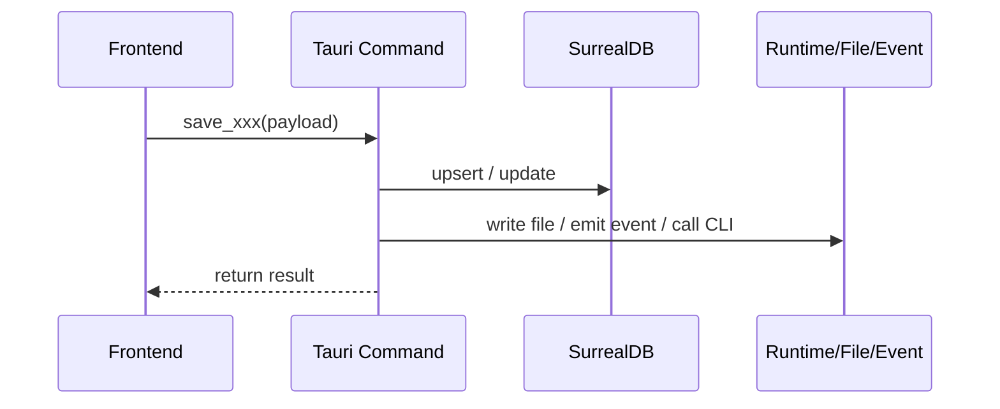

# Module AGENTS Template

> 用途：复制到目标模块目录并重命名为 `AGENTS.md`。只保留对该模块真正有价值的部分；空小节、泛泛描述、以及能被代码直接证明的内容应删除。

## 一句话职责

- 这个模块解决什么问题。
- 如果一句话说不清，先收紧模块边界，再写文档。

## Source of Truth

- 主数据来源是什么。
- 哪些状态只是派生结果、运行时缓存、镜像文件或展示态。
- 保存、应用、同步、恢复时最终以谁为准。

## 核心设计决策（Why）

- [决策] 为什么选 A 不选 B。
- [权衡] 这个决策解决了什么问题，代价是什么。
- [背景] 如果是历史兼容、跨平台、运行时限制或外部协议约束，要明确写出来。

## 关键流程

只描述跨文件、跨进程、跨事件、跨存储层的主链路。单文件内的线性逻辑不值得写。

如果 Mermaid 不利于表达，可以改用 ASCII 图，但要保持流程最短、最关键。

## 易错点与历史坑（Gotchas）

- [坑] 场景 -> 错因 -> 正确做法。
- [约束] 不能做什么，以及为什么不能。
- [历史] 过去修过的高价值回归。如果不理解这条历史，后续很容易复发。

## 跨模块依赖

- 依赖谁：通过命令、事件、表字段、配置文件、运行时目录或共享类型。
- 被谁依赖：这里对外暴露了什么契约。
- 如果改这里需要联动别处，明确写出对方模块或入口。

## 典型变更场景（按需）

- 新增字段时，至少检查哪些读写路径。
- 改保存逻辑时，至少检查哪些同步、应用、恢复或导入链路。
- 新增 provider、CLI 参数、配置节点或事件时，至少检查哪些兼容点。

## 最小验证

- 至少验证哪条用户路径。
- 哪类改动必须补自动化测试或全量测试。
- 本轮若未验证某些边界，应明确写出。

## 何时更新本文件

- 当本轮改动引入新的设计决策、修复会复发的坑、或用户反复强调某条约束时，同一任务内直接写回。
- 如果这条经验已经变成跨模块通用规则、数据库全局经验或仓库级铁律，不要只写在模块里，还要同步补到根 `AGENTS.md`。

## 明确不写

- 文件列表、目录结构、类型定义、命令清单、数据库字段表。
- 能被 `rg`、`ls`、类型系统或函数签名直接证明的事实。
- 一次性排障日志、临时 TODO、没有稳定价值的背景噪音。

## 前后端双份时的分工（按需）

- 后端 `AGENTS.md` 重点写 async/sync 边界、DB 语义、文件 I/O、CLI 调用、事件发射、跨平台差异。
- 前端 `AGENTS.md` 重点写状态来源、表单语义、事件监听、Modal 交互、i18n、页面联动。
- 跨端共享契约只写一处，另一处直接引用，不重复拷贝。
