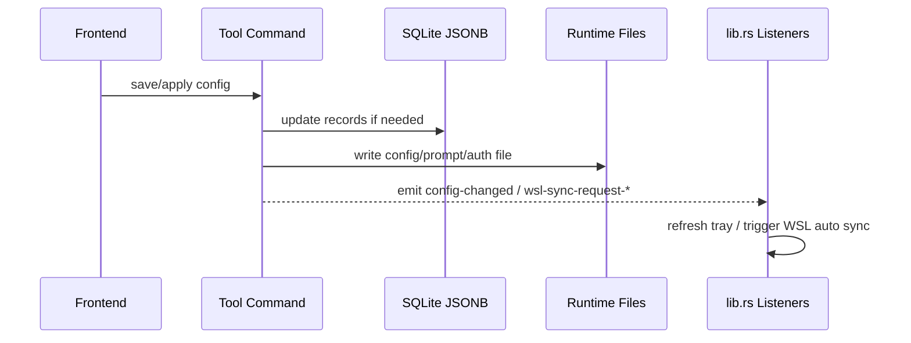

# Coding 模块说明

## 一句话职责

- `tauri/src/coding/` 是内置 coding 工具、Skills、MCP、WSL/SSH 同步和运行时定位的共享后端域。
- 这里最重要的不是某个工具单独怎么存，而是跨工具共享的路径决议、事件约定和跨平台执行语义。

## Source of Truth

- 各工具的业务配置主数据分别存于 SQLite JSONB 和对应运行时配置文件，两者都重要，但“当前生效路径”不是简单看页面输入框，而是由 `runtime_location` 统一决议。
- `runtime_location` 是各 coding tab 当前运行时位置、WSL Direct 状态和派生文件路径的唯一共享规则源。
- `runtime_location` 的同步 helper 只允许读取进程内 runtime location cache 或无 DB fallback；需要 SQLite、环境变量和 shell 配置参与解析时，必须走异步 refresh API 先刷新缓存，不能在同步 helper 里查 DB 或 `block_on`。
- 对这些 runtime tab，`source` 与 `is_wsl_direct` 是两个独立维度：`source` 只说明路径来源，`is_wsl_direct` 只说明当前生效路径是否为 WSL UNC；`module_statuses` 来自后者，不来自页面展示。
- runtime tab 分成两类：OpenCode/OpenClaw 是“配置文件路径模块”，Claude/Codex/Grok CLI/Gemini CLI 是“根目录模块”。后续 prompt、auth、plugins、skills 等派生路径都必须先尊重这个分层。
- `config-changed`、`wsl-sync-request-*`、`skills-changed`、`mcp-changed` 是跨模块联动的主事件契约；事件本身不保存状态，只触发后续动作。Grok 使用 `wsl-sync-request-grok`，与其他根目录模块保持同一监听层语义。
- provider 增删改、排序和导入操作需要继续触发 `config-changed`；全局监听器会用它刷新托盘并主动清空 Gateway provider 缓存。
- Magic Context 配置是 CortexKit 共享文件，不是 OpenCode plugin options 或 Pi extension 文件。AI Toolbox 当前只管理用户级配置；本机 Unix 路径优先使用 `$XDG_CONFIG_HOME/cortexkit/magic-context.jsonc`，未设置时回退 `~/.config/cortexkit/magic-context.jsonc`，Windows 使用 `%USERPROFILE%\.config\cortexkit\magic-context.jsonc`。Magic Context 上游支持的项目级配置不在当前配置卡片/API 范围内。WSL Direct 下用户级路径必须按 WSL 用户 home 派生为 UNC 路径。

## 核心设计决策（Why）

- runtime tab 的运行时路径统一收敛到 `runtime_location.rs`，避免每个模块各自判断 WSL UNC、默认路径和派生路径，导致逻辑分叉。
- 托盘刷新采用全局 `config-changed` 事件，而不是每个模块各自直接操作托盘，这样主窗口和托盘入口可以共享一套刷新机制。
- WSL 自动同步用 `lib.rs` 里的事件监听器集中触发，而不是在每个业务命令里直接调用 WSL 同步实现；这样可把“是否开启自动同步”判断统一放在监听器层。

## 关键流程

## 易错点与历史坑（Gotchas）

- 通用配置「从当前文件提取」以及 DB 为空时的磁盘 common 回退 / save-local base_common，都会直接读 WSL UNC / 网络根目录下的 runtime 文件。`Path::exists` / `fs::read_to_string` 在不可达路径上可能长时间阻塞；这些路径必须用 `coding::file_io` 做 `spawn_blocking` + 超时读，前端 extract 也要有兜底超时（`web/utils/withTimeout.ts`）。不要把 extract 复用成“读完整 settings（含 auth）”的 helper。`tokio::time::timeout` 只保证 await 返回，不会取消已卡住的 OS 读；超时后 blocking 线程仍可能短暂占用，应避免在不可达路径上连续重试打满线程池。
- 不要把“页面上显示的 `source`”和“WSL/SSH 设置页里的 `moduleStatuses.is_wsl_direct`”混为一谈。前者是路径来源标签，后者是对当前生效运行时路径的统一诊断结果。
- 不要把 OpenCode/OpenClaw 与 Claude/Codex 按同一种“自定义配置”处理。前两者改的是文件路径，后两者改的是根目录；一旦混写，后续所有派生路径都会偏掉。
- Claude Code 2.1.126 本机实测路径语义：未设置 `CLAUDE_CONFIG_DIR` 时，`settings.json` / `CLAUDE.md` / `config.json` / `plugins/` / `skills/` 位于 `~/.claude/` 下，MCP 与 onboarding 使用用户 home 下的 `~/.claude.json`；显式 `root_dir` / `CLAUDE_CONFIG_DIR` / shell 配置目录后，上述目录和 `.claude.json` 都位于该配置目录内。即使显式配置目录正好是 `~/.claude`，`.claude.json` 也应按显式目录解析为 `~/.claude/.claude.json`，不能只按路径值等于默认目录来判断。
- Claude plugins 还有独立的 `CLAUDE_CODE_PLUGIN_CACHE_DIR` 覆盖项；实测设置后 `known_marketplaces.json` / `installed_plugins.json` 位于该 plugin cache 目录，而不是 `CLAUDE_CONFIG_DIR/plugins`。这个路径同样要通过 runtime location cache 派生，不能在同步 helper 里临时查环境变量或 shell 配置。
- Claude Code 的本机自定义配置目录只影响本机 Claude CLI 消费路径；普通 WSL/SSH 同步仍把远端写到默认 `~/.claude/*` 与 `~/.claude.json`。只有当前运行时路径本身是 WSL Direct 自定义根目录时，WSL 目标才跟随该 Linux 配置目录，例如 `/home/user/custom-claude/settings.json`、`/home/user/custom-claude/plugins`、`/home/user/custom-claude/.claude.json`。
- 改 `root_dir` / `config_path` 保存逻辑时，保存 DB 后要先刷新对应 runtime location cache，再继续 apply 配置文件、比较 Skills 目标路径、发 WSL/SSH 相关同步事件。否则后续同步 helper 可能继续消费旧路径。
- 对 OpenCode、Claude Code、Codex、Grok CLI、OpenClaw、Gemini CLI 这类模块，文件 I/O 能直接读写 UNC 路径，不代表 CLI 也能直接吃 UNC 路径。新增 CLI 能力时必须先经过 `runtime_location::*_runtime_location_async` 判定。
- 对 OpenCode、Claude Code、Codex、Grok CLI、OpenClaw、Gemini CLI 这类用户自行安装的 CLI，不要默认 GUI 进程里 `PATH` 可用。尤其 macOS 从 Dock/Finder 启动时，新增调用应优先解析已知安装位置或显式配置路径，再回退到 `PATH`。
- WSL Direct 下为了补充 CLI shim 路径而使用 shell wrapper 时，动态 root、PATH 前缀和 CLI 参数必须作为位置参数传入固定脚本，不能插值进 `sh -c` / `bash -c` 文本；补充目录必须前置到 WSL 原 `$PATH`，不能用有限的硬编码目录覆盖整个 PATH。
- 本机 CLI 查找统一走 `cli_resolver.rs`。不要在单个工具模块里各自手写 `which`/`where`、nvm、volta、fnm、bun 或 Windows `.cmd`/`.bat` 处理，否则 Dock/Finder 启动和 Node/bun 全局安装场景会再次分叉。
- `cli_resolver` 的全局 bin 候选除 nvm/volta/fnm/nvm-windows/npm 外，还必须覆盖 bun：`$BUN_INSTALL/bin` 与默认 `~/.bun/bin`（Windows 含常见扩展后缀）。GUI 进程通常不继承终端 shell PATH，`bun install -g pi` 一类安装在 PATH 外时只能靠这些候选路径命中。
- 找到 Node-based CLI shim 本身还不够。像 Pi 的 `pi` 脚本可能通过 `#!/usr/bin/env node` 再查找 `node`；macOS GUI 启动环境即使能解析到 `pi`，子进程 `PATH` 也可能缺少 Node bin。新增本机 CLI spawn 能力时应复用 `cli_resolver` 构造命令，让它同时补齐 CLI 所在目录和可发现的 Node runtime 目录。
- 删除已保存的 prompt 配置只删 SQLite 记录，不删除/清空当前 runtime 本地 prompt 文件（如 `AGENTS.md` / `CLAUDE.md`）。产品语义是“删除记录”，不是“清空本地生效提示词”；Claude Code / OpenCode / Codex / Grok / Gemini CLI / Pi 统一此规则。
- 删除 Claude/Codex/Grok/Gemini 这类 DB-backed provider 也只删 SQLite 记录，不回滚/清空当前 `config.toml` / `settings.json` / `auth.json`。本地生效配置只在用户显式“应用”其他 provider 时改写。Pi 例外：它的 provider 事实源就是 runtime 文件，删除会按 scope 改 `auth.json` / `models.json`。
- 新增跨工具共享规则时，优先放在共享层，不要把通用逻辑塞进某个单独工具目录，否则后续很快出现“相邻工具修了一边，另一边继续错”。
- All API Hub 导入的浏览器扩展发现属于跨工具共享后端能力。当前应按 Chrome 优先、Edge 兜底的顺序扫描 Chromium profile 的 `Local Extension Settings`；Edge 既要兼容从 Chrome Web Store 安装的扩展 ID，也要兼容 Edge Add-ons 当前 ID。不要在 Claude/Codex/OpenCode/OpenClaw/Pi 页面各自实现浏览器发现。
- CC Switch 导入属于跨工具共享后端能力（`cc_switch.rs`）：只读 `~/.cc-switch/cc-switch.db`，不写 CCS。
  - **Providers**：`has_cc_switch_db`（30s 缓存）控制工具页按钮；`list_cc_switch_providers` 按 `app_type` 提取渠道。行表工具（Claude/Codex/Gemini）写入本应用 SQLite 且 `source_provider_id=ccs:{app}:{id}`、默认不 apply；map 工具（OpenClaw/OpenCode）用 CCS `raw_id` 作 key 并一次 save。Claude 侧整份拷贝 `settings_config.env`（含模型映射与自定义 env），忽略 CCS UI 杂字段与 `meta`；渠道导入剥离 provider 内嵌 MCP。
  - **MCP**：无独立按钮。`list_cc_switch_mcp_servers` 读 `mcp_servers` 表；`mcp_scan_servers` / `mcp_import_from_tool("cc_switch")` 挂入现有「导入现有 MCP」。
  - **Skills**：无独立按钮。`skills` onboarding 的 `EXTRA_SKILL_SOURCES` 扫 `~/.cc-switch/skills` 磁盘目录；不导 `skill_repos`。
- 跨 WSL/SSH/备份恢复的目标端字段清理规则统一放在 `config_cleanup.rs`。平台固定规则（例如 Claude 非 Windows 目标清理 Windows-only env）和用户映射配置的 `cleanup_paths` 都只作用于目标副本或恢复后的目标数据，不能反向污染 Windows 源配置。
- Magic Context 的 `doctor` 通过 `npx @cortexkit/magic-context@latest doctor --harness opencode|pi` 运行。本机命令解析要走 `cli_resolver.rs`，WSL Direct 要在目标 distro 内执行 `npx`，不能用 Windows home 或 Windows PATH 代表 WSL 运行环境。

## 跨模块依赖

- 被 `wsl/`、`ssh/`、`skills/` 和各工具模块依赖：它们都会消费 `runtime_location` 的派生路径或 WSL Direct 状态。
- 被前端 `web/features/settings/` 和各工具页面间接依赖：前端展示的路径来源、WSL Direct 提示和同步跳过逻辑最终都依赖这里的后端状态。

## 典型变更场景（按需）

- 新增需要调用工具 CLI 的能力时：
  先检查现有内置工具是否都存在同类调用点，并确认本机/WSL Direct 两套执行路径。
- 新增新的跨模块事件时：
  先判断是否应复用现有事件契约；如果新增，必须同时梳理监听端和前端刷新端。

## 最小验证

- 改 `runtime_location` 后，至少验证一个本机路径场景和一个 WSL UNC 路径场景。
- 改事件约定后，至少验证主窗口保存、托盘刷新、WSL 设置页状态三者是否仍一致。
