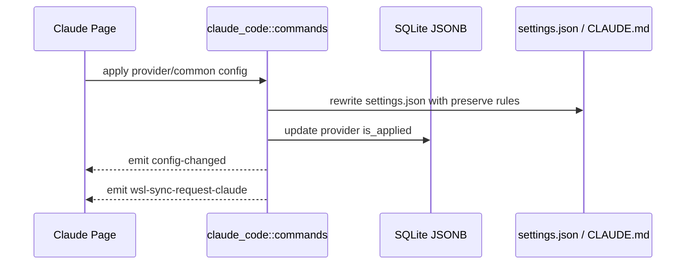

# Claude Code 后端模块说明

## 一句话职责

- `claude_code/` 负责 Claude Code provider/common config、`settings.json`、`CLAUDE.md`、plugin 运行时文件和 Claude MCP 相关配置。

## Source of Truth

- 当前生效根目录优先级是：应用内 `root_dir` > 环境变量 `CLAUDE_CONFIG_DIR` > shell 配置 > 默认根目录。
- Provider、common config 和 prompt config 的主存储是 SQLite JSONB；旧 SurrealDB 仅用于启动时一次性导入。
- Claude Code 是“根目录模块”，`settings.json`、`CLAUDE.md`、`config.json`、`plugins/`、`skills/` 都是从当前根目录派生出来的。
- `.claude.json` 需要按 Claude CLI 的默认/显式根目录语义单独处理：默认根目录时是用户 home 下的 `~/.claude.json`；只要根目录来自应用自定义、`CLAUDE_CONFIG_DIR` 或 shell 配置，就位于该配置目录下的 `.claude.json`。
- `plugins/` 默认从当前根目录派生，但 `CLAUDE_CODE_PLUGIN_CACHE_DIR` 会独立覆盖 plugin runtime root；`known_marketplaces.json` 和 `installed_plugins.json` 应跟随这个目录。
- prompt 的业务记录在数据库里，但运行时真正生效的是当前根目录下的 `CLAUDE.md`。

## 路径矩阵（Claude Code 2.1.126 本机实测）

| 场景 | `settings.json` / `CLAUDE.md` / `config.json` | `.claude.json` | `skills` | plugin metadata |
|------|-----------------------------------------------|----------------|----------|-----------------|
| 默认本机 | `~/.claude/*` | `~/.claude.json` | `~/.claude/skills` | `~/.claude/plugins/{known_marketplaces,installed_plugins}.json` |
| 显式 `root_dir` / `CLAUDE_CONFIG_DIR` / shell 根目录 | `<root>/*` | `<root>/.claude.json` | `<root>/skills` | `<root>/plugins/{known_marketplaces,installed_plugins}.json` |
| 显式根目录刚好是 `~/.claude` | `~/.claude/*` | `~/.claude/.claude.json` | `~/.claude/skills` | `~/.claude/plugins/{known_marketplaces,installed_plugins}.json` |
| `CLAUDE_CODE_PLUGIN_CACHE_DIR` | 不改变根目录文件 | 不改变 `.claude.json` | 不改变 `skills` | `<plugin-cache>/{known_marketplaces,installed_plugins}.json` |
| 普通 WSL/SSH 同步本机自定义根 | 本机源来自自定义根 | 远端目标仍是 `~/.claude.json` | 远端目标仍是 `~/.claude/skills` | 远端目标仍是 `~/.claude/plugins/*` |
| WSL Direct 自定义根 | Linux 目标跟随 `<linux-root>/*` | `<linux-root>/.claude.json` | `<linux-root>/skills` | `<linux-root>/plugins/*`，除非本机 plugin cache 被独立覆盖 |

## 官方参考

- Claude Code environment variables: https://code.claude.com/docs/en/env-vars
  - 这里记录 `CLAUDE_CONFIG_DIR` 与 `CLAUDE_CODE_PLUGIN_CACHE_DIR` 的官方语义；改根目录、plugin cache 或同步路径前必须先核对。
- Claude Code settings: https://code.claude.com/docs/en/settings
  - 这里记录 `settings.json` 等配置文件默认位置；改 settings/common config 落盘前必须先核对。
- Claude Code plugin marketplaces: https://code.claude.com/docs/en/plugin-marketplaces
  - 这里记录 marketplace 与 plugin runtime 文件行为；改 `known_marketplaces.json`、`installed_plugins.json` 或 marketplace CLI 集成前必须先核对。

## 核心设计决策（Why）

- 对 Claude Code 这类根目录模块，路径来源和运行时文件派生必须一致收敛，否则前端看的是一个目录、实际写到另一个目录，很容易状态分叉。
- `apply_config_internal` 统一负责写文件、更新 `is_applied`、发 `config-changed` 和 `wsl-sync-request-claude`。
- 自定义 provider 的 `extra_settings_config` 是 provider 私有的 `settings.json` 额外字段层，合并顺序固定为：磁盘/runtime 未知字段 → common config → extra settings → provider 表单派生字段。
- plugin/MCP 运行时文件要保留 CLI 自己拥有的字段，不能按 AI Toolbox 的部分结构反序列化后整文件重写。

## 关键流程

## 易错点与历史坑（Gotchas）

- 不要把 Claude Code 当成“配置文件路径模块”。它保存的是根目录，后续文件都要从根目录派生。
- 不要把“根目录路径等于 `~/.claude`”和“来源是默认根目录”混为一谈。实测 `CLAUDE_CONFIG_DIR=$HOME/.claude` 时，Claude Code 会使用 `$HOME/.claude/.claude.json`，而不是 `$HOME/.claude.json`。
- 不要把 `CLAUDE_CODE_PLUGIN_CACHE_DIR` 漏掉。实测该变量存在时，marketplace 元数据会写入它指向的目录，settings 与 `.claude.json` 仍跟随 `CLAUDE_CONFIG_DIR` / 当前根目录。
- 改写 `settings.json` 时要显式保留运行时自有字段，如 `enabledPlugins`、`extraKnownMarketplaces`、`hooks`，不能整文件按受管字段重建。
- `extra_settings_config` 不管理 `enabledPlugins`、`extraKnownMarketplaces`、`hooks`，也不能覆盖 provider 表单派生的 `ANTHROPIC_*` env 与模型字段。切换 provider 或编辑已应用 provider 时，必须先按上一份已应用 provider 的 extra settings 清理旧受管字段，再合入当前配置，避免旧 extra key 残留。
- 清空 optional 字段时不要用 truthy 判断，否则会把“用户明确清空”误当成“没有提交”，导致旧值残留。
- 普通“新建 provider”和“复制已应用 provider”都属于创建新记录，默认不应自动应用；不要因为源 provider 当前已应用，就把新记录写成 `is_applied = true`。
- `save_claude_local_config` 里的 `__local__` 不是普通新增 provider，而是把当前生效的本地运行时配置正式收编入库；在这个产品语义下，它保持 `is_applied = true` 是合理的，不要把这条链路误修成“保存但取消应用”。
- Claude Code 当前没有独立的官方订阅账号表；不要把纯官方本地运行态自动导入或展示成 `__local__` provider。`__local__` 只表示可收编的第三方/API-key/base-url 本地配置。
- Claude plugins 的 `known_marketplaces.json` 和 `installed_plugins.json` 会带运行环境相关路径。Windows 本机生成的 `installLocation` / `installPath` 不能在同步到 WSL/SSH 时原样保留，否则远端仍会指向 `C:\...` 而失效。
- 重写后的 `installLocation` / `installPath` 必须是**真实绝对 Linux 路径**，不能写 `~/.claude/...`。Claude CLI 2.1.126+ 在校验 marketplace 时直接把字段值当 literal path 用，不展开 `~`，留 `~` 会被判定 corrupted。`plugin_metadata_sync::rewrite_claude_plugin_metadata_if_needed` 本身只做字符串拼接，不负责展开 `~`；调用方(WSL 端 / SSH 端)必须先通过 `sync::get_wsl_user_home(distro)` 或 `sync::get_remote_user_home(session)` 把 target_plugins_root 头部的 `~` 解析成真实 home，再传进来。
- 本机自定义根目录只改变本机消费路径。普通 WSL/SSH 同步的远端目标仍保持 Claude 默认布局：`~/.claude/settings.json`、`~/.claude/CLAUDE.md`、`~/.claude/config.json`、`~/.claude/plugins`、`~/.claude/skills` 和 `~/.claude.json`。WSL Direct 自定义根目录是例外，目标应跟随该 Linux 根目录。

## 跨模块依赖

- 依赖 `runtime_location`：统一得到根目录、prompt 路径、MCP 配置路径和 WSL 目标路径。
- 被 `web/features/coding/claudecode/` 依赖：页面读取 `get_claude_root_path_info()` 并通过共享 RootDirectoryModal 编辑根目录。
- 被 `wsl/`、`skills/` 间接依赖：同步和 Skills 目标目录都依赖这里的根目录决议。

## 典型变更场景（按需）

- 改根目录来源逻辑时：
  同时检查 `settings.json`、`CLAUDE.md`、`config.json`、`.claude.json`、`CLAUDE_CODE_PLUGIN_CACHE_DIR`、插件运行时文件、Skills 路径和 WSL/SSH 目标路径。
- 改 provider/common config 落盘逻辑时：
  同时检查受管字段清理、runtime-owned 字段保留、`is_applied` 更新和 WSL 同步事件。

## 最小验证

- 至少验证：切换 provider 后 `settings.json` 改写、`is_applied` 更新和托盘刷新都成立。
- 至少验证：修改已应用 prompt 时会改写当前根目录下的 `CLAUDE.md`。
- 改根目录派生路径后，至少跑 `cargo test coding::runtime_location::tests`，覆盖默认本机、自定义本机、显式默认根、plugin cache 覆盖、WSL Direct 默认根和 WSL Direct 自定义根的 MCP、Skills、plugins、prompt 与 config 路径。
