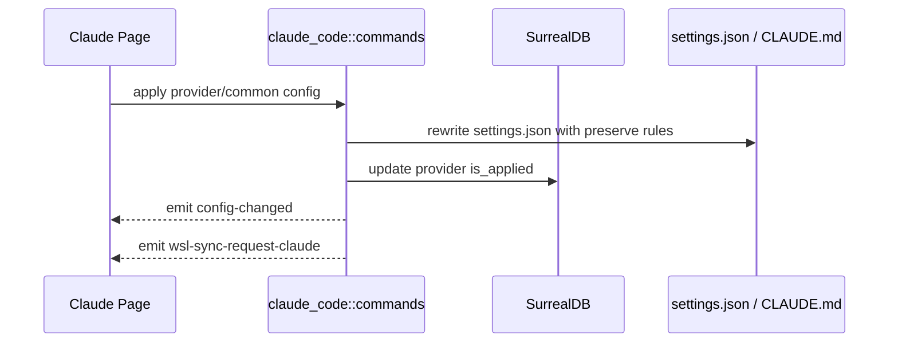

# Claude Code 后端模块说明

## 一句话职责

- `claude_code/` 负责 Claude Code provider/common config、`settings.json`、`CLAUDE.md`、plugin 运行时文件和 Claude MCP 相关配置。

## Source of Truth

- 当前生效根目录优先级是：应用内 `root_dir` > 环境变量 `CLAUDE_CONFIG_DIR` > shell 配置 > 默认根目录。
- Claude Code 是“根目录模块”，`settings.json`、`CLAUDE.md`、`config.json`、`skills/` 都是从当前根目录派生出来的。
- prompt 的业务记录在数据库里，但运行时真正生效的是当前根目录下的 `CLAUDE.md`。

## 核心设计决策（Why）

- 对 Claude Code 这类根目录模块，路径来源和运行时文件派生必须一致收敛，否则前端看的是一个目录、实际写到另一个目录，很容易状态分叉。
- `apply_config_internal` 统一负责写文件、更新 `is_applied`、发 `config-changed` 和 `wsl-sync-request-claude`。
- plugin/MCP 运行时文件要保留 CLI 自己拥有的字段，不能按 AI Toolbox 的部分结构反序列化后整文件重写。

## 关键流程

## 易错点与历史坑（Gotchas）

- 不要把 Claude Code 当成“配置文件路径模块”。它保存的是根目录，后续文件都要从根目录派生。
- 改写 `settings.json` 时要显式保留运行时自有字段，如 `enabledPlugins`、`extraKnownMarketplaces`、`hooks`，不能整文件按受管字段重建。
- 清空 optional 字段时不要用 truthy 判断，否则会把“用户明确清空”误当成“没有提交”，导致旧值残留。

## 跨模块依赖

- 依赖 `runtime_location`：统一得到根目录、prompt 路径、MCP 配置路径和 WSL 目标路径。
- 被 `web/features/coding/claudecode/` 依赖：页面读取 `get_claude_root_path_info()` 并通过共享 RootDirectoryModal 编辑根目录。
- 被 `wsl/`、`skills/` 间接依赖：同步和 Skills 目标目录都依赖这里的根目录决议。

## 典型变更场景（按需）

- 改根目录来源逻辑时：
  同时检查 `settings.json`、`CLAUDE.md`、插件运行时文件、Skills 路径和 WSL 目标路径。
- 改 provider/common config 落盘逻辑时：
  同时检查受管字段清理、runtime-owned 字段保留、`is_applied` 更新和 WSL 同步事件。

## 最小验证

- 至少验证：切换 provider 后 `settings.json` 改写、`is_applied` 更新和托盘刷新都成立。
- 至少验证：修改已应用 prompt 时会改写当前根目录下的 `CLAUDE.md`。
