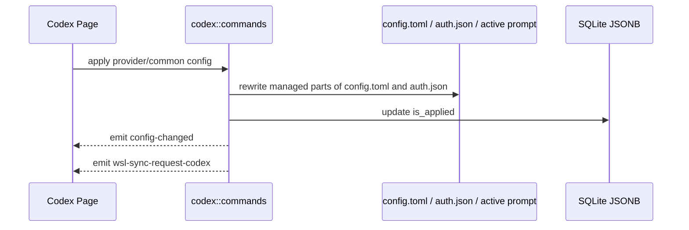

# Codex 后端模块说明

## 一句话职责

- `codex/` 负责 Codex provider/common config、`config.toml`、`auth.json`、prompt、plugin 和官方账号相关运行时文件。

## Source of Truth

- Provider、common config、prompt config、official account 和 plugin workspace roots 的长期主数据在 SQLite JSONB；旧 SurrealDB 仅用于启动时一次性导入。

- 当前生效根目录优先级是：应用内 `root_dir` > 环境变量 `CODEX_HOME` > shell 配置 > 默认根目录。
- Codex 是“根目录模块”，`config.toml`、`auth.json`、prompt、`skills/` 和历史同步目标都从当前根目录派生。
- prompt 的运行时事实源是当前根目录下的 Codex active global prompt 文件，而不是数据库记录本身。当前按 upstream 语义选择：非空 `AGENTS.override.md` 优先，否则使用非空 `AGENTS.md`；两者都为空时写入目标优先保持已存在的 `AGENTS.override.md`，否则使用 `AGENTS.md`。

## 核心设计决策（Why）

- `config.toml` 不能靠字符串拼接合并 common/provider 配置，必须结构化 merge，避免顶层键被吞进 provider 表作用域。
- `auth.json` 与 `config.toml` 混有 Codex runtime 自有字段；AI Toolbox 只能改受管字段，不能整文件覆盖运行时状态。
- `apply_config_internal` 统一负责写文件、更新 `is_applied`、发 `config-changed` 和 `wsl-sync-request-codex`。
- Codex 官方订阅的模型下拉来源是共享模型目录，而不是 Codex 本地账号文件。远程目录不可用时使用内置兜底；账号 quota/plan 只影响可用性判断，不应阻断 provider 表单读取模型列表。
- 当 provider 表为空、当前 Codex root 没有 API key / base_url 这类三方本地配置，并且本地 `auth.json` 有有效官方登录态时，启动初始化和 provider 列表懒加载会自动创建持久化 official 默认 provider；新建 provider 必须使用新的 `codex_provider` id，不复用 official account 记录里的 `provider_id`。
- 启动初始化和 provider 列表懒加载必须使用同一套 official-only 判断；如果本地同时存在官方登录态和三方 `base_url` / API key 配置，应保留 `__local__` 临时 provider 语义，不要在启动阶段持久化默认 provider。
- `__local__` 临时 provider 只用于三方/自定义本地配置。不要把纯官方订阅本地运行态显示成 `default（来自本地）`，否则用户删除持久化官方订阅后会看到无法删除的官方订阅临时卡片。
- official account 命令必须区分 `provider_id == "__local__"` 和 `account_id == "__local__"`：前者是临时 provider，后端必须拒绝 OAuth/apply/delete/refresh/copy 等 official-account 管理入口；后者是在真实持久化 official provider 下展示本机运行时登录态的虚拟账号。

## 关键流程

## 易错点与历史坑（Gotchas）

- 不要对 `config.toml` 做纯文本拼接。遇到 table 合并必须走结构化 TOML merge。
- 改写 `config.toml` 时要显式保留 runtime-owned sections，例如 `mcp_servers`、`features`、`plugins`。
- 改写 `auth.json` 时不要覆盖运行时 OAuth 字段；AI Toolbox 只应管理自己负责的 auth 键。
- WSL 自动同步是事件驱动，不是“数据库写成功就等于已经同步到 WSL”。
- 删除已应用 prompt 配置时，不能只删数据库记录；必须清空当前 active prompt 文件并发出 prompt 同步事件，否则 UI/DB 会显示已删除但 Codex 仍继续读取旧全局提示词。
- Codex prompt 同步必须按一组文件镜像：`AGENTS.md` 与 `AGENTS.override.md` 存在就同步，不存在就清理远端同名文件。不能只同步 active 文件，否则从 override 切回默认时远端会继续读取旧 override。
- 普通“新建 provider”和“复制已应用 provider”都属于创建新记录，默认不应自动应用；不要因为源 provider 当前已应用，就把新记录写成 `is_applied = true`。
- `save_codex_local_config` 里的 `__local__` 不是普通新增 provider，而是把当前生效的本地运行时配置正式收编入库；在这个产品语义下，它保持 `is_applied = true` 是合理的，不要把这条链路误修成“保存但取消应用”。
- 官方模型目录按 CLIProxyAPI 的 Codex plan 语义选择 `free/team/plus/pro` tier；未知 plan 默认按 `pro` 处理，并补入 Codex 内置模型 `gpt-image-2`。
- Codex 历史同步会直接修改 runtime 私有状态：`state_5.sqlite`、`session_index.jsonl` 和 `sessions/**/rollout-*.jsonl` 首行 metadata。必须先备份，默认只修复 provider 路由，不改写 `model` 或 `cwd`，恢复最新备份前必须再创建 `pre-restore` 安全备份。

## 跨模块依赖

- 依赖 `runtime_location`：统一得到根目录、`config.toml`、`auth.json`、prompt、skills 路径与 WSL 目标路径。
- 被 `web/features/coding/codex/` 依赖：页面通过 `get_codex_root_path_info()` 和 provider/prompt API 管理状态。
- 被 `wsl/`、`ssh/`、`mcp/` 间接依赖：它们都受 `config.toml` 路径和保留段语义影响。

## 典型变更场景（按需）

- 改 `config.toml` 落盘逻辑时：
  同时检查结构化 merge、runtime-owned sections 保留、WSL 同步事件和最小回归测试。
- 改 root_dir 逻辑时：
  同时检查 `auth.json`、`config.toml`、active prompt、Skills 路径、历史同步目标和前端 path info 展示。

## 最小验证

- 至少验证：common/provider 合并后顶层键仍在根级，表结构未错位。
- 至少验证：编辑已应用配置后仍会发出 `wsl-sync-request-codex`。
- 至少验证：prompt 应用会改写当前根目录下的 active prompt 文件。
- 至少验证：存在非空 `AGENTS.override.md` 时，prompt 读取、应用、删除和 WSL/SSH 动态映射都作用于 `AGENTS.override.md`，且切回 `AGENTS.md` 时远端 stale override 会被清理。
- 改历史同步时，至少验证新旧 `threads` schema、session 首行 metadata 往返、`session_index.jsonl` 重建、pre-sync 备份和恢复最新备份。
