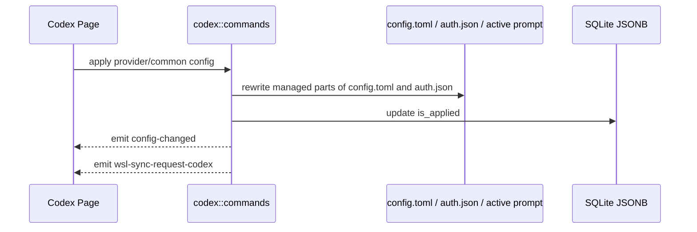

# Codex 后端模块说明

## 一句话职责

- `codex/` 负责 Codex provider/common config、`config.toml`、`auth.json`、prompt、plugin 和官方账号相关运行时文件。

## Source of Truth

- Provider、common config、prompt config、official account 和 plugin workspace roots 的长期主数据在 SQLite JSONB；旧 SurrealDB 仅用于启动时一次性导入。

- 当前生效根目录优先级是：应用内 `root_dir` > 环境变量 `CODEX_HOME` > shell 配置 > 默认根目录。
- Codex 是“根目录模块”，`config.toml`、`auth.json`、prompt、`skills/` 都从当前根目录派生。历史同步目标由命令层解析 Codex history source：会话管理来源为 `all` 时默认本机优先，当前根目录是 WSL Direct 时只处理该 WSL root。
- prompt 的运行时事实源是当前根目录下的 Codex active global prompt 文件，而不是数据库记录本身。当前按 upstream 语义选择：非空 `AGENTS.override.md` 优先，否则使用非空 `AGENTS.md`；两者都为空时写入目标优先保持已存在的 `AGENTS.override.md`，否则使用 `AGENTS.md`。

## 核心设计决策（Why）

- `config.toml` 不能靠字符串拼接合并 common/provider 配置，必须结构化 merge，避免顶层键被吞进 provider 表作用域。
- common config 是供应商共享默认值，provider 显式配置必须在应用时覆盖 common。入库拆分只能删除与 common 值相同的重复项，不得仅因字段同名就删除不同值；尤其要保留 provider 自己的 `model`、`model_reasoning_effort` 和 provider table 字段。
- `auth.json` 与 `config.toml` 混有 Codex runtime 自有字段；AI Toolbox 只能改受管字段，不能整文件覆盖运行时状态。
- `apply_config_internal` 统一负责写文件、更新 `is_applied`、发 `config-changed` 和 `wsl-sync-request-codex`。
- Codex 官方订阅的模型下拉来源是共享模型目录，而不是 Codex 本地账号文件。远程目录不可用时使用内置兜底；账号 quota/plan 只影响可用性判断，不应阻断 provider 表单读取模型列表。
- 当 provider 表为空、当前 Codex root 没有 API key / base_url 这类三方本地配置，并且本地 `auth.json` 有有效官方登录态时，启动初始化和 provider 列表懒加载会自动创建持久化 official 默认 provider；新建 provider 必须使用新的 `codex_provider` id，不复用 official account 记录里的 `provider_id`。
- 启动初始化和 provider 列表懒加载必须使用同一套 official-only 判断；如果本地同时存在官方登录态和三方 `base_url` / API key 配置，应保留 `__local__` 临时 provider 语义，不要在启动阶段持久化默认 provider。
- `__local__` 临时 provider 只用于三方/自定义本地配置。不要把纯官方订阅本地运行态显示成 `default（来自本地）`，否则用户删除持久化官方订阅后会看到无法删除的官方订阅临时卡片。
- official account 命令必须区分 `provider_id == "__local__"` 和 `account_id == "__local__"`：前者是临时 provider，后端必须拒绝 OAuth/apply/delete/refresh/copy 等 official-account 管理入口；后者是在真实持久化 official provider 下展示本机运行时登录态的虚拟账号。

## 关键流程

## 易错点与历史坑（Gotchas）

- `extract_codex_common_config_from_current_file` 只能读当前根目录下的 `config.toml`，禁止复用 `read_codex_settings_from_disk`（会先读无关的 `auth.json`）。提取逻辑不需要 auth；WSL UNC / 网络路径上 `Path::exists` / `fs::read_to_string` 可能长时间阻塞，文件 I/O 必须走 `coding::file_io`（`spawn_blocking` + 超时），超时错误文案要带上实际路径。
- 不要对 `config.toml` 做纯文本拼接。遇到 table 合并必须走结构化 TOML merge。
- 改写 `config.toml` 时要显式保留 runtime-owned sections，例如 `mcp_servers`、`plugins`。`[features]` 不是整段保护；普通 feature key 可以由 provider/common config 管理，但 `features.plugins` 属于插件页/运行时开关，必须保留当前 live 文件里的值，不能被 provider/common config 覆盖。
- Codex 插件批量启用/禁用只作用于当前 runtime 下真实已安装插件。全启用会确保 `[features].plugins = true`；全禁用只把各插件 `enabled = false`，不要顺手关闭 plugins feature，否则会把“逐插件状态”和“全局插件功能开关”混成两个不可解释的状态。
- 改写 `auth.json` 时不要覆盖运行时 OAuth 字段；AI Toolbox 只应管理自己负责的 auth 键。
- 当 `codex_preserve_official_auth_on_switch=true` 且应用第三方 provider 时，第三方 API key 的运行时投影只能写入当前 `model_provider` 指向的 `[model_providers.<id>].experimental_bearer_token`，不能写顶层 `experimental_bearer_token`，因为 Codex runtime 不读取顶层 bearer token。缺少有效 `model_provider` 或对应 provider 表时应拒绝应用，避免跳过 `auth.json` 后生成无可用第三方凭据的运行态。provider 存储仍以 `settings_config.auth.OPENAI_API_KEY` 为主数据；保存/导入 live config 时要把 provider-scoped `experimental_bearer_token` 回填到 auth 并从存储 TOML 清掉，旧 managed 快照也必须包含这个生成字段，确保关闭开关或切回官方时不会残留。
- 改会影响 live 投影方式的设置（例如 `codex_preserve_official_auth_on_switch`）时，不能只写 SQLite：必须立刻重投影当前已应用渠道。统一走 `proxy_gateway::provider_switch::apply_or_switch_provider`——未接管则直接 apply；Gateway 已接管则 restore 直连 → apply → 再 engage single，原先是 failover 再开 failover。不要只 `save_settings`，也不要在前端拼 restore/engage。失败要回滚设置（对齐 `set_codex_unified_session_history`）。专用入口：`set_codex_preserve_official_auth_on_switch`。
- WSL 自动同步是事件驱动，不是“数据库写成功就等于已经同步到 WSL”。
- 删除 prompt 配置只删 SQLite 记录，不改写/清空当前 active prompt 文件。产品语义是“删除已保存的提示词记录”，不是“清空本地 runtime 提示词”；Claude Code / OpenCode / Grok / Gemini / Pi 统一此规则。若用户要改本地生效内容，应通过编辑/应用其他 prompt 或直接改 active prompt 文件。
- Codex prompt 同步必须按一组文件镜像：`AGENTS.md` 与 `AGENTS.override.md` 存在就同步，不存在就清理远端同名文件。不能只同步 active 文件，否则从 override 切回默认时远端会继续读取旧 override。
- 普通“新建 provider”和“复制已应用 provider”都属于创建新记录，默认不应自动应用；不要因为源 provider 当前已应用，就把新记录写成 `is_applied = true`。
- `save_codex_local_config` 里的 `__local__` 不是普通新增 provider，而是把当前生效的本地运行时配置正式收编入库；在这个产品语义下，它保持 `is_applied = true` 是合理的，不要把这条链路误修成“保存但取消应用”。
- `save_codex_local_config` 收编 `__local__` 时仍要保留 provider `meta`，包括 Gateway 计费配置里的 `costMultiplier` / `pricingModelSource`；不要只保存 settings/common 而把表单提交的 meta 丢成 `None`。
- `adapter::to_db_value_provider` 是 Codex provider 持久化的最后一道写库入口；新增或调整 provider 级扩展字段时必须确认它也写入 JSONB。尤其 Gateway 计费 `meta` 不能只在 command 层结构体里保留，否则页面保存后重新 list 会丢失。
- 官方账号额度来自 Codex usage windows，后端负责按窗口语义解析并持久化 `5h`、weekly、monthly；前端只展示后端投影结果，不自行按套餐或字段顺序推断窗口类型。
- 拉取官方账号额度时必须带 `Chatgpt-Account-Id`，否则多账号/组织账号可能拿错 usage；解析 usage 时同时检查顶层 `rate_limit` 和 `additional_rate_limits`，monthly 这类窗口可能出现在 additional rate limits 中。
- 官方模型目录按 CLIProxyAPI 的 Codex plan 语义选择 `free/team/plus/pro` tier；未知 plan 默认按 `pro` 处理，并补入 Codex 内置模型 `gpt-image-2`。
- 当前官方模型目录只服务 AI Toolbox 页面下拉框，不等于 Codex runtime 的 `model_catalog_json`。自定义 Codex provider 可通过 `settingsConfig.modelCatalog.models` 保存简化模型映射；后端应用 provider 时会在当前 Codex root 下生成 `ai-toolbox-codex-model-catalog.json`，并在 `config.toml` 顶层写入相对文件名 `model_catalog_json = "ai-toolbox-codex-model-catalog.json"`。清空映射或切到官方 provider 时，只移除指向该 AI Toolbox 自有文件名的字段；不要覆盖或删除用户自有的外部 catalog 配置。
- `settingsConfig.config` 的默认 `model` 与 `settingsConfig.modelCatalog.models` 相互独立。后端只用 catalog 生成模型目录，不得用 catalog 第一项推断或改写默认 `model`。
- `settingsConfig.modelCatalog.models` 里的能力元数据必须和模型映射一起保存。`supportsImage=false`、`vision=false`、`attachment=false`、`modalities.input` 不含 `image` 会被 Gateway runtime 用来做发送前 text-only 图片替换；后端 storage normalize 不能只保留 `model/displayName/contextWindow`，否则真实 provider 保存后会丢失预测式图片兼容依据。
- Codex 历史同步会直接修改选定 history source 下的 runtime 私有状态：`state_5.sqlite`、`session_index.jsonl` 和 `sessions/**/rollout-*.jsonl` 首行 metadata。必须先备份，默认只修复 provider 路由，不改写 `model` 或 `cwd`，恢复最新备份前必须再创建 `pre-restore` 安全备份。`all` 这种列表来源不能被解释成同时同步本机和 WSL；写操作必须先解析成单一 Codex root。
- 历史同步读写 `state_5.sqlite` 时必须带 busy timeout，并对 `database is locked` / busy 做统一重试。`get_status` 打开弹窗就会读库，不能只在写路径重试；WSL/VS Code 远程场景下 Codex 持锁更常见。重试耗尽后的错误文案要可操作（结束当前回复/关闭 Codex 后再试），前端应对 locked 错误做本地化，不要直接抛原始 SQLite 字符串。
- 统一 Codex 会话历史只应让官方 provider 的 live `config.toml` 注入共享 `custom` history bucket，并保持 `auth.json` 官方登录态不变；注入段不能进入 provider 存储主数据。存量迁移只能按窄边界执行 `openai -> custom`，恢复只能按迁移账本把当初迁入的官方 session/thread 改回 `openai`，不能猜测开启期间新产生的 `custom` 会话来源。

## 跨模块依赖

- 依赖 `runtime_location`：统一得到根目录、`config.toml`、`auth.json`、prompt、skills 路径与 WSL 目标路径。
- 被 `web/features/coding/codex/` 依赖：页面通过 `get_codex_root_path_info()` 和 provider/prompt API 管理状态。
- 被 `wsl/`、`ssh/`、`mcp/` 间接依赖：它们都受 `config.toml` 路径和保留段语义影响。

## 典型变更场景（按需）

- 改 `config.toml` 落盘逻辑时：
  同时检查结构化 merge、runtime-owned sections 保留、WSL 同步事件和最小回归测试。
- 改 root_dir 逻辑时：
  同时检查 `auth.json`、`config.toml`、active prompt、Skills 路径、历史同步目标和前端 path info 展示。
- 改会影响 live 投影的设置/开关时：
  写设置后必须重投影当前已应用渠道，统一复用 `apply_or_switch_provider`（直连直接 apply；Gateway 下 restore → apply → re-engage）。参考 `set_codex_preserve_official_auth_on_switch`。

## 最小验证

- 至少验证：common/provider 合并后顶层键仍在根级，表结构未错位。
- 至少验证：编辑已应用配置后仍会发出 `wsl-sync-request-codex`。
- 至少验证：prompt 应用会改写当前根目录下的 active prompt 文件。
- 至少验证：存在非空 `AGENTS.override.md` 时，prompt 读取、应用、删除和 WSL/SSH 动态映射都作用于 `AGENTS.override.md`，且切回 `AGENTS.md` 时远端 stale override 会被清理。
- 改历史同步时，至少验证本机/WSL source 解析、新旧 `threads` schema、session 首行 metadata 往返、`session_index.jsonl` 重建、pre-sync 备份和恢复最新备份。
- 改统一会话历史时，至少验证 official config 注入/剥离、冲突 `custom` provider 跳过、`openai -> custom` 迁移、账本恢复和 Gateway 接管期间拒绝切换。
- 改 `codex_preserve_official_auth_on_switch` 时，至少验证：已应用第三方渠道下开关切换后 live `auth.json`/`config.toml` 立即按新投影更新；Gateway 接管时走 restore → apply → re-engage；失败时设置回滚。
