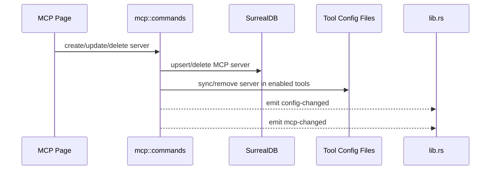

# MCP 后端模块说明

## 一句话职责

- `mcp/` 负责 MCP Server 的数据库存储、排序、导入导出，以及同步到各个工具运行时配置文件。

## Source of Truth

- MCP server 主数据存于 `mcp_server` 相关表；各工具配置文件中的 MCP 节点是派生结果，不是主数据。
- 每个 server 的 `enabled_tools` 和 `sync_details` 描述“应该同步到哪些工具”和“最近同步结果”，不是工具配置文件的反向解析真相。
- WSL 自动同步感知的不是某个工具配置文件具体变了什么，而是 `mcp-changed` 事件。

## 核心设计决策（Why）

- MCP 采用“中心存储 + 同步到工具配置”的模型，避免用户分别改 Claude/Codex/OpenCode/OpenClaw 的各自配置。
- 创建、更新、删除 server 后立即同步到所有启用工具，并统一发 `config-changed` + `mcp-changed`，这样托盘和 WSL 自动同步都能跟上。
- 导入已有配置时应尽量走共享 config sync 能力，而不是为每个工具复制一套解析逻辑。

## 关键流程

## 易错点与历史坑（Gotchas）

- 不要把工具配置文件当作 MCP 的 source of truth。真正要改的是中心存储，再同步下发。
- 改同步逻辑时要同时考虑“启用工具集合变化”“opencode disabled sync 特例”“删除时清理工具配置”三类路径，不要只修新增路径。
- WSL 自动同步依赖 `mcp-changed` 事件；如果只更新数据库、不发事件，WSL 侧不会跟进。

## 跨模块依赖

- 依赖 `tools/` 和 `runtime_location` 解析可用工具及对应 MCP 配置路径。
- 被 `web/features/coding/mcp/` 依赖：页面操作全部围绕这里的 Tauri commands。
- 被 `wsl/` 间接依赖：`lib.rs` 监听 `mcp-changed` 后触发 MCP WSL 同步。

## 典型变更场景（按需）

- 新增工具支持时：
  同时检查 runtime tool 注册、配置路径解析、导入扫描和 sync/remove 实现。
- 改 server CRUD 时：
  同时检查同步明细、工具配置文件更新和 `mcp-changed` 事件。

## 最小验证

- 至少验证：新增/编辑/删除 server 后中心存储和目标工具配置文件都变化。
- 至少验证：操作后仍会发出 `mcp-changed`，WSL 自动同步链路保持可触发。
