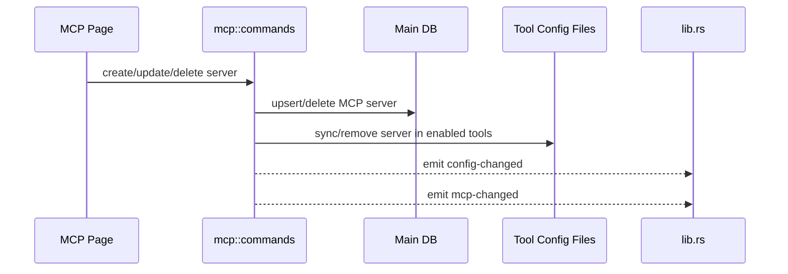

# MCP 后端模块说明

## 一句话职责

- `mcp/` 负责 MCP Server 的数据库存储、排序、导入导出，以及同步到各个工具运行时配置文件。

## Source of Truth

- MCP server 主数据存于主数据库的 `mcp_server` 相关表；必须直接读写 SQLite JSONB，旧 SurrealDB 仅用于启动时一次性导入。各工具配置文件中的 MCP 节点是派生结果，不是主数据。
- 每个 server 的 `enabled_tools` 和 `sync_details` 描述“应该同步到哪些工具”和“最近同步结果”，不是工具配置文件的反向解析真相。
- `user_group/user_note` 是 AI Toolbox 内部的用户管理元数据，不写入任何工具 MCP 配置，也不触发 MCP 同步。
- WSL 自动同步感知的不是某个工具配置文件具体变了什么，而是 `mcp-changed` 事件。

## 核心设计决策（Why）

- MCP 采用“中心存储 + 同步到工具配置”的模型，避免用户分别改 Claude/Codex/OpenCode/OpenClaw 的各自配置。
- 创建、更新、删除 server 后立即同步到所有启用工具，并统一发 `config-changed` + `mcp-changed`，这样托盘和 WSL 自动同步都能跟上。
- 备份恢复是例外：恢复编排必须调用不发事件的 MCP 全量同步入口，等本机 re-apply、Skills、MCP 全部串行完成后再由恢复任务统一执行一次 WSL 同步，避免 `mcp-changed` 在中途启动并发同步。
- 导入已有配置时应尽量走共享 config sync 能力，而不是为每个工具复制一套解析逻辑。
- 更新 `user_group/user_note` 只改变 AI Toolbox 内部列表组织信息，不应走 server CRUD 重同步链路。

## 关键流程

```mermaid
sequenceDiagram
  participant UI as MCP Page
  participant Cmd as mcp::commands
  participant DB as Main DB
  participant Tool as Tool Config Files
  participant App as lib.rs

  UI->>Cmd: create/update/delete server
  Cmd->>DB: upsert/delete MCP server
  Cmd->>Tool: sync/remove server in enabled tools
  Cmd-->>App: emit config-changed
  Cmd-->>App: emit mcp-changed
```

## 易错点与历史坑（Gotchas）

- 不要把工具配置文件当作 MCP 的 source of truth。真正要改的是中心存储，再同步下发。
- 改同步逻辑时要同时考虑“启用工具集合变化”“opencode disabled sync 特例”“删除时清理工具配置”三类路径，不要只修新增路径。
- WSL 自动同步依赖 `mcp-changed` 事件；如果只更新数据库、不发事件，WSL 侧不会跟进。
- `mcp_import_from_tool` 导入后会改写工具配置，必须同样发 `config-changed` + `mcp-changed`（与 create/update/delete 同一契约），否则 WSL 自动同步与托盘都不感知导入结果。
- `mcp_update_server` 只对 enabled_tools 做「增」同步会留下差集：从 enabled_tools 移除的工具、以及改名 server 的旧名字条目会残留在工具配置文件里继续被加载。更新时必须先按 previous name/enabled_tools 差集调用 `remove_server_from_tool_async` 并删除对应 sync_detail，再对新 enabled_tools 全量重同步。
- `cmd /c` 后处理不只有 JSON/TOML：wsl/ssh 的 `strip_cmd_c_from_*_mcp_file` 对 `hermes` 走 `process_hermes_yaml_mcp_servers`（只重写 `mcp_servers:` 段，其余字节保留），对 `dsh` 走 `process_cordis_patch_yaml`（重写 `insert` 行里 `@deepseek-ai/dsh-mcp-client` 的 config）。新增 YAML 型 MCP 工具时必须在 command_normalize 提供对应整文件处理函数并在两处 strip 分支注册，否则远端会残留 Windows 的 `cmd /c`。
- Hermes `process_hermes_yaml_mcp_servers` 在解析前必须先做顶层重复 key 自愈（复用 `yaml_sync::deduplicate_top_level_keys`），与 `read_yaml_object_or_empty` 保持一致；否则旧配置中的重复顶层 section 会导致 WSL/SSH MCP 后处理直接解析失败。
- 不要把恢复专用 no-event 入口复用到普通 CRUD/手动同步路径；它只用于已有外层编排明确负责最终 WSL 投影的场景。
- Windows 下给 `npx` / `npm` / `node` 等 stdio command 加 `cmd /c` 时，判断依据必须是目标配置文件的运行平台，不是 AI Toolbox 进程平台。普通 Windows 本机目标需要包装；WSL UNC / WSL Direct 目标不能包装，否则远端 Linux CLI 会读到无效的 `cmd`。
- Grok 是明确例外：官方 Grok MCP schema 在 Windows 本机、WSL 和 SSH 都保持裸 `npx`，不写 `cmd /c`；同时使用 `headers` 而非 Codex 的 `http_headers`，不写 `type`，并保留 `cwd/enabled/startup_timeout_sec/tool_timeout_sec/tool_timeouts/bearer_token_env_var`。
- Codex 与 Grok 共享秒级超时字段 `startup_timeout_sec` / `tool_timeout_sec`，存放在中心存储的 `server_config` 里（不是顶层 OpenCode 毫秒字段 `timeout`）。同步到 Codex `config.toml` 时由 `build_toml_edit_server_config` 写出；未设置则不写，让 Codex 使用官方默认（启动约 10s、工具约 60s）。导入 Codex TOML 时必须回读这两个字段，避免再同步时丢失。
- Pi 的 MCP 目标不是 Pi 原生能力，而是 `pi-mcp-adapter` 扩展读取的 `<Pi runtime root>/mcp.json`。同步时仍以中心 MCP 存储为 source of truth，只把标准 JSON `mcpServers` 写入该派生配置文件。
- Oh My Pi 原生读取 `<OMP runtime root>/mcp.json`,根字段为 `mcpServers`。同步目标路径必须消费 OMP 独立 custom root,不能退回 Pi root 或固定 `~/.omp/agent`;AI Toolbox 首次创建文件时写入官方 `$schema` URL,并保留已有的 `disabledServers` / `enabledServers` 等顶层字段。
- Antigravity 2.0 的远程 HTTP MCP 字段是 `serverUrl`，不是 Gemini/Qwen 的 `httpUrl`，也不是通用 `url`。中心存储仍统一用 `server_config.url`，只在同步到 Antigravity 配置和从 Antigravity 配置扫描时做字段转换；扫描时要兼容历史写出的 `httpUrl`，避免丢用户已有配置。`antigravity_cli` 与 `antigravity` 共用同一 `ANTIGRAVITY_FORMAT` 映射和相同的 `mcp_config.json` 布局，只是前缀换成 `~/.gemini/antigravity-cli/`；`get_format_config` 已把两个 key 都指向该格式。
- 「导入现有 MCP」扫描除已安装工具配置与 Claude 插件 `.mcp.json` 外，还会只读扫描 CC Switch `~/.cc-switch/cc-switch.db` 的 `mcp_servers` 表。发现结果使用合成 `tool_key = "cc_switch"` / 显示名 `CC Switch`（前端走 pluginGroups 同款分组，无独立按钮）。`mcp_import_from_tool("cc_switch")` 必须单独分支再读该表并 upsert；不要把 CCS 当 runtime tool，也不要写回 CCS。
- CCS `mcp_servers` 的 `enabled_*` 列（claude/codex/gemini/grokbuild/opencode/hermes → AI Toolbox 的 `claude_code`/`codex`/`gemini_cli`/`grok`/`opencode`/`hermes`）是该 server 的 per-agent 启用标记；读取用按列名 get，缺列或 NULL 一律按未标记处理，兼容 CCS 老库 schema。`mcp_import_from_tool` 默认 `followCcSwitchMarks=true`：CCS 源每个 server 的同步目标 = 标记映射结果 ∩ 已安装工具；全未标记 → 导入但 `enabled_tools` 为空、不同步到任何工具。开关关闭时才回退到弹窗统一勾选的 `enabledTools`。扫描结果经 `McpDiscoveredServerDto.source_enabled_tools` 透出，前端用它在 CC Switch 分组渲染 agent 徽标。

## 跨模块依赖

- 依赖 `tools/` 和 `runtime_location` 解析可用工具及对应 MCP 配置路径。
- 被 `web/features/coding/mcp/` 依赖：页面操作全部围绕这里的 Tauri commands。
- 被 `wsl/` 间接依赖：`lib.rs` 监听 `mcp-changed` 后触发 MCP WSL 同步。

## 典型变更场景（按需）

- 新增工具支持时：
  同时检查 runtime tool 注册、配置路径解析、导入扫描和 sync/remove 实现。
- 改 server CRUD 时：
  同时检查同步明细、工具配置文件更新和 `mcp-changed` 事件。

## 最小验证

- 至少验证：新增/编辑/删除 server 后中心存储和目标工具配置文件都变化。
- 至少验证：操作后仍会发出 `mcp-changed`，WSL 自动同步链路保持可触发。
