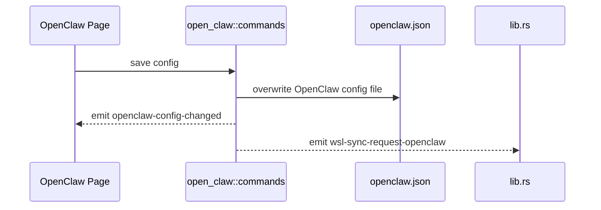

# OpenClaw 后端模块说明

## 一句话职责

- `open_claw/` 负责 OpenClaw 配置文件读写、配置路径管理和与 WSL/托盘的联动。

## Source of Truth

- OpenClaw 当前生效配置路径优先级很简单：应用内 `config_path` > 默认路径。
- OpenClaw 是“配置文件路径模块”，不是根目录模块；运行时相关派生都应从当前配置文件位置继续推导。
- 页面内 provider、tools、env 等编辑最终都要回到同一份 OpenClaw 配置文件。

## 核心设计决策（Why）

- OpenClaw 配置直接落单文件 JSON，而不是拆成多份子文件，因此页面上的各个 section 最终都在修改同一份配置对象。
- 保存配置统一走 `apply_config_internal`，负责写文件、发 `openclaw-config-changed` 和 `wsl-sync-request-openclaw`。
- 与其他 4 tabs 不同，OpenClaw 使用专属 `openclaw-config-changed` 事件而不是通用 `config-changed`，前端页面需单独监听。

## 关键流程

## 易错点与历史坑（Gotchas）

- 不要把 OpenClaw 当成根目录模块。它和 OpenCode 一样，保存的是配置文件路径。
- 页面保存时修改的是整份配置对象；改某个子 section 时要小心不要把其它 section 顺手丢掉。
- `openclaw-config-changed` 是专有事件，做跨模块抽象时不要误以为它会自动被通用 `config-changed` 监听逻辑覆盖。

## 跨模块依赖

- 依赖 `runtime_location`：提供 WSL 目标路径和 WSL Direct 统一诊断。
- 被 `web/features/coding/openclaw/` 依赖：页面通过 `get_openclaw_config_path_info()` 和整份配置读写 API 驱动 UI。
- 被 `wsl/`、`ssh/` 间接依赖：同步系统需要用到它的配置文件路径。

## 典型变更场景（按需）

- 改配置路径逻辑时：
  同时检查页面 path info、WSL 目标路径和同步映射。
- 改某个 section 写回逻辑时：
  先确认是“局部 patch”还是“整份重建”，避免覆盖其它 section。

## 最小验证

- 至少验证：保存任一 section 后文件落盘成功，页面监听 `openclaw-config-changed` 后刷新。
- 至少验证：修改配置后仍会触发 `wsl-sync-request-openclaw`。
