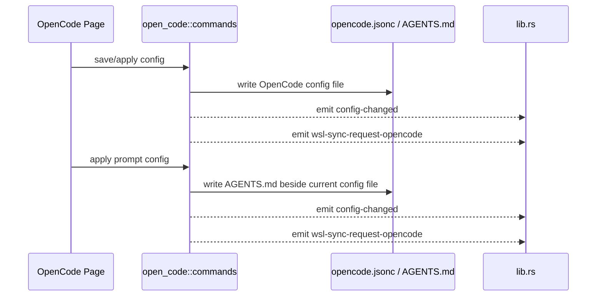

# OpenCode 后端模块说明

## 一句话职责

- `open_code/` 负责 OpenCode 配置文件、provider 数据、prompt 文件、模型读取和托盘联动。

## Source of Truth

- 当前生效配置文件路径的优先级是：应用内 `common_config.config_path` > 环境变量 `OPENCODE_CONFIG` > shell 配置 > 默认路径。
- OpenCode prompt 文件不是独立根目录配置，而是基于当前生效配置文件所在目录派生出的 `AGENTS.md`。
- OpenCode 主模型和小模型的运行时值都使用 `provider_id/model_id` 格式；不要把它降成裸 `model_id`。
- `favorite provider` / `我使用过的供应商` 库不是当前配置镜像，而是独立的历史库和诊断缓存；真正的 OpenCode 运行时配置仍以当前配置文件内容为准。

## 核心设计决策（Why）

- OpenCode 保存的是“配置文件路径”，不是配置根目录，因此 prompt、plugins、oh-my-openagent、skills 等路径都必须基于配置文件所在目录继续推导。
- `apply_config_internal` 负责统一写文件、发 `config-changed`、触发 WSL 同步事件，避免主窗口和托盘入口各自分叉。
- tray 的模型切换直接复用统一模型列表，并把选择结果按完整 `provider_id/model_id` 写回配置，避免托盘和主页面对模型 ID 语义不一致。
- prompt 配置既有数据库记录，也有当前生效的本地 `AGENTS.md` 文件；真正会影响运行时的是落到本地文件的内容。

## 关键流程

## 易错点与历史坑（Gotchas）

- 不要把 OpenCode prompt 路径写死成 `~/.config/opencode/AGENTS.md`。应始终先走当前配置路径决议，再取同目录下的 `AGENTS.md`。
- 前端显示的 `configPathInfo.source` 只是“路径来自哪里”，不是 WSL Direct 判断。WSL Direct 统一看 `runtime_location` / `module_statuses`。
- 不要把 OpenCode 的模型值只当成 `model_id`。tray、统一模型列表和配置文件都约定使用 `provider_id/model_id`，少一段就会导致选中态和写回都失真。
- tray 展示模型时会把当前已选模型保留在菜单里，即使其 provider 已被禁用；改 tray 过滤逻辑时不要把当前选择无提示隐藏掉。
- prompt tray 会过滤掉 `__local__` 临时项。页面仍可能把当前本地文件映射成 `__local__` 且视为已应用，因此页面与 tray 对“当前应用 prompt”的表达不一定完全对称。
- `favorite provider` 库的产品语义是“使用过的供应商历史库”，主要用于删除后找回和保留诊断信息；如果某个 provider 已不在当前配置里但仍留在库中，默认先视为预期语义，而不是脏数据。
- 改配置落盘后不要只刷新页面状态；托盘和 WSL 自动同步也依赖统一事件链路。

## 跨模块依赖

- 依赖 `runtime_location`：决定 WSL 目标路径、prompt 路径和 Skills 目标目录。
- 依赖 `tray_support.rs`：主模型、小模型、prompt 和插件收藏的 tray 表达都从这里汇总。
- 被 `web/features/coding/opencode/` 依赖：页面会读取 `get_opencode_config_path_info()`、配置文件内容和 prompt 列表。
- 被 `wsl/`、`ssh/` 间接依赖：它们同步 OpenCode 时使用这里派生出来的路径语义。

## 典型变更场景（按需）

- 改配置路径逻辑时：
  同时检查 prompt 路径、plugins 路径、WSL 目标路径和设置页展示。
- 改 prompt 保存/应用逻辑时：
  同时检查 DB 记录、本地 `AGENTS.md`、`config-changed` 和 WSL 自动同步事件。
- 改 provider 导入、删除或诊断保存时：
  同时检查当前配置文件、favorite provider 历史库和页面/tray 展示三者是否仍符合各自语义。

## 最小验证

- 至少验证：自定义配置路径、环境变量路径、默认路径三种来源中至少两种。
- 至少验证：应用 prompt 后本地 `AGENTS.md` 被正确改写，并触发 WSL 同步事件。
- 至少验证：从 tray 切换主模型或小模型后，配置文件里仍是完整 `provider_id/model_id`，且页面/托盘选中态一致。
