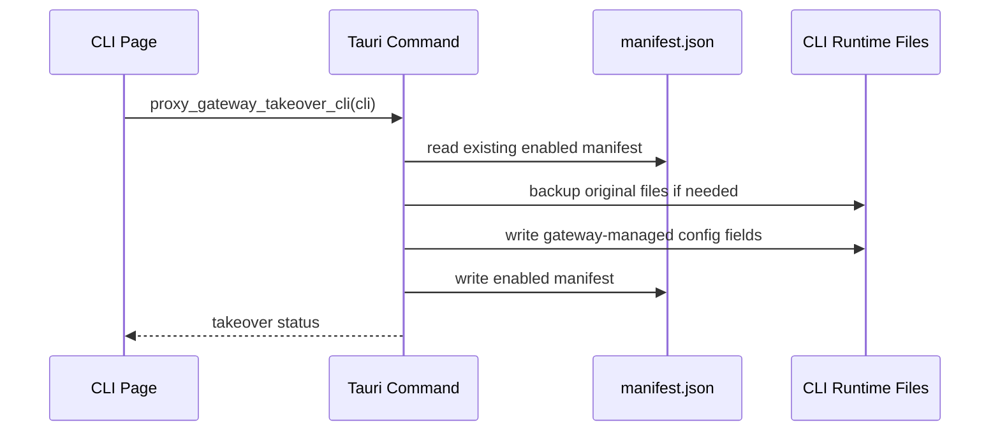
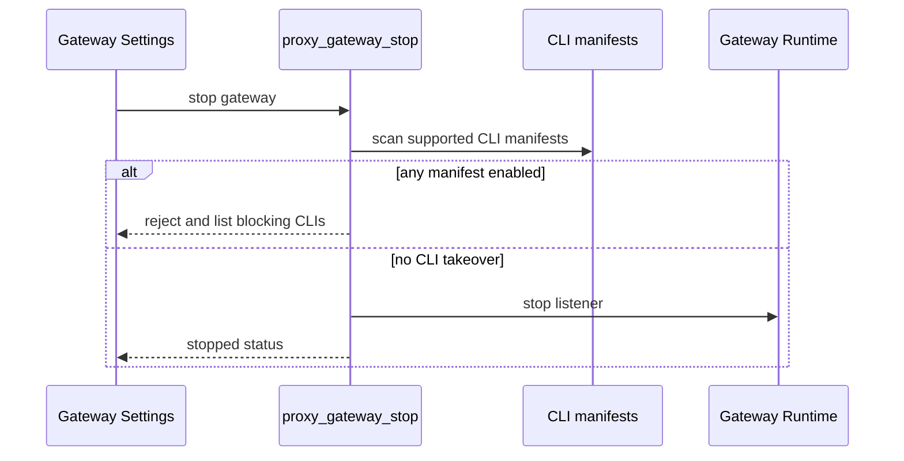

# Proxy Gateway Module Notes

## 一句话职责

- 提供本机代理网关运行态、CLI 接管状态、配置备份恢复、请求详情文件、数据库请求摘要/统计和模型级健康状态。

## Source of Truth

- 全局网关设置来自 AI Toolbox 主数据库的 `proxy_gateway_settings`；必须直接读写 SQLite JSONB，旧 SurrealDB 仅用于启动时一次性导入。CLI 接管状态不进数据库，以 `proxy-gateway/cli-proxy/<cli>/manifest.json` 为准。
- CLI manifest 只保存接管元数据、目标文件路径、备份相对路径、hash/size 和被管理字段；不要写 provider_id、settings_config、API key 明文或上游渠道配置。
- 被接管 CLI 的真实运行时配置仍在各 CLI 自己的 runtime root：Claude Code `settings.json`、Codex `config.toml`/`auth.json`、Gemini CLI `.env`/`settings.json`。
- 请求列表和统计页的 Source of Truth 是 SQLite 中的 `proxy_request_logs` 请求摘要表和 `usage_daily_rollups` 日聚合表；这些表只保存 provider/model/token/cost/status/latency/时间等摘要字段。
- 请求详情仍然以 `proxy-gateway/request-logs/*.jsonl` 文件为准。`body`、`headers`、`upstream_request_body`、`response_body`、provider attempt 明细和 failover 过程不要写入数据库。
- 当 `metrics_enabled=true` 但 `request_log_enabled=false` 时，详情文件可能不存在；详情命令可以从 SQLite 摘要降级返回 provider/model/token/status/latency 等基础字段，但仍不能把 body/header/attempt 明细写入数据库。
- 模型健康属于本地文件状态，继续以 `proxy-gateway/model-health.json` 为准。
- `ProxyGatewaySettings.enabled_on_startup` 表示上次应用退出前的网关运行态，不是用户可见的独立开关。启动成功后置 `true`，用户手动停止成功前置 `false`，应用启动时按它自动恢复网关。

## 核心设计决策（Why）

- CLI 接管使用文件 manifest，而不是数据库状态，原因是接管必须跟随本机 runtime 文件恢复，即使数据库记录损坏或迁移，仍能根据 manifest 找到备份并回滚。
- `OpenCode` adapter 暂不属于当前 MVP；不要把 `GatewayCliKey::OpenCode` 当成可接管 CLI 开启入口。
- 停止网关前必须做后端硬检查：只要存在 enabled manifest，就拒绝停止，要求先恢复对应 CLI 直连，避免用户 CLI 被留在不可用的本机网关地址上。
- 重新接管时必须复用已有 manifest 的原始备份，不要把已经被网关改写过的文件再次备份成“原始状态”。

## 关键流程

## 易错点与历史坑（Gotchas）

- 不要用 `enabled_cli_keys` 表示“当前已接管”。它只是旧设置兼容字段；实际接管状态看 manifest。
- 不要把 UI 的停止前检查当成安全边界。全局停止保护必须在 `proxy_gateway_stop` 后端命令里执行。
- 不要让保存设置时的隐藏字段把运行态恢复标记清掉。网关运行中保存设置时应保留 `enabled_on_startup=true`。
- 网关运行中保存日志/metrics 设置时必须同步更新运行态共享 settings，不能只写数据库；否则关闭 body/header 日志后重启前仍会继续落盘敏感内容。
- 控制台调试日志不等同于文件请求日志。文件请求日志必须按设置处理 headers/body 的脱敏、体积上限和保留策略；`/health` 这类健康检查不记录请求日志和 metrics。
- 请求摘要/统计可以写数据库，但必须保持 compact：不要把 body/header/attempt/response 这类大字段或敏感详情写进 SQLite。详情展示需要继续按 trace id 读取 JSONL 文件。
- `proxy_request_logs` 要保持与 cc-switch 核心 usage schema 兼容：不要让列表/统计查询依赖 `route_name`、`path`、body byte count 或其他 AI Toolbox 额外列；这些展示信息只能从详情文件或已有核心列推导。
- 只要 `request_log_enabled` 或 `metrics_enabled` 任一开启，就要写 compact 请求摘要；否则请求 Tab 列表和统计页会丢当前请求。只有 `request_log_enabled=true` 时才写 JSONL 详情文件。
- 旧 metrics rollup 文件入口已经废弃；`metrics_enabled` 现在表示写入 SQLite compact 请求摘要供统计页使用，不再维护文件 rollup API。
- 请求日志里 `request_body` 表示网关收到的原始请求体，`upstream_request_body` 表示实际发往上游的请求体。两者都受 `store_request_body` 控制；后续新增请求体改写能力时必须同步保存上游快照，否则 UI 无法对比整流前后差异。
- SSE/流式响应必须边读边写回客户端，不能为了日志、统计或 token 解析先 `bytes().await` 全量缓冲；统计采集只能在透传过程中维护 bounded snapshot 和 usage collector。
- `proxy_request_logs.latency_ms` 表示首 token/首 chunk 延迟；非流式或拿不到首包时间时才退回完整请求耗时。`duration_ms` 才表示完整请求耗时。
- 成本统计以 `model_pricing` 表和 `proxy_request_logs` 的 token 摘要计算。未知模型或未命中定价时 cost 可以为 0，但不能在写入路径把所有 cost 列固定写成 0。
- `usage_daily_rollups` 聚合/裁剪不能放在每个请求的热路径里高频执行；如果需要触发，必须有节流或后台任务。
- 模型健康快照只持久化非健康状态。失败进入 degraded/cooling/probing 后写快照；恢复 healthy 后移除对应条目，避免后续成功请求继续重复写快照。
- 模型健康列表里的 provider id 只是稳定键，返回前应尽量从 Claude/Codex/Gemini provider 表注入 `provider_name`，避免前端展示数据库原始 ID。
- 恢复直连时只恢复本模块管理的配置字段，尽量保留 CLI runtime 自己新增的未知字段和 OAuth/token 等运行时拥有字段。
- 配置写入要继续使用各 CLI 的 runtime location 解析结果，不要硬编码 `~/.claude`、`~/.codex` 或 `~/.gemini`。
- Claude 请求映射到非原始上游模型时，默认开启 thinking rectifier：只处理请求体顶层 `messages[].content[]`，移除其中的 `thinking` / `redacted_thinking` 块、内容块直接携带的 `signature` 字段，以及顶层 `thinking` 参数。不要递归扫描 metadata、tool input 或其他业务 payload 里的 `messages`/`signature`，否则会静默改写用户数据。只有 `thinking_rectifier_enabled=false` 或 requested model 与 upstream model 相同才保留这些字段。
- Provider 排序语义要与前端一致：`sort_index = None` 按 `0` 处理，而不是排到最后。

## 跨模块依赖

- 依赖 `coding::runtime_location` 解析 Claude Code、Codex、Gemini CLI 的 runtime root。
- 前端入口在各 CLI provider 列表标题后的 `GatewayTakeoverButton`；`GatewayPage` 顶部负责全局启动/停止、健康检查和刷新，设置面板只自动保存配置并展示网关地址/接管状态。
- 真实请求代理依赖 provider 表、模型健康、请求日志和 SQLite 使用摘要共同维护“按模型熔断、按供应商顺序路由”的契约：provider 列表从上到下就是网关优先级，后端只按 `sort_index` 和名称排序，不再把已应用 provider 提前；模型健康处于 cooling down 时跳过对应 provider/model。
- Claude Code 被网关接管后，运行时配置中的 `ANTHROPIC_MODEL` / `ANTHROPIC_DEFAULT_*_MODEL` / `ANTHROPIC_REASONING_MODEL` 必须写成 Claude 官方标准模型 ID。请求进入网关后保留这个标准模型作为 requested model，再按当前 provider 的 `model` / `haikuModel` / `sonnetModel` / `opusModel` / `reasoningModel` 映射成真实上游模型名；family 专属映射未配置时先回退 provider 默认模型，provider 默认模型也未配置时才使用标准模型名本身。
- 上游失败后的重试策略是“同一 provider 最多重试 `per_provider_retry_count` 次，然后切下一个 provider”；`max_retry_count` 是单个请求跨 provider 的额外重试总上限。请求日志里 `attempt_count` 表示最终 provider 内尝试次数，`total_attempt_count` 表示整个请求累计尝试次数。
- 上游 HTTP 400 在网关里按 `upstream_bad_request` 处理并允许切换到下一个 provider；它的健康分较低，目的是处理 provider schema 差异，不要把它恢复成不可重试的 RequestSchema。
- `runtime.rs` 只承载生命周期、线程 accept 和主流程编排。HTTP 读写放 `runtime/http_io.rs`，路由匹配和 URL 拼接放 `runtime/routes.rs`，provider 读取/解析放 `runtime/providers.rs`，上游转发和 failover 放 `runtime/upstream.rs`，请求日志/metrics 采集放 `runtime/observability.rs`，控制台调试日志放 `runtime/debug_log.rs`。后续新增能力优先放入对应职责文件，不要重新堆回 `runtime.rs`。

## 最小验证

- 修改 CLI 接管/恢复逻辑后至少跑 `cd tauri && cargo test`，并覆盖三类 CLI 文件写入、恢复、重新接管不覆盖原始备份、停止保护。
- 修改请求转发、请求日志、SQLite 使用摘要或模型健康后至少跑 `cd tauri && cargo test`，并覆盖本地文件 round trip、fallback 路由和失败健康状态更新。
- 修改前端接管入口或设置页状态后至少跑 `pnpm exec tsc --noEmit`、`pnpm test`；触及共享 UI、i18n 或构建入口时补跑 `pnpm build`。
