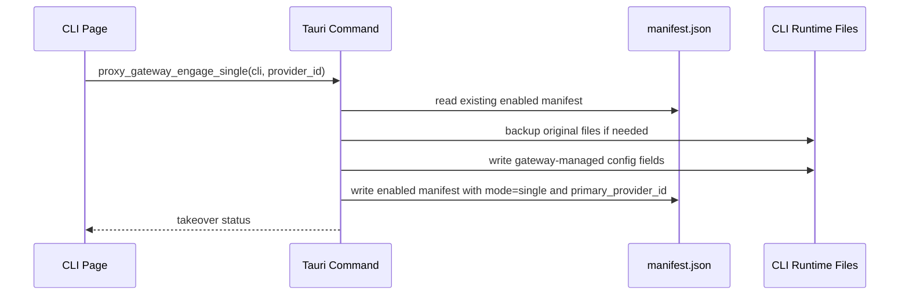
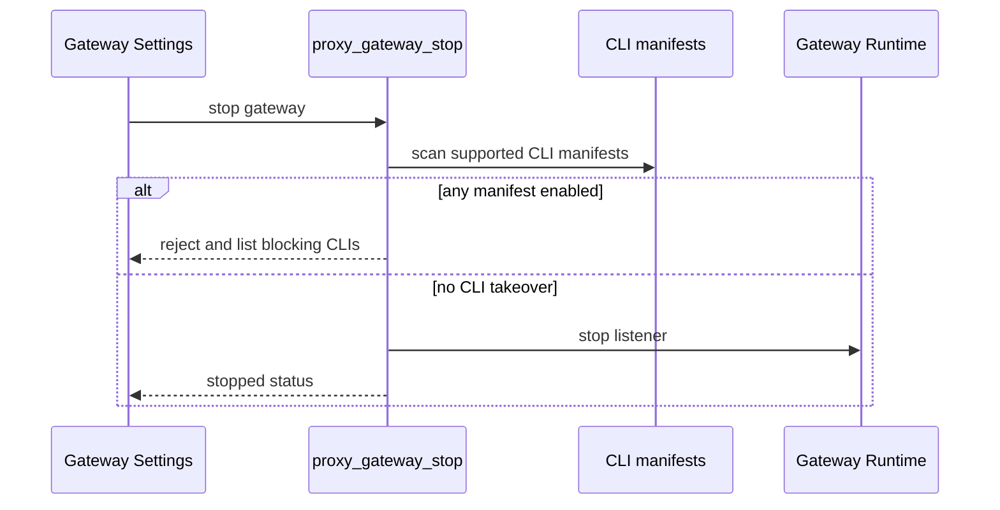

# Proxy Gateway Module Notes

## 一句话职责

- 提供本机代理网关运行态、CLI 接管状态、配置备份恢复、请求详情文件、数据库请求摘要/统计和模型级健康状态。

## Source of Truth

- 全局网关设置来自 AI Toolbox 主数据库的 `proxy_gateway_settings`；必须直接读写 SQLite JSONB，旧 SurrealDB 仅用于启动时一次性导入。CLI 接管状态不进数据库，以 `proxy-gateway/cli-proxy/<cli>/manifest.json` 为准。
- CLI manifest 只保存接管元数据、目标文件路径、备份相对路径、hash/size、被管理字段、`mode` 和 `primary_provider_id`；不要写 settings_config、API key 明文或上游渠道配置。
- `manifest.mode` 是 single/failover 的事实源。被接管 CLI 的 runtime 配置内容不区分 single 和 failover；网关运行时根据 manifest 选择候选列表形态：single 只返回 P0，failover 把 P0 提到队首后再接其他 provider。
- 被接管 CLI 的真实运行时配置仍在各 CLI 自己的 runtime root：Claude Code `settings.json`、Codex `config.toml`/`auth.json`、Gemini CLI `.env`/`settings.json`。
- 请求列表和统计页的 Source of Truth 是 SQLite 中的 `proxy_request_logs` 请求摘要表和 `usage_daily_rollups` 日聚合表；这些表只保存 provider/model/token/cost/status/latency/时间等摘要字段。
- 请求详情仍然以 `proxy-gateway/request-logs/*.jsonl` 文件为准。`body`、`headers`、`upstream_request_body`、`response_body`、provider attempt 明细和 failover 过程不要写入数据库。数据库里的 `detail_file` / `detail_offset` 只是 JSONL 定位索引，用于 O(1) seek 详情行，不是详情内容存储。
- 当 `metrics_enabled=true` 但 `request_log_enabled=false` 时，详情文件可能不存在；详情命令可以从 SQLite 摘要降级返回 provider/model/token/status/latency 等基础字段，但仍不能把 body/header/attempt 明细写入数据库。
- 模型健康的持久化文件仍是 `proxy-gateway/model-health.json`；网关运行时的 Source of Truth 是启动时加载的内存 `ModelHealthRegistry`，请求路径只读写内存，变更后异步 flush，停止时最终保存。命令读取健康列表时应优先读运行时 registry，再回退文件。
- provider 的网关元数据放在各 CLI provider JSONB `data.meta` 中，不新增物理 provider 表列。`provider_type`、`cost_multiplier`、`pricing_model_source` 会随运行时 provider 读取进入请求摘要和成本计算。
- `data.meta.providerType` 是后续 provider 专属兼容规则的识别键，内置供应商必须来自 `gateway_provider_profiles.json` 选中 endpoint 对应的 profile；自定义供应商不应伪造或保留旧 `providerType`。
- `data.meta.apiFormat` 是上游真实目标协议，内置供应商必须来自 `gateway_provider_profiles.json` 选中 endpoint；自定义供应商才允许用户手动选择。
- 每 CLI 的默认计费配置存放在 `ProxyGatewaySettings.app_configs` 中，只在 provider 记录没有显式 `data.meta.cost_multiplier` / `data.meta.pricing_model_source` 时作为缺省值；不要把默认配置误实现成覆盖所有 provider 的强制全局倍率。
- `model_pricing` 是独立 SQLite 物理表，不是 JSONB helper 表。模型定价 CRUD 必须直接查询/写入这张表，并继续使用字符串形式保存每百万 token 成本。官方默认价来自 bundled/cache/remote `model_pricing.json`，只允许 `INSERT OR IGNORE` 增量补齐，不能覆盖已有行。
- `ProxyGatewaySettings.enabled_on_startup` 表示上次应用退出前的网关运行态，不是用户可见的独立开关。启动成功后置 `true`，用户手动停止成功前置 `false`，应用启动时按它自动恢复网关。

## 核心设计决策（Why）

- CLI 接管使用文件 manifest，而不是数据库状态，原因是接管必须跟随本机 runtime 文件恢复，即使数据库记录损坏或迁移，仍能根据 manifest 找到备份并回滚。
- `OpenCode` adapter 暂不属于当前 MVP；不要把 `GatewayCliKey::OpenCode` 当成可接管 CLI 开启入口。
- 停止网关前必须做后端硬检查：只要存在 enabled manifest，就拒绝停止，要求先恢复对应 CLI 直连，避免用户 CLI 被留在不可用的本机网关地址上。
- 重新接管时必须复用已有 manifest 的原始备份，不要把已经被网关改写过的文件再次备份成“原始状态”。

## 关键流程

## 易错点与历史坑（Gotchas）

- 不要用 `enabled_cli_keys` 表示“当前已接管”。它只是旧设置兼容字段；实际接管状态看 manifest。
- 不要把 UI 的停止前检查当成安全边界。全局停止保护必须在 `proxy_gateway_stop` 后端命令里执行。
- 接管状态必须先读取 enabled manifest，再处理 provider 候选加载错误。只要 manifest 表示 CLI 已被接管，即使 provider 表损坏、API key 缺失或 settings_config 解析失败，也必须保留恢复直连入口并阻止停止网关。
- 不要让保存设置时的隐藏字段把运行态恢复标记清掉。网关运行中保存设置时应保留 `enabled_on_startup=true`。
- 网关运行中保存日志/metrics 设置时必须同步更新运行态共享 settings，不能只写数据库；否则关闭 body/header 日志后重启前仍会继续落盘敏感内容。
- 控制台调试日志不等同于文件请求日志。文件请求日志必须按设置处理 headers/body 的脱敏、体积上限和保留策略；`/health` 这类健康检查不记录请求日志和 metrics。
- 网关请求路径不要向控制台打印 request/response debug 日志；请求排障需要走受设置控制的 JSONL 请求详情和 SQLite 摘要，不要重新引入 `println!`/`eprintln!` 级别的请求体、header 或上游响应输出。
- CLI 接管入口的根路径探测也属于本地探测，不是真实模型请求：Claude `GET/HEAD /anthropic`、Codex `GET/HEAD /openai/v1`、Gemini `GET/HEAD /gemini/v1beta` 必须本地响应，不能进入上游 provider failover、SQLite 请求摘要、JSONL 请求详情或模型健康计分。无模型探测污染健康状态会导致后续真实请求被错误冷却。
- 请求摘要/统计可以写数据库，但必须保持 compact：不要把 body/header/attempt/response 这类大字段或敏感详情写进 SQLite。详情展示需要继续按 trace id 读取 JSONL 文件。
- `cost_multiplier` 和 `pricing_model_source` 都是成本计算必需的 compact 摘要字段。新增或调整 provider 计费语义时，必须同时保证运行时 response、`proxy_request_logs` 落库和 SQLite summary fallback 详情都保留这两个字段，不能只保存倍率而丢掉按请求模型/返回模型计费的选择。
- 入站 HTTP 读取必须保留 header/body 大小上限，不能按 `Content-Length` 无限读入内存；流式响应 usage collector 也必须保持 bounded buffer，不能用全量事件列表累计长会话。
- `proxy_request_logs` 要保持与 cc-switch 核心 usage schema 兼容：不要让列表/统计查询依赖 `route_name`、`path`、body byte count 或其他 AI Toolbox 额外列；这些展示信息只能从详情文件或已有核心列推导。
- 只要 `request_log_enabled` 或 `metrics_enabled` 任一开启，就要写 compact 请求摘要；否则请求 Tab 列表和统计页会丢当前请求。只有 `request_log_enabled=true` 时才写 JSONL 详情文件。
- 旧 metrics rollup 文件入口已经废弃；`metrics_enabled` 现在表示写入 SQLite compact 请求摘要供统计页使用，不再维护文件 rollup API。
- 请求日志里 `request_body` 表示网关收到的原始请求体，`upstream_request_body` 表示实际发往上游的请求体。两者都受 `store_request_body` 控制；后续新增请求体改写能力时必须同步保存上游快照，否则 UI 无法对比整流前后差异。
- 请求日志里 `upstream_response_body` 表示上游返回给网关、尚未转换的原始响应，`response_body` 表示网关最终返回给客户端的响应。两者都受 `store_response_body` 控制；非流式响应可以在转换前保留原始 body，流式响应只能保存 bounded snapshot，不能为了日志 full-buffer SSE。
- SSE/流式响应必须边读边写回客户端，不能为了日志、统计或 token 解析先 `bytes().await` 全量缓冲；统计采集只能在透传过程中维护 bounded snapshot 和 usage collector。
- 网关运行态必须保持 tokio async 链路：监听使用 `tokio::net::TcpListener`，连接处理使用 `tokio::spawn`，HTTP 读写和流式 body 写回都 `.await`。不要在请求路径里重新引入 `std::thread + block_on` 或 thread-per-connection。
- 流式 failover 只有在首个非空 chunk 到达后才算当前 provider 成功；首包超时或首包前断流要视为可重试失败。写回客户端时每个 chunk 读取都必须套 idle timeout，避免上游半开连接永久挂住。
- Header 大小写保真不能依赖 `reqwest::HeaderMap`，`HeaderName::from_bytes` 会规范化名称。需要保留原始大小写时走 `runtime/header_preserving_client.rs` 的原始 HTTP/1.1 写出路径；系统代理和 SOCKS 代理场景继续回退现有 reqwest 路径以尊重用户代理设置。
- `proxy_request_logs.latency_ms` 表示首 token/首 chunk 延迟；非流式或拿不到首包时间时才退回完整请求耗时。`duration_ms` 才表示完整请求耗时。
- 成本统计以 `model_pricing` 表和 `proxy_request_logs` 的 token 摘要计算，内部计算使用 `Decimal`，写库仍存字符串/数值文本格式。未知模型或未命中定价时 cost 可以为 0，但不能在写入路径把所有 cost 列固定写成 0。
- 更新模型定价只改变后续成本计算的价格来源；除非任务明确要求历史回填，不要在定价 CRUD 中重算 `proxy_request_logs` 或 `usage_daily_rollups`，避免把管理弹窗变成高成本数据迁移入口。
- 官方模型定价同步的核心保护是 `INSERT OR IGNORE`：用户编辑过的同 model_id 价格、迁移期已存在价格、以及手动新增价格都不能被 bundled 或 remote 默认值覆盖。用户删除某个默认模型价后，下一次启动或手动同步会按默认数据重新插入缺失行。
- 请求摘要中的 `input_tokens` 语义是“非缓存输入 token”，`cache_read_tokens` / `cache_creation_tokens` 单独记录缓存 token；`total_tokens` 和成本计算按这些分量相加/分别计价。OpenAI/Gemini 这类上游返回的 prompt/input 总数若包含 cached tokens，解析层要先拆分，成本层不能再二次扣减 cache。
- `usage_daily_rollups` 聚合/裁剪不能放在每个请求的热路径里高频执行；如果需要触发，必须有节流或后台任务。
- 模型健康快照只持久化非健康状态。失败进入 degraded/cooling/probing 后写快照；恢复 healthy 后移除对应条目，避免后续成功请求继续重复写快照。
- 模型健康列表里的 provider id 只是稳定键，返回前应尽量从 Claude/Codex/Gemini provider 表注入 `provider_name`，避免前端展示数据库原始 ID。
- 模型健康过滤只在故障转移模式生效。单渠道代理只有一个 provider 候选时，即使模型健康处于 cooling/down 或 degraded，也必须始终尝试转发，避免单渠道被冷却后直接 502。
- 恢复直连时只恢复本模块管理的配置字段，尽量保留 CLI runtime 自己新增的未知字段和 OAuth/token 等运行时拥有字段。
- 配置写入要继续使用各 CLI 的 runtime location 解析结果，不要硬编码 `~/.claude`、`~/.codex` 或 `~/.gemini`。
- WSL Direct 接管地址替换只在 runtime location 的 `mode == RuntimeLocationMode::WslDirect` 且 `ProxyGatewaySettings.wsl_host` 非空时生效：写入 CLI runtime 配置和 manifest 前，把运行中网关的 `http://host:port` origin 中的 host 替换为 `wsl_host`，端口和 scheme 保持不变；drift 检测必须使用同一套有效 origin 计算。
- 普通 Windows->WSL 同步不是 WSL Direct 接管。开启/切换/恢复 Gateway 接管成功后只发 `wsl-sync-request-*` 事件，让 WSL 模块按用户设置决定是否同步；WSL 目标副本的地址改写必须走 `cli_proxy` 的 manifest + sentinel + managed fields 校验，只改 Gateway 托管字段，不能全局替换 loopback，也不能污染 Windows runtime 文件。
- Claude/Codex/Gemini 的 `category=official` provider 代表 CLI 原生 OAuth 官方订阅，只能由 CLI 自己直连使用，不存储可转发 API key；网关 provider 候选列表和 CLI 接管前置校验必须跳过这类 provider。接管状态/卡片 UI 可提示“官方订阅不参与代理”，但不要把它当成可代理渠道。
- Codex 接管要遵守全局 `codex_preserve_official_auth_on_switch`：关闭时保持旧行为，把 Gateway client token 写入 `auth.json` 的 `OPENAI_API_KEY`/`auth_mode=apikey`；开启时在 `config.toml` 的 `model_providers.ai-toolbox-gateway.experimental_bearer_token` 写入 Gateway client token，并按 manifest 原始备份恢复/清理之前 Gateway 写入 `auth.json` 的受管字段，避免旧关闭状态残留导致官方 OAuth 登录态继续被 `apikey` 模式遮蔽。关闭开关重新接管时要清掉这个 provider-scoped token，避免旧开启状态残留。
- single 模式下候选列表只有 P0，P0 请求失败不切换其他渠道；如果配置了同渠道重试，会先按 retry interval 重试 P0，耗尽后再把上游失败返回给客户端。
- single/failover 模式只要 manifest 仍是 enabled，普通 provider apply/select 入口就必须拒绝硬切换。原因不是 manifest 保存了渠道完整配置，而是接管期间 manifest、CLI runtime 文件、原始备份和 P0 provider 必须保持同一个状态机：manifest 记录 `primary_provider_id`、被管理文件、备份路径和 managed fields，Gateway runtime 也按它决定 single/failover 候选。如果绕过恢复直连直接切换 provider，普通 apply 会重写 runtime 文件，破坏 Gateway 托管字段和备份恢复语义；随后恢复直连仍会按接管时的备份回滚，可能覆盖代理期间改动或让 P0 与实际 runtime 状态不一致。允许切换 P0 时必须走专用 Gateway-aware 编排入口，并且页面 provider 卡片和系统托盘 provider 菜单必须复用同一条后端链路：先恢复直连，再应用目标 provider，再重新开启 single；如果原状态是 failover，还必须在 single 接管成功后重新开启 failover。编排内部应用目标 provider 时不要触发中间 `config-changed` 或 WSL 同步，只在重新接管完成后发一次最终 `config-changed`（托盘入口保持 `tray` payload）和最终同步事件，避免窗口/远端短暂刷新到直连中间态。failover 模式下 P0 固定为 manifest 的 `primary_provider_id`。
- 网关接管期间必须禁止编辑“正在被代理的已应用渠道”（前端条件 `isApplied && gatewayProxyActive`），编辑入口要提示 `gateway.proxy.editLockedTooltip` 让用户先恢复直连。通用配置保存、配置根目录保存/恢复默认也必须在前端保存入口拦截，提示先恢复直连；原因是 common config 保存会 auto-apply 当前已应用 provider 到 runtime 配置，风险与编辑已应用 provider 一致。编辑已应用 provider 会触发各 CLI `update_*_provider` 的 auto-apply 回写 runtime 配置，破坏网关托管字段；随后恢复直连又只从接管时的 `.bak` 备份恢复受管字段，导致用户在代理期间改的模型设置被静默覆盖回接管前的旧值。未应用渠道（包括 failover 的 PN 候选）编辑只更新 DB，不写 runtime 文件，安全，必须保持可编辑，不要按 CLI 级 `gatewayProxyActive` 一刀切禁用整列。
- PN family 兜底继续沿用运行时模型映射规则：PN.haikuModel/sonnetModel/opusModel/reasoningModel 未配置时先用 PN.model，PN.model 也没有时才用请求里的标准模型名。
- Claude family 模型映射由 manifest mode 决定：`single` 模式必须保持请求里的原始模型名直透，仅剥离 `[1M]` / `[1m]` 上下文标记；`failover` 模式必须继续按 provider family 映射转发，即使当前有效候选只剩 P0 一个 provider。
- Provider `data.meta.apiFormat` 表示上游真实目标协议，不表示入站 CLI 协议，也不要写进 CLI runtime 配置文件。Gateway runtime 先从 route 推导入站 `AiProtocol`，再与 provider 的 target protocol 组成 `ConversionRoute`；只有 source/target 不一致时才调用 `transformer`，一致时保持原有直通行为。
- Provider body 兼容规则属于 Gateway runtime outbound adapter 层，应基于 `providerType + apiFormat` 做窄范围处理。不要把 DeepSeek/Moonshot/Zai/Doubao/Grok/Longcat/ModelScope/Bailian 等供应商专属限制下沉到通用 `transformer` 协议转换语义里。
- Claude/Codex 的 provider target protocol 与 CLI 原生协议不一致时，不能走普通直连 apply。页面按钮应显示“应用并代理”，托盘菜单在网关未运行或不可接管时要置灰，后端普通 apply 也必须拒绝；可用时统一走 Gateway-aware provider switch 编排，先内部应用 provider，再开启 single 代理。
- 协议格式相同时必须走既有直通链路，而不是把请求/响应送进统一转换器再“转换回同格式”。这是 Gateway 调度原则，不是转换器 fallback：同格式场景只能做 runtime 既有的 path/header/auth、模型名改写、`[1M]` 剥离等处理，不能重写协议结构。
- 协议格式转换必须集中在 `transformer` 独立模块中。该模块不能依赖数据库、Tauri app handle、provider 表或 Gateway runtime context；新增 Gemini Native 等后续格式时继续扩展 `AiProtocol` / `ConversionRoute` / JSON/SSE 转换边界，不要把转换 helper 散落到 `runtime/upstream.rs`。
- 协议转换后的请求体必须作为 `DebugHttpResponse.upstream_request_body` 保存，原始入站体仍由请求日志的 `request_body` 表示。直通路径可以保留当前模型改写/1M 标记剥离行为，但不能出现协议结构重写。
- 协议转换后的最终上游 body 可以在 `runtime/upstream.rs` 做窄范围 outbound adapter 兼容，职责是规避具体上游 provider 的严格校验，不是补充协议结构转换。当前规则：所有 JSON outbound body 最后递归过滤 `_` 开头的内部私有字段，但必须保留 JSON Schema `properties` / `patternProperties` / `definitions` / `$defs` 下的属性名；OpenAI Chat/Responses 或 Anthropic Messages target 在转换后没有非空 `tools` 时，清理 OpenAI 的 `tool_choice`/`parallel_tool_calls` 或 Anthropic 的 `tool_choice`；Gemini Native source 的 `toolConfig.functionCallingConfig` 可独立表达 tool choice，不能用这条规则清掉 Gemini-derived `tool_choice`。转换到 OpenAI Chat target 时，还要清理 Responses/Codex 专属扩展：移除 `responses_custom_tool` 工具和对应 custom tool call/result 历史，去掉第三方 Chat 兼容接口常见不支持的 `verbosity`、`reasoning_effort`、`prompt_cache_key`，并把纯文本 system content parts 压成字符串；这些清理只属于 provider 兼容层，不要下沉到 transformer roundtrip 语义。
- 图片/多模态兼容只做上游错误后的反应式同 provider 重试：当 400/415/422/501 响应明确表示 image/media/attachment/vision 等内容不支持时，runtime 才把最终上游 body 里的图片块替换为 `[Unsupported Image]` 文本并重试一次；不要根据模型名或 provider 声明提前预测式删除图片。替换时要保留原图片块的 `cache_control`，Gemini `inlineData`/`fileData` 只有 `mimeType` 明确为 `image/*` 才替换。
- SSE 协议转换必须用 stream wrapper 边读边转换，不能 full-buffer。结束事件要保持幂等：OpenAI `[DONE]`、Responses `response.completed`、Anthropic `message_stop` 或 Chat `finish_reason` 可能重复/组合出现，转换器只能向客户端输出一组完成事件。
- 上游鉴权和必需 header 必须按 target protocol 判断，而不是按入站 CLI 判断。例如 Codex route 选择 `anthropic_messages` target 时要使用 Anthropic API key 语义和 `anthropic-version`；Claude route 选择 OpenAI Chat/Responses target 时要使用 Bearer 语义。
- `GeminiNative` 已支持与 `AnthropicMessages` 双向转换：Claude/Anthropic 请求可转 Gemini `generateContent`/`streamGenerateContent?alt=sse`，Gemini 入站请求也可转 Claude/Anthropic Messages。Gemini 与 OpenAI Chat/Responses 的路由仍未实现，必须返回明确 unsupported conversion，不能退化成错误协议的直通。
- 旧 manifest 缺少 `mode` 或 `primary_provider_id` 时必须反序列化失败并提示用户重新执行“网关代理”；不要给这两个字段加 serde default 静默兼容。
- Claude 请求的 thinking rectifier 默认开启，但它是上游 4xx 后的反应式同渠道重试，不是正常发送前清理。开启 `thinking_rectifier_enabled` 时，Claude 入站非流式请求如果收到 thinking/signature 兼容类 HTTP 4xx，runtime 才对原请求重建一次上游 body，移除顶层 `thinking` 参数、顶层 `messages[].content[]` 中的 `thinking` / `redacted_thinking` 块和内容块直接携带的 `signature` 字段，然后同 provider 重试一次。正常模型映射或协议转换不得主动删除 `thinking` 或 `output_config.effort`，否则会破坏 Anthropic `output_config.effort` 到 OpenAI reasoning effort 的映射。不要递归扫描 metadata、tool input 或其他业务 payload 里的 `messages`/`signature`，否则会静默改写用户数据。
- `cache_injection_enabled` 和 `thinking_budget_rectifier_enabled` 必须按最终 `provider.target_protocol == AiProtocol::AnthropicMessages` 判断，而不是按入站 `route.cli_key == Claude` 判断。runtime 应先完成模型改写和必要的请求协议转换，再对最终 Anthropic body 注入 cache_control；budget 修正只针对目标 Anthropic、非流式、HTTP 4xx 的上游响应。
- `[1M]` / `[1m]` 只是客户端上下文能力标记，不是上游模型 ID 的一部分。Gateway 转发前必须从请求模型、provider 映射结果和 Gemini Native URL 的 `models/<model>` 段中剥离该后缀；仅剥离 1M 标记不算“模型重映射”，不能因此触发 Claude thinking rectifier 清理 thinking 块。
- Provider 排序语义要与前端一致：`sort_index = None` 按 `0` 处理，而不是排到最后。
- Gateway 辅助说明文字统一使用 `fontSize: 10` 和 `color: var(--color-text-tertiary)`，不要在设置页临时放大或改成主文本颜色。

## 跨模块依赖

- 依赖 `coding::runtime_location` 解析 Claude Code、Codex、Gemini CLI 的 runtime root；`RuntimeLocationMode::WslDirect` 还决定 CLI 接管时是否用 `ProxyGatewaySettings.wsl_host` 替换网关 origin 的 host。
- 前端 single 入口在已应用 provider 卡片上的“网关代理”按钮；常规恢复直连也在对应 provider 卡片上；provider 列表标题后的 `GatewayFailoverButton` 主要负责 single/failover 切换，但弹窗内必须保留 `status.can_restore_direct` 兜底恢复入口，避免 provider 被删除、解析失败或列表为空时无法解除接管。`GatewayPage` 顶部负责全局启动/停止、健康检查和刷新，设置面板只自动保存配置并展示网关地址/接管状态。
- 官方模型定价更新链路依赖 `tauri/resources/model_pricing.json`、app data 下的 `model_pricing.json` 缓存、以及远端 GitHub raw JSON。前端启动后台同步和定价弹窗手动同步都应调用同一后端命令，由后端校验 JSON、写缓存并 `INSERT OR IGNORE` 入 SQLite。
- 真实请求代理依赖 provider 表、模型健康、请求日志和 SQLite 使用摘要共同维护“按模型熔断、按供应商顺序路由”的契约：provider 列表从上到下就是网关优先级，后端只按 `sort_index` 和名称排序，不再把已应用 provider 提前；模型健康处于 cooling down 时跳过对应 provider/model。
- 运行时可以缓存 provider 候选列表，避免每个请求全量读 DB；缓存只能作为热路径优化，不能改变 provider 表的排序/禁用/模型映射语义。provider 增删改、排序和导入链路必须继续触发全局 `config-changed`，由监听器主动清空 Gateway provider 缓存；TTL 只是兜底，失效后必须重新从 SQLite 读取。
- Claude Code 进入故障转移模式时，运行时配置只写标准模型字段 `ANTHROPIC_MODEL`、`ANTHROPIC_DEFAULT_HAIKU_MODEL`、`ANTHROPIC_DEFAULT_SONNET_MODEL`、`ANTHROPIC_DEFAULT_OPUS_MODEL`，不写入 `ANTHROPIC_REASONING_MODEL`。同时写入 `ANTHROPIC_DEFAULT_HAIKU_MODEL_NAME`、`ANTHROPIC_DEFAULT_SONNET_MODEL_NAME`、`ANTHROPIC_DEFAULT_OPUS_MODEL_NAME` 用于 Claude Code UI 显示真实 provider 模型名；退出故障转移回 single 时，从原始备份精确恢复这 7 个模型字段，原始文件不存在时删除这些 failover-only 字段。恢复直连还要兼容旧版本已写入的 `ANTHROPIC_REASONING_MODEL`：备份里有则恢复，备份里没有则删除。
- 上游失败后的重试策略是“同一 provider 最多重试 `per_provider_retry_count` 次，每次同渠道重试前等待 `retry_interval_secs` 秒，然后切下一个 provider（如果存在）”；跨 provider 故障转移不等待 retry interval。`max_retry_count` 是单个请求跨 provider 的额外重试总上限。请求日志里 `attempt_count` 表示最终 provider 内尝试次数，`total_attempt_count` 表示整个请求累计尝试次数。`retry_interval_secs=0` 表示保持立即重试。
- 上游 HTTP 400 在网关里按 `upstream_bad_request` 处理并允许切换到下一个 provider；它的健康分较低，目的是处理 provider schema 差异，不要把它恢复成不可重试的 RequestSchema。
- Session Usage 导入写入同一张 `proxy_request_logs`，`data_source='session'`。Claude 优先用 `SESSION:<message_id>` 做 request_id 幂等去重；其他 CLI 用文件/行内容派生的稳定 ID，并通过 `INSERT OR IGNORE` 保持可重复导入。
- 代理请求摘要和 Session Usage 导入成功写入 `proxy_request_logs` 后应发出 `usage-log-recorded` 事件，供前端静默刷新统计和请求列表。该事件只是“有新 usage 落库”的通知，不是统计数据源，也不要用它承载费用重算或历史 rollup 语义。
- 模型定价匹配需要先做 ID 归一化再查表：剥离聚合商命名空间、`[1M]` 上下文标记、Bedrock/Vertex `-vN` 版本、日期/effort 后缀，并把 Claude 点号版本归一成短横线版本。前缀匹配只能用于明确的模型族和足够具体的 ID，避免 `gpt-5` 这类短 base 误命中 `gpt-5-mini`/`gpt-5-pro` 变体。
- 每个 CLI 可以通过 `ProxyGatewaySettings.app_configs` 覆盖首包超时、流式 idle timeout、非流式 timeout、单 provider 重试、全局重试和重试间隔；运行时必须用 `effective_app_config(cli_key)` 读取，不能只看全局字段。
- `runtime.rs` 只承载生命周期、async listener accept 和主流程编排。HTTP 读写放 `runtime/http_io.rs`，路由匹配和 URL 拼接放 `runtime/routes.rs`，provider 读取/解析放 `runtime/providers.rs`，上游转发和 failover 放 `runtime/upstream.rs`，请求日志/metrics 采集放 `runtime/observability.rs`。后续新增能力优先放入对应职责文件，不要重新堆回 `runtime.rs`。
- 统计页数据源拆分 (`DataSourceBreakdown`) 来自 `proxy_request_logs.data_source`，空值归并为 `proxy`，Session Usage 导入当前统一写 `session`；它只反映已落库的请求摘要分布，不要当成网关健康指标。

## 最小验证

- 修改 CLI 接管/恢复逻辑后至少跑 `cd tauri && cargo test`，并覆盖三类 CLI 文件写入、恢复、重新接管不覆盖原始备份、停止保护。
- 修改请求转发、请求日志、SQLite 使用摘要或模型健康后至少跑 `cd tauri && cargo test`，并覆盖本地文件 round trip、fallback 路由和失败健康状态更新。
- 修改前端接管入口或设置页状态后至少跑 `pnpm exec tsc --noEmit`、`pnpm test`；触及共享 UI、i18n 或构建入口时补跑 `pnpm build`。
