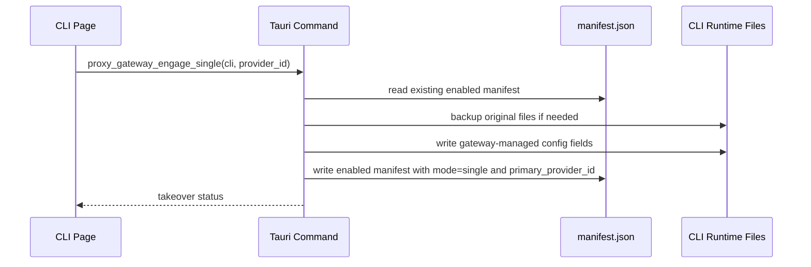
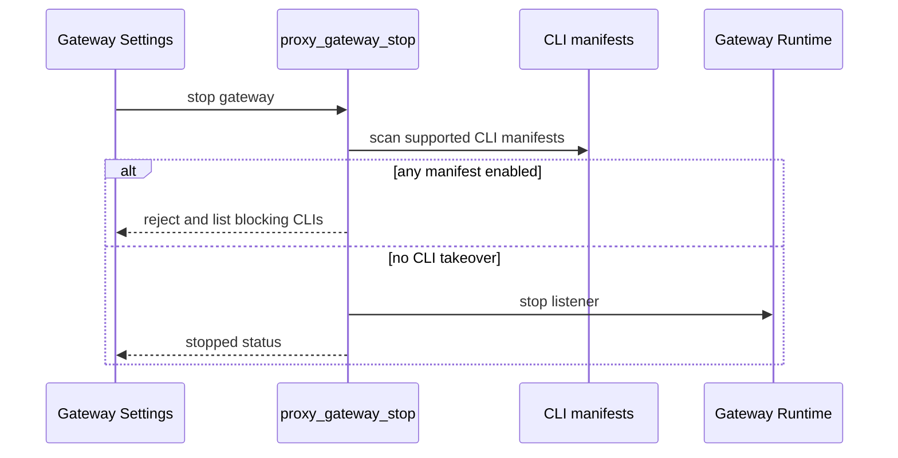

# Proxy Gateway Module Notes

## 一句话职责

- 提供本机代理网关运行态、CLI 接管状态、配置备份恢复、请求详情文件、数据库请求摘要/统计和模型级健康状态。

## 协议转换长期维护入口

- 修改 Gateway 协议转换、provider target protocol、协议直通/转换判定、SSE/响应分类、runtime pipeline、side store 或相关 fixture 前，必须先阅读架构主文档 [`docs/gateway-protocol-conversion.md`](../../../../docs/gateway-protocol-conversion.md)，再核对本模块规则、当前源码和测试。
- 修改 provider profile、target protocol、body/header/path/auth、stream filter、rectifier、同协议直通兼容、Codex Chat reasoning、图片/多模态策略、prompt cache、default max tokens、xAI native Responses 或其它 provider/channel wire 兼容时，还必须阅读细节文档 [`docs/gateway-provider-compatibility.md`](../../../../docs/gateway-provider-compatibility.md)。
- 代码或测试修改完成后，必须在同一任务内按职责更新对应文档，并重新对照当前源码、测试以及两个参考项目。文档与源码/测试冲突时，以源码和测试为最终事实源；跨架构和渠道边界的改动要同时更新两份文档。
- 参考项目只使用相对兄弟路径 `../cc-switch` 和 `../axonhub`。目录不存在时按文档远端地址和目标分支 clone 到同级目录；目录存在时先检查并保留用户工作树改动。允许用 `git fetch` 更新 remote-tracking ref，但只有工作树干净且当前 checkout 分支就是文档目标分支时才能 fast-forward；其它情况直接分析 fetch 后的 remote-tracking ref。同步只能从文档记录的 baseline commit 之后开始分析，完成后必须记录新 commit、增量范围、吸收结论和回归测试。
- 同协议请求保持 runtime 直通语义，只补 provider/channel wire 兼容；跨协议请求由 `transformer/` 负责结构转换，runtime 负责路由、URL/header/auth、provider adapter、failover 和跨请求状态。不要把参考项目的数据库、云网关账号、executor/session/pool 或 provider 识别启发式逐行移植进本模块。
- 工具结果媒体的共享不变量是：只有确认识别出图片时才改写 tool result；无媒体必须继续旧转换路径。Chat 将媒体移到同一工具结果批次后的 synthetic user turn，Responses 输出 `input_image`，Anthropic 输出原生 `image` block，Gemini 2.x 使用 `functionResponse` 后的兼容 parts、Gemini 3 使用 `functionResponse.parts`。当前 IR 只承载图片/文档，不把 cc-switch 的 file/audio tool media 扩展误写成已支持能力。

## Source of Truth

- 全局网关设置来自 AI Toolbox 主数据库的 `proxy_gateway_settings`；必须直接读写 SQLite JSONB，旧 SurrealDB 仅用于启动时一次性导入。CLI 接管状态不进数据库，以 `proxy-gateway/cli-proxy/<cli>/manifest.json` 为准。
- CLI manifest 只保存接管元数据、目标文件路径、备份相对路径、hash/size、被管理字段、`mode` 和 `primary_provider_id`；不要写 settings_config、API key 明文或上游渠道配置。
- `manifest.mode` 是 single/failover 的事实源。被接管 CLI 的 runtime 配置内容不区分 single 和 failover；网关运行时根据 manifest 选择候选列表形态：single 只返回 P0，failover 把 P0 提到队首后再接其他 provider。
- 被接管 CLI 的真实运行时配置仍在各 CLI 自己的 runtime root：Claude Code `settings.json`、Codex `config.toml`/`auth.json`、Grok CLI `config.toml`/`auth.json`、Kimi CLI `config.toml`、Gemini CLI `.env`/`settings.json`。
- 请求列表和统计页的 Source of Truth 是 SQLite 中的 `proxy_request_logs` 请求摘要表和 `usage_daily_rollups` 日聚合表；这些表只保存 provider/model/token/cost/status/latency/时间，以及脱敏后的 `route_name` / `method` / `path` 等列表展示摘要字段。
- 统计指标按分组维度（provider/model）共用同一套聚合语义：成功率与缓存命中率对 `provider_stats` 和 `model_stats` 都可用。模型维度的成功率只统计 `data_source='proxy'` 的行（分母同为 proxy 行）；session 行的 `status_code` 是占位 200、没有 HTTP 语义，绝不能计入成功样本——rollup 合并路径没有 `data_source` 列，用 `provider_id != 'session'` 守卫达到同一效果。缓存命中率则包含 session 行的真实缓存 token。纯 session 模型组成功率为 `None`，前端显示 `-`，不要把占位 200 聚合成 100% 成功。
- `ProxyGatewaySettings.session_usage_enabled`（默认 `true`）控制“未经过网关的本地 session 用量”是否参与统计页、请求列表和导入采集。所有 `proxy_gateway_usage_*` / `proxy_gateway_request_logs` / `proxy_gateway_data_source_breakdown` 命令在入口读取该设置并把 `include_session` 传给 `usage_stats`；导入门控只放在 `session_import::import_session_usage` 函数入口（命令与 `start()` 的 60s 后台调度器共用这一个权威点，不要在调用方各自查设置）。关闭是零计数 no-op 且账本/文件快照冻结：重新开启后第一次同步按 mtime/size 变化重扫文件，关闭期间新增的会话记录会幂等补采回来；唯一丢失场景是关闭期间 CLI 自己清理了 session 文件。
- session 数据的过滤判定分两层：明细表用权威列 `data_source='session'`（proxy 升级覆盖 session 占位行时会重写该列和 `provider_id`）；`usage_daily_rollups` 没有 `data_source` 列，但所有导入的 session 行（含 legacy）都保留保留字 `provider_id='session'`，且 proxy 行永远使用真实 provider id，因此 rollup 侧用 `provider_id <> 'session'` 过滤即可精确分离两个来源，不需要给 rollup 表拆 data_source 维度。开关关闭时用户显式选择“Session”来源筛选得到的是真实空态（过滤优先于筛选）。
- 请求详情仍然以 `proxy-gateway/request-logs/*.jsonl` 文件为准。`body`、`headers`、`upstream_request_body`、`response_body`、provider attempt 明细和 failover 过程不要写入数据库。数据库里的 `detail_file` / `detail_offset` 只是 JSONL 定位索引，用于 O(1) seek 详情行，不是详情内容存储。
- 当 `metrics_enabled=true` 但 `request_log_enabled=false` 时，详情文件可能不存在；详情命令可以从 SQLite 摘要降级返回 provider/model/token/status/latency 等基础字段，但仍不能把 body/header/attempt 明细写入数据库。
- 模型健康的持久化文件仍是 `proxy-gateway/model-health.json`；网关运行时的 Source of Truth 是启动时加载的内存 `ModelHealthRegistry`，请求路径只读写内存，变更后异步 flush，停止时最终保存。命令读取健康列表时应优先读运行时 registry，再回退文件。
- provider 的网关元数据放在各 CLI provider JSONB `data.meta` 中，不新增物理 provider 表列。内置渠道只持久化 `data.meta.gatewayProfile={tool,profileId,endpointId}` 引用和用户覆盖项；运行时读取 provider 时再从当前 `gateway_provider_profiles.json` cache/bundled defaults 动态解析 effective `provider_type`、`api_format`、`api_key_field`、`reasoning_field`、`codex_chat_reasoning`、图片策略和 `default_max_tokens`。`gatewayProfile` 的 profile/tool/endpoint ID 是持久化公共 ID：新 catalog 必须保留上一份有效 catalog 的既有 ID，breaking rename 必须先提供 alias 或 migration；不兼容 remote/cache 不能激活，不能让 reference-only provider 静默退化为 `category=custom`。`provider_type`、`cost_multiplier`、`pricing_model_source` 会随运行时 provider 读取进入请求摘要和成本计算。
- effective `providerType` 是后续 provider 专属兼容规则的识别键。内置供应商必须来自 `gatewayProfile` 指向的 profile；legacy provider 可以继续使用已保存的显式 `data.meta.providerType`，但自定义供应商不应靠模型名或 Base URL 伪造供应商身份。
- effective `apiFormat` 是上游真实目标协议。内置供应商必须来自 `gatewayProfile` 指向的 endpoint；普通自定义供应商才允许用户手动选择并保存 `data.meta.apiFormat`。
- `gateway_provider_profiles.json` 的 `compat` 字段只是 catalog 描述，不是生产执行开关。`provider_profiles.rs` 的 `CompatRuleRegistration` 必须把每个 tag 静态绑定到 runtime owner 和精确测试，注册表测试还要确认名称唯一且源码符号存在。新增 compat 名称时必须同时补 runtime body/stream/header adapter、回归测试、注册和文档；不要只在 JSON 里声明能力，也不要让 runtime 动态解释 tag。
- 上游 provider `base_url` 以 `##` 结尾表示 AxonHub 风格 RawURL：runtime 读取 provider 时必须剥离 `##` 并把 provider 标记为 full URL，转发时只合并 query，不再追加 `/v1/chat/completions`、`/v1/messages`、`/v1/responses` 或 Gemini 默认路径。显式 `data.meta.is_full_url` / `isFullUrl` 仍然保留为等价配置。
- 每 CLI 的默认计费配置存放在 `ProxyGatewaySettings.app_configs` 中，只在 provider 记录没有显式 `data.meta.cost_multiplier` / `data.meta.pricing_model_source` 时作为缺省值；不要把默认配置误实现成覆盖所有 provider 的强制全局倍率。
- provider 级自定义请求头覆盖存放在 `data.meta.customHeaders`（snake/camel 双兼容，`CustomHeaderOverride` 数组，每项 `{ op, name, value, from, to }`，op 取 set/delete/rename/copy，`parse_header_override_value` 校验，非法值静默跳过）。`build_upstream_headers` 在 inject 链最末尾调用 `inject_custom_headers` 逐项应用并覆盖客户端转发的请求头；Copilot provider 对落入 `COPILOT_MANAGED_HEADERS` 的名字整条避让（指纹 UA 由 `inject_copilot_headers` 独占，不可覆盖）；连通性测试走同一注入路径自动继承。旧 `customUserAgent` 字符串字段已下线，读取侧在 `provider_meta_from_record` 做只读回退（合成一行 `set User-Agent`），写入只落 `customHeaders`。细节见 `docs/gateway-provider-compatibility.md` 第 7 章。
- `model_pricing` 是独立 SQLite 物理表，不是 JSONB helper 表。模型定价 CRUD 必须直接查询/写入这张表，并继续使用字符串形式保存每百万 token 成本。官方默认价来自 bundled/cache/remote `model_pricing.json`，只允许 `INSERT OR IGNORE` 增量补齐，不能覆盖已有行。
- `ProxyGatewaySettings.enabled_on_startup` 表示上次应用退出前的网关运行态，不是用户可见的独立开关。启动成功后置 `true`，用户手动停止成功前置 `false`，应用启动时按它自动恢复网关。
- 网关“重启”是独立于“停止”的热重启命令：不做 CLI 接管 preflight、不改 manifest、尽量保持当前 host/port，并重建 runtime（清空 provider cache / side stores，重置模型健康冷却并写回 `model-health.json`）。请求历史与统计不删。
- 重启 bind 只临时关闭 `port_auto_select`，不要把用户设置永久写成 `false`；同端口释放有短重试。若重启在 stop 之后 start 失败，必须明确返回“网关已停止”错误，并提示重新启动或先恢复 CLI 直连；命令层无论成功失败都要按最终 running 状态 emit `gateway-running-changed`，避免中途失败后其它 UI 仍以为网关在跑。

## 核心设计决策（Why）

- Codex WebSocket 只在 runtime 做 Responses 同协议转发（架构文档 §16.1、兼容文档 §7.1）。必须先校验实际上游的有效 `101`，再升级下游；转换、动态协议或显式关闭 WS 的渠道在升级前 `426`。接管表的 `supports_websockets=true` 描述本机能力，上游判断仍读数据库 provider 的原始配置，恢复直连要恢复原值。
- 网关 `codex_websocket_enabled` 默认关闭，旧 settings 缺字段也关闭；这是独立于 provider capability 的运行态门控，不修改接管文件。关闭时在 provider 加载前 `426`，上游握手完成后、下游升级前再次检查。已有连接只在 pending 全部结算后关闭，空闲读被新帧唤醒时也要检查；不能中断在途 usage、额外记录模型失败或让空闲连接继续生成。开启后 Codex 已回退的旧会话需新建/重启才能重试，不能承诺自动恢复 WS。回归见 `runtime/websocket/settings_tests.rs` 与 `settings.rs`。
- 一条 WS 固定一个 provider/认证身份；`previous_response_id` 是连接内状态，禁止在已升级连接里静默 failover 或重放生成。握手可复用原 retry 预算，但不能把握手尝试记成每轮生成重试；握手阶段没有实际模型，只看 provider 冷却。
- WS 用量和请求详情按每个 `response.create` 结算，并按 `stream_id` / response ID 关联；终态送达后立刻落库，不等连接关闭。usage 解析先于下游写入，成功判定晚于写入；日志关闭/截断不能改统计，客户端写失败仍保留已经收到的 usage。
- WS 客户端事件快照必须在写入成功之后追加，本地请求校验产生的 error event 也遵守这条规则。没有 lane/response 归属的连接级 error 要附到每个受影响 pending 轮次，保留原始事件、已送达事件、错误码和原因；不能只写一条通用断线说明而丢失真实上游错误。
- 握手、Ping/Pong 和预热不计调用数/RPM。预热若有真实 usage 仍计 Token/费用；失败筛选、统计、native 去重和 daily rollup 必须同步使用 request kind 与业务终态，不能把 WS 的 HTTP 占位 `0` 解释成失败。连接 IDs、握手尝试及正文只在 JSONL；摘要回退与明细导出都要保留 transport 语义。停止/重启必须关闭已有 WS 并结算 pending 请求，不能只停 listener。

- CLI 接管使用文件 manifest，而不是数据库状态，原因是接管必须跟随本机 runtime 文件恢复，即使数据库记录损坏或迁移，仍能根据 manifest 找到备份并回滚。
- `OpenCode` adapter 暂不属于当前 MVP；不要把 `GatewayCliKey::OpenCode` 当成可接管 CLI 开启入口。
- Kimi CLI 已纳入 Gateway MVP：接管文件是 `<runtime_root>/config.toml`，manifest kind 为 `kimi_config_toml`，受管字段是当前生效 provider 表（`default_model` → `[models.<key>].provider` 解析出的 key，回退 `managed:kimi-code`）的 `type/base_url/api_key`，真实模型请求通过 `/kimi/v1/chat/completions` 入站。网关候选 provider（`runtime/providers.rs` 的 `kimi_selected_provider_entry`）必须镜像同一条解析链选择 `providerConfigs` 条目：`defaultModelKey` → `modelCatalog.models[].provider` → `providerConfigs[key]`，链不完整时才回退首条；盲取首条会让多 provider 记录的候选指向错误 upstream。链不完整且存在多个 `providerConfigs` 条目时候选与 patch 目标（`managed:kimi-code`）分叉，候选加载会打 `log::warn` 便于排障。恢复直连是字段级：按 manifest managed fields 记录的 provider key 清除并按原始备份还原 `type/base_url/api_key`，清空后无残留字段的表删除（含 patch 新建的 `[providers]` 根）；备份缺失时只清受管字段，禁止整文件覆盖回滚接管窗口内的用户改动。
- 停止网关前必须做后端硬检查：只要存在 enabled manifest，就拒绝停止，要求先恢复对应 CLI 直连，避免用户 CLI 被留在不可用的本机网关地址上。
- 重启网关不能走 stop preflight，也不能实现成前端 `stop + start`。有接管时重启必须仍可用，否则网络切换后的半死状态只能靠用户先恢复直连才能自愈。
- 重新接管时必须复用已有 manifest 的原始备份，不要把已经被网关改写过的文件再次备份成“原始状态”。
- engage 路径先写 enabled manifest（保护 `.bak`），再 `apply_gateway_config`。若 apply 中途失败：必须立即按备份 restore runtime 文件，并把 manifest `enabled=false` 写回，不能留下 “manifest enabled 但配置半改写” 的产品态；重试时仍复用首次原始 `.bak`。
- `restore_cli_direct` 成功后必须删除对应 `.bak` 快照。否则“接管→恢复直连→用户改 API key/base URL→再接管→再恢复”会把 managed 字段滚回第一次接管时的旧值。失败重试路径仍可在 `.bak` 存在时复用，两者不矛盾。
- Responses 源工具流：`arguments.done` / `output_item.done` / `finish()` 只能冲刷尚未发出的参数后缀，done 后从 pending map 移除；禁止对 dense 流（delta+done 都发）重发全量 arguments，否则 Chat/Anthropic 目标参数会拼接重复。
- selection manifest 热路径必须用 `load_gateway_provider_selection_async`（`tokio::fs`），不能在请求路径同步 `fs::read_to_string`；30s 缓存只是二次优化。`write_manifest` 与 provider cache clear 都必须调用 `clear_gateway_provider_selection_cache`，覆盖 engage / disengage / restore 全部出口。
- forced-stream 聚合 raw_body 上限必须复用 `upstream_response_snapshot_limit`（来自 `store_response_body` + `log_max_body_size_kb`）；仅当该 limit 未启用时才允许 16 MiB fallback，避免设置页语义与实现漂移。

## 关键流程

```mermaid
sequenceDiagram
  participant UI as CLI Page
  participant Cmd as Tauri Command
  participant Manifest as manifest.json
  participant Runtime as CLI Runtime Files

  UI->>Cmd: proxy_gateway_engage_single(cli, provider_id)
  Cmd->>Manifest: read existing enabled manifest
  Cmd->>Runtime: backup original files if needed
  Cmd->>Runtime: write gateway-managed config fields
  Cmd->>Manifest: write enabled manifest with mode=single and primary_provider_id
  Cmd-->>UI: takeover status
```

```mermaid
sequenceDiagram
  participant Settings as Gateway Settings
  participant Cmd as proxy_gateway_stop
  participant Manifest as CLI manifests
  participant Runtime as Gateway Runtime

  Settings->>Cmd: stop gateway
  Cmd->>Manifest: scan supported CLI manifests
  alt any manifest enabled
    Cmd-->>Settings: reject and list blocking CLIs
  else no CLI takeover
    Cmd->>Runtime: stop listener
    Cmd-->>Settings: stopped status
  end
```

## 易错点与历史坑（Gotchas）

- 应用数据目录切换会让新进程读不到旧目录的接管 manifest/原始备份，因此 `app_paths` 保存前必须通过 `ensure_data_dir_can_change` 确认所有可接管 CLI 已恢复直连；损坏或不可读 manifest 同样拒绝。保存与 `engage_single` / `engage_failover` 命令及整个 `provider_switch` 编排共用 `DATA_DIR_CHANGE_LOCK`，不能只锁最终 engage，否则中间 restore/apply 阶段可能被切目录打断。待重启目录变更存在时，在任何运行时配置写入前拒绝新的接管；显式恢复直连继续可用。

- 不要用 `enabled_cli_keys` 表示“当前已接管”。它只是旧设置兼容字段；实际接管状态看 manifest。
- 不要把 UI 的停止前检查当成安全边界。全局停止保护必须在 `proxy_gateway_stop` 后端命令里执行。
- 接管状态必须先读取 enabled manifest，再处理 provider 候选加载错误。只要 manifest 表示 CLI 已被接管，即使 provider 表损坏、API key 缺失或 settings_config 解析失败，也必须保留恢复直连入口并阻止停止网关。
- 不要让保存设置时的隐藏字段把运行态恢复标记清掉。网关运行中保存设置时应保留 `enabled_on_startup=true`。
- 网关运行中保存日志/metrics 设置时必须同步更新运行态共享 settings，不能只写数据库；否则关闭 body/header 日志后重启前仍会继续落盘敏感内容。
- 控制台调试日志不等同于文件请求日志。文件请求日志必须按设置处理 headers/body 的脱敏、体积上限和保留策略；`/health` 这类健康检查不记录请求日志和 metrics。
- 网关请求路径不要向控制台打印 request/response debug 日志；请求排障需要走受设置控制的 JSONL 请求详情和 SQLite 摘要，不要重新引入 `println!`/`eprintln!` 级别的请求体、header 或上游响应输出。
- CLI 接管入口的根路径探测也属于本地探测，不是真实模型请求：Claude `GET/HEAD /anthropic`、Codex `GET/HEAD /openai/v1`、Grok `GET/HEAD /grok/v1`、Kimi `GET/HEAD /kimi/v1`、Gemini `GET/HEAD /gemini/v1beta` 必须本地响应，不能进入上游 provider failover、SQLite 请求摘要、JSONL 请求详情或模型健康计分。无模型探测污染健康状态会导致后续真实请求被错误冷却。
- Kimi 接管的 patch、`current_kimi_gateway_endpoint` 状态判定和 WSL 副本改写三处必须共用 `resolve_kimi_takeover_provider_key`（`default_model` → `[models.<key>].provider`，回退 `managed:kimi-code`）定位当前生效 provider 表，禁止写死 `managed:kimi-code`——自定义 provider（如 axonhub）投影后模型引用自己的 provider key，写死 managed 表会让 CLI 流量完全绕过网关且状态误报绿色（2026-08 实测复发根因）。已知限制：`[secondary_model]` 子 agent 模型池引用的其他 provider 不经过网关，与其他 CLI 的单点接管语义一致。
- 请求摘要/统计可以写数据库，但必须保持 compact：不要把 body/header/attempt/response 这类大字段或敏感详情写进 SQLite。`route_name` / `method` / `path` 只允许保存脱敏后的轻量请求类型摘要，用于列表识别模型列表、上下文压缩、连接探测等无模型请求；详情展示需要继续按 trace id 读取 JSONL 文件。
- usage `request_id` 优先用上游 envelope id 做稳定键（对齐 cc-switch `c9ac6efd`）：Claude 用 `SESSION:{message_id}` 与 session import 收敛；Codex/Grok/Gemini 用 `SESSION:{app}:{provider_id}:{envelope_id}`；没有 envelope 时才回退进程内 `gw-{pid-ts}-{n}`。写入层对同键同语义 proxy 重放直接跳过（JSONL 详情也不重写），不对 token/cost 再计数；JSONL locator 只有非空 `detail_file` 与 `detail_offset` 同时存在才算完整，缺任一列都返回 `NeedsDetail`，只允许补挂详情而不重计 token/cost。`data_source=session` 的行允许 proxy 升级覆盖，并保留已有 `detail_file/offset` 与 `session_id`（REPLACE 不能硬写 `session_id=NULL`）；同键不同语义落到 `...:collision:{sha256}`，且 **SQLite `request_id` 与 JSONL `summary.trace_id` 必须使用同一最终键**，禁止盲 `INSERT OR REPLACE` 覆盖已有统计。
- `cost_multiplier` 和 `pricing_model_source` 都是成本计算必需的 compact 摘要字段。新增或调整 provider 计费语义时，必须同时保证运行时 response、`proxy_request_logs` 落库和 SQLite summary fallback 详情都保留这两个字段，不能只保存倍率而丢掉按请求模型/返回模型计费的选择。
- Copilot 等动态路由必须在每次 attempt 进入发送层之前解析实际模型与 target protocol，让发送、连接失败、本地拒绝和日志使用同一份 effective provider。首包失败/空响应包装继承原 response 的 target protocol，不能重新取供应商默认协议，否则 effort 会从错误字段读取；覆盖真实 HTTP 转发到失败摘要落库的回归。
- 入站 HTTP 读取必须保留 header/body 大小上限，不能按 `Content-Length` 无限读入内存；流式响应 usage collector 也必须保持 bounded buffer，不能用全量事件列表累计长会话。
- 入站请求体必须在路由/JSON 解析前处理 `Content-Encoding`。Codex Desktop 开启“保留官方登录”后常见 `zstd` 压缩 JSON；不解压就把 body 原样转发时，中转站会报 `invalid character '(' looking for beginning of value`。实现入口是 `runtime/content_encoding.rs` + `http_io::decode_inbound_request_body`：支持 gzip/x-gzip/deflate/br/zstd/zst（含堆叠），解压后清 `content-encoding`/`content-length`/`transfer-encoding`，转发时 `should_skip_forwarded_request_header` 也必须跳过 `content-encoding`。每个解码层必须在读取过程中执行 16 MiB 输出上限，入站请求和非流上游响应共用该 bounded helper；不能先 `read_to_end`/`decode_all` 再检查长度。deflate 的 zlib→raw fallback 遇到输出超限必须立即停止，只有格式解码失败才允许重试 raw。不支持、损坏或超限的压缩体返回错误，禁止半解码透传。
- `proxy_request_logs` 要保持与 cc-switch 核心 usage schema 兼容：统计、计费和筛选不要依赖 `route_name`、`method`、`path`、body byte count 或其他 AI Toolbox 额外列；这些额外列只能服务请求列表展示和 SQLite summary fallback。`path` 写入前必须脱敏 query 中的 `key`、`api_key` / `api-key`、`access_token`、`refresh_token`、`client_secret` / `client-secret`、`token` 等鉴权参数。
- 只要 `request_log_enabled` 或 `metrics_enabled` 任一开启，就要写 compact 请求摘要；否则请求 Tab 列表和统计页会丢当前请求。只有 `request_log_enabled=true` 时才写 JSONL 详情文件。
- 旧 metrics rollup 文件入口已经废弃；`metrics_enabled` 现在表示写入 SQLite compact 请求摘要供统计页使用，不再维护文件 rollup API。
- 请求日志里 `request_body` 表示网关收到的原始请求体，`upstream_request_body` 表示实际发往上游的请求体。两者都受 `store_request_body` 控制；后续新增请求体改写能力时必须同步保存上游快照，否则 UI 无法对比整流前后差异。
- 请求日志里 `upstream_response_body` 表示上游返回给网关、尚未转换的原始响应，`response_body` 表示网关最终返回给客户端的响应。两者都受 `store_response_body` 控制；非流式响应可以在转换前保留原始 body，流式响应只能保存 bounded snapshot，不能为了日志 full-buffer SSE。
- 请求详情导出必须同时脱敏 JSON 字段、header 值和 URL/query 文本中的鉴权参数。尤其是 Gemini 常见 `?key=...`、`api_key` / `api-key`、`access_token`、`refresh_token`、`client_secret` / `client-secret`、`token` 这类 query 不能以明文出现在 `summary.path`、`routing.upstream_url` 或 provider attempts 中。
- SSE/流式响应必须边读边写回客户端，不能为了日志、统计或 token 解析先 `bytes().await` 全量缓冲；统计采集只能在透传过程中维护 bounded snapshot 和 usage collector。
- Ollama 是 runtime wire adapter，必须保留出站 tools/历史 tool_calls、把合法参数字符串解码成对象，并在 JSON/NDJSON 回转时保留工具调用和真实 usage。NDJSON 用量必须是 Chat `choices:[]` usage-only 事件，不能用无 finish 的空 delta 导致 transformer 丢用量；只接受真实 done，error/截断 EOF 不得补成功终态。Legacy Completions 的 `choices[].text` 是有效正文，空响应判定和 SSE 还原都要覆盖。
- 网关运行态必须保持 tokio async 链路：监听使用 `tokio::net::TcpListener`，连接处理使用 `tokio::spawn`，HTTP 读写和流式 body 写回都 `.await`。不要在请求路径里重新引入 `std::thread + block_on` 或 thread-per-connection。
- 流式 failover 只有在首个有协议意义的 chunk 到达后才算当前 provider 成功；单纯 SSE 控制事件、heartbeat、created/completed 但没有文本/工具/候选等实际内容时仍应按 empty response 失败并允许重试/故障转移。完全没有收到非空 chunk 的首包前断流仍按 timeout 处理。写回客户端时每个 chunk 读取都必须套 idle timeout，避免上游半开连接永久挂住。
- Gateway 连通性测试的 `timeoutSecs` 是从请求开始计算的整体预算，路由/建连/首字节和后续流读取共享同一个 deadline，不能在拿到 response 后重新分配完整时长。HTTP 2xx 流也必须把 `event: response.failed`、`type: response.failed` 和嵌套 `response.error` / failure status 判为失败。
- 非流式 2xx/3xx 响应也必须做 empty response detection：body 为空、或协议 JSON 没有 Chat choices / Responses output / Anthropic content / Gemini candidates 等实际内容时，按 `empty_response` 失败处理并进入现有同 provider retry / 跨 provider failover；不能把 200 空 body 当成功返回给 CLI。Gemini `promptFeedback.blockReason` 是合法 blocked prompt 终态，即使 `candidates: []` 且没有 candidate `finishReason`，也必须保留为响应内容，不能当截断流重试或故障转移。
- Header 大小写保真不能依赖 `reqwest::HeaderMap`，`HeaderName::from_bytes` 会规范化名称。需要保留原始大小写时走 `runtime/header_preserving_client.rs` 的原始 HTTP/1.1 写出路径；该路径失败时（Direct 模式）fallback 到 `global_hyper_client()`——专用 hyper-util Client（`http1_title_case_headers` + `http1_preserve_header_case`），不能改回 reqwest（reqwest 会把请求头小写化，破坏对大小写敏感的中转站）。系统代理和 SOCKS 代理场景继续回退 reqwest 路径以尊重用户代理设置；`http_client.rs` 的 reqwest builder 已统一加 `http1_title_case_headers()`。
- header-preserving 流式路径的 per-chunk idle timeout 必须使用用户/CLI 的 `streaming_idle_timeout_secs`，禁止再 `min(..., 60s)` 硬顶；否则用户调大 idle 仍会在 60s 被掐断，复现 mid-response Connection closed。无总超时的 stream client 在读非 SSE JSON body 时仍必须套 `non_streaming_timeout` 兜底。
- `proxy_request_logs.latency_ms` 表示首 token/首 chunk 延迟；非流式或拿不到首包时间时才退回完整请求耗时。`duration_ms` 才表示完整请求耗时。
- 成本统计以 `model_pricing` 表和 `proxy_request_logs` 的 token 摘要计算，内部计算使用 `Decimal`，写库仍存字符串/数值文本格式。未知模型或未命中定价时 cost 可以为 0，但不能在写入路径把所有 cost 列固定写成 0。
- 更新模型定价只改变后续成本计算的价格来源；除非任务明确要求历史回填，不要在定价 CRUD 中重算 `proxy_request_logs` 或 `usage_daily_rollups`，避免把管理弹窗变成高成本数据迁移入口。
- 官方模型定价同步的核心保护是 `INSERT OR IGNORE`：用户编辑过的同 model_id 价格、迁移期已存在价格、以及手动新增价格都不能被 bundled 或 remote 默认值覆盖。用户删除某个默认模型价后，下一次启动或手动同步会按默认数据重新插入缺失行。
- 请求摘要中的 `input_tokens` 语义是“非缓存输入 token”，`cache_read_tokens` / `cache_creation_tokens` 单独记录缓存 token；`total_tokens` 和成本计算按这些分量相加/分别计价。OpenAI/Gemini 这类上游返回的 prompt/input 总数若包含 cached tokens，解析层要先拆分，成本层不能再二次扣减 cache。OpenAI/Responses 的 `input_tokens_details.cache_write_tokens` 按 inclusive 语义并入 `cache_creation_tokens`，并从 raw input 中扣除。
- Anthropic usage 解析默认按官方语义处理：`input_tokens` 已是 fresh input，`cache_read_input_tokens` / `cache_creation_input_tokens` 另记。Moonshot/Kimi Anthropic-compatible target 是例外，provider-aware usage parser 必须按 `providerType=moonshot/kimi` 识别 `cached_tokens`，并处理 Moonshot 可能返回的负 `input_tokens` 折扣形态，最终仍写入本仓库统一语义的 **fresh** `input_tokens` + `cache_read_tokens`。公式视角：负 `input_tokens` 时 `fresh = signed + 1×cache`（AxonHub 存总 prompt 时为 `signed + 2×cache`，对偶为 `PromptTokens = fresh + cache`）；正 input ≥ cache 时把 input 当总再减 cache；正 input < cache 时把 input 当 fresh。`total_tokens` 含 fresh + output + cache_read + cache_creation。不要在成本层再对 Moonshot 做第二次 cache 扣减。
- 请求 Tab 列表保留所有 compact 摘要供排障；统计页只统计真实模型请求和 Codex/OpenAI Responses Compact 请求。`usage_daily_rollups` 没有 `method` / `path`，只有无有效模型的 Compact 才使用内部模型哨兵保留在总量、趋势和 provider 统计里，并在模型维度隐藏；带有效模型的 Compact 仍按模型计入统计。不要把模型列表、连接探测或其他无模型请求聚合成 `unknown` 参与统计。
- `usage_daily_rollups` 聚合/裁剪不能放在每个请求的热路径里高频执行；如果需要触发，必须有节流或后台任务。
- 模型健康快照只持久化非健康状态。失败进入 degraded/cooling/probing 后写快照；恢复 healthy 后移除对应条目，避免后续成功请求继续重复写快照。
- 模型健康列表里的 provider id 只是稳定键，返回前应尽量从 Claude/Codex/Grok/Gemini provider 表注入 `provider_name`，避免前端展示数据库原始 ID。
- 模型健康过滤只在故障转移模式生效。单渠道代理只有一个 provider 候选时，即使模型健康处于 cooling/down 或 degraded，也必须始终尝试转发，避免单渠道被冷却后直接 502。
- 恢复直连时只恢复本模块管理的配置字段，尽量保留 CLI runtime 自己新增的未知字段和 OAuth/token 等运行时拥有字段。
- 配置写入要继续使用各 CLI 的 runtime location 解析结果，不要硬编码 `~/.claude`、`~/.codex`、`~/.grok` 或 `~/.gemini`。
- WSL Direct 接管地址替换只在 runtime location 的 `mode == RuntimeLocationMode::WslDirect` 且 `ProxyGatewaySettings.wsl_host` 非空时生效：写入 CLI runtime 配置和 manifest 前，把运行中网关的 `http://host:port` origin 中的 host 替换为 `wsl_host`，端口和 scheme 保持不变；drift 检测必须使用同一套有效 origin 计算。
- 普通 Windows->WSL 同步不是 WSL Direct 接管。开启/切换/恢复 Gateway 接管成功后只发 `wsl-sync-request-*` 事件，让 WSL 模块按用户设置决定是否同步；WSL 目标副本的地址改写必须走 `cli_proxy` 的 manifest + sentinel + managed fields 校验，只改 Gateway 托管字段，不能全局替换 loopback，也不能污染 Windows runtime 文件。
- Claude/Codex/Grok/Gemini 的 `category=official` provider 代表 CLI 原生 OAuth 官方订阅，只能由 CLI 自己直连使用，不存储可转发 API key；网关 provider 候选列表和 CLI 接管前置校验必须跳过这类 provider。接管状态/卡片 UI 可提示“官方订阅不参与代理”，但不要把它当成可代理渠道。Kimi 额外注意：从本地 config.toml 收编的记录可能因官方 OAuth 凭据在 `credentials/` 目录而没有任何可解析 API key（`auth.API_KEY` 与 `providerConfigs.<key>.api_key` 都为空），候选加载对这类无 key custom 记录必须按 skip（`Ok(None)`）处理而不是返回 Err，否则一条坏记录会把整个 CLI 接管状态毒化成 Error 红点并连带锁死卡片上的代理入口；Kimi 的 API key 解析顺序是 `auth.API_KEY` → 链式选中的 provider 条目 `api_key`（选择链见上方 Kimi 接管条目：`defaultModelKey` → `modelCatalog.models[].provider` → `providerConfigs[key]`，链不完整回退首条；对齐 Kimi CLI 的 `[providers.<key>].api_key` 形态）。
- Codex 第三方接管对齐 cc-switch：就地改写**当前** `model_provider` 对应表的 `base_url`/`wire_api`（缺省 id 为 `custom`），**不要**再插入 `ai-toolbox-gateway` 第二段，也不要切换顶层 `model_provider` id，否则会话按 `model_provider` 分桶会像“吞掉 custom 会话”。旧版残留的 `[model_providers.ai-toolbox-gateway]` 在 patch/restore 时删除，恢复时也不能写回备份里的 legacy 顶层 `model_provider = "ai-toolbox-gateway"`；若备份缺少本次接管创建/改写的 active provider 表，必须清掉 Gateway 写入字段并在空表时删除该表。`codex_preserve_official_auth_on_switch` 关闭时仍把 Gateway client token 写入 `auth.json` 的 `OPENAI_API_KEY`/`auth_mode=apikey`；开启时把 token 写到**当前 active** 表的 `experimental_bearer_token`，并按 manifest 原始备份恢复/清理 `auth.json` 受管字段。漂移检测读 active 表 `base_url`（兼容旧 sentinel）。
- single 模式下候选列表只有 P0，P0 请求失败不切换其他渠道；如果配置了同渠道重试，会先按 retry interval 重试 P0，耗尽后再把上游失败返回给客户端。
- single/failover 模式只要 manifest 仍是 enabled，普通 provider apply/select 入口就必须拒绝硬切换。原因不是 manifest 保存了渠道完整配置，而是接管期间 manifest、CLI runtime 文件、原始备份和 P0 provider 必须保持同一个状态机：manifest 记录 `primary_provider_id`、被管理文件、备份路径和 managed fields，Gateway runtime 也按它决定 single/failover 候选。如果绕过恢复直连直接切换 provider，普通 apply 会重写 runtime 文件，破坏 Gateway 托管字段和备份恢复语义；随后恢复直连仍会按接管时的备份回滚，可能覆盖代理期间改动或让 P0 与实际 runtime 状态不一致。允许切换 P0 时必须走专用 Gateway-aware 编排入口，并且页面 provider 卡片和系统托盘 provider 菜单必须复用同一条后端链路：先恢复直连，再应用目标 provider，再重新开启 single；如果原状态是 failover，还必须在 single 接管成功后重新开启 failover。编排内部应用目标 provider 时不要触发中间 `config-changed` 或 WSL 同步，只在重新接管完成后发一次最终 `config-changed`（托盘入口保持 `tray` payload）和最终同步事件，避免窗口/远端短暂刷新到直连中间态。failover 模式下 P0 固定为 manifest 的 `primary_provider_id`。
- 网关接管期间允许编辑“正在被代理的已应用渠道”，但保存后必须走 Gateway-aware 重接管链路：恢复直连、重新应用当前 provider、再按原模式重新开启 single/failover。不能依赖各 CLI `update_*_provider` 的普通 auto-apply，因为接管期间 runtime 文件由 Gateway 托管。通用配置保存、配置根目录保存/恢复默认仍必须在前端保存入口拦截并提示先恢复直连；这些入口不是 provider 专用保存，不能安全自动恢复接管。未应用渠道（包括 failover 的 PN 候选）编辑只更新 DB，不写 runtime 文件，安全，必须保持可编辑，不要按 CLI 级 `gatewayProxyActive` 一刀切禁用整列。
- PN family 兜底继续沿用运行时模型映射规则：PN.haikuModel/sonnetModel/opusModel/fableModel/reasoningModel 未配置时先用 PN.model，PN.model 也没有时才用请求里的标准模型名；Fable 未配置时先回退 Opus，再回退 PN.model。
- Claude family 模型映射由 manifest mode 决定：`single` 模式必须保持请求里的原始模型名直透，仅剥离 `[1M]` / `[1m]` 上下文标记；`failover` 模式必须继续按 provider family 映射转发，即使当前有效候选只剩 P0 一个 provider。
- Codex / Grok 没有 Claude 那种多 role family 映射；它们只有每个 provider 自己的默认模型。默认模型来源：Codex 读 `settings_config.config` 中的 `[chat].model`，没有时回退根级 `model`，以兼容前端仍保留的旧字段形态；Grok 读当前选中 model table 的 `model`/`key`。不要把 Codex `modelCatalog` / `model_catalog_json` 误当成这套默认模型映射源。
- 模型改写门控按 CLI 区分：Claude family 与 Codex default-model 只在 `failover` 且非连通性测试（无 `provider_override_id`）时生效；`single` 下 Claude/Codex 原样透传请求模型（仅剥 `[1M]`）。Grok 例外：接管写盘在 single/failover 都会把 CLI 请求模型固定成 `grok-build`，因此只要允许 provider 映射（非连通性测试），有 `default_model` 时 single 与 failover 都改写为真实默认模型；连通性测试仍保留用户点选的模型。没有默认模型时仍透传请求模型。这样跨渠道故障转移和 Grok 单渠道代理都不需要为了对齐模型而重启 CLI。
- Provider 精确模型改写规则（`data.meta.modelRewrites`，issue #321）是所有模型改写中优先级最高的一层，在 per-CLI family/default/auto-review 之前、由 `resolve_upstream_model_id` 顶部统一执行：请求模型先剥 `[1M]`，再按 trim + 大小写不敏感 exact 匹配 `from`，命中即改写为剥 `[1M]` 后的 `to`。它**在 single 和 failover 都生效**（与 family/default 的 failover-only 门控是有意差异），只在连通性测试（`provider_override_id` 非空）时跳过；不支持通配/前缀，只改请求方向、不改回响应模型。统计侧 `requested_model`/`upstream_model_id` 双列已天然支持，成本按改写后模型计价。细节见 `docs/gateway-provider-compatibility.md` 2.6。
- Codex failover 对 auto-review/guardian 请求（`x-openai-subagent: guardian` / `auto_review`）按**当前候选渠道**解析模型：先用该渠道 `settingsConfig.autoReviewModelOverride`（加载为 `model_mapping.auto_review_model`），没有则回退该渠道 `default_model`，再没有才透传请求 model。主会话 failover 仍只看 `default_model`，忽略 auto-review 字段。`single` 下 auto-review 与主会话一样透传请求 model。协议转换仍按当前候选渠道 `apiFormat`，与 model 选择无关。
- Codex 候选加载 `auto_review_model` 时与 Codex 模块对齐：优先顶层 `autoReviewModelOverride` / `auto_review_model_override`；顶层缺失或空白时，再扫 `modelCatalog.models[]` 的 legacy 行级同名字段（首个非空）。空串/空白必须当未配置，不能留下 `Some("")` 阻断后续 default_model 回退。
- Provider `data.meta.apiFormat` 表示上游真实目标协议，不表示入站 CLI 协议，也不要写进 CLI runtime 配置文件。Gateway runtime 先从 route 推导入站 `AiProtocol`，再与 provider 的 target protocol 组成 `ConversionRoute`；只有 source/target 不一致时才调用 `transformer`，一致时保持原有直通行为。
- Provider body 兼容规则属于 Gateway runtime outbound adapter 层，应基于 effective `providerType + apiFormat` 做窄范围处理；effective meta 可以来自 `gatewayProfile` 动态解析，也可以来自 legacy 显式 meta。`ProviderBodyCompat` alias 和 target protocol guard 集中在 `runtime/compat/provider_kind.rs`，新增 provider kind 时应在该模块补正负 target 测试；请求/响应主编排继续留在 `runtime/upstream.rs`。不要把 DeepSeek/Moonshot/Zai/Doubao/Grok/Longcat/ModelScope/Bailian/Ollama 等供应商专属限制下沉到通用 `transformer` 协议转换语义里。
- Anthropic platform 兼容也属于 runtime 层，必须按 `providerType + target_protocol` 判断，不能只看 providerType 字符串：`bedrock` / `anthropic-bedrock` / `aws-bedrock` 在 Anthropic target 下走 Bedrock Claude Messages，`vertex` / `anthropic-vertex` / `claude-vertex` 在 Anthropic target 下走 Anthropic Vertex，`google-vertex` / `gemini-vertex` 在 Gemini target 下才走 Gemini Vertex。Bedrock Anthropic URL 必须使用 `/model/{model}/invoke` 或 `/model/{model}/invoke-with-response-stream`，header/body 使用 `anthropic-version: bedrock-2023-05-31`，最终 body 清理 `model` 和 `stream`；Vertex Anthropic URL 使用 base URL 已包含 project/location 的 `publishers/anthropic/models/{model}:rawPredict` 或 `:streamRawPredict`，header/body 使用 `anthropic-version: vertex-2023-10-16`。LongCat 和 Bedrock Anthropic target 使用 Bearer auth。Direct Anthropic body 含 native `web_search` tool 时要注入 `anthropic-beta: web-search-2025-03-05`；非 Direct/非 Bedrock Anthropic platform 要过滤 native web_search tool，避免发到不支持的平台。
- Codex official upstream 兼容使用 `providerType=codex` / `openai-codex` / `chatgpt-codex` / `codex-official` 且 target protocol 为 OpenAI Responses 的 runtime adapter。它不会改变“`category=official` provider 不参与 Gateway 候选”的安全边界；候选仍必须有可转发 bearer token。该 adapter 会强制 `stream=true`、`store=false`、`parallel_tool_calls=true`，删除 `max_tokens` / `max_completion_tokens` / `metadata`，默认补 `include:["reasoning.encrypted_content"]` 和 `reasoning.summary="auto"`；headers 会补 `Accept: text/event-stream`、缺省 `Originator: ai-toolbox`，并在缺少 `Session_id` 时从 `X-Codex-Turn-Metadata.session_id` 推导。客户端已有的 `Originator`、`User-Agent`、`Session_id`、`Chatgpt-Account-Id` 和 Codex passthrough headers 必须保留。由于官方 Codex 上游被强制流式，客户端请求非流式时 runtime 必须把上游 Responses SSE 聚合成非流式 JSON，再按需要执行同一次 response 协议转换；客户端本身请求流式时仍走 SSE wrapper，不做 full-buffer。
- OpenAI Responses target 支持 HTTP JSON/SSE；Codex 同协议 Responses WebSocket 已由 `runtime/websocket.rs` 独立实现，详见主文档 §16.1。不要在 transformer 内扩展 transport，也不移植 AxonHub 的全局 executor/session/pool。协议转换和不兼容上游仍在握手前 426 回退 HTTP。
- OpenAI Responses `/responses/compact` 是独立 endpoint，不属于普通聊天协议跨转换矩阵，也不要新增 `AiProtocol` 行。Gateway runtime 通过 `runtime/compat/codex_responses_compact.rs` 单独识别 Codex compact 请求：OpenAI Responses target 保持原 compact path 直通；OpenAI Chat、Anthropic Messages、Gemini Native target 走 compact 专项 IR/facade fallback，并把响应转回 `response.compaction`。显式 `stream:true` 或 `?stream=true` 必须在发送上游前拒绝；compact 路由上的本地请求 schema 拒绝和上游非 2xx fallback 错误也必须返回 OpenAI Responses 风格 `{error:{message,type,param,code}}` envelope，避免 Codex 客户端收到网关私有 `{error,message}` shape。
- 非流客户端的 SSE auto-aggregate 不再限定 Codex official：只要上游返回 `text/event-stream`，且客户端请求和 route 都没有声明 streaming，runtime 会按 target protocol 聚合为同协议非流 JSON，再按同一次 response conversion route 转回客户端协议。当前覆盖 OpenAI Responses SSE → Responses JSON、OpenAI Chat SSE → Chat JSON、Anthropic Messages SSE → Messages JSON、Gemini Native SSE → generateContent JSON。该能力仍是 runtime forced-stream 兜底，不替代正常流式请求的边读边转换。
- Responses forced-stream 聚合只有在实际收到 `response.completed`、`response.failed`、`response.incomplete`、`response.cancelled` 或 `response.canceled` 后才返回 JSON；如果流在 terminal event 前结束，必须返回连接类错误进入既有 retry/failover，不能把截断伪装成合法 `incomplete`。`response.created` / `response.in_progress` / terminal response 都可能是稀疏 snapshot，聚合时要按字段浅层合并，不能让后续空对象或稀疏对象覆盖先前的 id/model/created_at/usage。terminal event 的 `response` 只有 object 才是有效 snapshot；字段省略、`null`、空对象或非对象时应保留最近的 base snapshot，terminal `status` 只有非空字符串才可信，否则按事件类型覆盖真实终态。若已收到 `response.output_item.done` 且 terminal snapshot 没有非空 output array，不能继续沿用 created snapshot 中的陈旧空 `output`，要用已聚合 item 重建；没有已聚合 item 时保留 base snapshot 的 output。合法 cancellation/incomplete 仍按协议终态处理，不扣 provider health。
- GitHub Copilot provider 兼容使用 `providerType=copilot` / `github-copilot` / `github_copilot` 的 runtime adapter。请求级 target protocol 会按 AxonHub 规则动态选择：`gpt-5+` / `gpt-6+` 等 `^gpt-(major)` 且 major >= 5 的模型走 OpenAI Responses，`gpt-5-mini` 和其他模型走 OpenAI Chat；这个选择只影响本次请求的 effective provider，不改 provider 记录。Copilot warmup 请求会在 route selection 前先把本次 effective model 降级为 `gpt-5-mini`：必须同时满足 provider 是 Copilot、请求头包含 `anthropic-beta`、body 不是 compact、`X-Initiator`/body 分类为 user、且没有 tools；带工具或 agent/subagent 的请求不能降级。该 adapter 还会在发送前把 GitHub access token 换成 Copilot bearer token：常见 GitHub token 前缀（`ghp_` / `github_pat_` / `gho_` / `ghu_` / `ghs_` / `ghr_`）会自动 exchange，或通过 `data.meta.apiKeyField=github_access_token` / `github_token` / `copilot_oauth` 等显式启用；raw Copilot token 继续按 Bearer 直发，不强制 exchange。exchange 请求使用全局 rustls HTTP client，结果按 token hash 缓存到过期前 5 分钟。该 adapter 还会注入并覆盖 Copilot fingerprint headers（`Editor-Version`、`Editor-Plugin-Version`、`User-Agent`、`Copilot-Integration-Id`、`Openai-Intent`、`X-Github-Api-Version`、`X-Vscode-User-Agent-Library-Version`）、按 body 重算 `X-Initiator`、检测 vision 内容写 `Copilot-Vision-Request:true`、为 subagent 写 `X-Interaction-Type:conversation-subagent`、基于 session/body 生成确定性 `X-Interaction-Id` / `X-Request-Id` / `X-Agent-Task-Id`，并做 Claude 4.x Copilot model ID 语法归一化、Chat/Responses orphan tool result 文本降级、Responses function call item id 修正。它不负责 GitHub device-code 登录 UI、账号存储或 live model list fallback；这些仍属于后续账号管理能力。不要把 cc-switch 的 Anthropic 原始 `merge_tool_results` 逐行搬进 transformer；ai-toolbox 当前 Copilot 出站 compat 应按最终 OpenAI Chat/Responses body 形态处理。
- Copilot 内置 provider profile 必须保存 origin base URL，不要用 `##` 固定 `/chat/completions` full URL。Copilot Chat endpoint 是 `/chat/completions`，GPT-5+ 动态切到 Responses 时 endpoint 是 `/responses`；固定 full URL 会绕过 runtime 的请求级 target protocol 切换。
- Ollama provider 兼容使用 `providerType=ollama` 或 `data.meta.apiFormat=ollama/chat`，target protocol 在 Gateway 中视作 OpenAI Chat，但 runtime 最后一跳使用 Ollama `/api/chat` wire format。发送前把最终 OpenAI Chat body 投影为 Ollama `model/messages/options/format/stream`：text content 合并为字符串，`image_url` 的 data URL 去掉前缀后写入 `images[]`，plain URL 原样保留，`max_tokens` / `max_completion_tokens` 写入 `options.num_predict`，`stop` 写入 `options.stop`，`response_format` 写入 Ollama `format`。非流 Ollama JSON response 先转 OpenAI Chat response，再按入站协议需要执行既有 response conversion；流式 Ollama `application/x-ndjson` 先转 OpenAI Chat SSE，再进入已有 SSE transformer。它不是新增第五个 transformer 协议，不能要求补 5×5 协议矩阵；full URL `##` 仍优先尊重用户提供的完整 URL。
- Codex -> OpenAI Chat 的多 vendor 推理参数矩阵由 runtime outbound adapter 执行，effective `codexChatReasoning` 优先；它通常从 `gatewayProfile` 指向的 Codex endpoint/profile 动态解析，也兼容 legacy 显式 meta。该配置可声明 `supportsThinking`、`supportsEffort`、`thinkingParam`、`effortParam`、`effortValueMode` 和 `outputFormat`，用于把 Codex/Responses 风格 `reasoning_effort` 映射到 DeepSeek、OpenRouter、SiliconFlow、DashScope/Qwen、Bailian、Kimi/Moonshot、GLM/Zai、MiniMax、Mimo、StepFun 等 Chat 兼容 provider 的 `thinking` / `enable_thinking` / `reasoning_split` / `reasoning.effort` / `reasoning_effort`。缺 `codexChatReasoning` 时，provider 专属 fallback 只能由明确的 effective `providerType` / `apiFormat` 触发；自定义渠道绝不能因为 body `model` 字符串包含 `deepseek`、`qwen`、`minimax`、`mimo` 等名称就套用对应 provider 规则。模型名只允许在已识别 provider 内做能力细分，例如 `providerType=stepfun` 后再用 `2603` 判断是否支持 effort。新增或修复 provider 兼容能力时，必须同步维护 `gateway_provider_profiles.json`、runtime profile resolver 和 runtime 回归测试，让用户通过明确预设或 legacy 显式 meta 选择兼容行为，而不是依赖模型名猜测。
- OpenAI Chat assistant 历史消息的 reasoning 字段策略也属于 runtime outbound adapter，不属于 transformer。provider 可通过 `data.meta.reasoningField` / `data.meta.reasoning_field` 控制最终出站字段：`reasoning_content`/`content`、`reasoning`、`none`、`all`；未显式配置时默认保持 `reasoning_content`，OpenRouter/NanoGPT 的 `providerType` 默认使用 `reasoning`。OpenRouter 还要把顶层 `reasoning_effort` 移入 `reasoning.effort`，并把 `max`/`xhigh` 归一为 `xhigh`。DeepSeek OpenAI Chat target 是更严格的最终门控：有非空 `tool_calls` 的 assistant 轮必须保留/回填 `reasoning_content`，无 `tool_calls` 的 assistant 轮必须剥离 `reasoning_content` 和 `reasoning`，避免纯文本多轮 400。这是相对 AxonHub（偏保留/补空）和 cc-switch（默认路径可能丢弃纯 thinking 消息）的**有意更严差异**；禁止为“对齐参考库”削弱 strip 门控。thinking 显式 `disabled` 时整段 assistant reasoning 字段一律剥离。
- DeepSeek legacy OpenAI Completion API 是 runtime passthrough 兼容，不属于 transformer 的聊天协议矩阵：Codex/OpenAI `/v1/completions` 或 `/completions` 入站不进 IR，也不套 OpenAI Chat body adapter；当 `providerType=deepseek` 时，上游 URL 要按 AxonHub 语义从 base URL 去掉尾部 `/v1` 后发送到 `/beta/completions`。不要把这条路径误扩展成 Completion ↔ Chat/Responses/Messages 的跨协议转换。
- Doubao/Volces OpenAI Chat target 的 `reasoning_effort` 不能按通用 Chat 字段直传：runtime adapter 必须改写为 `thinking.type=enabled|disabled` 对象，`none`/`off`/`disabled` 映射 disabled，其余非空 effort 映射 enabled；随后顶层 `reasoning_effort` 仍按通用 provider 兼容规则清理。
- Gemini Native target 且 `providerType` 为 `vertex` / `google-vertex` / `gemini-vertex` 时，runtime adapter 必须删除 `contents[].parts[].functionCall.id` 和 `functionResponse.id`。Vertex AI 不接受这些 ID；这只是出站 provider 兼容，不改变 transformer 内 Gemini provider-local signature 和 synthetic id 语义。
- Bailian/DashScope/Aliyun OpenAI Chat target 的 SSE 过滤属于 runtime provider stream adapter：见到 `tool_calls` 后，应从后续 delta 中剥离并缓冲 text content，在 finish chunk 前作为独立 text delta 重发；同一 tool call 已累计非空 arguments 后，上游再发 `{}` 参数片段时应清空该片段，避免污染已累计参数。该规则必须发生在 raw upstream SSE 转换前，确保直通 Chat 和 Chat->其他协议转换路径一致。
- xAI/Grok OpenAI Chat target 的 SSE 空 delta 过滤也属于 runtime provider stream adapter：只过滤 `choices[].delta` 为空且没有 finish/usage 的空事件，保留 role/content/tool_calls/finish/usage 事件。该规则必须发生在 raw upstream SSE 转换前，不能下沉到通用 transformer。
- Claude/Codex 的 provider target protocol 与 CLI 原生协议不一致时，不能走普通直连 apply。页面按钮应显示“应用并代理”，托盘菜单在网关未运行或不可接管时要置灰，后端普通 apply 也必须拒绝；可用时统一走 Gateway-aware provider switch 编排，先内部应用 provider，再开启 single 代理。
- 协议格式相同时必须走既有直通链路，而不是把请求/响应送进统一转换器再“转换回同格式”。这是 Gateway 调度原则，不是转换器 fallback：同格式场景只能做 runtime 既有的 path/header/auth、模型名改写、`[1M]` 剥离等处理，不能重写协议结构。
- 协议格式转换必须集中在 `transformer` 独立模块中。该模块不能依赖数据库、Tauri app handle、provider 表或 Gateway runtime context；新增 Gemini Native 等后续格式时继续扩展 `AiProtocol` / `ConversionRoute` / JSON/SSE 转换边界，不要把转换 helper 散落到 `runtime/upstream.rs`。
- 当 transformer 的请求转换返回 `ConversionContext` 时，runtime 必须把它原样带到同一次非流式 response 或 SSE response 转换。这个 context 是请求作用域内的协议映射状态，例如 Codex Responses `tool_search` / namespace 工具展平后需要在 Chat 响应里还原；它不是可落库、可跨请求复用或可由 runtime 解释的状态。`lossy_warnings` **不属于** `ConversionContext`：由 runtime lossy 策略产生，存在 `PreparedUpstreamBody.lossy_warnings`，仅用于回写 `X-Transformer-Lossy` 响应头。
- 跨 HTTP 请求的协议补全状态属于 runtime `side_stores`，不属于 transformer：`CodexHistoryStore` 用于 Codex Responses follow-up 只带 `previous_response_id`/`function_call_output` 时补回上轮 assistant call item，当前只在 Responses -> Chat 和 Responses -> Anthropic 请求转换前运行；同协议 Responses target 不需要展开服务端历史，Gemini target 使用 `GeminiShadowStore` 在转换后的 Gemini body 上回放带 `thoughtSignature` 的上轮 model functionCall。side store 必须有容量上限，且只作为兼容缓存，不能成为 provider 配置或请求日志的 Source of Truth。Gemini shadow 只能在请求头、metadata、`previous_response_id` 或 `cachedContent` 等可靠会话线索存在时记录/回放；缺少线索时必须跳过，不能把所有请求归入 `"default"` 会话导致跨会话污染。
- Responses encrypted-content 负缓存必须绑定已解析 provider 配置身份，而不只是 provider ID；至少要隔离 base URL、target protocol、full URL/profile endpoint 和凭据变化，避免用户原地编辑同一 provider 后继续误删合法 reasoning item。
- `runtime/pipeline.rs` 和 `runtime/middleware.rs` 是 AxonHub 风格的轻量扩展骨架。`build_upstream_body_for_provider` 会为每个 request 构造 request-scoped pipeline context，并在转换前运行 inbound middleware、最终上游 body 发送前运行 outbound middleware。最终上游 JSON body 的 provider compat 已通过 `OutboundAdapterCompatMiddleware` 进入生产 pipeline，覆盖 ReasoningField、DeepSeek 门控、Codex→Chat reasoning 矩阵、Ollama 投影、预测式图片替换和通用 tool/reasoning 清理等现有规则；provider kind 分类已拆到 `runtime/compat/provider_kind.rs`，其余 helper 仍在 `runtime/upstream.rs`，但挂载点必须继续保持 middleware 化，后续按职责小步迁移而不引入动态规则框架。`BillingHeaderCchMiddleware` 已实现请求/响应对称：`on_inbound_request` 剥离 Claude Code billing header 动态 `cch=...` 并存入 request-scoped `PipelineContext.billing_cch`；`on_outbound_body` 在 Anthropic target 时回填到发往上游的 body；`on_outbound_response`（reverse）在 Anthropic target 时回填到回客户端 JSON。非 Anthropic target 不得泄漏 `cch`。`PreparedUpstreamBody` 必须同时携带 request-scoped `pipeline` + `pipeline_context` 并跨「上游请求→客户端响应」存活；禁止在 response/stream 阶段新建空 `PipelineContext` 或另建一套不同 skip/middleware 集合的 pipeline（会丢 `billing_cch` 等状态，或让 reverse 与请求侧不一致）。`OutboundAdapterCompatMiddleware` 继续只做上游 `on_outbound_body`，不要硬塞 `on_outbound_response`。不要把它扩展成 API key/header 转发或替代 transformer 的非 Anthropic billing header 清理。`EnsureMaxTokensMiddleware` 只有 provider meta 显式声明 `defaultMaxTokens` / `default_max_tokens` 时才启用；无配置时不得默认改变用户请求。它按 target protocol 补齐/截断 `max_tokens`、`max_completion_tokens`、`max_output_tokens` 或 Gemini `generationConfig.maxOutputTokens`。`ChannelCustomizedExecutor` 已在 runtime pipeline 层具备可测试执行边界：customizer 可以替换默认 executor，错误会原样传播。Middleware trait 已提供 `on_outbound_response` / `on_outbound_stream`，pipeline 以 reverse 顺序（M_n→…→M_1）调用；JSON 回客户端路径已接线 `on_outbound_response`；SSE 边读边写路径已接线 `on_outbound_stream`（`wrap_pipeline_outbound_sse_stream`，非 full-buffer）。`BillingHeaderCchMiddleware` 是当前唯一已实现 client-facing reverse 的 stock middleware。
- reverse stream 是否启用先按实际响应 `Content-Type: text/event-stream` 识别；请求 `stream:true` 只在无 Content-Type 时兜底，明确 JSON 不进 SSE wrapper，Ollama NDJSON 先经专用 adapter。随后按 `Pipeline::needs_outbound_stream` 决定是否需要解帧：stock 中只有 Anthropic target 且有非空 billing CCH 才需要，其余原 chunk 零额外缓冲；未知 middleware 默认需要，防止未来 hook 被跳过。需要解帧时，无改写 block 保留 event/id/retry/comment、多行 data、空白、LF/CRLF、分隔符；混合换行消费最早边界；有改写也保留非 data 元数据。transport error 之前先输出已读尾部，否则 outer demote 会把尚未送达的尾部直接丢掉。
- reverse SSE wrapper 不得用 `trim()` 丢弃完整空白 block 或 EOF 尾部空白；发生实际 data 改写时，逐行保留各自原始 LF/CRLF，不能把混合行尾统一化。
- **适合迁入 response reverse 的**：请求改字段、响应需对称 undo/回填的窄 compat（如 billing CCH）。
- **不要迁入 middleware 的**：thinking/encrypted_content rectifier（整请求重建+重试）、`CodexHistoryStore` / `GeminiShadowStore`、xAI namespace restore map（请求局部）、协议结构转换（transformer）、以及 `OutboundAdapterCompatMiddleware`（继续只做上游 `on_outbound_body`）。
side store、lossy 策略、rectifier、xAI restore 仍由 `upstream.rs` 请求编排负责；后续若再迁必须逐项搬迁并补「有行为 + 无 middleware 零 diff」回归，不能只改目录结构。
- 协议转换后的请求体必须作为 `DebugHttpResponse.upstream_request_body` 保存，原始入站体仍由请求日志的 `request_body` 表示。直通路径可以保留当前模型改写/1M 标记剥离行为，但不能出现协议结构重写。
- 协议转换后的最终上游 body 可以在 `runtime/upstream.rs` 做窄范围 outbound adapter 兼容，职责是规避具体上游 provider 的严格校验，不是补充协议结构转换。当前规则：所有 JSON outbound body 最后递归过滤 `_` 开头的内部私有字段，但必须保留 JSON Schema `properties` / `patternProperties` / `definitions` / `$defs` 下的属性名；OpenAI Chat/Responses 或 Anthropic Messages target 在转换后没有非空 `tools` 时，清理 OpenAI 的 `tool_choice`/`parallel_tool_calls` 或 Anthropic 的 `tool_choice`；Gemini Native source 的 `toolConfig.functionCallingConfig` 可独立表达 tool choice，不能用这条规则清掉 Gemini-derived `tool_choice`。发往 OpenAI Chat target 时，无论是否发生协议转换，都要做第三方 Chat 基础兼容：`developer` 归一为 `system`、所有 system 消息合并到首条、纯文本 system content parts 压成字符串、空 tool call arguments 归一为 `{}`，清理 Responses/Codex 专属扩展（`responses_custom_tool` 工具和对应 custom tool call/result 历史、常见不支持的 `verbosity`/`reasoning_effort`/`prompt_cache_key`），并删除 tool call 上携带实际值的 Google 私有 `thought_signature` 容器，避免把 Gemini/OpenAI-Google 额外字段发给普通 Chat provider。这些清理只属于 provider 兼容层，不要下沉到 transformer roundtrip 语义。
- OpenAI Responses target 的 `prompt_cache_key` fallback 属于 runtime 请求上下文兼容：当最终 Responses body 没有非空 `prompt_cache_key` 时，`runtime/upstream.rs` 可从稳定会话 header/body 字段（如 `X-Session-Id`、`x-ai-toolbox-session-id`、`metadata.session_id`、`previous_response_id`）补齐；显式 `prompt_cache_key` 不能被覆盖，完全没有会话线索时也不要写入 `"default"`。
- OpenAI Chat target 默认 strip `prompt_cache_key`（严格兼容）。strip 之后仅对 allowlist 的 `providerType`（`openai` / `kimi` / `moonshot` 及其常见别名）再注入：优先转换前缓存的 explicit key，其次 `gateway_session_id_hint`；无线索不写 `"default"` / 随机 UUID。不要覆写 `ProviderGatewayMeta.prompt_cache_key` 的字符串缓存键语义。
- 正式转发路径必须把 2xx/3xx 的 protocol failure envelope（顶层非空 `error`、`type/event=response.failed`、`status=failed`、嵌套 `response.error`/`response.status=failed`）判为可 failover 的 `UpstreamBadRequest`，不能当成功内容；流式首包探测同样 fail-closed。响应经过协议转换后，runtime 成功响应分类和 `EmptyResponse` 检测必须同时检查最终 `response.body` 与原始 provider `upstream_response_body`，不能让转换隐藏 `failed` envelope，也不能让转换丢失合法终态信息。OpenAI Responses 的 `response.incomplete`、`response.cancelled` / `response.canceled` 及对应 status 是合法终态，不是 provider failure：即使 output 为空，也不得因此触发同渠道重试、跨渠道 failover 或模型健康扣分；只有 `completed` 等控制事件且没有实际内容时才保留 `EmptyResponse`。连通性测试与转发共用 `gateway_body_reports_error` helper。流式首包探测命中 protocol error envelope 后，`streaming_first_chunk_failure_response` 必须从 probe 快照（`error.upstream_response_body`，必要时回退 response 快照）解析出上游原始 envelope 的 `error.message`/`error.type`（`error.message` 本身可能是字符串化 JSON，需再解一层）拼进返回给客户端的 `message`，如 `Upstream streaming error (invalidrequesterror): Too many requests...`，解析失败回退泛化话术；探测/重试/failover/健康记录一律不变，只动装配出的 message。同时把上游真实 HTTP 状态码记到 `DebugHttpResponse.upstream_status_code`（网关把上游真实码改写成合成 502 时才填，正常转发/透传路径保持 `None`），经 `GatewayRequestLogSummary.upstream_status_code` 透出到请求明细，避免明细只剩合成 502 而看不到上游真实码。`empty_success_failure_response` 同样记原始码；`local_request_schema_failure_response`（本地 400，无上游响应）不记。
- **流式终态生命周期（Source of Truth）**：一旦 `http_io::write_response` 写出 `HTTP/1.1 200` + chunked 头，此后所有失败都在 `http_io::write_streaming_body` 内部，无法再改 status_code。成败不由 status_code 反推，而由「终态事件是否真的写给了客户端」决定。判定链：`SseUsageCollector` 逐 chunk 调用 `sse_block_classify_terminal`（平铺，不按协议分派），追踪 `terminal_kind: Option<SseTerminalKind>`（first-wins，四种 `Success`/`Failed`/`Incomplete`/`Canceled`）；只有携带该终态的 chunk 三段（header/body/CRLF/flush）全部写成功后，才把 `terminal_kind_delivered` 置位，所以终态 chunk 本身的 BrokenPipe 不算「已送达」。`sse_block_classify_terminal` 语义对齐 `gateway_json_reports_error`（顶层/嵌套 `error`、`type/event=response.failed`、`status=failed`），并区分：`response.completed`+`response.status=incomplete`（项目自产跨协议 incomplete，`transformer/stream.rs`）→ `Incomplete`；`response.incomplete`/`status=incomplete` → `Incomplete`；`response.cancelled`/`canceled`/对应 status → `Canceled`；`error`/`response.failed`/`response.completed`+`status=failed`/非空 error envelope → `Failed`；`message_stop`/`[DONE]`/正常 `response.completed`/非空 `finish_reason`/`finishReason` → `Success`。`classify_stream_outcome` 把 `terminal_kind_delivered` + 写结果 + idle 超时 + 上游 stream error 映射成 `GatewayStreamOutcome`：`Failed`/`Success`/`Incomplete`/`Canceled` 终态已送达 → 对应枚举；无终态 + idle 超时/上游 stream error → `Failed`；无终态 + 客户端断开 → `Canceled`；无终态 + EOF 无错 → `Incomplete`。`GatewayStreamOutcome` 持久化为 SQLite `stream_outcome` 列（migration v14，连同 `error_category`/`attempt_count`/`total_attempt_count`；`NotStreaming` 不写、NULL 旧行回退 status）。残留 buffer 中无结尾 `\n\n` 的终态由 `drain_terminal` 在分类前补判（写出全成功时才合并）。**成功率口径**：`usage_stats` 的 live summary、provider stats、rollup 写入三处 SQL 统一用 `stream_outcome='completed' OR (stream_outcome IS NULL AND status_code IN 2xx/3xx)`，不再只按 status_code，rollup 读回累加 `success_count` 自动正确。`UsageSemantic` 纳入 `stream_outcome`+`error_category`，同 envelope 同 token 同 200 但终态不同（一 completed 一 failed）不再被当同语义重放跳过；session 导入行（`data_source='session'`）这两列为 NULL，但其 `resolve_usage_request_id` 分支不比较 semantic，安全。`GatewayStreamOutcome::from_str` 返回 `Option<Self>`，未知/损坏值返回 `None`，查询层回退 status_code，不再误判成功。**Broken pipe 文本落库**：`write_streaming_body` 在分类前对「终态前客户端断开」补 `error_category=client_disconnected` + note；`runtime::handle_connection` 的写失败兜底只在 `stream_outcome != Completed` 时挂 `client_write_failed`，终态后断开（stream 已成功）不挂任何失败分类。**provider health 事后修正**：首包探针通过后 `upstream.rs` 即记 `record_health_success`，但流真正消费在更晚的 `write_streaming_body`；`runtime::handle_connection` 在 `write_response` 后、`record_gateway_observability` 前调 `amend_health_after_stream`，按终态补 `record_health_failure`：`Incomplete`→`EmptyResponse`（score 2 Model）、`Failed`→`stream_idle_timeout` 映射 `Timeout` / 其余 `Upstream5xx`、`Canceled`→`ClientCancelled`（scope None score 0，不计分，跳过）、`Completed`/`NotStreaming` 不修正。**客户端 wire**：流未正常收尾且客户端仍在线时，按 `source_protocol` 渲染协议方言 error 事件再发 `0\r\n\r\n`（Anthropic `event: error`、Responses `event: response.failed`、Gemini 复用 `transformer::gemini::gemini_stream_error` 的 `{code,message,status}` envelope、Chat/未知 通用 `{"error":{message,type,code}}`）；三路优先级：显式流错误非 cancel → 发；客户端已断开 → 只记录不发；无错误无终态 → 发 `stream_incomplete` 再收尾；非成功终态已送达 → 不补发（客户端已收到上游 envelope）。**连接级无痕路径**：`handle_connection` 的 503 busy（并发超 `MAX_CONCURRENT_CONNECTIONS`）和 `read_http_request` 失败（2s 读头/30s 读体超时、oversize、peer reset）只记 `log::warn`，**不进 `proxy_request_logs`**——这两类在请求发生时尚未解析出 cli_key/route/trace_id，无法落库，设计上明确为日志级；不要宣称请求记录已覆盖这两类。
- **退化扁平 SSE / #318**：对无空行分隔的 relay 事件，terminal 与 usage 共用 JSON 精确跨度扫描；完整事件约每增加 256 KiB 释放，未完成单事件允许到 16 MiB，不能把大网络 chunk 和旧残留分开解析。超过硬上限的未闭合事件不猜测终态，等下一标准分隔符恢复；日志快照不参与补判。所有用例必须同时验证日志关闭和截断时成败/usage 相同。标准分隔符包住的退化扁平事件也必须走 usage fallback，不能只补 terminal 而丢计费数据。
- **#318 非成功状态和分片边界**：Responses 中间事件仅屏蔽 item 级 `status=incomplete`，显式 error 和自定义 response.* 的 failed/canceled 状态仍生效；不能回退成“所有 response.* 中间事件忽略 status”。JSON EOF 型解析错误必须停止字段扫描，不能进入未闭合字符串识别 `event: error data: {}`；UTF-8 字符跨片不能导致原始字节切片越界。完整 200、非零 token、扣费均不是成功兜底。
- **#318 已读与已送达**：socket 写入失败时，先 drain 之前已送达的 collector 残留，再记录当前失败 chunk 的 usage；后者的终态不能算送达。上游后续传输错误不抹去先前送达的终态。真实附件只用于本地重放，不提交用户对话；自动化只用去敏合成数据。关键测试：`large_terminal_event_survives_every_network_chunk_size`、`partial_flattened_json_does_not_classify_quoted_field_tokens`、`large_flattened_terminal_reaches_client_independently_of_body_logging`、`charged_200_stream_keeps_real_non_success_terminal_outcomes`、`reverse_sse_noop_forwards_partial_chunk_before_eof`、`reverse_sse_flushes_complete_tail_before_transport_error`。补充回归：`flattened_events_with_a_final_blank_line_keep_usage`、`terminal_in_failed_write_is_not_counted_as_delivered`。
- **流中途 body 解码错误 demote 为干净 EOF（2026-09 issue #318）**：上游 body 的 framing/decode 层在流中途放弃时，已 yield 并转发给客户端的字节仍然有效，此时把错误当硬失败会在真实数据之后注入合成 error event、破坏客户端 SSE 解码。因此 `write_streaming_body` 用 `is_demotable_stream_body_error()` 识别这类错误并 demote 成干净流 EOF：`write_result` 保持 `Ok`、chunked terminator `0\r\n\r\n` 正常发出、不注入合成 error event，成败仍由终态判定链决定（无终态 → `Incomplete` 标红；终态恰在最后无尾随分隔的 chunk 里 → `drain_terminal` 补判转绿）。判定按错误文本 lowercase 匹配，覆盖两条上游 HTTP 路径的同一类失败：reqwest 0.12 的 `bytes_stream()` 把所有 hyper body 帧错误统一映射成 `Kind::Decode`（Display 即 `error decoding response body`）；header-preserving raw 路径和 hyper-util fallback 路径（`UpstreamResponse::Hyper`）格式化原始 `hyper::Error` Display（`error reading a body from connection` = `Kind::Body` 含 chunked 严格解码拒绝，`connection closed before message completed` = `Kind::IncompleteMessage` 上游没发终止 chunk 就断开）。idle 超时、hyper channel closed 等其他传输错误不 demote，保持硬失败。demote 时必须把原始错误写进 `response.note`（`upstream body decode error demoted to clean stream EOF: ...`），否则这类行在请求日志里与普通空流无法区分；若终态补判为 `Failed`（上游明确报 failed 后 framing 崩了），note 会被上游终态话术覆盖，属预期。注意错误文本由 reqwest/hyper 库 Display 决定，升级依赖若改文案，demote 会安全降级回硬失败（不会误判成功），但需重新核对匹配文本。客户端对照：Codex 把流缺终态视为 `StreamDisconnected`（"stream disconnected before completion"，session loop 自动重试 turn），干净 EOF 与合成 error event 对它都是重试，demote 不劣化客户端行为且不再把网关内部错误文本冒充上游错误；cc-switch 透传流对 mid-stream 错误原样 yield（连接级中断、无终态概念），本仓库的 demote + 终态判定是独立更完善的设计。回归测试：`runtime/http_io.rs` 的 `stream_body_decode_error_*`、`stream_non_decode_error_keeps_hard_failure_and_synthetic_event`、`demotable_stream_body_error_covers_both_upstream_http_paths`。
- Codex official headers：客户端已有的 `Chatgpt-Account-Id` 必须透传保留；仅当 header 缺失时才从 bearer JWT payload（不验签）尽力解析 `chatgpt_account_id` / nested OpenAI auth claim 注入。
- 有损转换检测由 transformer 提供纯检测，runtime 负责策略执行。`ProxyGatewaySettings.lossy_rejection_enabled` 默认关闭：默认 best-effort 放过并在最终响应写 `X-Transformer-Lossy`，避免真实 CLI 请求因可降级字段被直接阻断；用户显式开启后，检测到明确不可逆字段才返回本地 400，且不计入 provider health/failover。请求头 `X-Allow-Lossy: true` 仍可绕过显式硬拒绝。当前检测按源协议覆盖 OpenAI Chat、OpenAI Responses、Anthropic Messages、Gemini Native 的明确不可逆字段：Chat audio/modalities/未知 content part/parallel tool calls，Responses code/computer/local shell/search/MCP/image generation/compaction call/item 与高风险 hosted tool declaration，Anthropic native/server tool definition 与 block，Gemini native tools、Gemini-only generation config、cachedContent/safetySettings 和非图片媒体。Responses 顶层 `web_search` / `web_search_preview` / `image_generation` 只是 hosted tool 声明，Responses→Chat 时会被过滤，不默认作为 blocking lossy issue；已经发生的 `web_search_call` / `image_generation_call` 仍是 lossy issue。新增不可逆字段时必须先补 `LossyIssue` 和测试。
- OpenAI Chat response 中 leading `<think>...</think>` 的 reasoning 提取属于 transformer，非流式和 Chat source stream 主路径都在 transformer 内处理。不要在 runtime provider adapter 中再写一套字符串解析；stream FSM 需要继续保证跨 chunk partial tag 不泄漏，并在 tool/finish 边界 flush 缓冲。
- 图片/多模态兼容有两层：发送前的预测式替换和上游错误后的反应式同 provider 重试。预测式替换只允许由 provider meta 或 `settings_config.modelCatalog.models` 的显式能力驱动：`imageInputPolicy=strip/text_only`、`textOnlyModels`、或模型 catalog 中 `supportsImage=false` / `attachment=false` / `modalities.input` 不含 `image` 时，把最终上游 body 里的图片块替换为 `[Unsupported Image]`；`imageCapableModels` 或 catalog 明确支持 image 时必须保留图片。`allowTextOnlyModelHeuristic=true` 才能启用 cc-switch 风格 text-only 模型名启发式，默认不猜；名单里 `glm-5.1`/`glm-5.2` 必须用 exact tail（不能前缀匹配），避免误伤未来多模态 `glm-5.2v`。反应式兜底在 400/415/422/501 时触发：错误文本明确 image/media/attachment/vision 不支持，或自证性 text-only 短语 `only support text` / `only supports text` / `text only` / `text-only`（无需再提 image，覆盖火山 `Model only support text input`）时，同 provider 重试一次。替换时要保留原图片块的 `cache_control`，Gemini `inlineData`/`fileData` 只有 `mimeType` 明确为 `image/*` 才替换。
- SSE 协议转换必须用 stream wrapper 边读边转换，不能 full-buffer。结束事件要保持幂等：OpenAI `[DONE]`、Responses `response.completed`、Anthropic `message_stop` 或 Chat `finish_reason` 可能重复/组合出现，转换器只能向客户端输出一组完成事件。
- SSE error 是终止状态：一旦 source stream 已输出 error，后续 source block 和 EOF synthetic finish 都必须被抑制，不能让客户端同时收到 error 和正常 completed/stop。
- 上游鉴权和必需 header 必须按 target protocol 判断，而不是按入站 CLI 判断。例如 Codex route 选择 `anthropic_messages` target 时要使用 Anthropic API key 语义和 `anthropic-version`；Claude route 选择 OpenAI Chat/Responses target 时要使用 Bearer 语义。
- Claude/Codex 跨协议 provider 的单卡和批量连通性测试都必须走 Gateway 原生 CLI 入站协议，不能让单卡退回直连而与批量结果分叉。指定 provider 的测试应直接解析该 provider 并返回缺 key 等具体错误；诊断流只接受 2xx、非空且无 error event 的响应，并设置整体超时与有界响应预览，测试过程不得修改 provider health。
- Codex Gateway 协议和地址解析以当前 `model_provider` 指向的 `[model_providers.<id>]` 为首选，兼容根级 `wire_api` / `api_format` / `base_url`，最后才回退第一个 provider table。provider proxy 判定与 runtime provider 加载必须复用同一解析规则，不能维护两套不同的 TOML 语义。
- `GeminiNative` 已支持与 `AnthropicMessages`、`OpenAiChat`、`OpenAiResponses` 的聊天协议双向转换：Claude/Anthropic、OpenAI Chat 和 OpenAI Responses 请求可转 Gemini `generateContent`/`streamGenerateContent?alt=sse`，Gemini 入站请求也可转这些目标协议。具体 request/response/SSE/error 支持矩阵以 `proxy_gateway/transformer/AGENTS.md` 为准。
- 旧 manifest 缺少 `mode` 或 `primary_provider_id` 时必须反序列化失败并提示用户重新执行“网关代理”；不要给这两个字段加 serde default 静默兼容。
- Claude Thinking rectifier 与 Responses 密文恢复是两个独立、默认开启的反应式同渠道重试开关。`thinking_rectifier_enabled` 只处理 Claude 入站非流式请求的 thinking/signature 兼容类 HTTP 4xx：从重建的上游 body 移除顶层 `thinking`、顶层 `messages[].content[]` 中的 `thinking` / `redacted_thinking` 块和内容块直接携带的 `signature`。`responses_encrypted_content_rectifier_enabled` 只处理最终 target 为 OpenAI Responses 且明确报告 `encrypted_content` 无法验证/解密的 HTTP 4xx：结构化 `/error/code`（兼容顶层 `/code`）精确等于 `invalid_encrypted_content` 是首要且语言无关的恢复证据，`param=encrypted_content` 次之，旧英文 message 识别只作无结构化 code 的兼容兜底；`type=invalid_request_error` 过于宽泛，不能单独触发。恢复时仅在本次最终上游 body 副本中删除带非空 `encrypted_content` 的 `input[].type=reasoning` item。Responses 恢复以 `provider.target_protocol` 和转换后的最终 body 为事实源，覆盖 Responses 直通及其他协议转 Responses 后产生密文的路径；最终 target 非 Responses 时不能触发，`/responses/compact` 也必须排除。明确解密失败后，runtime side store 以“provider 运行时配置指纹 + `SHA-256(encrypted_content)`”记住具体失效密文；配置指纹必须覆盖 provider id、CLI、Base URL、target protocol、profile/endpoint 和鉴权身份等会影响实际上游的配置，配置变化后旧缓存不能继续命中。错误消息只负责定位具体密文，不负责决定结构化错误类别：完整 base64-like token 用等值匹配，`prefix...suffix`、`prefix…suffix` 或 `prefix……suffix` 用前后缀匹配，token 扫描不得依赖自然语言前后文；多个候选只遍历一次并在第二个命中时判歧义。完整或省略 token 都只在当前请求候选中唯一命中时缓存；请求仅有一条唯一密文且错误未提供可匹配标记时也允许缓存唯一候选。多密文但错误无法定位或省略标记命中多个候选时仍可删除整批完成本次恢复，却不能把整批写入跨请求负缓存。后续最终上游 body 只预删除同一配置身份下已知失效的 reasoning item，新密文和其他 provider 配置的同值仍按正常路径探测。该负缓存必须有容量上限、只驻留内存、不保存完整密文、不落数据库也不修改磁盘会话；不能按 session 或 provider 布尔值永久删除全部密文。两类恢复都只重试一次，不把 reasoning summary 改写成普通 message，并分别受自己的设置控制。Responses 重试还必须保留顶层 `include` / `store` / `reasoning`；Claude 清理不要递归扫描 metadata、tool input 或其他业务 payload，Responses 清理不要删除普通 message、function/custom tool call 或 output。
- `cache_injection_enabled` 和 `thinking_budget_rectifier_enabled` 必须按最终 `provider.target_protocol == AiProtocol::AnthropicMessages` 判断，而不是按入站 `route.cli_key == Claude` 判断。runtime 应先完成模型改写和必要的请求协议转换，再对最终 Anthropic body 注入 cache_control；budget 修正只针对目标 Anthropic、非流式、HTTP 4xx 的上游响应。
- CacheControl 注入使用 AxonHub 风格 4 断点规划，而不是简单“最后 system + 最后 user”：严格模式会先清空旧 `cache_control`，再按 structural anchors（最后一个 `tools[]`、最后一个 `system[]`）和 message anchors（短内容 1 个、长内容 2 个，第二个取距尾部约 20 block 的窗口边界）重建，最多 4 个 breakpoint。不要给 `thinking`、`redacted_thinking` 或空 text block 打 cache 点；string system/message content 可先规范化为 array 后再打点。
- `[1M]` / `[1m]` 只是客户端上下文能力标记，不是上游模型 ID 的一部分。Gateway 转发前必须从请求模型、provider 映射结果和 Gemini Native URL 的 `models/<model>` 段中剥离该后缀；仅剥离 1M 标记不算“模型重映射”，不能因此触发 Claude thinking rectifier 清理 thinking 块。
- Gemini Native URL 版本由 runtime 从 provider base URL 推断，支持 `v1` / `v1beta` / `v1alpha`。入站 route 可以匹配这些版本，但转发时要重写为 provider base URL 指定的版本；没有显式版本时才使用默认 Gemini 版本。这个规则只影响 runtime route/path 拼接，不改变 transformer 的 Gemini payload 语义。
- Provider 排序语义要与前端一致：`sort_index = None` 按 `0` 处理，而不是排到最后。
- Gateway 辅助说明文字统一使用 `fontSize: 10` 和 `color: var(--color-text-tertiary)`，不要在设置页临时放大或改成主文本颜色。

## 跨模块依赖

- 依赖 `coding::runtime_location` 解析 Claude Code、Codex、Grok CLI、Gemini CLI 的 runtime root；`RuntimeLocationMode::WslDirect` 还决定 CLI 接管时是否用 `ProxyGatewaySettings.wsl_host` 替换网关 origin 的 host。
- 前端 single 入口在已应用 provider 卡片上的“网关代理”按钮；常规恢复直连也在对应 provider 卡片上；provider 列表标题后的 `GatewayFailoverButton` 主要负责 single/failover 切换，但弹窗内必须保留 `status.can_restore_direct` 兜底恢复入口，避免 provider 被删除、解析失败或列表为空时无法解除接管。`GatewayPage` 顶部负责全局启动/停止、健康检查和刷新，设置面板只自动保存配置并展示网关地址/接管状态。
- 官方模型定价更新链路依赖 `tauri/resources/model_pricing.json`、app data 下的 `model_pricing.json` 缓存、以及远端 GitHub raw JSON。前端启动后台同步和定价弹窗手动同步都应调用同一后端命令，由后端校验 JSON、写缓存并 `INSERT OR IGNORE` 入 SQLite。
- 真实请求代理依赖 provider 表、模型健康、请求日志和 SQLite 使用摘要共同维护“按模型熔断、按供应商顺序路由”的契约：provider 列表从上到下就是网关优先级，后端只按 `sort_index` 和名称排序，不再把已应用 provider 提前；模型健康处于 cooling down 时跳过对应 provider/model。
- 运行时可以缓存 provider 候选列表，避免每个请求全量读 DB；缓存只能作为热路径优化，不能改变 provider 表的排序/禁用/模型映射语义。provider 增删改、排序和导入链路必须继续触发全局 `config-changed`，由监听器主动清空 Gateway provider 缓存；TTL 只是兜底，失效后必须重新从 SQLite 读取。
- Claude Code 进入故障转移模式时，运行时配置只写标准模型字段 `ANTHROPIC_MODEL`、`ANTHROPIC_DEFAULT_HAIKU_MODEL`、`ANTHROPIC_DEFAULT_SONNET_MODEL`、`ANTHROPIC_DEFAULT_OPUS_MODEL`、`ANTHROPIC_DEFAULT_FABLE_MODEL`，不写入 `ANTHROPIC_REASONING_MODEL`。同时写入 `ANTHROPIC_DEFAULT_HAIKU_MODEL_NAME`、`ANTHROPIC_DEFAULT_SONNET_MODEL_NAME`、`ANTHROPIC_DEFAULT_OPUS_MODEL_NAME`、`ANTHROPIC_DEFAULT_FABLE_MODEL_NAME` 用于 Claude Code UI 显示真实 provider 模型名；退出故障转移回 single 时，从原始备份精确恢复这 9 个模型字段，原始文件不存在时删除这些 failover-only 字段。恢复直连还要兼容旧版本已写入的 `ANTHROPIC_REASONING_MODEL`：备份里有则恢复，备份里没有则删除。
- 上游失败后的重试策略是“同一 provider 最多重试 `per_provider_retry_count` 次，每次同渠道重试前等待 `retry_interval_secs` 秒，然后切下一个 provider（如果存在）”；跨 provider 故障转移不等待 retry interval。timeout 类失败例外：首包超时、请求超时或上游 timeout 不做同 provider retry，直接进入下一个 provider，避免同一慢 provider 阻塞整次请求。`max_retry_count` 是单个请求跨 provider 的额外重试总上限。请求日志里 `attempt_count` 表示最终 provider 内尝试次数，`total_attempt_count` 表示整个请求累计尝试次数。`retry_interval_secs=0` 表示保持立即重试。
- `ProxyGatewaySettings.retryable_status_codes` 控制哪些上游 HTTP 状态码可触发同渠道重试或跨渠道 failover。默认与历史行为一致：`400-404,408,429,500-599`。输入支持逗号分隔和闭区间，且只允许 `400-599`（1xx-3xx 不会进入失败重试路径，保存时直接拒绝）。空值在保存时回退默认并 normalize 成紧凑形式；默认集合本身就用折叠区间写法，避免保存后显示从逐码列表变成区间。保存设置时必须先 normalize/validate 并成功持久化，再把规范化结果写回运行态；不能先用未校验输入改 live runtime，再在 DB 失败时留下运行态与持久化分叉。该列表只影响“是否重试/切渠道”，不改变 `classify_status_failure` 的 failure kind 与 model health 计分。连接失败、超时和 2xx 空响应不是状态码失败，继续走既有 kind 规则，不受该列表约束。
- 上游 HTTP 400 在网关里按 `upstream_bad_request` 处理；默认在 `retryable_status_codes` 中，因此允许切换到下一个 provider。它的健康分较低，目的是处理 provider schema 差异，不要把它恢复成不可重试的 RequestSchema。用户可从配置中去掉 400 以关闭这类重试。
- 上游 HTTP 402 Payment Required 必须按 `Auth`（provider 级）处理；默认在 `retryable_status_codes` 中，因此允许跨 provider 故障转移，不能落入默认 `RequestSchema`。`RequestSchema` 对未列入可重试码表的状态码通常意味着不重试、不切换渠道；若把 402 误判成它，网关会把余额/额度耗尽错误原样回给 CLI，由 agent 自行重试同一渠道，最终导致对话中断。401/402/403 统一走 auth 故障转移语义。
- 本地会话用量由 `session_import` 独立采集：应用注册 SQLite 和 runtime location cache 后启动，立即同步一次、此后每 60 秒一次；页面激活和手动同步复用同一 mutex 与 blocking worker。它不依赖网关监听/接管状态，不改写 CLI 原始文件，也不采集 HTTP body/header。
- `gateway_session_usage_state` 保存文件 mtime/size、待沉降标记、原生记录身份/指纹、envelope ID 与已匹配 proxy 身份。未变化文件跳过，变化 JSONL 按行重读并合并最终 usage；这不是字节 offset tailer。记录更新与账本在同一事务提交；合并同一响应的多次快照时保留全部旧 path/line 身份，在事务内迁入新身份并清除冗余行。新身份已存在或指纹相同也必须清理源文件可证明的旧身份；已归档/删除的账本身份不重新插入。
- Claude 按 message ID 合并局部/最终 usage；Codex 优先 last_token_usage、累积 high-water 只作回退，并去除重复计数 lane 与可证实的父会话 replay；sessions/archived_sessions 共用线程身份，父记录不可读时延后子记录。Gemini 同时支持 JSON 与 JSONL，rewind 不能撤销已发生用量。OpenCode 兼容 legacy message JSON 与只读 SQLite/WAL，不能用主库文件 mtime 代替 message 水位，也不能修改 CLI 原库。
- Codex `last_token_usage` / `total_token_usage` 的 `input_tokens` 包含缓存读取和缓存创建；`cache_write_input_tokens` 必须解析为 `cache_creation_tokens`，普通输入只保留减去两类缓存后的余量。累计差额、高水位和快照指纹也要保留缓存创建。漏读该字段会把同一次调用的 Session 输入误算为“网关普通输入 + 缓存创建”，破坏精确去重并重复累计 Token 和费用。修复通过 Codex parser revision 3 重扫未变化文件、更新仍在明细中的原记录及账本；有网关副本时沿用原有一对一精确匹配收敛，不能直接删除所有 Session，不能放宽已知缓存分项或不同 envelope 的匹配。已归档且缺少精确贡献证据的历史继续保留。
- Claude 日志有真实 assistant、模型和消息 ID，且明确记录 usage 计数时，即使四类 token 全为 0，也要按消息 ID 计入请求/模型统计；不能用正 token 数作为真实调用存在的唯一证据。零用量的 `<synthetic>`、user 记录、空 usage 对象仍排除，不据此推测真实 Token 或费用。解析规则改变后用每 CLI 的 parser_revision 使旧文件状态失效并重扫，保留既有导入账本，不能只更新 parser 后继续按相同 mtime/size 跳过旧文件。
- `data_source='session'` 使用保留 provider ID `session`，不猜测历史供应商。费用复用模型定价的 Decimal 计算，CLI 有正数自报费用时优先保留；未命中定价仍为零，不表示官方账单上的免费调用。Grok 读取 updates.jsonl 的 turn_completed/modelUsage，Kimi Code 读取 usage.record，Python Kimi 单独读取 StatusUpdate.token_usage；Claude Desktop 限于官方/3P 的 local-agent-mode-sessions，不代表全部云端 Chat。CLI 原生 provider 仅作历史标签保存在 usage_metadata，不能解析成当前配置的 provider ID。
- 跨源去重优先使用共享 envelope ID；两端已知且不同的 ID 禁止退回 token/时间匹配，四类 token 全零也不能作为启发式身份。缺少共有 ID 时要求同 CLI、模型、非零用量、四类 token 完全相同、时间落在 proxy 实际执行区间内（created_at 是结束时间，起点减 ceil(duration_ms/1000)，起点前容差 10 秒、终点后落盘宽限 30 秒）且 proxy 候选唯一，并持久化一对一占用。native 最终用量/身份更新时重新核验仍有明细的旧匹配，释放失效占用并恢复被误抑制的 native；proxy 已归档时继续保留账本匹配。占用变更与数据提交成功后同步，不能在事务失败后污染下一文件的匹配。native 先落库、最终 usage 更新和 proxy 同时到达时，要在事务内删除已被 proxy 代表的 native 行。每轮同步还复核全部仍保留明细的 native 行并恢复账本 envelope，以覆盖 proxy 较晚落库；回合/累计汇总不能使用逐请求启发式匹配；缺少共有 ID 或已归档的历史明细不能保证跨源全量去重，不采用宽时间窗按接管状态删除本地用量。
- 用量工具枚举 `GatewayUsageTool` 独立于 `GatewayCliKey`；新增 Pi/OMP/DSH/Hermes/OpenClaw/Python Kimi 仅扩大采集、DTO 与查询范围，不扩大网关接管。列表分页计数仍是记录条数；统计/rollup 累加 `usage_request_count`，逐调用默认 1，汇总缺少原生调用数时为 0，详情显示未记录。额外 Token 保留在 `extra_tokens` 并进入总量/趋势/归档，不归入普通输入计费。聚合记录不伪造 HTTP 状态、耗时或 RPM。
- Pi/OMP 读取真实 assistant、摘要和 model_usage；output 已含 reasoning，不重复添加。父会话复制的短 entry ID 必须对照实际父记录后复用原调用身份，OMP 清零继承费用不代表新调用；跨文件同步先继承全局已知账本，防止归档后 fork 再导入。task/subagent 工具汇总不与子会话同时计入。Pi 的 sessionDir 复用 Session Manager 解析；OMP 非默认 SQL/Redis session storage 不属于文件采集覆盖。
- DSH 只选最高规范 generation 文件，按行解压 zstd，未写完的尾部保持 pending。v0 assistant 用真实 message ID；v2+ 只合并同一次调用的连续 settlement，retry/start 分开。`session/end-seed` 的空 data 也会在正常恢复会话时追加，绝不能清除它之前的已付费用量；仅明确 inherited 标记或首个旧版父会话 seed 可排除继承前缀。compaction/summary 的真实 usage 单独计入，不把 shadowedTokenCount/context pressure 当消耗。旧开发版 turn/step 账本迁移到消息身份时，必须以原指纹和相容 envelope 证明 alias，且一对一退休；归档 alias 只迁移账本，不能重新插入或让后续复用 turn/step 的新调用继续认领。
- Desktop transcript 的 assistant 最终用量优先；仅缺 transcript 时读取 audit result 的互斥回合汇总，不叠加 audit assistant 和 result，也不同时计 modelUsage 与 totals。audit 文件游标按完整路径区分，后续出现 transcript 时重验 fallback。新贡献保存精确归档快照以便原子退回；旧版 unknown audit 汇总仅在原 UUID、fingerprint 及同日整组计数/Token/零费用完全一致时修复。无法证明的旧归档不猜测扣减，修复后保留 retired 账本与贡献快照。
- Hermes 读取 session_model_usage（旧库回退 sessions），以持久化 high-water 计算累计差额并保存窗口。first_seen/last_seen 不能还原逐 HTTP 请求或窗口内每天消耗；时间归属取最后观察时间，缺少时取本次观察时间。缺少原生价格时记录未定价 Token，按本地模型价格只估算尚未计价的贡献；实际零费用、原生明确的零估算和 included 套餐状态均保留。原生累计金额替换本地/原生估算时只记与已计入金额的差额，允许负调整，不双算二者；后补零价格也必须保存未定价贡献已清除的状态。旧快照没有未定价贡献证据时，不反推整个历史成本。差额身份包含完整模型/路由/task 作用域和不删除的账本顺序，不能仅用累计值 hash：不同模型可能同值，费用也可能在相同 last_seen 下反复更正。按工具汇总不能丢掉只有费用更正的时间窗口。已有 legacy 总量的会话在新增模型表后延续总量身份，不能再导入各模型的全部历史。OpenClaw SQLite/WAL 优先同源 JSONL，归档 blob 与文件共用原生身份；Kimi 不把状态 totals/byModel/currentTurn 当额外用量。
- 非网关历史也按 log_retention_days 归档；rollup 与裁剪原子提交，账本保留。native 没有真实 HTTP 状态/耗时，DTO 来源与详情空值要保持可识别；平均延迟只累加 proxy 的测量值，v19 rollup 的 latency_sample_count 保存有效样本数，无样本返回 None。unknown 模型的本地用量仍须进入统计，不能被普通无模型 HTTP 探测的过滤规则误删。
- v18 最早只创建采集账本，已有数据库可能标记 v18 却没有 latency_sample_count；必须由独立 v19 迁移补齐该列，不能只修改 v18 函数。已有非空样本数不重置。归档失败只能告警并重试，不能经 `?` 阻止新 proxy 摘要写入，也不能阻止已提交 native 用量的结果返回与刷新事件；proxy 侧失败尝试也按维护间隔限频。
- 代理请求摘要和 Session Usage 导入成功写入 `proxy_request_logs` 后应发出 `usage-log-recorded` 事件，供前端静默刷新统计和请求列表。该事件只是“有新 usage 落库”的通知，不是统计数据源，也不要用它承载费用重算或历史 rollup 语义。
- 模型定价匹配需要先做 ID 归一化再查表：剥离聚合商命名空间、`[1M]` 上下文标记、Bedrock/Vertex `-vN` 版本、日期/effort 后缀，并把 Claude 点号版本归一成短横线版本。部分渠道会把 `max` effort 拼进模型 ID，因此允许在完整 ID 没有精确定价时剥离 `-max` 回退基础模型；但所有候选必须先按原始完整 ID 做精确查询，使 `qwen3.7-max`、`qwen3-max`、`gpt-5.1-codex-max` 等具有独立价格的正式模型自动优先命中，不能维护易过期的手工排除名单。前缀匹配只能用于明确的模型族和足够具体的 ID，避免 `gpt-5` 这类短 base 误命中 `gpt-5-mini`/`gpt-5-pro` 变体。
- 日期后缀兼容也覆盖合法 `MMDD`（如 `deepseek-v4-flash-0731`）；验证真实月日，不能把任意四位规格数字剥掉。Claude/DeepSeek 的 `-thinking` 模式别名可回退基础模型（含 `gemini-claude-…-thinking` 包装）；不泛化到其它模型族或剥离 `-free`。完整 ID 的价格（包括显式零价格）仍优先，基础模型回退只影响未精确匹配的记录。
- 缺价回填覆盖全部按记录采集的工具，独立于普通文件指纹跳过；Hermes 的累计贡献在自身适配器处理。记录原费用来源/金额，按工具缓存来源文件、导入身份和价格表状态。OpenCode SQLite 和 OpenClaw SQLite/压缩归档必须复用普通采集的解析规则，不能只扫描 JSONL；数据库缓存同时考虑 WAL。活跃明细只补明确未定价项；归档必须让原生身份/指纹、工具/日期/模型分组的调用数、各类 Token 和原成本全部对账。缺少旧费用来源时，仅处理旧匹配器确实漏掉的 MMDD/thinking 别名零贡献；不能把未知模型或名称含 free 当成已知免费。已定价的零或正费用都不自动重算。金额、修复前后快照与账本同事务提交，失败后重试；不新增/删除请求和 Token。Desktop 的归档贡献快照必须同步新金额，否则后续 audit 被 transcript 取代时会留下残余费用。
- 每个 CLI 可以通过 `ProxyGatewaySettings.app_configs` 覆盖首包超时、流式 idle timeout、非流式 timeout、单 provider 重试、全局重试和重试间隔；运行时必须用 `effective_app_config(cli_key)` 读取，不能只看全局字段。
- `runtime.rs` 只承载生命周期、async listener accept 和主流程编排。HTTP 读写放 `runtime/http_io.rs`，路由匹配和 URL 拼接放 `runtime/routes.rs`，provider 读取/解析放 `runtime/providers.rs`，上游转发和 failover 放 `runtime/upstream.rs`，请求日志/metrics 采集放 `runtime/observability.rs`，跨请求协议兼容缓存放 `runtime/side_stores/`，pipeline/middleware 扩展点放 `runtime/pipeline.rs` / `runtime/middleware.rs`。后续新增能力优先放入对应职责文件，不要重新堆回 `runtime.rs`。
- 统计页数据源拆分 (`DataSourceBreakdown`) 来自 `proxy_request_logs.data_source`，空值归并为 `proxy`，Session Usage 导入当前统一写 `session`；它只反映已落库的请求摘要分布，不要当成网关健康指标。
- 新增可接管 CLI 时，`usage_stats.rs` 的 `cli_key_from_app_type` 和 `load_provider_names` 必须同步注册：前者漏注册会让该 CLI 已落库的 `proxy_request_logs` 行在请求列表/统计查询里被静默丢弃（`let Some(...) else { return Ok(None) }`，无报错无日志），后者漏注册会让 provider 名称无法解析。Kimi 集成时两处都漏过：请求实际已落库但页面一直看不到（2026-08 实测）。

- 请求指标（issue #332）：`reasoning_effort` 从最终 attempt 的 `DebugHttpResponse.upstream_request_body` 按 `target_protocol` 选择对应 effort 字段，不能跨协议字段回退，也不能从原始客户端请求、模型后缀或 thinking budget 反推；未知目标协议返回 `None`。最终响应及连接失败等有请求快照的路径都必须携带实际 provider 的目标协议；该快照不依赖 `store_request_body`。SQLite v17、列表、SQLite 详情回退和 JSONL 必须一致，旧数据为 `None`。本地 schema 拒绝且没有上游发送/响应证据时不提取；实际收到上游错误响应时仍保留该次参数。
- `requests_per_minute` 与 `requests_per_minute_by_cli` 来自同一 runtime 单调时钟滑动窗口；队列保留每个请求的到达时间和 CLI，status 从一次窗口读取的 CLI 计数求和得到总量，不能分别读取形成不同快照。统计 `(now - 60s, now]` 内进入转发流程的外部请求，到达时计一次。排除本地探测、未匹配路由和带 provider override 的应用内连通性测试；包含成功、失败、进行中和转发的模型列表请求。重试/failover 不重复计数，日志/metrics 开关、Session 导入和 usage 幂等键均不影响它。start/stop/restart/status 统一由 manager 返回，停止/重启后清零，禁止改成查询以结束时间落库的 `created_at`。
- 供应商缓存命中率是输入 token 加权比例：`SUM(cache_read_tokens) / SUM(input_tokens + cache_creation_tokens + cache_read_tokens)`；存储的 input 已经是 fresh，不能再次扣缓存，output 不进分母。实时明细和 daily rollup 都要累加后再算，不能平均每行百分比；无输入用量返回 `None`，有输入但无读取命中返回 `Some(0.0)`。
## 数据脱敏边界

- 数据脱敏的长期边界见 `docs/gateway-data-redaction.md`。策略属于 runtime，不进入 transformer；必须在出站转换/兼容之后脱敏、在原始历史记录/响应回转之后还原。从原请求重建的整流正文要再次处理，重试/failover 保持同一请求映射。关闭路径不加 JSON 处理、映射或流包装。
- 覆盖按真实路由和 `supported_mvp()` 判断，不按 User-Agent 或 Session 采集支持推断。Claude Desktop 必须与其余受支持 CLI 一起经过共用发送入口；内部不带版本的 source path 别名不能当作已开放网络路由。新增 CLI 要补 `runtime/websocket/privacy_matrix_tests.rs` 的入口集合及 JSON/SSE/强制 SSE、开关两态矩阵。
- 隐私规则用 `proxy_gateway_settings` 的独立 `privacy` 记录和独立命令；不能塞入频繁 clone 的普通 settings，也不能复用会清 provider cache 的普通设置更新。更新串行完成校验/编译、保存、发布；规则编辑只更新 rules，开关只更新 enabled。映射只存在内存，response ID 弱引用必须受同身份/会话/provider/代次约束。
- 工具参数可能包含多层 JSON 字符串（例如写文件的 content）。SSE/WS 必须按真实逻辑通道等待完整 JSON 字符串值，解码后用业务遍历还原，再逐层编码；不能只对原值 escape 一次，也不能漏掉 Unicode 转义的占位符。普通文本仍只缓存不完整占位符，不能为普通 `{` 等待或丢字。空 error 字段不是终态；成功必须等还原后的终态实际送达，错误仍保留已观察到的 usage。
- Anthropic thinking / Gemini thought 的签名可能在后续分片到达，不能只检查当前 JSON 对象是否有 signature。必须记住通道的签名状态和已修改状态，禁止将修改后的文本与原签名拼接。JSON 响应还原前保留原始上游快照；请求解压/解析失败发生在映射创建之前时，隐私模式也不能记录未处理的原文正文。
- Gemini functionCall 的默认兼容签名只复用 transformer 的同一常量识别，不当作真实签名绑定；其他签名和 thinking 文本不豁免。Gemini 通道必须区分 thought/text/function，同一 part index 的思考状态不能污染随后公开文本，未收齐的 thought 占位符也不能靠省略标记绕过检查。
- 协议身份、Schema 控制字段和媒体不能按普通业务对象遍历：保留 namespace/tool_name、format/required、工具结果 block 中的图片/inlineData 和 Ollama images；描述/示例、工具结果文本和 Anthropic 纯文本文档仍扫描。HTTP 隐私错误必须按客户端协议提供 error envelope，保持 provider 健康中立。
- 脱敏日志必须使用独立副本；截断/解析失败以省略说明替代，不能回退原文、不能落盘映射。日志对流式字段的扫描也要跨分片并隔离工具通道。改动至少验证 `cargo test --lib privacy`、现有 WS 生命周期和 SQLite/全量门禁。
- 日志原值匹配必须一次选定原始文本范围并保护已有 token，不能循环 replace 新生成的字符串；单字符凭据会命中 token 自身。映射 TTL 是闲置期限，活动请求不按起始时间过期，响应到达需刷新缓存保留时间。
- WS 旧轮次是否受保护要跟随有界 completed ID 记录，不能只看当前总开关；关闭后迟到的重复终态也不能带占位符透传。开启时的未关联正文检查必须覆盖 pending 为空的情况。

## 最小验证

- 修改 WS 时至少运行 `cargo test --lib websocket --jobs 2` 和 `cargo test --test sqlite_jsonb --jobs 2`：覆盖真实握手/426→HTTP 转换、同连接多轮、多路交错、重复终态、正文关闭/截断、客户端写失败仍计用量、握手重试与超时/停止、proxy/native 两种到达顺序、预热不计调用、归档前后统计和接管恢复原能力。跨层交付仍需根文档规定的全量测试集合。
- 修改以上指标时覆盖：v16 旧行升级、正文关闭与 metrics-only 读写往返、同协议和转换请求的最终 effort、等待上游时的计数、重试不重复、60 秒边界、重启清零，以及明细/rollup 混合、CLI/时间过滤和无数据/零命中。
- 修改本地采集时覆盖原生文件 -> SQLite -> 列表/统计往返、局部/最终用量更新、重启幂等、旧手动导入身份兼容、proxy/native 两种到达顺序、一对一去重、pending 无文件变化重查、父会话 replay、大 JSONL、只读 OpenCode WAL、账本失败回滚，以及 native-only / mixed 延迟归档前后语义。补测 21 秒落盘延迟、长请求执行区间、超过一小时的旧明细、DSH 普通恢复 marker、Grok 调用数、Hermes 累计/费用修正、Desktop 精确归档修复和旧数据不可证明时保持原值。v18/v19/v20 升级须保留旧汇总和新账本，重复升级不能清空它们；补测已标记 v18 的缺列库、完整 v18 库和归档失败仍能保存新请求/返回导入成功。
- 成本回归覆盖带日期后缀的真实模型、精确零价保护、活跃/归档缺价补算、已知/未知费用混合、不完整分组拒绝修改、回填与账本失败回滚，以及 Desktop 补价后再退回 audit 汇总。真实数据验证在只读连接生成的副本内运行，并与使用同一价格表全新导入的结果比较，同时断言 Token 和调用数不变。
- 跨 CLI 成本复查同时覆盖 Pi/OMP 的原生零估算与正费用、OpenCode 的 legacy JSON 和没有新水位的 SQLite/WAL、OpenClaw 的文件和数据库归档，以及 Codex/Gemini/Grok/Kimi 两种格式的原生粒度。Hermes 必须覆盖 unknown → 模型估算 → actual/included、明确零价结算和价格变化不重算旧贡献。
- 同一轮某工具的原始来源已解析/写入失败时，不要再用费用核对重读失败来源并重复增加 failed_files；该工具下轮重试，其它工具继续处理，已成功导入的用量仍保留并通知前端。
- 去重回归同时验证不同 envelope 的相同用量不误合并、零 token 身份、旧账本重扫恢复、最终用量推翻启发式匹配，以及旧快照多身份在新行已存在时收敛。动态协议日志回归使用 `runtime::tests::copilot_failed_requests_keep_effective_protocol_and_effort`，覆盖空响应、流式首包失败和连接失败。

- 修改 CLI 接管/恢复逻辑后至少跑 `cd tauri && cargo test`，并覆盖三类 CLI 文件写入、恢复、重新接管不覆盖原始备份、停止保护。
- 修改请求转发、请求日志、SQLite 使用摘要或模型健康后至少跑 `cd tauri && cargo test`，并覆盖本地文件 round trip、fallback 路由和失败健康状态更新。
- 修改前端接管入口或设置页状态后至少跑 `pnpm exec tsc --noEmit`、`pnpm test`；触及共享 UI、i18n 或构建入口时补跑 `pnpm build`。
