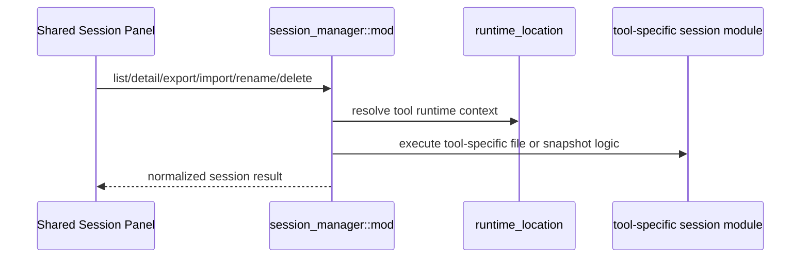

# Session Manager 后端模块说明

## 一句话职责

- `session_manager/` 负责四个内置工具会话的列表、详情、路径过滤、重命名、删除、导入和导出。

## Source of Truth

- 会话的真实来源不是数据库，而是各工具运行时目录或导出快照。
- `source_path` 是会话操作的关键标识；对 OpenCode 这种特殊格式，还要经过专门的同源判断逻辑，不能简单字符串比较。
- 当前工具的会话上下文路径必须先经 `runtime_location` 决议，再派生 sessions/projects/agents/data_root 等目录。

## 核心设计决策（Why）

- 四个工具共用一套 Session Manager 入口，但上下文解析各不相同，因此通过 `ToolSessionContext` 隔离各自文件布局。
- 读会话详情、删除、导出等重 I/O 操作统一放进 `spawn_blocking`，避免堵塞 Tauri async runtime。
- 导出使用统一 schema `ai-toolbox.session-export.v2`，同时保留 normalized messages 和 native snapshot，兼顾跨工具一致性与原生往返恢复。

## 关键流程

## 易错点与历史坑（Gotchas）

- 不要假设所有工具的会话根目录都是同一种布局。Codex 是 `sessions/`，Claude Code 是 `projects/`，OpenClaw 是配置目录旁的 `agents/`，OpenCode 还涉及 data/state/sqlite。
- 对 OpenCode，会话来源判断和导入导出依赖显式运行时环境与官方导出格式，不能套用其它工具的 JSONL 逻辑。
- 对 OpenCode 删除，不要为了确认 `source_path` 再先全量扫描会话缓存。`source_path` 自身就能解析出 `session_id` 并直接执行删除；预扫描只会把单删/批删放大成整库遍历。
- 对 OpenCode 删除，直删语义仍要保持幂等。若底层 SQLite/JSON 已不存在，应视为成功收敛，而不是把重复删除、并发删除或陈旧列表操作升级成 `Session not found`。
- 导出/导入格式校验是强约束；改 schema、version、tool alias 时必须同步兼容检查。
- 批量删除不能只在前端循环调单删就算完成。后端需要返回 partial success 结果，明确区分 `deleted_count` 和逐条失败项，避免多文件删除时“删了一部分但整体只报一个错”。

## 跨模块依赖

- 依赖 `runtime_location` 决议四个工具当前运行时根。
- 依赖 `web/features/coding/shared/sessionManager/` 作为唯一前端入口。
- 与四个工具模块的会话子实现强耦合。

## 典型变更场景（按需）

- 新增某工具会话字段或格式支持时：
  同时检查 list/detail/export/import/rename/delete 全链路，而不是只改列表。
- 改 OpenCode 会话逻辑时：
  同时检查 official export、raw snapshot、runtime env 和 source_path 归一化。

## 最小验证

- 至少验证：某个工具的 list/detail/export/import/rename/delete 至少一条往返路径。
- 改导出格式时，至少验证 schema/version/tool alias 校验没有破坏旧导入。
