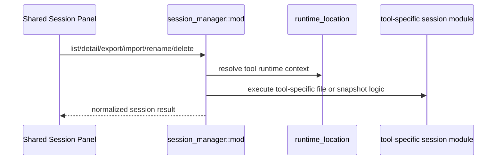

# Session Manager 后端模块说明

## 一句话职责

- `session_manager/` 负责四个内置工具会话的列表、详情、路径过滤、重命名、删除、导入和导出。

## Source of Truth

- 会话的真实来源不是数据库，而是各工具运行时目录或导出快照。
- `source_path` 是会话操作的关键标识；对 OpenCode 这种特殊格式，还要经过专门的同源判断逻辑，不能简单字符串比较。
- 当前工具的会话上下文路径必须先经 `runtime_location` 决议，再派生 sessions/projects/agents/data_root 等目录。

## 核心设计决策（Why）

- 四个工具共用一套 Session Manager 入口，但上下文解析各不相同，因此通过 `ToolSessionContext` 隔离各自文件布局。
- 读会话详情、删除、导出等重 I/O 操作统一放进 `spawn_blocking`，避免堵塞 Tauri async runtime。
- 导出使用统一 schema `ai-toolbox.session-export.v2`，同时保留 normalized messages 和 native snapshot，兼顾跨工具一致性与原生往返恢复。
- 会话详情页和导出里的消息展示统一消费 normalized `SessionMessage.blocks`。各工具 parser 负责把 raw runtime shape 转成 text/thinking/tool_call/tool_result 等 block；前端不应再按 Claude/Codex/Gemini/OpenCode 的原始 JSON 结构分叉展示。
- 会话详情右侧导航统一依赖 normalized `SessionMessage.id` 派生 DOM target。各工具 parser 读取详情时必须保证每条消息都有 id；运行时原始数据没有 id 时使用共享 helper 补 provider-scoped fallback id，不要让前端按工具类型或数组渲染位置分别猜定位规则。

## 关键流程

## 易错点与历史坑（Gotchas）

- 不要假设所有工具的会话根目录都是同一种布局。Codex 是 `sessions/`，Claude Code 是 `projects/`，OpenClaw 是配置目录旁的 `agents/`，OpenCode 还涉及 data/state/sqlite。
- 对 OpenCode，会话来源判断和导入导出依赖显式运行时环境与官方导出格式，不能套用其它工具的 JSONL 逻辑。
- OpenCode CLI 版本可能在 official export 的 `info` 中自动补默认 `cost` / `tokens` 字段；往返测试应只归一化这类 CLI 默认补字段，不要把真实消息、路径或用户内容差异吞掉。
- 对 OpenCode 删除，不要为了确认 `source_path` 再先全量扫描会话缓存。`source_path` 自身就能解析出 `session_id` 并直接执行删除；预扫描只会把单删/批删放大成整库遍历。
- 对 OpenCode 删除，直删语义仍要保持幂等。若底层 SQLite/JSON 已不存在，应视为成功收敛，而不是把重复删除、并发删除或陈旧列表操作升级成 `Session not found`。
- 对 Gemini CLI，当前主格式是 `tmp/<project>/chats/session-*.jsonl` conversation record stream，不是单个 JSON 对象；旧版 `session-*.json` 仍要兼容。标题提取要优先使用 summary 或首条真实用户消息，并识别旧包装 prompt 里的 `[User Request]`，避免把 `[Assistant Rules - You MUST follow these instructions]` 当作会话标题。
- 对 Gemini CLI 删除，不能只删主 session 文件。必须同步清理同项目 temp 下的 `logs/session-<id>.jsonl`、`tool-outputs/session-<id>/`、`<id>/` session-scoped 目录，以及 `chats/<parentSessionId>/` subagent 目录和其 artifacts；但 artifacts 清理是 best-effort，主 session 文件删除不能被 artifact 权限、锁文件或残留目录阻断。
- Claude Code / Gemini CLI 的 SubAgent 文件会被主会话列表排除，但详情页需要通过父会话显式发现并进入子会话详情。不要放宽 `get_tool_session_detail` 让前端任意传文件路径直读；应先由 parent `source_path` 发现合法子会话，再用专用 subagent detail API 读取，保持 source_path 操作边界清晰。
- 对 Gemini CLI resume 命令，全局扫描会跨项目列出会话；如果能解析 `.project_root` 或 `projects.json`，命令必须体现需要在项目目录下执行，例如 `cd <projectRoot> && gemini --resume <id>`。
- 对所有可 resume 的 CLI，复制命令只有在能从工具自己的会话元数据解析出真实项目目录时，才加目录前缀。Codex 用 `cwd`，Claude Code 用 JSONL `cwd` 或 index `projectPath`，OpenCode 用 `directory`，Gemini CLI 用 `.project_root` 或 `projects.json`；不要用 sessions/projects/tmp/cache 这类运行时存储目录冒充项目目录。
- resume 命令的目录前缀必须区分路径格式：Windows drive/UNC 路径用 Windows shell 兼容的 `pushd "<path>" && ...`，macOS/Linux 路径用 `cd <quoted-path> && ...`。不要把 Windows 路径塞进 POSIX 单引号命令，也不要用普通 `cd` 处理 Windows 跨盘符或 UNC 路径。
- 导出/导入格式校验是强约束；改 schema、version、tool alias 时必须同步兼容检查。
- 新增或调整工具消息类型时，优先扩展 normalized block 中间层和工具名归一化逻辑。不要只在某个工具 parser 里拼接 `content` 字符串，否则搜索、详情渲染、导出和后续跨 CLI 复用会再次漂移。
- 批量删除不能只在前端循环调单删就算完成。后端需要返回 partial success 结果，明确区分 `deleted_count` 和逐条失败项，避免多文件删除时“删了一部分但整体只报一个错”。
- 列表搜索如果用户输入完整 `session_id`，共享层必须先做精确 ID 短路并直接返回匹配项，不能继续扫描其它会话正文；否则粘贴 session id 定位也会被放大全库全文扫描成本。
- 普通会话列表首屏可以使用最近候选 quick load 优先返回少量结果，但后台补全、搜索、目录筛选、强制刷新、删除/导入后的刷新必须保留完整扫描语义并返回完整列表，不能让 quick path 变成新的事实源。
- 所有 CLI 的首屏 recent quick path 都应复用共享的最近文件早停扫描，按工具自己的文件布局过滤候选，拿够候选后立即停止；不要在某个 CLI 里重新写“先全量递归收集所有候选，再排序截断”的实现。
- 会话列表缓存采用 stale-while-refresh 语义：过期完整缓存仍可用于 `cache-first` 立即展示，并通过 `cache_state=stale` 提醒前端后台刷新；只有主动刷新、删除、导入等真实变更才应显式失效或重建缓存。
- `cache-first` 首屏不能为了补齐未缓存的远端/WSL context 去做 recent 扫描；应先返回已有完整缓存或本地轻量 recent，并用 `partial/meta_complete=false` 触发后台完整刷新。
- 会话管理没有后端分页语义。`page/page_size/has_more` 字段只为旧契约兼容保留；新 UI 不应依赖它们实现“加载更多”。`load_mode=full` 和 `load_mode=refresh` 必须返回完整过滤结果，完成后 `has_more=false`，前端一次性替换列表。
- `load_mode=cache-first` 只服务首屏快速展示：优先返回已有完整缓存；没有缓存时只允许轻量 recent 候选，且远端/WSL 未缓存 context 只能标记 partial，不能阻塞首屏去扫描它们。
- `load_mode=full` 是后台完整补全和搜索事实源：必须扫描所有被 source mode 接受的 context，更新完整缓存，并返回完整列表。不要把 full 重新改成“扫描完整但只返回第一页”，这会让前端误以为还有分页。
- `load_mode=refresh` 是主动重建完整列表：用于手动刷新、删除、导入后的收敛，必须绕过旧缓存重建完整缓存；除非调用方明确要静默刷新，否则 UI 语义上它是用户可感知的完整刷新。
- 完整缓存保存的是 metadata 完整列表，不是分页页缓存。`cache-first` 可以先读 fresh/stale 完整缓存，也可以在缺缓存时退到本地 quick recent；`full/refresh` 才负责扫描所有 local/WSL context 并重建完整缓存。不要把 quick recent、前端首屏 10 条或旧 `page_size` 当成缓存事实源。
- 搜索分两层：先用已加载/缓存的 metadata 字段加速，包括 `session_id`、标题、摘要、项目目录、`source_path`、runtime source/distro；只有 `full/refresh/auto` 深搜时才允许扫描消息正文。`cache-first` 搜索不能为了正文搜索放大全库 I/O。
- 搜索完整 `session_id` 必须优先精确匹配并短路正文扫描；这是粘贴会话 ID 定位的高频路径，不能被“全文搜索更完整”的想法破坏。
- 搜索等待语义由返回字段表达：metadata 不完整时 `partial/meta_complete=false` 让前端后台补齐完整列表；正文未搜索完成时 `message_search_complete=false` 让前端只提示搜索仍在继续。后端不要用 `has_more=true` 暗示继续翻页，也不要让正文深搜阻塞 `cache-first` 首屏。

## 跨模块依赖

- 依赖 `runtime_location` 决议四个工具当前运行时根。
- 依赖 `web/features/coding/shared/sessionManager/` 作为唯一前端入口。
- 与四个工具模块的会话子实现强耦合。

## 典型变更场景（按需）

- 新增某工具会话字段或格式支持时：
  同时检查 list/detail/export/import/rename/delete 全链路，而不是只改列表。
- 改 OpenCode 会话逻辑时：
  同时检查 official export、raw snapshot、runtime env 和 source_path 归一化。

## 最小验证

- 至少验证：某个工具的 list/detail/export/import/rename/delete 至少一条往返路径。
- 改导出格式时，至少验证 schema/version/tool alias 校验没有破坏旧导入。
