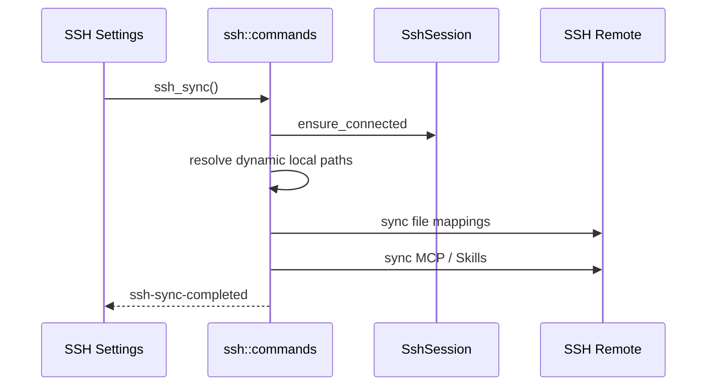

# SSH 同步模块说明

## 一句话职责

- `ssh/` 负责 SSH 连接管理、文件映射同步，以及 MCP/Skills 到远端主机的同步。

## Source of Truth

- `ssh_sync_config`、`ssh_connection`、`ssh_file_mapping` 是 SSH 配置、连接和映射的主数据。
- SSH 设置页里显示的本地路径会根据 `module_statuses` 改写成 WSL UNC 友好展示，但真正同步路径仍由后端在执行时动态解析。
- 当前仓库里，SSH 不应按“自动同步模块”理解。公开产品语义仍是手动同步为主。

## 核心设计决策（Why）

- SSH 连接状态与同步执行分离：连接由 `SshSessionState` 管理，同步只在显式触发或启用/切换连接时执行全量同步。
- `module_statuses` 仍会带进 SSH 配置里，是为了正确展示 WSL Direct 本地路径，而不是为了让 SSH 像 WSL 一样自动跳过或自动监听。
- MCP/Skills SSH 同步走独立链路，不复用普通文件映射，因为它们的源数据和目标路径决议不同。

## 关键流程

## 易错点与历史坑（Gotchas）

- 不要把 SSH 写成“自动同步”模块。当前应明确为手动同步主模型；即使启用或切换连接时会跑一次全量同步，也不等于存在像 WSL 那样的事件驱动自动同步监听体系。
- SSH 设置页不会像 WSL 设置页那样按 `is_wsl_direct` 禁用模块。它只是把左侧本地路径显示成完整 UNC，真正同步仍由后端解析。
- 不要只看普通 file mappings 就判断 SSH 同步是否完整。MCP 和 Skills 都走独立链路，其中 Skills 的源目录仍是中央仓库，不是某个工具当前目录。
- `ssh_sync_config.active_connection_id` 只是持久化配置，不等于进程内 `SshSession` 已恢复。冷启动后若要支持首次手动同步，必须先按已保存的 active connection 恢复 session，或在 `ssh_sync()` 里按当前 active connection 懒建连；不要把 `session.ensure_connected()` 当成会自动从数据库补回连接信息。
- 排查 SSH “没同步”时，先分三层：
  连接是否有效；
  映射和动态路径是否正确；
  MCP/Skills 独立同步链路是否执行。

## 跨模块依赖

- 依赖 `runtime_location`：仅用于模块状态和本地路径展示/动态路径解析。
- 依赖 `mcp_sync.rs`、`skills_sync.rs`：普通文件映射成功后再执行这两条独立链路。
- 被 `web/features/settings/` 的 SSH 设置页独占消费。

## 典型变更场景（按需）

- 新增 SSH 同步文件类型时：
  先判断它应走普通 file mappings 还是独立链路。
- 修改“启用 SSH”或“切换连接”逻辑时：
  不要顺手把它升级成事件驱动自动同步；如果真要引入，需要在产品语义上单独确认。

## 最小验证

- 至少验证：手动点击 Sync Now 会执行同步，并带出进度事件。
- 至少验证：启用 SSH 或切换 active connection 时能完成一次全量同步。
- 至少验证：WSL Direct 本地路径在 SSH 设置页显示为 UNC，但不会导致模块被禁用。
