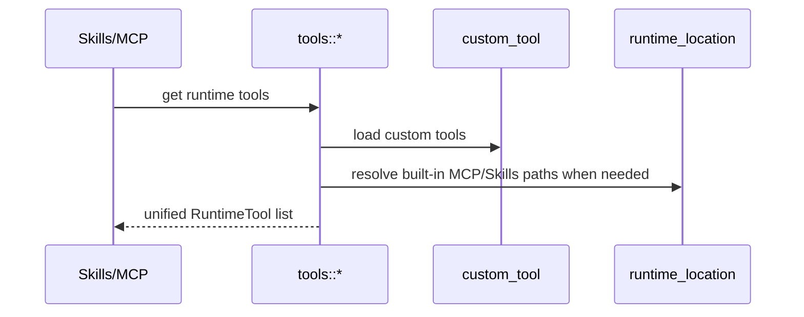

# Tools 后端模块说明

## 一句话职责

- `tools/` 为 Skills 和 MCP 提供统一的工具定义、安装检测、路径解析和自定义工具存储能力。

## Source of Truth

- 内置工具定义来自 `builtin.rs` 的静态配置。
- 用户自定义工具来自 `custom_tool` 表；这部分是 Skills/MCP 对“额外工具”的唯一持久化来源。
- 对 4 个内置工具，真正的 MCP/Skills 路径不能只看静态字符串，必须优先经过 `runtime_location` 派生。

## 核心设计决策（Why）

- Skills 和 MCP 共用同一套 `RuntimeTool` 抽象，避免两个功能各维护一套工具列表和检测规则。
- 自定义工具字段分为 Skills 相关和 MCP 相关，保存时要保留另一侧字段，不能互相覆盖。
- 对 OpenCode、Claude Code、Codex、OpenClaw 这 4 个内置工具，带数据库上下文的路径解析必须优先于静态默认值，否则 WSL Direct 场景会错。

## 关键流程

## 易错点与历史坑（Gotchas）

- 不要把“自定义工具”当成一定已安装的真实运行时。当前检测层对 custom tool 默认视为可用，业务层要理解这是产品约束，不是系统级验证。
- 保存自定义工具时，Skills 字段和 MCP 字段必须互相保留；只更新一侧时不要把另一侧清空。
- 4 个内置工具的 Skills/MCP 路径在 WSL Direct 场景下必须用 `*_with_db` 版本解析，不能退回静态默认路径。

## 跨模块依赖

- 被 `skills/` 和 `mcp/` 共同依赖。
- 依赖 `runtime_location`、`path_utils` 和 `custom_store`。

## 典型变更场景（按需）

- 新增内置工具支持时：
  同时检查 builtin 定义、安装检测、MCP 路径、Skills 路径和 DTO 输出。
- 改自定义工具 schema 时：
  同时检查 Skills/MCP 两侧保存逻辑是否仍能互相保留字段。

## 最小验证

- 至少验证：内置工具与自定义工具都能正确出现在 Skills/MCP 工具列表中。
- 至少验证：WSL Direct 场景下 4 个内置工具的 MCP/Skills 路径仍从 runtime_location 解析。
