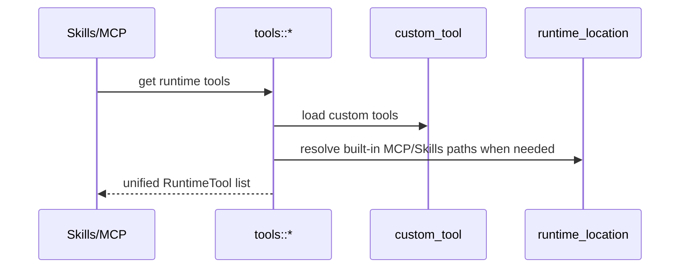

# Tools 后端模块说明

## 一句话职责

- `tools/` 为 Skills 和 MCP 提供统一的工具定义、安装检测、路径解析和自定义工具存储能力。

## Source of Truth

- 内置工具定义来自 `builtin.rs` 的静态配置。
- 用户自定义工具来自主数据库的 `custom_tool` 表；必须直接读写 SQLite JSONB，旧 SurrealDB 仅用于启动时一次性导入。这部分是 Skills/MCP 对“额外工具”的唯一持久化来源。
- 对 OpenCode、Claude Code、Codex、Grok、OpenClaw、Pi、Oh My Pi 这类 runtime root 可配置的内置工具，真正的 MCP/Skills 路径不能只看静态字符串，必须优先经过 `runtime_location` 派生。

## 核心设计决策（Why）

- Skills 和 MCP 共用同一套 `RuntimeTool` 抽象，避免两个功能各维护一套工具列表和检测规则。
- 自定义工具字段分为 Skills 相关和 MCP 相关，保存时要保留另一侧字段，不能互相覆盖。
- 对 OpenCode、Claude Code、Codex、OpenClaw、Pi、Oh My Pi 这些内置工具，带数据库上下文的路径解析必须优先于静态默认值，否则 WSL Direct 场景会错。

## 关键流程

```mermaid
sequenceDiagram
  participant Feature as Skills/MCP
  participant Tools as tools::*
  participant DB as custom_tool
  participant Runtime as runtime_location

  Feature->>Tools: get runtime tools
  Tools->>DB: load custom tools
  Tools->>Runtime: resolve built-in MCP/Skills paths when needed
  Tools-->>Feature: unified RuntimeTool list
```

## 易错点与历史坑（Gotchas）

- 不要把“自定义工具”当成一定已安装的真实运行时。当前检测层对 custom tool 默认视为可用，业务层要理解这是产品约束，不是系统级验证。
- 保存自定义工具时，Skills 字段和 MCP 字段必须互相保留；只更新一侧时不要把另一侧清空。
- `icon_url`（自定义工具品牌图标，http(s) 图片 URL）由 Skills 与 MCP 表单共同拥有：两侧的 `save_custom_tool_*_fields` 都接收期望值（空字符串 → 清除，`None` → 保留 DB 已有值），且都校验非空值必须以 `http://`/`https://` 开头（MCP 侧 `mcp_add_custom_tool` 同样放行空串以支持清除）。
- OpenCode、Claude Code、Codex、OpenClaw、Pi、Oh My Pi 的 Skills/MCP 路径在 WSL Direct 场景下必须用 `*_with_db` 版本解析，不能退回静态默认路径。
- Hermes MCP 同步走 `mcp::hermes_mcp`（serde_yaml round-trip），不是 `hermes::commands` 的段落级 section splice。merge-on-write 保留 Hermes 专有字段（`enabled`/`timeout`/`connect_timeout`/`tools`/`sampling`/`roots`/`auth`），import 时剥离。Hermes 无 `type` 字段，靠 `command`/`url` 推断 stdio/http。
- dsh MCP 同步走 `mcp::cordis_patch`（Cordis patch DSL），不是 yaml 段。每个 server 是一行 `insert`，包名固定 `@deepseek-ai/dsh-mcp-client`，`config.serverName` 作 key。dsh 是 developer preview，cordis 格式可能迭代；adapter 隔离在 `cordis_patch.rs` 便于更新。
- Hermes/dsh 的文件路径与统一 WSL Direct 状态复用各自同一个配置目录解析器；新增路径分支时必须保持两者一致，不能出现 Tools 写入 UNC、同步状态却仍显示本机的分叉。
- Hermes Skills 路径必须走 `resolve_special_skills_path`（复用 config.yaml 同一平台根目录），不能直接用静态 `~/.hermes/skills`——Windows 上 hermes 根目录是 `%LOCALAPPDATA%\hermes`，而 `~/.hermes/skills` 会误解析到 `%USERPROFILE%\.hermes`。
- Shared Agents 工具指向 `~/.agents/skills`（agentskills.io 公共目录），与 central_repo 默认路径重叠。`skills::commands::sync_skill_to_tool_record` 有 canonicalize 守卫：当 source 和 target 解析到同一物理路径时跳过同步（返回 mode="skip"），避免 `ensure_source_target_not_overlapping` bail。
- 内置工具的 Skills 强制复制（不支持 symlink 的工具，当前为 Cursor、Antigravity CLI）统一由 `builtin::builtin_tool_forces_skill_copy` 判定；新增此类工具时只扩展该 helper，禁止回到各同步入口散落 `tool_key == "..."` 匹配。
- Antigravity CLI 的 Skills 与 MCP 不共享根目录：Skills 使用 `~/.gemini/antigravity-cli/skills`，用户级 MCP 使用官方共享路径 `~/.gemini/config/mcp_config.json`。不能从 CLI 的检测目录机械派生 MCP 路径；旧 `antigravity` 条目继续保留 IDE 旧路径。

## 跨模块依赖

- 被 `skills/` 和 `mcp/` 共同依赖。
- 依赖 `runtime_location`、`path_utils` 和 `custom_store`。

## 典型变更场景（按需）

- 新增内置工具支持时：
  同时检查 builtin 定义、安装检测、MCP 路径、Skills 路径和 DTO 输出。
- 改自定义工具 schema 时：
  同时检查 Skills/MCP 两侧保存逻辑是否仍能互相保留字段。

## 最小验证

- 至少验证：内置工具与自定义工具都能正确出现在 Skills/MCP 工具列表中。
- 至少验证：WSL Direct 场景下 OpenCode、Claude Code、Codex、OpenClaw、Pi、Oh My Pi 的 MCP/Skills 路径仍从 runtime_location 解析。
