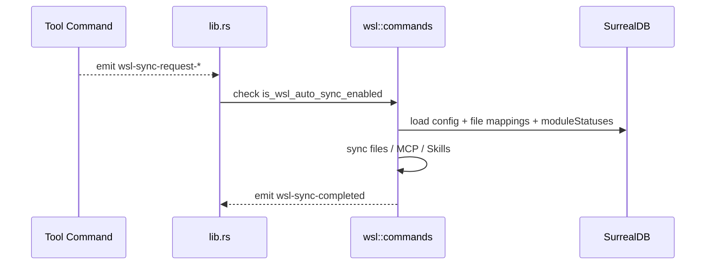

# WSL 同步模块说明

## 一句话职责

- `wsl/` 负责 Windows 到 WSL 的配置文件、MCP、Skills 同步，以及 WSL Sync 设置本身的配置与状态管理。

## Source of Truth

- `wsl_sync_config` 和 `wsl_file_mapping` 表是 WSL 同步配置的主数据。
- `module_statuses` 不是前端自己推出来的，它来自 `runtime_location::get_wsl_direct_status_map_async()` 的统一后端诊断。
- 自动同步是否发生，不由业务模块保存数据库这件事决定，而由 `lib.rs` 中对应事件监听器 + `is_wsl_auto_sync_enabled()` 决定。

## 核心设计决策（Why）

- WSL 自动同步被建模为事件驱动，而不是把同步逻辑内嵌进每个工具模块，避免 4 个模块各自复制“启用判断 + 调用同步”的逻辑。
- `module_statuses` 由运行时路径统一产出，这样 WSL 设置页和 SSH 设置页都能基于相同事实源显示 WSL Direct 状态。
- 启用 WSL sync 时会触发一次全量同步，减少“刚打开但远端还是旧状态”的初始分叉。

## 关键流程

## 易错点与历史坑（Gotchas）

- 不要把 WSL 自动同步理解成“保存数据库就自动发生”。真正触发点是事件监听器。
- `moduleStatuses.is_wsl_direct=true` 的模块，在 WSL 设置页里应视为“已直接运行在 WSL”，手动 WSL 同步要跳过这些模块，而不是继续把 Windows 本地映射强塞过去。
- WSL Direct 判断不要从页面上的 `source=custom` 反推。`custom`、`env`、`shell`、`default` 与是否 WSL Direct 是两个独立维度。
- 对 Skills，WSL 自动同步的源目录仍然是中央仓库 `central_repo_path`，不是工具当前运行时 skills 目录。当前运行时目录只决定目标写到哪里。
- 对 4 个内置工具，如果当前运行时路径是 Windows 本机路径而不是 WSL UNC，WSL 侧 skills 目标仍应回退到各自默认 Linux 目录；不要误判成“没有 WSL 目标”。

## 跨模块依赖

- 依赖 `runtime_location`：用于拿到 `module_statuses`、默认 WSL 目标路径和 WSL Direct 诊断。
- 被 4 个工具模块依赖：它们通过 `wsl-sync-request-opencode|claude|codex|openclaw` 触发自动同步。
- 被 `settings/` 前端依赖：WSL 设置页会据此禁用 WSL Direct 模块的手动映射操作和同步入口。

## 典型变更场景（按需）

- 新增 4 个 tab 相关文件同步时：
  同时检查默认映射、`skipModules`、WSL Direct 跳过规则和事件触发点。
- 改 Skills 的 WSL 同步时：
  同时检查中央仓库源目录、统一 WSL 中央仓库、工具目标目录和 `is_wsl_direct` 跳过规则。
- 新增自动同步入口时：
  优先挂到 `lib.rs` 的监听层，而不是在业务命令里直接调用 `wsl_sync`。

## 最小验证

- 至少验证：启用 WSL sync 后首次全量同步会执行。
- 至少验证：某个工具保存后发出 `wsl-sync-request-*` 时，在开启自动同步和关闭自动同步两种状态下行为不同。
- 至少验证：WSL Direct 模块在 WSL 设置页被置灰，并在手动同步时进入 `skipModules`。
