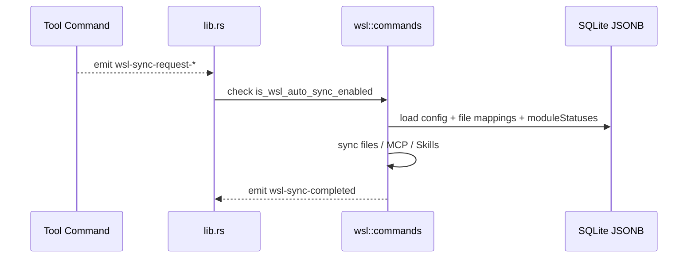

# WSL 同步模块说明

## 一句话职责

- `wsl/` 负责 Windows 到 WSL 的配置文件、MCP、Skills 同步，以及 WSL Sync 设置本身的配置与状态管理。

## Source of Truth

- `wsl_sync_config` 和 `wsl_file_mapping` 表是 WSL 同步配置的主数据；当前主存储是 SQLite JSONB，不再双写旧库。
- `module_statuses` 不是前端自己推出来的，它来自 `runtime_location::get_wsl_direct_status_map_async()` 的统一后端诊断。
- 自动同步是否发生，不由业务模块保存数据库这件事决定，而由 `lib.rs` 中对应事件监听器 + `is_wsl_auto_sync_enabled()` 决定。

## 核心设计决策（Why）

- WSL 自动同步被建模为事件驱动，而不是把同步逻辑内嵌进每个工具模块，避免各工具模块各自复制“启用判断 + 调用同步”的逻辑。
- 读写 WSL 配置时必须直接走 SQLite；`last_sync_*` 状态更新、默认 mapping backfill 和用户 mapping CRUD 都要更新 SQLite，不能写回旧 SurrealDB。
- `module_statuses` 由运行时路径统一产出，这样 WSL 设置页和 SSH 设置页都能基于相同事实源显示 WSL Direct 状态。
- 启用 WSL sync 时会触发一次全量同步，减少“刚打开但远端还是旧状态”的初始分叉。
- 备份恢复后的同步由恢复编排独占：普通启动全量同步看到 `.resync_required` / `.reapply_applied_required` 时必须让位；恢复任务按本机 re-apply → Skills → MCP 的顺序完成后，只调用一次 WSL full sync，并通过 `skip_modules` 排除本轮未改写的 CLI 模块。这里的“本轮已改写”必须同时包含 `.resync_required` payload 记录的 direct external-configs restore 模块，以及 re-apply summary 里的模块；不能只看 re-apply 结果，否则正常恢复会跳过所有 CLI WSL 映射。

## 关键流程

```mermaid
sequenceDiagram
  participant Tool as Tool Command
  participant App as lib.rs
  participant WSL as wsl::commands
  participant DB as SQLite JSONB

  Tool-->>App: emit wsl-sync-request-*
  App->>WSL: check is_wsl_auto_sync_enabled
  WSL->>DB: load config + file mappings + moduleStatuses
  WSL->>WSL: sync files / MCP / Skills
  WSL-->>App: emit wsl-sync-completed
```

## 易错点与历史坑（Gotchas）

- 不要把 WSL 自动同步理解成“保存数据库就自动发生”。真正触发点是事件监听器。
- 同步设置保存只 patch 用户字段，`last_sync_warnings` 只能由 Skills 链路替换；配置、普通状态和警告写入都在同一次 SQLite 连接锁内完成，避免旧表单或其它链路清掉诊断。全量同步必须把 Skills 阶段警告合入返回结果与完成事件，失败时也保留已经收集的警告；WSL 孤立中央目录清理失败同样属于非致命警告。
- 恢复期间不能同时依赖启动同步、业务事件同步和恢复收尾同步。三条链路并发会让旧文件、半完成配置和新配置互相覆盖；恢复专用入口应抑制中间事件，启动同步应识别 restore flag，最终只保留恢复收尾的一次串行同步。
- `moduleStatuses.is_wsl_direct=true` 的模块，在 WSL 设置页里应视为“已直接运行在 WSL”，手动 WSL 同步要跳过这些模块，而不是继续把 Windows 本地映射强塞过去。
- full sync 必须从后端当前 `runtime_location` 读取 Direct 跳过集合，不能信任传入 `config.module_statuses` 的 UI 快照；首次启用同步尤其可能携带目录切换前的旧状态。MCP 使用相同集合过滤映射，不再维护逐工具的布尔参数列表。
- dsh/Hermes 的自定义目录也允许 UNC；两者必须出现在 `module_statuses` 中，并在保存/清除目录后刷新缓存和通知设置页。issue #331 的失败链路是“UNC 文件存在 → 漏掉 Direct 跳过 → 转成 //wsl.localhost/... → Linux cp cannot stat”，不是文件缺失或发行版特例。
- WSL Direct 判断不要从页面上的 `source=custom` 反推。`custom`、`env`、`shell`、`default` 与是否 WSL Direct 是两个独立维度。
- 对 Skills，WSL 自动同步的源目录仍然是中央仓库 `central_repo_path`，不是工具当前运行时 skills 目录。当前运行时目录只决定目标写到哪里。
- Skills 工具目标由 `skills::remote_target` 统一维护链接/复制/清理。Cursor、Antigravity CLI 在 WSL 中同样强制复制；受管副本须带匹配中央源路径的 `.ai-toolbox-skill-source` 标记，不能把无标记真实目录当成可覆盖副本。旧受管链接可转成副本；先复制成功再替换，取消同步与孤立清理同样识别副本。
- 对内置工具，如果当前运行时路径是 Windows 本机路径而不是 WSL UNC，WSL 侧目标仍应回退到各自默认 Linux 目录；不要误判成“没有 WSL 目标”。
- Claude Code 本机自定义根目录不会把普通 WSL 同步目标改成远端自定义目录。Windows 本机源可以来自自定义根，也可以来自 `CLAUDE_CODE_PLUGIN_CACHE_DIR` 覆盖的 plugin cache，但 WSL 目标仍应是默认 `~/.claude/*`、`~/.claude/plugins`、`~/.claude/skills` 和 `~/.claude.json`；只有 Claude 当前运行时本身是 WSL Direct 自定义根目录时，目标才跟随该 Linux 根目录。
- 对 Claude `claude-plugins` 目录，同步不只是拷贝目录内容。同步后还要把 `known_marketplaces.json` / `installed_plugins.json` 里的 `installLocation` / `installPath` 从 Windows plugins 根目录映射到目标 WSL plugins 根目录，否则远端插件元数据仍会指向 `C:\...`。
- 对 JSON/TOML 单文件映射，`cleanup_paths` 是同步到 WSL 后只作用于目标副本的字段清理规则，不能反向改 Windows 源文件。Claude `claude-settings` 还会自动追加非 Windows 目标平台规则，移除 `CLAUDE_CODE_USE_POWERSHELL_TOOL`、`CLAUDE_CODE_SHELL` 这类 Windows-only env；代理等用户自定义字段应通过映射里的 `cleanup_paths` 配置。
- Claude 插件元数据补写属于 best-effort 后处理。即使 `known_marketplaces.json` / `installed_plugins.json` 读取、改写或写回失败，也不能把已经成功完成的主文件同步整体标成失败；最多记录 warning/error 供排查。
- 写入到 `known_marketplaces.json` / `installed_plugins.json` 的 `installLocation` / `installPath` **必须是真实绝对 Linux 路径**，不能保留 `~/.claude/...`。Claude CLI 2.1.126+ 在 WSL 里校验 marketplace 时不会展开 JSON 字段值里的 `~`，留 `~` 会被判定 corrupted。读写文件路径仍可保留 `~`(`read_wsl_file` / `write_wsl_file` 通过 bash `$HOME` 展开)；只有当字符串作为字段**值**落到 JSON 里时，才必须先用 `sync::get_wsl_user_home(distro)` 解析真实 home，再传给重写逻辑。这条规则同样适用于以后任何"路径作为字段值落到工具配置里"的同步链路。
- 删除类业务操作不能只依赖后续 `wsl-sync-request-*`。普通文件同步遇到本机源文件不存在会跳过，不会删除 WSL 目标；如果业务语义是“清除当前运行时文件”，必须在本地状态落库前显式删除对应 WSL 目标，或让同步链路明确支持该删除语义。
- Skills WSL 同步对工具目标的删除/覆盖必须先做**归属校验**：共享 `remote_target` 区分 missing / 受管链接 / 带源标记的受管副本 / 用户目录或外部链接；只有受管目标可删除或替换，其余保留并 warn，检查失败不执行修改。不能直接删除用户工具目录。中央仓库目录（`~/.ai-toolbox/skills/<name>`）本身是 app 私有，可按原语义删除。
- Skills 同步的用户可见警告有独立链路：归属校验保留、链接维护失败、源目录缺失跳过、同步哈希写入失败会 emit `wsl-sync-warning` 事件（手动同步弹窗实时展示），同时经 `commands::update_sync_warnings` 累积持久化到 `wsl_sync_config` 记录的 `last_sync_warnings`（随 status 命令返回，设置页常驻展示）。`update_sync_warnings` 只能由 skills 链路调用；文件/MCP 链路不得写该字段，否则会清除或混入其它子链路的警告。后端警告文案是稳定中文格式，前端经 `syncMessageTranslator` 的 `skills*` 正则模式翻译。同步哈希（`.synced_hash`）写入失败属于非致命警告：内容已同步成功，只记录警告并让本轮继续，下次运行会重传，不能用 `?` 中止整个 skills 同步（否则会丢掉已累积的警告持久化）。
- WSL Skills 目标解析直接查询 `runtime_location::get_tool_skills_path_async`，未提供运行时 Skills 路径时回退工具默认目录；Direct 跳过集合只转换 `claude`/`geminicli` 两个工具别名，不再维护另一份模块白名单。Hermes 必须覆盖 `<root>/skills`；dsh 没有独立 Skills 目录，不为它新增目标。新增可配置运行时根的工具时必须同时核对目标路径与跳过规则。
- Gateway 代理接管后的 WSL 地址改写只能发生在同步到 WSL 的目标副本上，不能反向写回 Windows runtime 文件；也不能对文件内容全局替换 `127.0.0.1` / `localhost`。判断必须同时依赖 Gateway manifest、目标文件 kind、managed fields 和字段内 sentinel，只允许改写 Claude `env.ANTHROPIC_BASE_URL`、Codex gateway provider `base_url`、Gemini `.env` 的 `GOOGLE_GEMINI_BASE_URL` 这类 AI Toolbox Gateway 托管字段，避免误伤用户自己配置的本地服务地址。
- Codex prompt 映射不要硬编码 active 文件名。同步 `codex-prompt` 时要镜像 `AGENTS.md` 与 `AGENTS.override.md` 两个已知文件：本机存在就同步到 WSL 同名目标，本机不存在就清理 WSL 同名目标，避免远端保留 stale override。
- Codex `config.toml` 可能通过顶层 `model_catalog_json = "ai-toolbox-codex-model-catalog.json"` 引用 AI Toolbox 生成的模型映射文件。同步 `codex-config` 时必须连带镜像这个同目录 companion JSON；但只处理 AI Toolbox 自有文件名，不要接管用户自定义的外部 catalog 路径。
- Grok 默认映射覆盖 `auth.json`、`config.toml`、`AGENTS.md` 和 `plugins/`，不默认同步 `sessions/`；Grok 的 MCP 配置承载在 `grok-config`，命令字段不做 Codex 的 `cmd /c` 包装。
- Kimi 默认映射覆盖 `config.toml`、`AGENTS.md`、`credentials/` 和 `plugins/`，不默认同步 `sessions/`；kimi 配置不走 MCP 专用同步（MCP 主数据在中央 MCP 模块）。`kimi-config` 映射 id 与 Gateway `wsl_synced_gateway_target_for_mapping` 的 `"kimi-config"` 对齐，接管期间 WSL 目标副本由 `cli_proxy` 按 manifest + sentinel 只改网关托管字段。新增映射走 `wsl_defaults_version` v16 backfill，只补本版本新加的 id。
- 新增通过文件映射承载 MCP 配置的工具时，不能只加默认 file mapping。还要同步更新 `mcp_sync.rs` 的 MCP 配置 mapping 白名单、WSL Direct 跳过判断、进度/错误文案，以及 `cmd /c` 后处理识别。MCP 专用同步只能包含实际承载 MCP 配置的文件，不能把同模块的 env、prompt、OAuth 等普通映射一起纳入。
- bump `wsl_defaults_version` 新增默认映射时，只能 backfill 本版本新加的 mapping id。不要把所有缺失的默认 mapping 重新插回去，否则会恢复用户之前主动删除的旧默认映射；新安装空列表仍应一次性创建完整默认集合。
- OpenCode Markdown Agent 的规范目录是复数 `~/.config/opencode/agents`（单数 `agent` 仅为旧版别名，不再作为默认映射同步）。把它作为一个独立目录映射即可；不能把整个 OpenCode 配置目录作为 Agent 同步源，否则会接管主配置、插件和其他用户文件。
- 目录同步不要先 `rm -rf` 目标再直接 `cp -rL source target`。Codex 插件缓存这类深层目录在 WSL/DrvFS 下曾出现 `cp` 无法创建深层父目录的失败；通用目录同步应先复制 `source/.` 到同级临时目录，全部成功后再替换目标，避免半成品目标和父目录创建顺序问题。复制目录内容时也不要跟随源目录内部符号链接：Codex 插件缓存里的 `latest` 可能指向已经被运行时清理掉的旧版本目录，`cp -L` 会因 dangling symlink 让整次同步失败。

## 跨模块依赖

- 依赖 `runtime_location`：用于拿到 `module_statuses`、默认 WSL 目标路径和 WSL Direct 诊断。
- 被多个工具模块依赖：它们通过 `wsl-sync-request-opencode|claude|codex|grok|kimi|openclaw|geminicli|pi|omp|hermes|dsh` 触发自动同步。
- 被 `settings/` 前端依赖：WSL 设置页会据此禁用 WSL Direct 模块的手动映射操作和同步入口。

## 典型变更场景（按需）

- 新增 tab 相关文件同步时：
  同时检查默认映射、`skipModules`、WSL Direct 跳过规则和事件触发点。
- 改 Skills 的 WSL 同步时：
  同时检查中央仓库源目录、统一 WSL 中央仓库、工具目标目录和 `is_wsl_direct` 跳过规则。
- 新增自动同步入口时：
  优先挂到 `lib.rs` 的监听层，而不是在业务命令里直接调用 `wsl_sync`。

## 最小验证

- 同步警告回归：`cargo test --lib saving_sync_preferences_preserves_latest_skills_warnings` 和 `cargo test --lib concurrent_sync_status_and_warnings_preserve_both_snapshots` 覆盖旧表单保存、文件状态更新、Skills 清空警告及并发写入；警告必须在真实 SQLite 写入后读回验证。
- `cargo test --test coding wsl_direct_status` 验证保存配置目录后的前端状态 payload 与后端跳过集合一致；`cargo test --lib coding::wsl::mcp_sync::tests` 验证 Direct 模块跳过、本机模块保留以及 MCP 文件边界。
- 至少验证：启用 WSL sync 后首次全量同步会执行。
- 至少验证：某个工具保存后发出 `wsl-sync-request-*` 时，在开启自动同步和关闭自动同步两种状态下行为不同。
- 至少验证：WSL Direct 模块在 WSL 设置页被置灰，并在手动同步时进入 `skipModules`。
