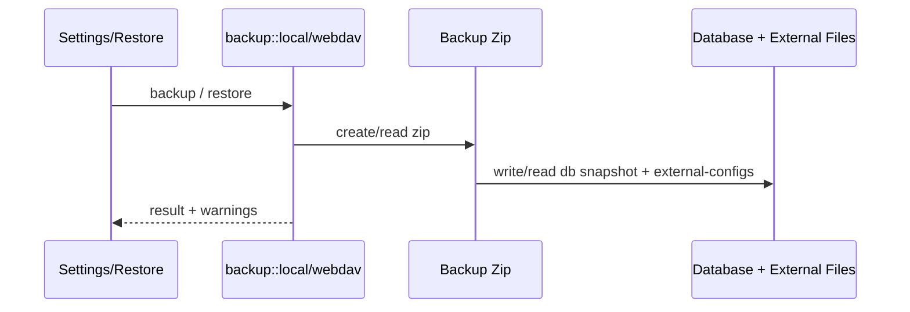

# Backup 后端模块说明

## 一句话职责

- `backup/` 负责本地备份恢复、WebDAV 备份恢复和自动备份调度。

## Source of Truth

- 备份包里的 `db/` 是数据库快照；`external-configs/` 是外部运行时配置和 prompt/auth 等文件快照，两者缺一不可。
- 图片工作台资产文件默认进入备份包；是否写入 `image-studio/assets/` 由应用设置 `backup_image_assets_enabled` 控制，默认开启。
- 自定义备份项是 Backup 自己的 source of truth，不复用 SSH/WSL file mappings；保存路径时优先使用 `~/...` 或 `%APPDATA%/...` 这类可迁移格式。
- restore 后真正继续参与运行的，不只是解压出来的文件路径；任何还会被后续同步/托盘/WSL/SSH 依赖的元数据也必须保持一致。
- 自动备份是否运行由应用设置驱动，调度器只消费设置，不自己持久化业务状态。

## 核心设计决策（Why）

- 备份不是只备份数据库，还要把各工具外部配置文件、prompt、auth、skills 等一起打包，否则恢复后会出现“库里有记录、运行时文件缺失”的分叉。
- WebDAV 与本地备份共用备份 zip 生成能力，但上传/列举/恢复链路分离，这样可以分别处理网络错误和本地文件错误。
- 自动备份作为后台调度器常驻运行，周期性读取设置并决定是否执行，而不是把调度状态散落到 UI 层。
- 自定义备份项用 `custom-backup/manifest.json` 描述恢复目标，payload 使用稳定相对路径存放，避免把绝对路径直接作为 zip entry，也避免不同文件名互相覆盖。

## 关键流程

## 易错点与历史坑（Gotchas）

- 不要把备份理解成“只有数据库”。`external-configs/` 下的 OpenCode/Claude/Codex/OpenClaw 配置、prompt、auth 等同样关键。
- 不要把 SSH/WSL 映射当作自定义备份项来源。SSH/WSL 是同步规则；自定义备份项是备份恢复规则，两者状态语义不同。
- 关闭 `backup_image_assets_enabled` 只跳过图片资产文件，不会跳过数据库里的 `image_job` / `image_asset` 元数据；恢复后历史记录可能存在但图片文件不可读，这是用户显式选择的体积取舍。
- 新增外部配置文件进入备份时，要同时检查本地备份、WebDAV 备份和 restore 路径，不要只改一个入口。
- restore 处理跨平台路径时，不要只修提取路径；任何被后续同步或状态计算继续消费的元数据都要同步规范化。
- 自定义目录恢复只覆盖备份包中存在的文件，不清空目标目录里额外文件；这是备份恢复，不是镜像同步。

## 跨模块依赖

- 依赖 `runtime_location` / backup utils 解析各工具当前实际配置、prompt、auth、skills 路径。
- 被 `settings/` 前端与 `lib.rs` 启动阶段依赖：恢复后可能触发后续重同步，自动备份调度器在启动时常驻运行。
- 与 `skills/`、`wsl/`、`ssh/` 间接耦合：恢复出来的文件和元数据后续会继续被这些模块消费。

## 典型变更场景（按需）

- 新增某类外部文件进备份时：
  同时检查 backup zip、restore 输出路径、WebDAV 版本和 restore warning。
- 改自动备份策略时：
  同时检查 local/webdav 两条执行路径、失败节流和保留数量清理。

## 最小验证

- 至少验证：备份包里同时包含 `db/` 与相关 `external-configs/` 内容。
- 至少验证：restore 后关键外部配置文件落到正确位置。
- 涉及自定义备份项时，至少验证：`custom-backup/manifest.json` 存在、payload 文件存在、restore 后按 `~/...` 或 `%APPDATA%/...` 写回目标路径。
- 若本轮只改了文档或静态逻辑，也要明确说明尚未做真实备份→恢复端到端验证。
