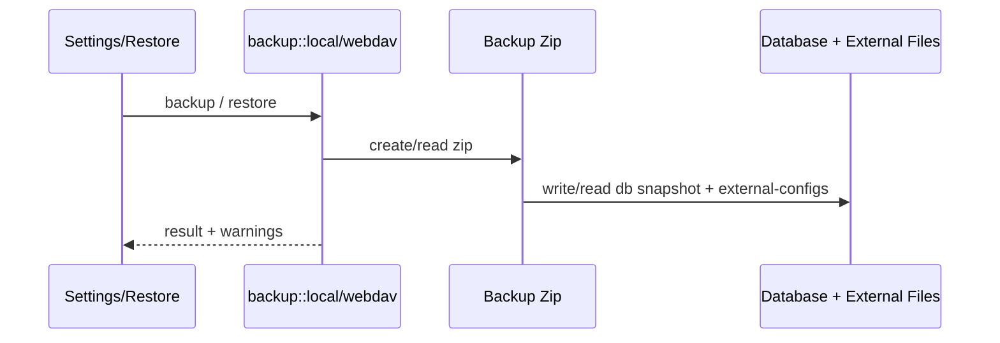

# Backup 后端模块说明

## 一句话职责

- `backup/` 负责本地备份恢复、WebDAV 备份恢复和自动备份调度。

## Source of Truth

- 备份包里的 `sqlite/ai-toolbox.db` 是 SQLite 主数据库快照；`db/` 只保留兼容旧 SurrealDB 备份/恢复流程的占位或 legacy 内容；`external-configs/` 是外部运行时配置和 prompt/auth 等文件快照。默认情况下数据库快照与外部文件两者都写入；当 `backup_cli_config_files_enabled=false` 时整段跳过 `external-configs/`（含 `root-dir.txt`），语义是保护本机 CLI 运行时文件，而不是承诺所有工具都能“只靠数据库迁移渠道”。Codex、Claude、Grok、Gemini CLI 等 DB-backed provider/prompt 可重建；OpenCode、OpenClaw、Pi 的 provider/model/config 以运行时文件为主数据，关闭后不会随备份迁移。
- 图片工作台资产文件默认进入备份包；是否写入 `image-studio/assets/` 由应用设置 `backup_image_assets_enabled` 控制，默认开启。
- CLI 运行时配置文件是否进入备份包由 `backup_cli_config_files_enabled` 控制，默认开启；缺字段按 `true` 处理（老用户兼容）。关闭后备份/恢复都不写 `external-configs/**`。
- 每个备份 zip 根目录写入 `backup_meta.json`（`version` + `cli_config_files_included`），用于恢复后判断是否需要自动 re-apply。`need_reapply` 仅在「本次恢复跳过 external-configs」或「meta 明确 `cli_config_files_included=false`」时为 true；**旧包无 meta 不因缺 external-configs 推断 re-apply**，避免残缺旧包误改本机配置。
- app data 下的动态资源缓存文件也是备份恢复对象，包括 `preset_models.json`、`models.dev.json`、`model_pricing.json` 和 `gateway_provider_profiles.json`；它们是远端数据缓存，不是仓库内 bundled resource 文件。
- 自定义备份项是 Backup 自己的 source of truth，不复用 SSH/WSL file mappings；保存路径时优先使用 `~/...` 或 `%APPDATA%/...` 这类可迁移格式。
- 文件过滤规则 `backup_file_filter_rules` 控制哪些工具路径应从备份包中排除，以及恢复时跳过这些路径。该能力属于用户扩展配置，新用户默认不注入任何规则。持久化字段只使用 `file_path`；UI options 必须来自后端当前实际会写入 `external-configs/<tool>/` 的文件列表，并尽量使用 `~/...` 这类跨平台可迁移路径。全局 CLI 配置开关关闭时整类跳过，不再叠加单文件过滤。
- restore 后真正继续参与运行的，不只是解压出来的文件路径；任何还会被后续同步/托盘/WSL/SSH 依赖的元数据也必须保持一致。
- 自动备份是否运行由应用设置驱动，调度器只消费设置，不自己持久化业务状态。
- 恢复时「是否跳过 external-configs」必须读 **恢复开始前** 的本机 settings，绝不能在 SQLite 覆盖后再读。
- 恢复确认可选 `skip_cli_custom_roots`：在 SQLite restore 成功后清空各 CLI common 的 `root_dir` / `config_path`（id=`common`），避免跨机旧路径；默认不勾选。
- 当 need_reapply 时写 `{app_data}/.reapply_applied_required`；启动 delayed task **串行**：refresh runtime location → re-apply 已应用 provider/prompt/config → skills → MCP → Windows 下单次受限范围 WSL sync。Flag 先删后跑；普通启动 WSL sync 检测到 restore flag 时必须让位。`.resync_required` 不是纯布尔：恢复阶段直接写回过的 `external-configs/<tool>/` 模块要写入 flag payload，最终 WSL sync 的 changed module 集合必须合并「直接恢复的模块」和「re-apply 改写的模块」。

## 核心设计决策（Why）

- 备份不是只备份数据库，还要把各工具外部配置文件、prompt、auth、skills 等一起打包，否则恢复后会出现“库里有记录、运行时文件缺失”的分叉。
- Skills 文件备份/恢复必须以当前 `skill_settings:skills.central_repo_path` 解析出的中央仓库目录为准，而不是固定 `{app_data_dir}/skills`。恢复 SQLite 快照后再解析该路径；若目标目录不存在，恢复流程负责创建。
- WebDAV 与本地备份共用备份 zip 生成能力，但上传/列举/恢复链路分离，这样可以分别处理网络错误和本地文件错误。
- 自动备份作为后台调度器常驻运行，周期性读取设置并决定是否执行，而不是把调度状态散落到 UI 层。
- 自定义备份项用 `custom-backup/manifest.json` 描述恢复目标，payload 使用稳定相对路径存放，避免把绝对路径直接作为 zip entry，也避免不同文件名互相覆盖。

## 关键流程

## 易错点与历史坑（Gotchas）

- 不要把备份理解成“只有数据库”。`external-configs/` 下的 OpenCode/Claude/Codex/OpenClaw 配置、prompt、auth 等同样关键。
- 不要把 SSH/WSL 映射当作自定义备份项来源。SSH/WSL 是同步规则；自定义备份项是备份恢复规则，两者状态语义不同。
- 关闭 `backup_image_assets_enabled` 只跳过图片资产文件，不会跳过数据库里的 `image_job` / `image_asset` 元数据；恢复后历史记录可能存在但图片文件不可读，这是用户显式选择的体积取舍。
- 关闭 `backup_cli_config_files_enabled` 只跳过 `external-configs/**` 磁盘文件，不会跳过 DB 中已有记录；UI 仍可能显示「已应用」。Codex、Claude、Grok、Gemini CLI 的 applied provider/prompt 会重建，OpenCode 只重建 applied prompt 与已存储的 Oh My 配置，Pi 只重建 applied prompt；OpenCode/OpenClaw/Pi 的 provider/model/main config 不从数据库猜写。
- `skip_cli_custom_roots=true` 时，SQLite restore 后要清空 common 中的 `root_dir/config_path`；无论是该选项还是全局跳过 runtime 文件，恢复阶段都不得读取备份里的 `root-dir.txt`，否则清库后的本机默认目标会再次被旧机器路径覆盖。
- re-apply 中 provider、prompt 和 Oh My config 是独立步骤：单步失败只记录 warning 并继续；Gateway takeover 只跳过被接管工具的 provider 投影，不能连 prompt 一起跳过。
- 恢复专用 apply/MCP 入口不得发中间 `wsl-sync-request-*`、`mcp-changed` 等自动同步事件。最终 WSL 同步只传播本轮实际改写的 CLI 模块，同时同步 MCP/Skills 一次，不能顺手覆盖受保护的 OpenClaw/OpenCode/Pi 本机运行时文件。
- 普通 `timeout(work())` 无法可靠抢占卡在同步文件 I/O 的 future。re-apply 要在独立 task 中运行，超时后 abort 并继续下一个 CLI；写入前再用 `spawn_blocking` 做短时无写入路径探测，降低不可达 UNC 路径拖死恢复链路的概率。
- 新增外部配置文件进入备份时，要同时检查本地备份、WebDAV 备份和 restore 路径，不要只改一个入口。
- 新增 app data 缓存文件进入备份时，也要同时检查本地备份、WebDAV 备份和 restore 路径；这些文件通常位于 zip 根目录，和 `preset_models.json` 的处理方式保持一致。
- SQLite-only 用户迁移完成后通常没有 `{app_data}/database` legacy 目录；本地/WebDAV 自动备份不能因为这个目录缺失而失败，必须继续写入 `sqlite/ai-toolbox.db` 和 manifest。
- Codex 全局 prompt 备份要同时保留两个已存在的已知文件：`AGENTS.md` 与 `AGENTS.override.md`。即使 override 当前生效，基础 `AGENTS.md` 仍是未来清空/删除 override 后的回退数据，不能只备份 active 文件。
- Grok 外部状态备份覆盖当前 runtime root 下的 `auth.json`、`config.toml`、`AGENTS.md` 和 `plugins/`，不默认备份 `sessions/`；恢复时必须尊重动态 root 与统一文件过滤规则。
- Grok `plugins/` 备份跳过 `.git`、`node_modules`、cache、build/dist/target 等可重建内容；目录中的 symlink 不跟随，恢复目标的现有相对路径组件若是 symlink 必须拒绝，避免写出 runtime root。
- Grok 的 `auth.json` 和可能包含模型 API key/header 的 `config.toml` 都按敏感文件处理；Unix 恢复后权限统一收紧为 `0600`。
- restore 处理跨平台路径时，不要只修提取路径；任何被后续同步或状态计算继续消费的元数据都要同步规范化。
- 非 Windows 目标恢复 Claude `settings.json` 时，必须通过共享 `coding::config_cleanup` 平台规则移除 Windows-only env；SQLite 快照里的 Claude common config、provider `settings_config` 和 `extra_settings_config` 也要同步清理，避免恢复后下一次 apply/provider 切换又把这些字段写回运行时文件。这个清理不应影响 Windows 上的恢复。
- 自定义目录恢复只覆盖备份包中存在的文件，不清空目标目录里额外文件；这是备份恢复，不是镜像同步。
- `zip::ZipWriter` 不允许重复 entry。新增外部配置目录或文件进入备份时，不要直接多次 `add_directory("external-configs/<tool>/")`；应复用共享写入链路并让目录 entry 幂等写入，否则自定义根目录与配置文件同时存在时会报 `Duplicate filename`。
- 文件过滤规则是统一的：备份时排除 = 恢复时跳过。不要为备份和恢复维护两套独立的过滤逻辑。
- 过滤规则按「工具 + 路径」精确匹配，不是全局文件名过滤。`~/.local/share/opencode/auth.json` 和 `~/.codex/auth.json` 是两条独立规则。
- 规则存在即生效，删除即失效；不要重新引入 `enabled` 或“预置”语义。
- UI 允许用户添加文件过滤规则时，后端不能只在少数固定文件处硬编码判断；所有 `external-configs/<tool>/<relative_path>` 的写入和恢复都必须经过同一个过滤 helper，确保用户规则真实生效。
- 恢复操作应使用操作开始前的当前过滤规则，避免旧备份里的 settings 覆盖当前用户用于保护本机路径的排除规则。
- 过滤只影响文件是否进入备份包/是否从备份包恢复，不影响数据库状态。跳过 auth.json 不会清理数据库中的 provider 配置。

## 跨模块依赖

- 依赖 `runtime_location` / backup utils 解析各工具当前实际配置、prompt、auth、skills 路径。
- 被 `settings/` 前端与 `lib.rs` 启动阶段依赖：恢复后可能触发 re-apply + skills/MCP 重同步，自动备份调度器在启动时常驻运行。
- 与 `coding::reapply_applied_runtime` 耦合：跳过 CLI 配置恢复后由该 helper 串行 re-apply 各 CLI 已应用渠道/prompt。
- 与 `skills/`、`wsl/`、`ssh/` 间接耦合：恢复出来的文件和元数据后续会继续被这些模块消费。

## 典型变更场景（按需）

- 新增某类外部文件进备份时：
  同时检查 backup zip、restore 输出路径、WebDAV 版本和 restore warning。
- 改自动备份策略时：
  同时检查 local/webdav 两条执行路径、失败节流和保留数量清理。

## 最小验证

- 至少验证：备份包里包含 `sqlite/ai-toolbox.db`、`db_manifest.json` 与相关 `external-configs/` 内容；SQLite-only 场景下不能要求 legacy `db/` 目录有真实数据库文件。
- 至少验证：restore 后关键外部配置文件落到正确位置。
- 涉及自定义备份项时，至少验证：`custom-backup/manifest.json` 存在、payload 文件存在、restore 后按 `~/...` 或 `%APPDATA%/...` 写回目标路径。
- 若本轮只改了文档或静态逻辑，也要明确说明尚未做真实备份→恢复端到端验证。
