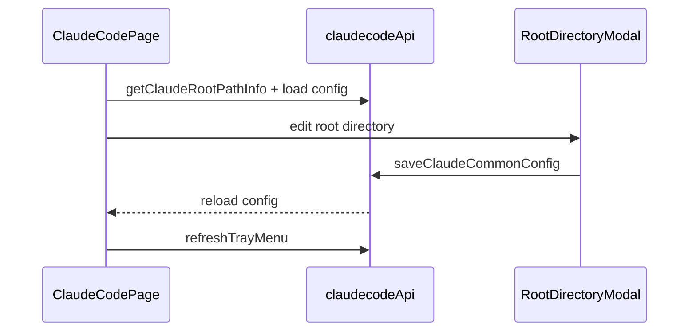

# Claude Code 前端模块说明

## 一句话职责

- `claudecode/` 页面负责 Claude Code provider/common config、根目录管理、prompt、plugin 与导入交互。

## Source of Truth

- 页面展示的根目录来源于后端 `getClaudeRootPathInfo()`，不是前端自己推导。
- Claude Code 页面管理的是根目录而不是单一配置文件路径；后续 `settings.json`、`CLAUDE.md` 等都从这个根目录派生。
- provider 的 `is_applied` 与运行时文件状态都以后台命令执行结果为准。

## 核心设计决策（Why）

- 根目录编辑复用共享 `RootDirectoryModal` 和 `useRootDirectoryConfig`，确保 Claude/Codex 页面对 `custom/env/shell/default` 的解释一致。
- 导入 provider 时先做冲突检查，再决定覆盖或创建副本，避免直接把已有来源 provider 覆盖掉。
- 页面很多操作后都要主动 `loadConfig()` 和 `refreshTrayMenu()`，不能假设后端事件会自动把当前 React 状态改对。

## 关键流程

## 易错点与历史坑（Gotchas）

- 不要把根目录编辑降级成“只改路径展示”；保存后真正会影响整个运行时文件派生。
- `sourceProviderId` 冲突必须先处理，不要新导入时直接无提示覆盖已有 provider。
- Optional 字段允许清空时，前端表单不要比后端存储模型更严格，否则会形成“能读不能存”的回归。
- 普通“新建 provider”和“复制已应用 provider”都应走普通创建语义，默认不自动应用；不要因为复制源当前已应用，就在提交对象或页面状态里把新记录当成已应用配置处理。
- 页面里的 `__local__` 不是普通新增 provider，而是当前生效本地配置的收编入口；当用户把它保存为正式 provider 时，产品语义是“把当前生效配置正式落库”，不是“基于当前配置再新建一个未应用草稿”。
- provider 模式只允许在新增或复制时选择。编辑已保存 provider 时必须隐藏模式选择，并沿用原 provider 的 `category`，不要允许官方/自定义互相切换。

## 跨模块依赖

- 依赖共享 `RootDirectoryModal` / `useRootDirectoryConfig`。
- 依赖后端 `claude_code::commands`、共享 favorite provider 和 All API Hub 导入组件。
- 与 `settings/` 间接共享根目录来源和 WSL Direct 语义，但本页面自己只展示 `source/path`。

## 典型变更场景（按需）

- 改根目录交互时：
  同时检查 modal 回填只在 `source === custom` 时生效。
- 改 provider 导入/删除时：
  同时检查冲突处理、favorite provider 备份和 tray refresh。

## 最小验证

- 至少验证：修改根目录后重新加载页面能看到新的 path info。
- 至少验证：导入 provider 冲突时会进入冲突弹窗，而不是静默覆盖。
