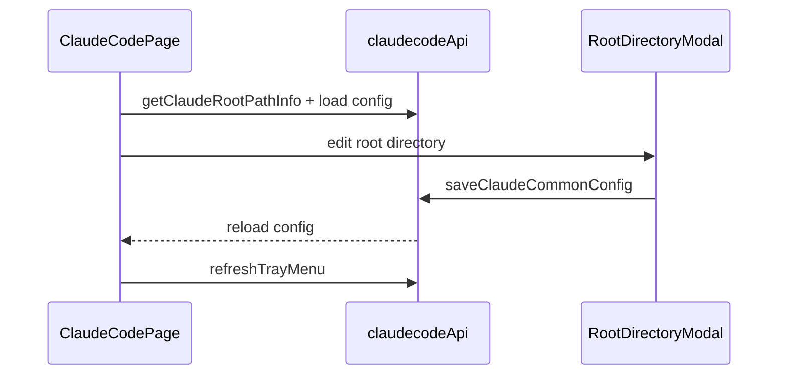

# Claude Code 前端模块说明

## 一句话职责

- `claudecode/` 页面负责 Claude Code provider/common config、根目录管理、prompt、plugin 与导入交互。

## Source of Truth

- 页面展示的根目录来源于后端 `getClaudeRootPathInfo()`，不是前端自己推导。
- Claude Code 页面管理的是根目录而不是单一配置文件路径；后续 `settings.json`、`CLAUDE.md` 等都从这个根目录派生。
- provider 的 `is_applied` 与运行时文件状态都以后台命令执行结果为准。
- 自定义 provider 的 Extra settings JSON 是 provider 记录的一部分，只在自定义渠道表单展示；官方订阅模式不展示也不写入额外字段。

## 核心设计决策（Why）

- 根目录编辑复用共享 `RootDirectoryModal` 和 `useRootDirectoryConfig`，确保 Claude/Codex 页面对 `custom/env/shell/default` 的解释一致。
- 导入 provider 时先做冲突检查，再决定覆盖或创建副本，避免直接把已有来源 provider 覆盖掉。
- 页面很多操作后都要主动 `loadConfig()` 和 `refreshTrayMenu()`，不能假设后端事件会自动把当前 React 状态改对。

## 关键流程

## 易错点与历史坑（Gotchas）

- 不要把根目录编辑降级成“只改路径展示”；保存后真正会影响整个运行时文件派生。
- `sourceProviderId` 冲突必须先处理，不要新导入时直接无提示覆盖已有 provider。
- Optional 字段允许清空时，前端表单不要比后端存储模型更严格，否则会形成“能读不能存”的回归。
- 普通“新建 provider”和“复制已应用 provider”都应走普通创建语义，默认不自动应用；不要因为复制源当前已应用，就在提交对象或页面状态里把新记录当成已应用配置处理。
- 页面里的 `__local__` 不是普通新增 provider，而是当前生效本地配置的收编入口；当用户把它保存为正式 provider 时，产品语义是“把当前生效配置正式落库”，不是“基于当前配置再新建一个未应用草稿”。
- provider 模式只允许在空白新增 provider 时选择。复制 provider 仍走创建新记录语义，但必须隐藏模式选择并沿用源 provider 的 `category`；编辑已保存 provider 也必须隐藏模式选择，不要允许官方/自定义互相切换。
- 自定义模式下的内置供应商 endpoint 会自动锁定 Base URL 和 API 格式，并在保存时写入 `meta.providerType` / `meta.apiFormat`；切回“自定义”时必须清掉 `providerType`，只保留用户手动选择的 `apiFormat`。
- Extra settings JSON 允许为空或 JSON object；保存时必须保留“用户清空”的语义，不能用 truthy 判断导致旧 extra settings 留在数据库或 settings.json 中。
- Extra settings 是高级可选配置，表单中默认折叠；编辑或复制已有非空 JSON object `extraSettingsConfig` 时必须自动展开，避免隐藏既有配置。
- Claude provider 模型表单以 `settingsConfig.env.ANTHROPIC_*` 为新写入来源：兜底模型写 `ANTHROPIC_MODEL`，Sonnet/Opus/Haiku 角色模型分别写 `ANTHROPIC_DEFAULT_*_MODEL`，显示名称写 `ANTHROPIC_DEFAULT_*_MODEL_NAME`。前端仍要兼容读取旧顶层 `model` / `haikuModel` / `sonnetModel` / `opusModel` / `reasoningModel`，但新表单不再提供 Reasoning 模型编辑入口，也不应新写 `ANTHROPIC_REASONING_MODEL`。
- Sonnet/Opus 的 1M 声明不是独立布尔字段，只能通过模型 ID 末尾 `[1M]` 后缀表达；展示、收藏 provider 和连通性测试使用模型 ID 时要按场景剥离该后缀，不能把它当作真实上游模型名的一部分。
- Gateway 现在是 direct → single → failover 三态。single 入口在已应用 provider 卡片的“网关代理”按钮；single/failover 接管期间都必须锁定其他 provider 的“应用”入口，failover 时卡片额外显示 P0/P1 优先级，切 P0 必须先恢复直连。
- 插件页的全部启用/全部禁用只作用于“已安装”Tab 中 user scope 已安装插件；非 user scope 卡片仍只能提示当前不可直接操作，不要把批量入口扩展到 project/local/managed scope。

## 跨模块依赖

- 依赖共享 `RootDirectoryModal` / `useRootDirectoryConfig`。
- 依赖后端 `claude_code::commands`、共享 favorite provider 和 All API Hub 导入组件。
- 与 `settings/` 间接共享根目录来源和 WSL Direct 语义，但本页面自己只展示 `source/path`。

## 典型变更场景（按需）

- 改根目录交互时：
  同时检查 modal 回填只在 `source === custom` 时生效。
- 改 provider 导入/删除时：
  同时检查冲突处理、favorite provider 备份和 tray refresh。

## 最小验证

- 至少验证：修改根目录后重新加载页面能看到新的 path info。
- 至少验证：导入 provider 冲突时会进入冲突弹窗，而不是静默覆盖。
