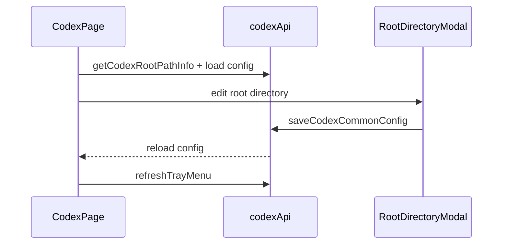

# Codex 前端模块说明

## 一句话职责

- `codex/` 页面负责 Codex provider/common config、根目录管理、prompt、plugin 与导入交互。

## Source of Truth

- 根目录来源于后端 `getCodexRootPathInfo()`，并决定页面实际针对哪份 `config.toml` / `auth.json` / active global prompt 文件工作。
- provider 最终生效状态以后端应用结果为准，前端本地状态只是展示。
- prompt 管理最终作用的是当前根目录下的 Codex active global prompt 文件。后端会按 upstream 语义优先使用非空 `AGENTS.override.md`，否则使用 `AGENTS.md`。
- 历史同步入口作用于后端解析出的 Codex history source。会话管理来源为 `all` 时，历史同步这种写操作默认落到本机；当前 Codex root 本身是 WSL Direct 时只作用于该 WSL root。前端只展示后端状态和触发命令，不自行推断数据库或 session 文件格式。

## 核心设计决策（Why）

- Codex 与 Claude Code 一样使用共享根目录编辑逻辑，保证 `custom/env/shell/default` 语义一致。
- provider 导入同样先做 `sourceProviderId` 冲突判断，避免重复导入同一来源时形成歧义。
- 页面操作后需要显式 `refreshTrayMenu()`，因为托盘是另一套消费者，不能假设 React 页面重绘就等于托盘已刷新。
- provider 表单的模型获取分两条链路：官方订阅读取后端共享模型目录，自定义网关继续走通用 `fetch_provider_models`；不要让官方模式依赖 Base URL/API Key 输入。

## 关键流程

## 易错点与历史坑（Gotchas）

- 不要把页面上的 root path 只当展示信息。它直接决定当前读写哪份 `config.toml` / `auth.json` / active prompt 文件。
- 导入 provider 时的冲突分支、favorite provider 备份和 tray refresh 是一组相邻语义，改一个时通常要一起检查。
- 前端表单不要引入比后端更强的 paired validation，尤其是可选字段和导入数据兼容性相关字段。
- 普通“新建 provider”和“复制已应用 provider”都应走普通创建语义，默认不自动应用；不要因为复制源当前已应用，就在提交对象或页面状态里把新记录当成已应用配置处理。
- 页面里的 `__local__` 不是普通新增 provider，而是当前生效本地配置的收编入口；当用户把它保存为正式 provider 时，产品语义是“把当前生效配置正式落库”，不是“基于当前配置再新建一个未应用草稿”。
- `__local__` 还没有正式 provider 数据库记录，不能进入依赖持久化 provider ID 的官方账号管理链路；页面应先让用户保存收编，再展示或调用官方账号接口。
- 官方订阅模型列表只是辅助填写 `model` 字段。账号套餐、quota 和真实可调用性以 Codex 官方账号明细/运行时请求为准，前端不应在模型下拉阶段做额外拦截。
- 官方账号额度窗口由后端解析并投影；页面只展示返回的 `5h`、weekly、monthly 明细，不根据套餐、字段顺序或文案自行推断。
- provider 模式只允许在空白新增 provider 时选择。模式入口并入表单顶部“渠道”选择行：空白新增可在“自定义/官方/内置渠道”之间切换；复制 provider 仍走创建新记录语义，但必须沿用源 provider 的 `category`；编辑已保存 provider 也必须保留既有 `category`，不要允许官方/自定义互相切换。
- 自定义模式下的内置供应商 endpoint 会填入 Base URL、API 格式和模型映射，但只锁定 API 格式，不锁定 Base URL；保存内置 endpoint 时只写 `meta.gatewayProfile={tool:"codex",profileId,endpointId}` 引用，`settingsConfig.config` 中的 `base_url` 必须使用用户当前表单里的 Base URL。切回普通“自定义”时必须清掉 `gatewayProfile`，只保留用户手动选择的 `apiFormat`；不要把 `providerType` / `apiKeyField` / `reasoningField` / `defaultMaxTokens` / 图片策略这类 profile 派生快照写进 provider meta。
- 内置供应商 endpoint 的 Gateway meta 不只包含 `providerType` / `apiFormat`。如果 profile endpoint 带 `reasoningField` 或 `codexChatReasoning`，Codex provider 表单也只保存 `gatewayProfile` 引用；runtime 每次按当前 profile catalog 动态解析 effective meta，保证 ReasoningField 和 Codex -> Chat 多 vendor reasoning/thinking 矩阵跟随内置 catalog 更新。切回官方或普通自定义时不能伪造这些 provider 专属字段。
- 自定义 Codex provider 的“模型映射”入口放在“获取模型”按钮后面；打开表单时如果 `settingsConfig.modelCatalog.models` 有有效模型则默认展开。手动模式下 API 格式不是默认 `openai_responses` 时也要自动展开模型映射区域，切回默认格式不自动收起，避免覆盖用户手动状态。官方订阅模式不保存模型映射。
- Codex 的 `settingsConfig.modelCatalog` 由 `useCodexConfigState` 的 `codexCatalogModels` 状态持久化，不是普通 Form 字段。内置 endpoint 提供 `modelCatalog` 时，应同步该 hook 状态；不要用 `form.setFieldValue('modelCatalog', ...)` 伪造保存。
- `modelCatalog.models` 不是只给模型下拉用的三字段列表。`supportsImage`、`vision`、`attachment`、`modalities` 这类能力字段会被 Gateway runtime 用来判断 text-only/vision 行为，前端解析和保存规范化时必须保留显式 boolean（尤其是 `false`）和 `modalities.input/output`，不能只写回 `model/displayName/contextWindow`。
- Codex 内置 Anthropic/Claude 协议 endpoint 如果没有显式 `modelCatalog`，添加供应商时应从同一渠道的 Claude endpoint 角色模型派生初始模型映射；如果 endpoint 自带 `modelCatalog`，仍以 endpoint 自身目录为准。派生逻辑只用于补齐添加表单的初始值，不能改变 Base URL 可编辑和保存用户当前输入值的语义。
- Gateway 现在是 direct → single → failover 三态。single 入口在已应用 provider 卡片的“网关代理”按钮；single/failover 接管期间都必须锁定其他 provider 的“应用”入口，failover 时卡片额外显示 P0/P1 优先级，切 P0 必须先恢复直连。
- 前端不要假设 Codex prompt 文件名永远是 `AGENTS.md`。展示路径、删除已应用 prompt 后的刷新和同步结果都以后端返回/事件为准。
- 插件页的全部启用/全部禁用只作用于“已安装”Tab 中当前 runtime 的已安装插件，不作用于市场可安装列表；全部启用需要允许后端同时开启 plugins feature，成功后仍按现有规则提示用户重启 Codex。
- 历史同步入口放在会话管理区域标题栏右侧，不属于 provider 卡片或已应用 provider 菜单；同步和恢复都是高影响本地写操作，必须使用后端返回的来源、统计、备份路径和锁等待信息展示结果，恢复最新备份必须强确认。历史同步默认只修复 provider 路由，不应在 UI 文案中承诺会同步或改写 model。
- “统一 Codex 会话历史”入口属于 Codex 更多选项，不属于手动历史同步弹窗；开关行应沿用 SidebarSettingsModal 的左右布局，说明文字放在 Switch 下方。开启确认里“迁入现有官方会话历史”默认不勾，关闭确认里只有存在当前 Codex root 的迁移账本时才提供按账本恢复；Gateway 接管期间前端应禁用开关并提示先恢复直连。

## 跨模块依赖

- 依赖共享 `RootDirectoryModal` / `useRootDirectoryConfig`。
- 依赖后端 `codex::commands` 和共享 favorite provider、All API Hub 组件。
- 间接受 `settings/` 和 `runtime_location` 的 WSL Direct 语义影响，但页面本身只显示 path info。

## 典型变更场景（按需）

- 改根目录逻辑时：
  同时检查页面顶部 path info、modal 回填、历史同步目标和保存后 reload。
- 改 provider 删除/导入时：
  同时检查冲突处理、favorite provider 兜底和 tray refresh。

## 最小验证

- 至少验证：修改根目录后页面重新读取到新的路径来源。
- 至少验证：导入同源 provider 冲突时有明确覆盖/副本分支。
- 改历史同步 UI 时，至少验证会话管理标题栏入口、来源切换、本机/WSL 状态弹窗、同步确认、恢复最新备份强确认和 Session Manager 刷新触发。
- 改统一会话历史 UI 时，至少验证开启/关闭确认弹窗、迁移/恢复结果提示、Gateway 接管禁用态和 settings store 刷新。
