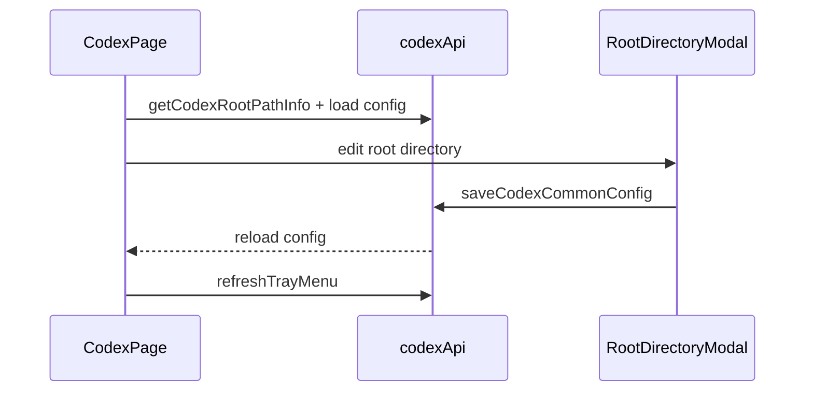

# Codex 前端模块说明

## 一句话职责

- `codex/` 页面负责 Codex provider/common config、根目录管理、prompt、plugin 与导入交互。

## Source of Truth

- 根目录来源于后端 `getCodexRootPathInfo()`，并决定页面实际针对哪份 `config.toml` / `auth.json` / active global prompt 文件工作。
- provider 最终生效状态以后端应用结果为准，前端本地状态只是展示。
- prompt 管理最终作用的是当前根目录下的 Codex active global prompt 文件。后端会按 upstream 语义优先使用非空 `AGENTS.override.md`，否则使用 `AGENTS.md`。
- 历史同步入口作用于当前 Codex root 下的本机历史状态；前端只展示后端状态和触发命令，不自行推断数据库或 session 文件格式。

## 核心设计决策（Why）

- Codex 与 Claude Code 一样使用共享根目录编辑逻辑，保证 `custom/env/shell/default` 语义一致。
- provider 导入同样先做 `sourceProviderId` 冲突判断，避免重复导入同一来源时形成歧义。
- 页面操作后需要显式 `refreshTrayMenu()`，因为托盘是另一套消费者，不能假设 React 页面重绘就等于托盘已刷新。
- provider 表单的模型获取分两条链路：官方订阅读取后端共享模型目录，自定义网关继续走通用 `fetch_provider_models`；不要让官方模式依赖 Base URL/API Key 输入。

## 关键流程

## 易错点与历史坑（Gotchas）

- 不要把页面上的 root path 只当展示信息。它直接决定当前读写哪份 `config.toml` / `auth.json` / active prompt 文件。
- 导入 provider 时的冲突分支、favorite provider 备份和 tray refresh 是一组相邻语义，改一个时通常要一起检查。
- 前端表单不要引入比后端更强的 paired validation，尤其是可选字段和导入数据兼容性相关字段。
- 普通“新建 provider”和“复制已应用 provider”都应走普通创建语义，默认不自动应用；不要因为复制源当前已应用，就在提交对象或页面状态里把新记录当成已应用配置处理。
- 页面里的 `__local__` 不是普通新增 provider，而是当前生效本地配置的收编入口；当用户把它保存为正式 provider 时，产品语义是“把当前生效配置正式落库”，不是“基于当前配置再新建一个未应用草稿”。
- `__local__` 还没有正式 provider 数据库记录，不能进入依赖持久化 provider ID 的官方账号管理链路；页面应先让用户保存收编，再展示或调用官方账号接口。
- 官方订阅模型列表只是辅助填写 `model` 字段。账号套餐、quota 和真实可调用性以 Codex 官方账号明细/运行时请求为准，前端不应在模型下拉阶段做额外拦截。
- provider 模式只允许在新增或复制时选择。编辑已保存 provider 时必须隐藏模式选择，并沿用原 provider 的 `category`，不要允许官方/自定义互相切换。
- 前端不要假设 Codex prompt 文件名永远是 `AGENTS.md`。展示路径、删除已应用 prompt 后的刷新和同步结果都以后端返回/事件为准。
- 历史同步入口放在会话管理区域标题栏右侧，不属于 provider 卡片或已应用 provider 菜单；同步和恢复都是高影响本地写操作，必须使用后端返回的统计、备份路径和锁等待信息展示结果，恢复最新备份必须强确认。历史同步默认只修复 provider 路由，不应在 UI 文案中承诺会同步或改写 model。

## 跨模块依赖

- 依赖共享 `RootDirectoryModal` / `useRootDirectoryConfig`。
- 依赖后端 `codex::commands` 和共享 favorite provider、All API Hub 组件。
- 间接受 `settings/` 和 `runtime_location` 的 WSL Direct 语义影响，但页面本身只显示 path info。

## 典型变更场景（按需）

- 改根目录逻辑时：
  同时检查页面顶部 path info、modal 回填、历史同步目标和保存后 reload。
- 改 provider 删除/导入时：
  同时检查冲突处理、favorite provider 兜底和 tray refresh。

## 最小验证

- 至少验证：修改根目录后页面重新读取到新的路径来源。
- 至少验证：导入同源 provider 冲突时有明确覆盖/副本分支。
- 改历史同步 UI 时，至少验证会话管理标题栏入口、状态弹窗、同步确认、恢复最新备份强确认和 Session Manager 刷新触发。
