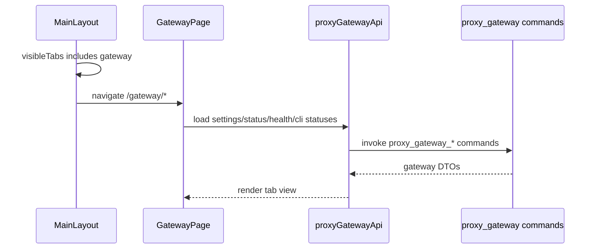

# Gateway 前端模块说明

## 一句话职责

- `gateway/` 页面负责本机代理网关的独立入口、状态统计视图、请求记录视图和网关设置视图。

## Source of Truth

- 网关设置、运行状态、CLI 接管状态都以后端 `proxy_gateway_*` Tauri 命令返回为准，前端不自行持久化。
- 顶部 `网关` 入口可见性来自全局 `visibleTabs`，只表示 UI 入口是否显示，不代表启动、停止或禁用网关服务。
- 请求列表和统计聚合以后端 SQLite 摘要命令为准；前端只能通过 `proxy_gateway_request_logs`、`proxy_gateway_usage_*`、`proxy_gateway_provider_stats`、`proxy_gateway_model_stats` 读取，不直接扫描数据库或文件目录。
- 请求详情优先以后端 JSONL 文件详情命令为准；`body`、`headers`、`response` 和 attempt/failover 过程只在详情文件里读取，不进入列表/统计状态。若详情文件不存在，后端可以用 SQLite 摘要降级返回基础字段，前端应继续把 body/header 显示为空态。
- 模型健康度仍以后端本地文件状态为准，前端只能通过后端命令读取。

## 核心设计决策（Why）

- `网关` 和 `Image` 一样是 AI Toolbox 的独立工作台能力，放在顶栏右侧动作区，不放进 OpenCode / Claude / Codex / Gemini CLI 的 coding 子 Tab。
- 页面内部使用 `统计 / 请求 / 设置` 三个路由化 Tab：`设置` 承载真实可写配置，`统计` 与 `请求` 只展示后端数据库摘要或详情文件能返回的真实数据和空态，不伪造请求量或图表数据。
- 页面顶部的启动/停止和健康检查是网关级通用动作，放在内部 Tab 前；统计和请求 Tab 的数据刷新由各自内容区工具栏承载。
- 设置 Tab 不再提供保存按钮，字段变更后由设置面板自动调用后端保存。
- 关闭设置页“模块显示”里的 `网关` 只隐藏顶部入口；如果用户仍打开 `/gateway/*`，布局层负责跳回可见页面，不修改网关运行态。

## 关键流程

## 易错点与历史坑（Gotchas）

- 不要把 `gateway` 加入 WSL/SSH 的 runtime 同步模块集合；它在 `visibleTabs` 里只是顶栏入口 key。
- 不要把隐藏 `gateway` 入口理解成停止服务。停止服务必须继续走网关设置里的停止按钮和后端 stop preflight。
- 请求 Tab 的列表占满主视图；点击记录后再以大弹窗展示“请求记录 / 请求体 / Headers / Response”详情。不要为了列表页一次性拉大 body，也不要把详情文件字段同步进列表 store。
- 请求列表只展示后端数据库摘要 DTO；点击具体请求后再读取详情文件。不要把 request/response body、完整 headers、attempt 明细或大块 JSON 放进列表状态。
- 请求列表应保持高密度表格展示：时间、供应商、模型、状态、token、费用和延迟来自摘要表；尝试次数只放详情记录里，不在列表 badge 里展示，避免误解 provider 内尝试和总尝试。
- 请求详情 Body tab 如果后端同时返回 `request_body` 与不同的 `upstream_request_body`，要分别显示“收到的请求体（原始）”和“实际发出的请求体（整流后）”；相同或没有上游快照时只显示一段。
- 请求详情里的长 body / headers / response 文本块默认折叠并提供复制，折叠条件要同时考虑行数和字符长度；压缩 JSON 这类大型单行文本也不能直接把 `<pre>` 全展开。
- 统计页的相对时间范围（Today、1d、7d 等）必须在每次刷新请求发起时重新计算；不要用 `useMemo` 把 `Date.now()` 派生出的 `endDate` 冻结在组件挂载时。
- 设置 Tab 自动保存有 debounce；顶部启动按钮必须优先使用设置面板当前 draft 立即保存后启动，不能重新读取旧的后端 settings 后启动。
- 统计图表直接使用 Recharts；不要为了网关统计引入额外图表封装层。图表必须有 tooltip/legend，并使用主题变量保证浅色/深色模式可读。
- 如果未来新增视图依赖的后端查询命令还没暴露，页面只能显示真实空态，不能用假数据填充图表。

## 跨模块依赖

- 依赖 `@/services/proxyGatewayApi` 暴露的 Tauri 命令包装。
- 依赖 `MainLayout` 的顶部动作区、`routeConfig` 的 KeepAlive 路由和 `settingsStore.visibleTabs`。
- 设置视图当前复用 `GatewaySettingsPanel`，其数据仍通过同一组后端命令读取和保存。
- `GatewayPage.tsx` 只保留页面 shell、标题和内部 Tab 路由；统计数据加载/展示放 `components/GatewayStatisticsView.tsx`，请求列表/详情放 `components/GatewayRequestsView.tsx`，纯格式化函数放 `utils/gatewayFormatters.ts`。新增统计或请求 UI 时优先扩展对应组件，不要把业务逻辑重新写进页面 shell。
- 样式按组件边界拆分。页面 shell 使用 `pages/GatewayPage.module.less`，统计视图使用 `GatewayStatisticsView.module.less`，请求视图使用 `GatewayRequestsView.module.less`，统计卡片使用 `StatTile.module.less`。

## 最小验证

- 至少验证：`visibleTabs` 包含 `gateway` 时，顶栏在 `Image` 左侧显示网关入口。
- 至少验证：关闭 `gateway` 后，`/gateway/*` 会跳回可见页面，但不会调用停止网关命令。
- 至少验证：`/gateway/statistics`、`/gateway/requests`、`/gateway/settings` 三个内部 Tab 可切换且 URL 稳定。
- 至少验证：顶部通用启动/停止、健康检查按钮在三个 Tab 前保持可用，且统计/请求内容区各自刷新按钮能重载当前视图。
- 至少验证：统计、请求、设置三个 Tab 内容区不再出现重复的标题/副标题/刷新工具栏。
- 至少验证：设置 Tab 修改字段会自动保存。
- 至少验证：统计页从真实 SQLite 摘要/日聚合命令读取数据，空数据时显示空态，不伪造请求量。
- 至少验证：请求页列表只拉数据库摘要，点击记录后弹出 80% 窗口级大弹窗再按 trace id 拉文件详情，并能展示未保存 body/headers 的空态。
- 至少验证：设置 Tab 自动保存仍走原有后端保存命令，运行中保存会同步更新运行态共享 settings。
