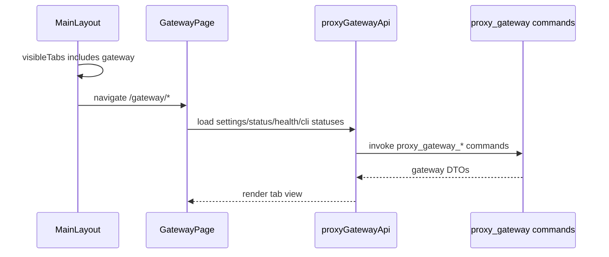

# Gateway 前端模块说明

## 一句话职责

- `gateway/` 页面负责本机代理网关的独立入口、状态统计视图、请求记录视图和网关设置视图。

## Source of Truth

- 网关设置、运行状态、CLI 接管状态都以后端 `proxy_gateway_*` Tauri 命令返回为准，前端不自行持久化。
- 顶部 `网关` 入口可见性来自全局 `visibleTabs`，只表示 UI 入口是否显示，不代表启动、停止或禁用网关服务。
- 请求列表和统计聚合以后端 SQLite 摘要命令为准；前端只能通过 `proxy_gateway_request_logs`、`proxy_gateway_usage_*`、`proxy_gateway_provider_stats`、`proxy_gateway_model_stats` 读取，不直接扫描数据库或文件目录。
- 本地 session 用量是否出现在统计页和请求列表由网关设置 `session_usage_enabled`（设置页“日志与统计”区，默认开启）在后端查询层过滤决定，前端查询参数不变；关闭后请求页来源筛选选“Session”显示的是真实空态，前端不要按设置自行隐藏筛选选项或伪造来源标签。
- 模型定价管理入口放在统计页筛选栏右侧，前端通过 `get_model_pricing_list` / `upsert_model_pricing` / `delete_model_pricing` 操作后端 `model_pricing` 表；手动“同步官方价格”只调用后端远端同步命令并刷新列表；每 CLI 默认计费配置通过 `ProxyGatewaySettings.app_configs` 保存，不另建前端本地状态源。
- 请求详情优先以后端 JSONL 文件详情命令为准；`body`、`headers`、`response` 和 attempt/failover 过程只在详情文件里读取，不进入列表/统计状态。若详情文件不存在，后端可以用 SQLite 摘要降级返回基础字段，前端应继续把 body/header 显示为空态。
- 模型健康度仍以后端本地文件状态为准，前端只能通过后端命令读取。

## 核心设计决策（Why）

- `网关` 和 `Image` 一样是 AI Toolbox 的独立工作台能力，放在顶栏右侧动作区，不放进 OpenCode / Claude / Codex / Gemini CLI 的 coding 子 Tab。
- 页面内部使用 `统计 / 明细 / 设置` 三个路由化 Tab：`设置` 承载真实可写配置，`统计` 与 `明细` 只展示后端数据库摘要或详情文件能返回的真实数据和空态，不伪造请求量或图表数据。明细 Tab 即请求明细视图，路由路径仍是 `/gateway/requests`。
- 本地会话用量与网关请求共用统计/请求入口。应用后台独立同步本地记录，页面激活或恢复可见时也通过既有同步命令补齐并静默刷新；不能以 gateway running、CLI 接管或当前 Tab 是否为设置作为本地用量可见的前置条件。同步命令本身受设置页“本地会话统计”开关门控：开关关闭时后端导入是零计数 no-op，前端无需为它加额外的调用条件。
- 页面顶部的启动/启停和健康检查是网关级通用动作，放在内部 Tab 前；统计和明细 Tab 的数据刷新由各自内容区工具栏承载。
- 运行中顶部不再直接放“停止”主按钮，而使用“启停”下拉：`重启` / `停止`。停止仍走原 preflight；重启走后端热重启，允许在 CLI 已接管时执行。
- 设置 Tab 不再提供保存按钮，字段变更后由设置面板自动调用后端保存。
- 关闭设置页“模块显示”里的 `网关` 只隐藏顶部入口；如果用户仍打开 `/gateway/*`，布局层负责跳回可见页面，不修改网关运行态。

## 关键流程

```mermaid
sequenceDiagram
  participant Header as MainLayout
  participant Page as GatewayPage
  participant Api as proxyGatewayApi
  participant Cmd as proxy_gateway commands

  Header->>Header: visibleTabs includes gateway
  Header->>Page: navigate /gateway/*
  Page->>Api: load settings/status/health/cli statuses
  Api->>Cmd: invoke proxy_gateway_* commands
  Cmd-->>Api: gateway DTOs
  Api-->>Page: render tab view
```

## 易错点与历史坑（Gotchas）

- `transport=websocket` 的普通请求按 `stream_outcome` 显示业务终态，不展示内部 HTTP 占位 `0`，也不把握手 `101` 展示为模型成功。`websocket_handshake` 的 `426` 是 HTTP 回退提示，使用中性文本；真实握手错误仍展示状态。WS 标记和预热标记沿用现有紧凑副文本，主题状态色只作辅助。
- WS 握手不展示 Token/费用；预热只在后端有真实 Token 时展示用量。连接/response/previous/stream ID、握手状态/尝试和事件错误从 JSONL detail 读取，长 ID 要能悬停查看，回退原因允许换行；summary-only 不伪造这些详情。Headers tab 标明所显示的是客户端握手请求和网关握手响应。
- 不要把 `gateway` 加入 WSL/SSH 的 runtime 同步模块集合；它在 `visibleTabs` 里只是顶栏入口 key。
- 不要把隐藏 `gateway` 入口理解成停止服务。停止服务必须继续走网关设置里的停止按钮和后端 stop preflight。
- 明细 Tab 的列表占满主视图，筛选栏顺序为 CLI、时间、来源、状态、搜索、操作；点击记录后再以大弹窗展示“请求记录 / 请求体 / Headers / Response”详情。不要为了列表页一次性拉大 body，也不要把详情文件字段同步进列表 store。
- 请求列表只展示后端数据库摘要 DTO；点击具体请求后再读取详情文件。不要把 request/response body、完整 headers、attempt 明细或大块 JSON 放进列表状态。
- 请求列表应保持高密度表格展示：时间、供应商、请求摘要、词元、耗时、令牌/秒、成本、状态来自摘要表（成本、状态固定最后两列）；模型生成请求显示模型与用量，模型列表、上下文压缩、连接探测等无模型请求显示脱敏后的方法/路径摘要；尝试次数只放详情记录里，不在列表 badge 里展示，避免误解 provider 内尝试和总尝试。请求/模型列副标题显示紧凑 Token 明细（输入/输出/缓存），「不完整」与「额外 Token」标记追加其后。
- 词元列展示两行：上 `总计: {total}`，下缓存命中率 `{rate} 缓存命中`（`缓存读取 /（非缓存输入 + 缓存写入 + 缓存读取）`；`null` 显示 `-`，真实 `0` 显示 `0.0% 缓存命中`）；不要把 token 数拆成独立「读缓存」列（已按用户决策移除，Token 明细由请求/模型列副标题承载）；耗时列展示 `首字 {value}` / `总耗时 {value}` 两行；数字用千分位全量格式，不用紧凑缩写。
- 请求列表的词元 / 成本列只对模型生成请求和 Codex Compact 请求显示数值；模型列表、连接探测和普通无模型请求没有 usage 语义，应显示 `-`，不要把摘要里的 `0` 格式化成真实用量。
- `data_source=session` 的本地记录即使未记录模型名，也必须显示已有 token/费用，来源显示“Session”；HTTP 状态、流式标记、耗时、TPS、尝试次数显示 `-`，不能把 SQLite 的兼容占位值当成实测。供应商不可从当前配置推测，native 供应商统计不显示 HTTP 成功率，模型统计的未知名称显示“未记录模型”，平均耗时 null 显示 `-`。
- 统计与请求筛选使用独立 `GatewayUsageTool`，原生采集工具不能混入网关接管配置；没有网关测量的工具 RPM 显示 `-`。Session 列表保留来源标签，并可显示原生 provider 历史标签；渠道搜索也匹配该标签，不把它映射到当前 provider 配置。
- Session 的逐调用/回合汇总/累计差额、原生调用数、完整性、原始总量及费用来源由后端 usage_metadata 提供。未知调用数不按一条明细推算一次；分页的条数与统计调用数可以不同。累计记录必须解释观察时间口径，支持负费用调整；额外 Token 在总量、详情和趋势中独立展示，不误标为普通输入。数据来源筛选只是显示过滤，不能代替后端跨源去重。
- 统计粒度（逐调用/回合汇总/累计差额）只是后端统计语义，不要在请求列表或请求详情里展示粒度文本（用户决策）：请求详情不出现「统计粒度」字段行，列表词元列的第二行固定为缓存命中率，不承载粒度文案。累计记录的观察口径由详情里 gated on `granularity === 'session'` 的「累计区间 / 时间口径」行解释。
- 请求工具栏的日期使用与统计页相同的紧凑预设下拉，默认保留“全部时间”，只有选择“自定义”才展示起止时间。日期预设不能占据可拉伸的大块空白；自定义区间与操作区允许自然换行，不能把时间输入压成几个字符。验证英文标签与禁用/加载状态，避免按钮被挤出操作区域。
- 本地记录的正文/Headers/Response 空态应解释本地用量不包含 HTTP 明细，不能沿用“在网关设置开启记录”的提示；开启网关日志无法补出过去直连请求的明细。
- 手动同步展示新增/更新/跳过计数；部分失败使用独立的 warning notice 并保留成功数据，不能被紧随其后的列表刷新清掉，也不能当成全部失败或全部成功。后台同步事件仍只静默刷新。
- 请求详情 Body tab 如果后端同时返回 `request_body` 与不同的 `upstream_request_body`，要分别显示“收到的请求体（原始）”和“实际发出的请求体（整流/转换后）”；相同或没有上游快照时只显示一段。
- 请求详情 Response tab 如果后端同时返回 `upstream_response_body` 与不同的 `response_body`，要分别显示“上游原始响应（转换前）”和“返回给客户端的响应（转换后）”；相同或没有上游快照时只显示一段。
- 请求详情里的长 body / headers / response 文本块默认折叠并提供复制，折叠条件要同时考虑行数和字符长度；压缩 JSON 这类大型单行文本也不能直接把 `<pre>` 全展开。
- `gateway-failover` 属于代理流量中的后台状态事件，只能用于刷新状态、统计或请求记录；不要触发全局 notification/message 弹窗，避免每次上游故障转移都打断客户端使用。
- `usage-log-recorded` 属于后台 usage 落库事件，只能静默刷新统计和请求列表；高频请求下必须做节流/防抖合并，不能每条请求都打断 UI 或触发全局 notification/message。
- 统计页和请求页的相对时间范围（Today、1d、7d 等）必须在每次刷新请求发起时重新计算；不要用 `useMemo` 或搜索时生成的绝对时间把 `endDate` 冻结。请求页继续区分筛选草稿与已提交筛选：刷新/翻页只消费已提交范围，自定义绝对时间保持固定，清空和“全部时间”保留无日期限制的语义。
- 设置 Tab 自动保存有 debounce；顶部启动按钮必须优先使用设置面板当前 draft 立即保存后启动，不能重新读取旧的后端 settings 后启动。
- 统计图表直接使用 Recharts；不要为了网关统计引入额外图表封装层。图表必须有 tooltip/legend，并使用主题变量保证浅色/深色模式可读。
- 定价管理弹窗遵循全局 Modal 规范：不重度覆盖 Ant Design Modal chrome，上半部分用 `sectionCard` 风格承载默认配置，下半部分用 Ant Design Table 原生样式展示模型定价。
- 定价管理弹窗里的“同步官方价格”按钮位于模型定价标题行右侧、添加按钮左边；成功后提示新增条数并刷新表格，失败只在当前操作中提示错误。
- 如果未来新增视图依赖的后端查询命令还没暴露，页面只能显示真实空态，不能用假数据填充图表。
- Gateway 辅助说明文字统一使用 `fontSize: 10` 和 `color: var(--color-text-tertiary)`，避免设置页和统计页说明文字风格漂移。
- 请求模型后的 effort 只显示后端 `reasoning_effort`，不解析模型名或请求正文。耗时按首字（近似首包）/总耗时展示并保留秒的小数精度；现有 TTFT 记录的是首个写出的非空 chunk，可能含 SSE 控制事件，不能宣传为严格的首个文字 token。
- TPS 只对有 usage 语义的请求派生，分子仅为输出 token：流式且已记录首包时除以 `duration_ms - first_token_ms`，非流式或缺首包时除以总耗时；无输出或无有效生成区间显示 `-`。列表用独立「令牌/秒」列展示，列内只显示实际计算的带单位数值或 `-`，不加 TPS 前缀；明细保留 TPS 标签，使用相同的带单位数值。最多保留一位小数并省略末尾 `.0`。字段说明必须解释这两种计时口径。
- 供应商缓存命中率直接展示后端输入 token 加权比例（0..1）；用量概览从当前 CLI / 时间范围的 summary 总量计算同一比例：`cache_read / (fresh_input + cache_creation + cache_read)`，不要平均供应商百分比。`null` 显示 `-`，真实 `0` 显示 `0.0%`；输出 token 不参与命中率。
- 用量概览采用用户指定的 cc-switch 结构：上方 Token 总量、请求数和成本，下方分别展示新增输入、输出、缓存创建、缓存命中与命中率进度条；不再使用原来的三张装饰性大卡片。缓存创建展示后端已记录总量，不能仅根据 CLI 名称猜测是否支持并强行改成 N/A。
- 概览“总成本”保留两位小数；请求和维度统计中的细粒度费用仍保留原精度，避免小额请求都被显示成零。
- 概览成本是已报告费用与可匹配模型定价的估算之和；缺少定价的用量不包含在金额中，不能因为显示 0 或模型名称含 free 就宣称免费。保持已有辅助文字的密度与主题 token，用清晰口径说明这一边界。
- RPM 表示最近 60 秒外部请求到达数；HTTP 网关场景只展示 RPM，不重复显示相同口径的 QPM。用量概览右侧按 RPM、总请求数、总成本排列三个独立带边框的小模块，统一为标签与数值，不在总请求数下展示成功率。全部 CLI 取 `requests_per_minute`，指定 CLI 取 `requests_per_minute_by_cli` 中对应项，已加载但无该 CLI 流量时为 0；不重复展示“全部 CLI”说明，不随历史日期改变，不从落库事件、活跃连接数或本地会话导入累加。
- RPM 数值使用 tabular-nums 并与相邻模块对齐，保留稳定最小宽度；不再放置双列数值、斜杠或竖线。RPM、总请求数、总成本与下方 Token 明细统一采用“图标 + 标题、下一行数值”的结构，复用同一标签样式，保持图标尺寸、颜色和间距一致。
- 窄容器中的概览头部固定为 Token 总量一行、其余模块一行，避免从空态/加载态到大数字时动态折行导致整页跳动。
- 运行中每 5 秒静默刷新状态，KeepAlive 非活跃或 document 隐藏时停止轮询；document 可见性变化必须销毁旧刷新会话，恢复后立即发起新请求，不能被旧的慢请求挡住。`gateway-running-changed` 触发刷新；旧轮询结果不能覆盖启停/重启、设置面板返回的新状态或恢复可见后的结果。
- 统计异步响应必须按 request id 丢弃过期结果；切换 CLI / 日期范围时清空上一筛选的显示，避免旧用量在新筛选下被当成当前结果。静默刷新保留当前数据，旧请求也不能结束新请求的 loading 或覆盖错误信息。
- 请求列表的筛选/分页/后台刷新和详情查询也必须按 revision 丢弃过期结果，不能让旧列表关闭新详情、旧详情覆盖新选中记录或晚返回的请求结束当前 loading。
- 手动同步完成后用 state revision 触发当前筛选下的列表 effect，并与回到第一页一起更新；不能直接调用 await 之前捕获的 `loadRequests`，否则同步期间的分页/筛选变更会被旧闭包覆盖。验证“第一页开始同步 -> 切第二页或搜索新模型 -> 同步完成”，页码、筛选与展示内容必须一致。
- 请求和统计表使用固定表格布局配合列宽、横向滚动及单元格省略；仅对子元素设置 `min-width: 0` 不能阻止自动表格布局被长模型/供应商名称撑宽，否则状态、TPS、缓存命中率和耗时会被挤出视野。

## 跨模块依赖

- 依赖 `@/services/proxyGatewayApi` 暴露的 Tauri 命令包装。
- 依赖 `MainLayout` 的顶部动作区、`routeConfig` 的 KeepAlive 路由和 `settingsStore.visibleTabs`。
- 设置视图当前复用 `GatewaySettingsPanel`，其数据仍通过同一组后端命令读取和保存。
- `GatewayPage.tsx` 只保留页面 shell、标题和内部 Tab 路由；统计数据加载/展示放 `components/GatewayStatisticsView.tsx`，请求列表/详情放 `components/GatewayRequestsView.tsx`，纯格式化函数放 `utils/gatewayFormatters.ts`。新增统计或请求 UI 时优先扩展对应组件，不要把业务逻辑重新写进页面 shell。
- 样式按组件边界拆分。页面 shell、统计视图、请求视图与用量概览各自维护 CSS Module；用量概览集中在 `GatewayUsageOverview`，不把总览布局重新堆进页面 shell。

## 最小验证

- 至少验证：`visibleTabs` 包含 `gateway` 时，顶栏在 `Image` 左侧显示网关入口。
- 至少验证：关闭 `gateway` 后，`/gateway/*` 会跳回可见页面，但不会调用停止网关命令。
- 至少验证：`/gateway/statistics`、`/gateway/requests`、`/gateway/settings` 三个内部 Tab 可切换且 URL 稳定。
- 至少验证：顶部通用启动/启停、健康检查按钮在三个 Tab 前保持可用；运行中启停菜单可重启或停止；统计/请求内容区各自刷新按钮能重载当前视图。
- 至少验证：统计、请求、设置三个 Tab 内容区不再出现重复的标题/副标题/刷新工具栏。
- 至少验证：设置 Tab 修改字段会自动保存。
- 至少验证：统计页从真实 SQLite 摘要/日聚合命令读取数据，空数据时显示空态，不伪造请求量。
- 至少验证：请求页列表只拉数据库摘要，点击记录后弹出 80% 窗口级大弹窗再按 trace id 拉文件详情，并能展示未保存 body/headers 的空态。
- 至少验证：设置 Tab 自动保存仍走原有后端保存命令，运行中保存会同步更新运行态共享 settings。
