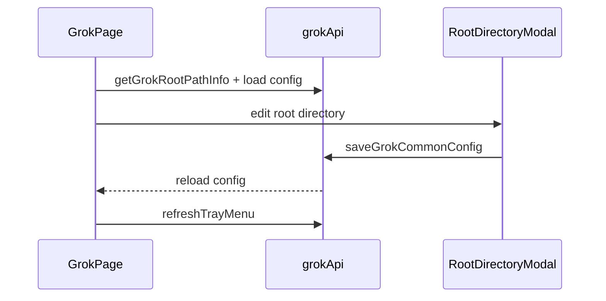

# Grok 前端模块说明

## 一句话职责

- `grok/` 页面负责 Grok provider/common config、根目录管理、prompt、plugin 与导入交互。

## Source of Truth

- 根目录来源于后端 `getGrokRootPathInfo()`，并决定页面实际针对哪份 `config.toml` / `auth.json` / active global prompt 文件工作。
- provider 最终生效状态以后端应用结果为准，前端本地状态只是展示。
- prompt 管理最终作用的是当前 Grok 根目录下的 `AGENTS.md`。Grok 还会扫描 `Agents.md`、Claude 兼容规则文件和各级 rules 目录，但这些属于 runtime 自己的多来源发现，不由当前复制自 Codex 的全局 prompt 面板统一改写。
- 会话管理读取后端解析出的 Grok session root；前端不复用 Codex history 数据库或 rollout parser。

## 核心设计决策（Why）

- Grok 与 Claude Code 一样使用共享根目录编辑逻辑，保证 `custom/env/shell/default` 语义一致。
- provider 导入同样先做 `sourceProviderId` 冲突判断，避免重复导入同一来源时形成歧义。
- 页面操作后需要显式 `refreshTrayMenu()`，因为托盘是另一套消费者，不能假设 React 页面重绘就等于托盘已刷新。
- provider 表单的模型获取分两条链路：官方订阅读取 Grok 官方模型目录，自定义渠道继续走通用 `fetch_provider_models`；不要让官方模式依赖 Base URL/API Key 输入。
- Provider 存储以 `defaultModelKey + modelCatalog.models` 为模型主数据，后端投影为 Grok 官方的 `[models].default` 与 `[model.<key>]`。页面外观可以复制 Codex，但不得生成 Codex 的 `model_provider` / `[model_providers.*]`。
- `[model.<key>]` 就是渠道配置。切换/保存/应用供应商时后端会删除上一渠道 catalog keys 并重写新投影；前端不要再监听或展示“已保留手动修改的模型配置”类 warning。
- 官方渠道只保存 `defaultModelKey`，不保存 `modelCatalog`；后端校验不得要求 official 也带 catalog。新建/保存官方渠道时若模型名为空，前端默认写入 `grok-4.5`。
- 自定义渠道保存时若模型映射为空，前端自动创建一条默认映射（key/model 使用当前模型名或 `grok-4.5`，并带上当前 Base URL / API 格式），避免 save/apply 因缺 catalog 失败。
- 表单「API 格式」是 provider 协议源：`buildGrokSettingsConfig` / 内置 endpoint 应用必须把当前 `apiFormat` **覆盖写入**每条 `modelCatalog.models[].apiBackend`（`openai_chat`→`chat_completions`，`openai_responses`→`responses`，`anthropic_messages`→`messages`）。不要只在空字段时补齐，否则从 responses 改成 chat 后 live `api_backend` 仍会残留 `responses`。
- 自定义渠道的「服务端搜索」是渠道级总开关：勾选后 `buildGrokSettingsConfig` / 表单保存必须把 `supportsBackendSearch=true` **覆盖写入**全部 `modelCatalog.models[]`（含自动创建的默认映射）；取消则写 `false`。它走结构化 modelCatalog → `[model.<key>].supports_backend_search`，不要写进供应商高级 `config.toml` 或 Common Config。官方渠道不展示该开关。
- 供应商弹窗里的 `config.toml` 只承载非模型高级附加配置，UI 放在默认折叠的「高级设置」里；Base URL / API 格式 / 模型映射 / backend search 都在结构化字段。不要为了和 Codex 外观一致把 modelCatalog 再 mirror 回 TOML。
- 账号「已应用」标签以后端 `account.isApplied` 为准；切到非官方 provider 时后端会清空全部官方账号 applied 标记（与 Codex 一致）。前端不要在自定义已应用时继续展示陈旧账号 applied。

## 关键流程

## 易错点与历史坑（Gotchas）

- 不要把页面上的 root path 只当展示信息。它直接决定当前读写哪份 `config.toml` / `auth.json` / active prompt 文件。
- 导入 provider 时的冲突分支、favorite provider 备份和 tray refresh 是一组相邻语义，改一个时通常要一起检查。
- 前端表单不要引入比后端更强的 paired validation，尤其是可选字段和导入数据兼容性相关字段。
- 普通“新建 provider”和“复制已应用 provider”都应走普通创建语义，默认不自动应用；不要因为复制源当前已应用，就在提交对象或页面状态里把新记录当成已应用配置处理。
- 页面里的 `__local__` 不是普通新增 provider，而是当前生效本地配置的收编入口；当用户把它保存为正式 provider 时，产品语义是“把当前生效配置正式落库”，不是“基于当前配置再新建一个未应用草稿”。
- Local Grok 的 API Key 来自后端把 live `config.toml` 中共享的模型级 `api_key` 提升到 `settingsConfig.auth.API_KEY`；前端仍只从 `auth.API_KEY` 回填表单，不要从 `modelCatalog` 读 key。
- Local / 无 gateway meta 的 provider 编辑时，API 格式优先从 `modelCatalog.models[].apiBackend` 推断：`responses` → `openai_responses`，`chat_completions` → `openai_chat`，`anthropic*` → `anthropic_messages`。`normalizeGrokApiFormat` 必须保留 `openai_responses`，不能把它吞成默认 chat。
- 供应商卡片与连通性测试都必须区分 Grok 本地模型 key 与上游模型 ID：列表/测试用 `modelCatalog.models[].model`，不要把 `defaultModelKey`（如 `custom`）当测试模型。卡片应展示当前 API 格式（Responses / Chat / Anthropic）。
- UI 上 `__local__` 即使后端 `isApplied=true`，也不要显示「已应用」标签、选中高亮或「应用」按钮；只保留本地来源提示。用户应通过编辑后保存收编入库，再进入正式 applied 管理语义。
- `__local__` 还没有正式 provider 数据库记录，不能进入依赖持久化 provider ID 的官方账号管理链路；页面应先让用户保存收编，再展示或调用官方账号接口。
- 官方订阅模型列表只是辅助填写默认模型。当前 Grok CLI 没有 Codex 的套餐 quota 卡片语义，前端不得复制 Codex 的 5h/weekly/monthly 展示。
- Device Code OAuth 状态序列是 `waiting_for_user -> authorized -> saving -> completed`。前端只能在 `completed` 后刷新账号列表并关闭弹窗；`authorized` 只表示 token 已拿到，账号尚未写入 SQLite。
- provider 模式只允许在空白新增 provider 时选择。模式入口并入表单顶部“渠道”选择行：空白新增可在“自定义/官方/内置渠道”之间切换；复制 provider 仍走创建新记录语义，但必须沿用源 provider 的 `category`；编辑已保存 provider 也必须保留既有 `category`，不要允许官方/自定义互相切换。
- 自定义模式下的内置供应商 endpoint 会填入 Base URL、API 格式和模型映射，但只锁定 API 格式，不锁定 Base URL；保存内置 endpoint 时只写 `meta.gatewayProfile={tool:"grok",profileId,endpointId}` 引用，`settingsConfig.config` 中的 `base_url` 必须使用用户当前表单里的 Base URL。切回普通“自定义”时必须清掉 `gatewayProfile`，只保留用户手动选择的 `apiFormat`；不要把 `providerType` / `apiKeyField` / `reasoningField` / `defaultMaxTokens` / 图片策略这类 profile 派生快照写进 provider meta。
- OpenAI Chat/Responses 的 Base URL 通常需要 `/v1` 后缀（官方 xAI 默认 `https://api.x.ai/v1`）。表单只做文案提示 + 保存软确认（对齐 OpenCode）：`apiFormat` 为 `openai_chat`/`openai_responses` 且 base 去尾 `/` 后不以 `/v1` 结尾、也不是 `##` full URL 时 `Modal.confirm`；**禁止**静默自动补 `/v1`（会破坏 Anthropic 类、反代前缀与 full-URL 配置）。
- 内置供应商 endpoint 的 Gateway meta 不只包含 `providerType` / `apiFormat`。如果 profile endpoint 带 `reasoningField` 或 `grokChatReasoning`，Grok provider 表单也只保存 `gatewayProfile` 引用；runtime 每次按当前 profile catalog 动态解析 effective meta，保证 ReasoningField 和 Grok -> Chat 多 vendor reasoning/thinking 矩阵跟随内置 catalog 更新。切回官方或普通自定义时不能伪造这些 provider 专属字段。
- 自定义 Grok provider 的“模型映射”入口放在“获取模型”按钮后面；打开表单时如果 `settingsConfig.modelCatalog.models` 有有效模型则默认展开。手动模式下 API 格式不是官方默认 `openai_chat` 时也要自动展开模型映射区域，切回默认格式不自动收起，避免覆盖用户手动状态。官方订阅模式不保存模型映射。
- Grok 的 `settingsConfig.modelCatalog` 由 `useGrokConfigState` 的 `grokCatalogModels` 状态持久化，不是普通 Form 字段。内置 endpoint 提供 `modelCatalog` 时，应同步该 hook 状态；不要用 `form.setFieldValue('modelCatalog', ...)` 伪造保存。
- Grok 的“模型名称”与“模型映射”最终共同投影到官方 TOML：默认模型写 `[models].default`，模型目录写 `[model.<key>]`。不得生成 Codex 的 `model_catalog_json`，也不得把上游模型 ID 与本地模型 key 无条件混为一谈。
- `modelCatalog.models` 不是只给模型下拉用的三字段列表。`supportsImage`、`vision`、`attachment`、`modalities` 这类能力字段会被 Gateway runtime 用来判断 text-only/vision 行为，前端解析和保存规范化时必须保留显式 boolean（尤其是 `false`）和 `modalities.input/output`，不能只写回 `model/displayName/contextWindow`。
- Grok 内置 Anthropic/Claude 协议 endpoint 如果没有显式 `modelCatalog`，添加供应商时应从同一渠道的 Claude endpoint 角色模型派生初始模型映射；如果 endpoint 自带 `modelCatalog`，仍以 endpoint 自身目录为准。派生逻辑只用于补齐添加表单的初始值，不能改变 Base URL 可编辑和保存用户当前输入值的语义。
- Gateway 现在是 direct → single → failover 三态。single 入口在已应用 provider 卡片的“网关代理”按钮；single/failover 接管期间都必须锁定其他 provider 的“应用”入口，failover 时卡片额外显示 P0/P1 优先级，切 P0 必须先恢复直连。
- Grok CLI 原生支持 `openai_responses` / `openai_chat` / `anthropic_messages`，**只有** `gemini_native` 才需要“应用并代理”。卡片判定必须用 `grokProviderNeedsGatewayProxy`，禁止 `providerNeedsGatewayProxy(format, 'openai_responses')`，否则 chat/claude 会被误判为需要协议转换。
- 前端不要假设 Grok prompt 文件名永远是 `AGENTS.md`。展示路径、删除已应用 prompt 后的刷新和同步结果都以后端返回/事件为准。
- 插件页的全部启用/全部禁用只作用于“已安装”Tab 中当前 runtime 的已安装插件，不作用于市场可安装列表。Grok 没有 Codex 的 plugins feature toggle，不得复制该开关。
- Grok marketplace 添加入口应使用 Modal + 文本输入（GitHub repo / git URL / 本地路径），不能只靠本地目录选择。CLI 支持 `xai-org/plugin-marketplace` 这类 shorthand；空态可提供“添加 xAI 官方市场”快捷入口。官方市场有双名：manifest 为 `xai-official`，`plugin marketplace list` 注册名为 `plugin-marketplace`；推荐卡片隐藏与 `is_curated` 必须同时认这两个 name，并可用 `xai-org/plugin-marketplace` source URL 兜底。`claude-plugins-official` 是兼容市场，不要当官方推荐，也不要在默认列表里自动删除。
- 后端 `list_grok_plugin_workspace_roots` 目前会镜像 known marketplaces；前端本地目录区块只展示真正的本地路径，避免把 git URL / `owner/repo` 重复显示成“本地市场目录”。推荐卡片用“推荐”标签，不要伪装成已 curated。
- Grok Session Manager 只管理 Grok 自己的 session 目录、详情、恢复、导入导出和删除；不要增加 Codex 的统一历史、provider 路由迁移或 SQLite history 修复入口。
- Grok 单个和批量会话导出需明确区分三种格式：共享 AI Toolbox JSON、官方 `grok export` Markdown、独立 native snapshot JSON。格式选择复用共享 Session Manager 的现有导出动作和 Modal，不新增 Grok 专用详情页或视觉体系。

## 跨模块依赖

- 依赖共享 `RootDirectoryModal` / `useRootDirectoryConfig`。
- 依赖后端 `grok::commands` 和共享 favorite provider、All API Hub 组件。
- 间接受 `settings/` 和 `runtime_location` 的 WSL Direct 语义影响，但页面本身只显示 path info。

## 典型变更场景（按需）

- 改根目录逻辑时：
  同时检查页面顶部 path info、modal 回填、Session Manager 来源和保存后 reload。
- 改 provider 删除/导入时：
  同时检查冲突处理、favorite provider 兜底和 tray refresh。

## 最小验证

- 至少验证：修改根目录后页面重新读取到新的路径来源。
- 至少验证：导入同源 provider 冲突时有明确覆盖/副本分支。
- 改 Session Manager UI 时，至少验证来源切换、详情导航、恢复命令、导入导出、删除和刷新触发。
