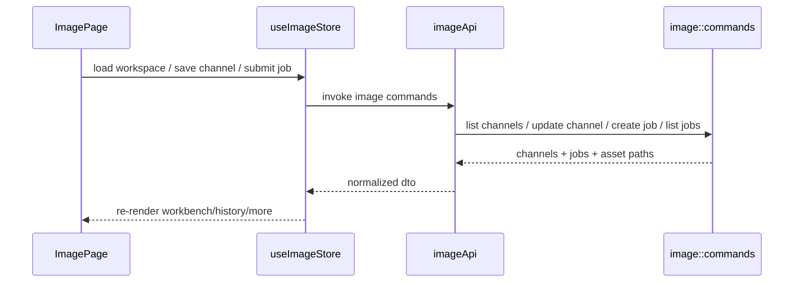

# Image 前端模块说明

## 一句话职责

- `image/` 页面负责内置图片工作台前端交互：工作台生成、渠道管理、历史复用，以及图片任务的运行时模型/渠道选择。

## Source of Truth

- 图片任务与资产的真实主数据以后端 Tauri 命令和 SurrealDB 记录为准，不以前端临时表单、预览 URL 或当前可见列表为准。
- `references`、当前表单、工作台内部的运行时模型/渠道选择都只是 UI 临时状态；真正提交给模型的内容由后端 `image_create_job` 收口。
- 本地图片文件的真实来源是 app data 下的图片资产目录；前端只消费后端返回的文件路径并转成可显示 URL。
- 渠道配置的真实来源以后端 `image_channel` 表为准，不以前端当前草稿或工作台自动推导结果为准。

## 核心设计决策（Why）

- `Image` 放在顶栏右侧动作区，和 `Skills` / `MCP` 同级，而不是放进中间 4 个 coding 子 tab。因为它不是某个 CLI 运行时配置页，而是 AI Toolbox 内置工作台。
- 页面内部分为 `工作台 / 历史 / 更多` 三个并列视图；`更多` 是扩展配置入口，当前先承载渠道列表，后续其他配置项也应继续挂在这里。
- 工作台选择顺序固定为“模式 -> 模型 -> 自动选中第一个可用渠道 -> 用户可切换渠道”，不要再回退到“先选渠道再选模型”。
- 渠道配置单独落表，模型仍嵌在渠道记录内；前端工作台消费的是跨渠道聚合后的模型视图，而不是某个渠道的原始模型数组。
- `更多` 里的渠道管理使用单列表 + 新增/编辑弹窗，不做常驻两栏编辑页，避免把页面变成第二套重型配置后台。
- 新增渠道必须先打开本地创建弹窗，只有点击保存后才真正落库；不要再实现“先创建空渠道记录，再弹编辑窗”的交互，这会在取消时残留脏数据，也和用户预期相反。
- 图片模块的按钮语言必须跨页面统一：主页面、渠道弹窗、尺寸弹窗共用同一套主按钮 / 次按钮 / 工具按钮样式，不要再混用默认 Ant Button 外观和零散自定义按钮。对这个模块来说，按钮是核心交互层，不是局部点缀。

## 关键流程

## 易错点与历史坑（Gotchas）

- 不要把 `Image` 当成第 5 个 coding runtime 模块去接 `visibleTabs -> WSL/SSH skipModules` 那套语义。它没有对应的 WSL/SSH runtime-location 逻辑。
- 不要再把图片接口配置理解成单个 `settings` 对象；当前真实配置源已经是 `image_channel` 表，而不是旧的 `base_url/api_key/default_model` 单记录。
- 图片模块从数据库读出的 `image_channel` / `image_job` / `image_asset` `id` 不能直接信任 `type::string(id)` 的原样值；前后端对外使用前必须先清洗成干净业务 id，否则编辑渠道、删除渠道、拖拽排序和按 `channel_id` 提交任务都会因为 record id 前缀而找不到记录。
- 参考图在前端可以先是 data URL，但提交和历史记录不能只停留在内存里；后端必须统一落资产文件，否则下载、历史和备份恢复都会分叉。
- 参考图缩略图列表必须使用稳定尺寸的媒体框承载图片，操作按钮固定在媒体框内的稳定位置；不要让图片原始宽高比例决定卡片高度，否则多图混排会造成操作按钮上下错位。
- `ImagePage` 运行在 KeepAlive 容器里，切页后通常不会卸载。异步生成完成后的提示、loading 收尾和结果回填要考虑页面可能已隐藏。
- 图片生成 loading 区不能只显示总用时；需要监听后端 `image-job-progress` 事件，展示当前 attempt、最大 attempt、已用重试次数、最大重试次数、单次 timeout 和 retry delay。
- 结果图和历史缩略图虽然都来自后端 `output_assets.file_path`，但前端真正能否显示还取决于 Tauri `assetProtocol`。如果 `createImageJob` 已返回 `status=done`、`output_assets > 0`，而 `` 仍然空白，不要先怀疑列表状态；先检查 `tauri.conf.json -> app.security.assetProtocol` 是否开启，且 scope 覆盖 `image-studio/assets/**`。
- 结果图“继续迭代”时，前端不能把本地文件路径直接当提交体发给后端；应先读取成 data URL / base64，再转成标准参考图输入。
- 历史记录里的“继续迭代”语义不是单纯复用历史参数；它必须读取历史输出资产作为参考图、切到 `image_to_image`，再回到工作台。
- 工作台里的 `模型` 不是某个渠道内部下拉，而是跨启用渠道聚合后的可用模型列表；`渠道` 只是该模型在当前模式下的可用路由集合。
- 自动选择渠道时，必须以渠道 `sort_order` 为准，保证“第一个渠道”是稳定且可解释的；不要用对象枚举顺序或更新时间碰运气。
- 当前工作台和尺寸弹窗的字段布局约定为“左标签、右控件”的高密度横向结构；除非窄屏响应式回落，不要再把参数项改回“标题在上、输入在下”的堆叠样式。
- 对工作台参数行这类紧凑字段，标签列不要写死过宽的固定宽度；优先让标题宽度自适应内容，控件尽量贴着标题开始，减少无意义留白。
- 对 `nano-banana` / `nano-banana-pro` 这类 Gemini Banana 模型，要明确区分“模型兼容层”和“渠道协议层”。历史上只做过 OpenAI-compatible 网关下的 Banana 模型识别与参数隐藏；只有渠道 `provider_kind=gemini` 时，才代表真正走 Gemini Native 协议。
- 当渠道 `provider_kind=gemini` 时，前端参数区和历史参数摘要必须按 Gemini Native 语义收敛；不要继续暴露 `quality`、`output_format`、`moderation`、`output_compression`、`generation_path`、`edit_path` 这类 OpenAI-compatible 特有字段，避免把错误协议字段重新带回 UI。
- 当渠道 `provider_kind=openai_responses` 时，要把它视为独立协议，不要偷复用“OpenAI Compatible 渠道路径可配置”这套心智。它固定走 `/v1/responses`，因此前端渠道弹窗同样不应再暴露 `generation_path` / `edit_path`。
- 当渠道 `provider_kind=openai_responses` 时，前端参数区和提交参数都不要暴露/发送 `moderation`；Responses 返回的实际参数和 `revised_prompt` 只在请求详情里作为响应元数据展示，不进入历史参数摘要。
- 新增图片供应商类型时，前端应优先扩展 `utils/providerProfile.ts` 的 provider profile，集中声明 label、是否支持自定义 path、默认 base URL 和参数可见性；不要在 `ImagePage` / `ImageChannelModal` / `modelProfile` 里继续散落 provider kind 条件分支。
- 对同一批被隐藏为“不适用”的 Banana 参数，提交链路也必须真正省略，不能只在 UI 上隐藏后仍写默认值；否则兼容网关可能因为未知字段直接拒绝请求。
- `Image` 现在也会出现在设置页的 `visibleTabs` 里，但这只表示“是否显示顶栏 Image 入口”；不要把 `image` 当成 WSL/SSH 的同步模块 key 去参与 `skipModules`、mappings 或 runtime-location 推导。
- 图片页面对用户的文案只描述当前功能，不要写“首版 / 一期 / 后续 / 计划中 / 之后会支持”这类路线图信息。
- 数值型短字段如压缩率、超时、比例输入等，不要默认拉成满宽控件；优先用更紧凑的输入宽度，减少视觉噪声。
- 同一参数区内的输入控件必须使用统一的外壳语言：边框、圆角、背景、hover/focus 状态、控件高度保持一致，不要出现 `Select`、数字输入、按钮式触发器各像各的情况。
- 图片模块如果继续演进按钮样式，优先改共享按钮样式文件，再由主页面和弹窗复用；不要在 `ImagePage`、`ImageChannelModal`、`SizePickerModal` 各自堆一套相近但不一致的按钮规则。
- 当参数项需要和“尺寸”按钮保持同一视觉语言时，优先使用按钮式触发器配轻量菜单，不要为了省事回退到默认 `antd Select` 外观。
- 参数行虽然走高密度布局，但交互控件之间仍要保留明确触控间距；横向/纵向相邻控件至少维持约 `8px+` 的间隔，不要压到发闷。
- 模式切换按钮文案可能比中文更长，`Text to image` / `Image to image` 这类按钮必须保持单行展示，宽度跟随文本自适应，不能被样式压到换行。
- 历史里的请求详情只用于排查，不要把真实 `Authorization` 或 multipart 原始二进制直接展示给前端；前端默认只消费后端返回的脱敏 headers 和可读 body 摘要。
- 历史项如果展示“第三行参数摘要”，只对成功任务显示；失败任务保留更紧凑的失败信息结构，不要把空参数行或误导性的配置摘要展示出来。
- 当图片生成出现“服务端已完成，但 UI 很久才结束”这类现象时，前端也要有最小阶段日志，至少区分 `createImageJob` 何时 resolve、`listImageJobs` 何时 resolve、以及 `submitJob finally` 何时触发；否则只看按钮 loading 无法判断是后端命令没返回，还是返回后前端又卡在二次刷新。
- `submitJob` 成功返回的 job 应先即时写回 store，再做后台 `listImageJobs` 刷新；不要让结果区完全依赖第二次列表请求，否则“任务已成功”和“列表刷新或资源展示异常”会被混成同一种表象。

## 跨模块依赖

- 依赖后端 `tauri/src/coding/image/` 提供渠道、任务、资产路径与请求能力。
- 依赖顶层 `MainLayout` 独立入口按钮与 `routeConfig` 独立路由。
- 间接依赖 `backup/`：图片资产目录必须和数据库记录一起备份恢复。

## 典型变更场景（按需）

- 扩模型支持时：
  先确认是只增一个兼容模型还是需要引入新的请求语义；优先改渠道模型能力和请求构建层，不要先把页面条件分支堆满。
- 扩 provider 支持时：
  先改 provider profile，再检查渠道弹窗、工作台参数区、历史参数摘要是否全部由 profile 派生；不要为单个页面单独写一份 provider option 或 path 能力判断。
- 改 `更多` 里的渠道管理时：
  同时检查工作台模型聚合、自动渠道选择、历史快照显示三处是否仍一致。
- 改历史或结果预览时：
  同时检查下载、继续迭代、重新打开页面后的可见性，以及资产路径是否仍能正确转成前端可显示 URL。

## 最小验证

- 至少验证：`工作台` 中选择模型后会自动选中当前模式下排序最前的可用渠道。
- 至少验证：保存渠道与模型能力后，工作台里的模型列表和渠道切换器会按新配置刷新。
- 至少验证：`工作台` 中填写提示词并生成后，结果会出现在当前结果区与 `历史`。
- 至少验证：图生图提交至少能带着 1 张参考图走通到后端。
- 至少验证：重新打开页面后，历史记录仍能从后端重新读取，而不是只依赖前端内存。
