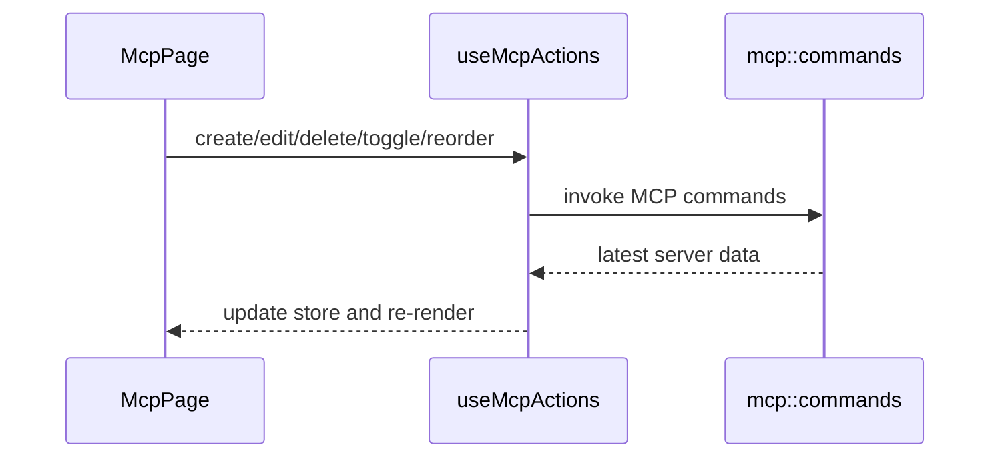

# MCP 前端模块说明

## 一句话职责

- `mcp/` 页面负责 MCP server 的展示、增删改、导入和排序，以及按工具开关同步状态的交互。

## Source of Truth

- 页面列表数据来自后端中心存储，不直接以任何单个工具配置文件为准。
- 工具可安装状态、可同步目标和扫描结果分别来自 hooks 与后端命令，不由页面本地推断。
- 排序的持久化以 server `sort_index` 为准，前端拖拽顺序只是即时 UI 表现。
- `user_group/user_note` 是 AI Toolbox 内部的用户管理元数据，事实源是后端 `mcp_server` 记录，不是 MCP server 自身配置或工具运行时配置文件。

## 核心设计决策（Why）

- 页面把“server CRUD”“工具同步切换”“导入已有配置”“排序”拆给不同 hooks/store，避免一个组件承载全部副作用。
- 拖拽排序采用先本地重排再提交 `reorderServers`，这样交互更顺滑。
- MCP 页不自己实现底层同步逻辑，只做中心存储和工具勾选的前端入口。
- 自定义分组只影响页面组织和搜索，不改变 MCP server 配置，也不改变同步到各工具的目标路径。
- 分组视图不开放拖拽排序；排序只在平铺模式中修改全局 `sort_index`，避免把“改分组”和“改排序”混成一个交互。

## 关键流程

## 易错点与历史坑（Gotchas）

- 不要在前端直接推导某个工具配置文件里“应该有什么 MCP server”；真正真相在后端中心存储。
- 拖拽排序时，本地 UI 顺序和后端持久化必须一起更新；只改其中一边会导致刷新后回弹。
- 导入成功后要回到 scan/result 刷新链路，不要只关弹窗不刷新列表。
- 不要把 MCP 自身的 `description` 和 AI Toolbox 管理备注 `user_note` 合并存储；卡片展示可以在 `user_note` 为空时回退展示 `description`，但编辑入口必须分开。
- 组工具模式只是分组视图里的前端批量控制模式，未分组不参与启用时的统一和组级工具控制；卡片工具列表仍展示，但卡片内工具添加/移除入口应只读禁用，点击时提示用户到分组标题后操作。MCP 工具开关是 toggle 语义，批量添加/移除前必须先按 `enabled_tools` 过滤目标 server，不能对整组无脑 toggle。
- MCP 管理页可能出现几百个 server，平铺和分组展开都应使用 shared `management/VirtualGrid` 这类可视区渲染；拖拽排序模式保持完整列表渲染，避免虚拟化与 dnd-kit 排序语义冲突。
- MCP 管理页、列表、分组和卡片的主交互面应保持轻量原生控件风格，不要重新把 AntD `Button/Input/Segmented/Dropdown/Tooltip/Collapse/Empty/Spin/Tag/Checkbox` 引回这些高频列表 surface；复杂 modal 表单可另行按 modal 规则处理。

## 跨模块依赖

- 依赖 `useMcp`、`useMcpActions`、`useMcpTools` 和 `mcpStore`。
- 依赖后端 `mcp::commands` 提供 CRUD、导入、排序和同步能力。
- 与 `settings/` 和 `wsl/` 间接相关，但页面本身不直接处理 WSL 自动同步。

## 典型变更场景（按需）

- 改排序或批量导入时：
  同时检查 store 更新、后端持久化和导入后 reload。
- 改工具开关 UI 时：
  同时检查 tool availability、toggle action 和同步结果提示。
- 改自定义分组时：
  同时检查平铺/分组切换、搜索匹配、卡片第二行展示和右侧两按钮操作区。

## 最小验证

- 至少验证：新增、编辑、删除、切换工具、拖拽排序都能刷新到正确列表。
- 至少验证：导入已有配置或 JSON 后，列表和扫描结果都会更新。
