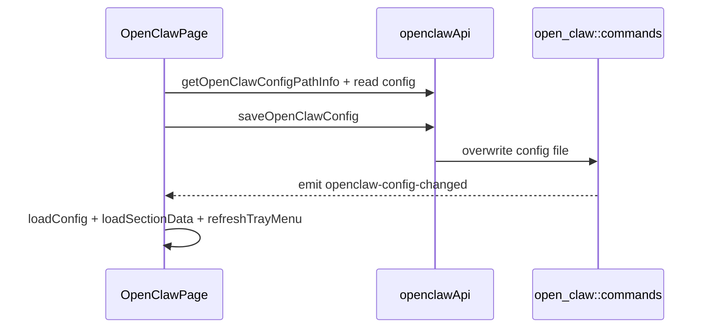

# OpenClaw 前端模块说明

## 一句话职责

- `openclaw/` 页面负责 OpenClaw 整份配置的读取、编辑、导入、provider 管理和配置路径管理。

## Source of Truth

- 页面状态最终都汇聚到同一份 OpenClaw 配置文件；各 section 只是对该配置对象不同片段的编辑界面。
- `configPathInfo` 来自后端 `getOpenClawConfigPathInfo()`，只表达路径来源，不表达 WSL Direct 状态。
- 页面刷新依赖 `openclaw-config-changed` 专有事件和显式 `loadConfig()/loadSectionData()`。

## 核心设计决策（Why）

- OpenClaw 页面采用“整份配置对象 + 多个 section”的模式，而不是 provider/common config 分表模式；这样与 OpenClaw 运行时 JSON 更一致。
- `OpenClawConfigPathModal` 只在 `source === custom` 时回填当前值，避免把 env/default 等来源误写成用户输入。
- 保存、导入、删除 provider 后都会显式 reload 和 tray refresh，因为页面 section 状态分散，不能只局部 patch 一个局部状态就结束。

## 关键流程

## 易错点与历史坑（Gotchas）

- 不要把 OpenClaw 的某个 section 当成独立配置源。它们最终都在改同一份配置文件。
- 页面监听的是 `openclaw-config-changed`，不是通用 `config-changed`。抽象公共逻辑时别把它漏掉。
- 导入 OpenCode / All API Hub / favorite providers 时，不仅要更新配置，还要同步处理 favorite provider 相关辅助状态。

## 跨模块依赖

- 依赖后端 `open_claw::commands` 提供路径信息和整份配置读写。
- 依赖共享 favorite provider 和导入组件。
- 与设置页共享路径来源和 WSL Direct 大语义，但本页面本身只关心 `configPathInfo` 与专有配置变更事件。

## 典型变更场景（按需）

- 改配置路径弹窗时：
  同时检查回填、reset 和保存后 reload。
- 改任一 section 保存时：
  同时检查是否保住整份配置对象中的其它 section。

## 最小验证

- 至少验证：修改任一 section 后配置文件仍保有其它 section 内容。
- 至少验证：路径变更或配置保存后页面能通过 `openclaw-config-changed` / reload 看到最新状态。
