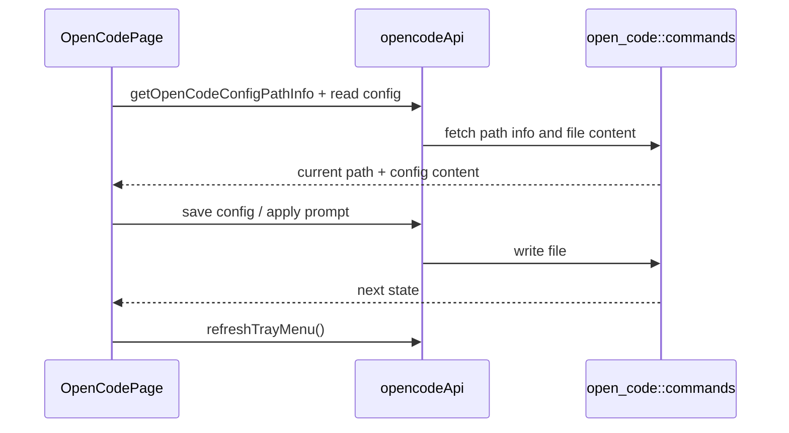

# OpenCode 前端模块说明

## 一句话职责

- `opencode/` 页面负责 OpenCode 配置编辑、provider 管理、prompt 管理、模型读取和相关导入交互。

## Source of Truth

- 页面展示的配置内容来自当前生效配置文件；`configPathInfo` 只说明路径来源，不说明是否 WSL Direct。
- `configPathInfo` 由后端 `getOpenCodeConfigPathInfo()` 返回；当前生效 prompt 路径由后端按配置文件所在目录推导。
- 页面里的主模型和小模型值都应视为完整 `provider_id/model_id`，而不是单独的模型名。
- `favorite provider` 列表和诊断属于辅助历史状态，不能反推为 OpenCode 当前运行时真实配置。

## 核心设计决策（Why）

- 页面把“路径管理”与“配置内容”分开：路径通过 `ConfigPathModal` 管理，配置内容单独读取和保存，避免把文件定位和文件内容混在同一表单里。
- `ConfigPathModal` 只在 `source === custom` 时回填输入框，避免把 env/default/shell 的当前生效路径误当成用户显式保存的自定义路径。
- 托盘刷新不是自动 effect 全程接管，很多用户动作后需要显式 `refreshTrayMenu()`，否则托盘和页面状态会分叉。
- 模型刷新走受限频率的显式操作，而不是每次页面操作都重抓远端模型，避免无谓请求和体验噪音。

## 关键流程

## 易错点与历史坑（Gotchas）

- 不要把 OpenCode 页面上的 `configPathInfo.source === custom` 误解成“当前是 WSL Direct”；这两个概念无关。
- 改 prompt 行为时要记住运行时文件名就是当前配置目录下的 `AGENTS.md`，不是独立根目录。
- 不要把模型选项只按 `model_id` 处理。页面、后端和 tray 共享的契约是完整 `provider_id/model_id`，否则选中态、保存值和 tray 菜单会分叉。
- `favorite provider` 页内列表的语义是“使用过的供应商”和诊断缓存，不是“当前配置中的 provider 列表”；删除当前 provider 前后保留它是可能的预期行为。
- 改模型刷新或 provider 导入时，不要忘了托盘刷新和 favorite provider 辅助状态更新。

## 跨模块依赖

- 依赖后端 `open_code::commands` 提供配置路径、配置文件、prompt 和模型相关能力。
- 依赖 `shared/favoriteProviders`、`shared/allApiHub`、`shared/prompt` 等共享前端能力。
- 与 `settings/` 间接共享 `moduleStatuses` 语义，但本页面本身不直接做 WSL Direct 判定。

## 典型变更场景（按需）

- 改配置路径弹窗时：
  同时检查 `configPathInfo` 回填、env/source 提示和保存后 reload。
- 改 provider 或 prompt 保存时：
  同时检查页面 reload、tray refresh 和相关 favorite provider 状态。

## 最小验证

- 至少验证：切换自定义配置路径后页面能重新读取新文件内容。
- 至少验证：保存配置、应用 prompt、导入 provider 后托盘仍同步刷新。
