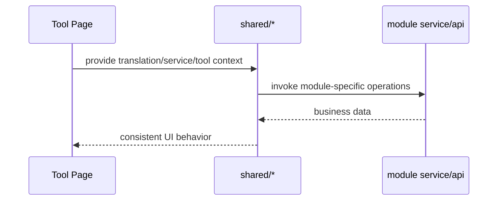

# Coding Shared 前端模块说明

## 一句话职责

- `shared/` 提供多个 coding 页面共用的前端语义层，不拥有独立业务主数据，但封装了跨模块必须一致的交互规则。

## Source of Truth

- `shared/` 中的大多数组件只是消费各模块自己的 service/store，不能反过来成为业务事实源。
- 根目录来源、prompt 列表、session 数据、favorite provider、provider 诊断等真实数据都在各自 owning module 或后端命令。
- `shared/` 真正需要维护的是“相同概念在不同页面的统一解释”，例如 root path source、favorite provider storage key、session tool API 形态。

## 核心设计决策（Why）

- `useRootDirectoryConfig` + `RootDirectoryModal` 把 Claude/Codex 的根目录编辑语义统一起来，避免两个页面对 `custom/env/shell/default` 的解释漂移。
- Claude/Codex/Gemini CLI 复用共享根目录交互，而 OpenCode/OpenClaw 继续使用各自的配置文件路径弹窗；这是“根目录模块”和“文件路径模块”的前端分层，不要为了复用把两类语义硬揉到一个 modal 里。
- `favoriteProviders.ts` 用 source 前缀和 payload 约定把 OpenCode/Claude/Codex/OpenClaw 的收藏 provider 统一建模，避免不同页面各存一套不兼容 key。
- `GlobalPromptSettings`、`SessionManagerPanel`、`ProviderConnectivityTestModal` 等共享组件都要求业务方通过 service/api 注入，不自己硬编码某个模块的存储细节。
- `allApiHub` 共享 modal 和模型缓存属于“共享交互层”，不是某个页面的私有实现。
- `management/` 下的控件和 `VirtualGrid` 只提供高密度管理页的纯 UI 行为，例如原生按钮、菜单、搜索、分段控件、空/加载态和可视区渲染；它们不保存业务选择、搜索、分组、排序或同步状态。

## 关键流程

## 易错点与历史坑（Gotchas）

- 不要把 `shared/` 写成新的业务层。它应该统一交互语义，而不是偷存一份自己的持久化状态。
- 改 root directory、favorite provider、session manager 这类共享能力时，要先确认是不是所有消费页面都要同步调整，而不是只修当前页面。
- `RootDirectoryModal` 只对 `source === custom` 的值做输入框回填；不要把 env/shell/default 的当前生效路径直接塞回输入框，否则用户会误以为那是显式保存的自定义路径。
- `favoriteProviders.ts` 的 key/payload 规则会影响多个模块的数据迁移和去重；这里不能随意改前缀或 payload 结构。
- 对 OpenCode/Claude/Codex/OpenClaw 这些页，“favorite provider” 的语义更接近“历史库 + 诊断缓存”，不是当前配置快照。改共享 helper 时不要把它偷偷重定义成当前配置镜像。
- `SessionManagerPanel` 依赖 `tool + sourcePath` 契约，不能把 `sourcePath` 当作纯展示字段。
- `SessionManagerPanel` 如果加批量操作，选择范围必须和当前已加载列表严格一致；搜索词、目录筛选或 reload 改变列表后，要同步清理旧选择，不能保留“用户当前看不见但仍会被删”的隐式选中态。
- `SessionManagerPanel` 运行在 KeepAlive 页面里，工具页切走后组件通常不会卸载，只会隐藏。任何异步操作完成后的 `message.success/error`、loading 收尾或详情回写，都必须先判断当前页面是否仍处于可见上下文；不要让 OpenCode 等隐藏页的旧请求在用户切到 Codex/Claude/OpenClaw 后继续向全局 UI 吐成功或错误提示。
- `SessionManagerPanel` 在 KeepAlive 隐藏页里即使放弃提示或结果回写，也不能漏掉本地 loading 收尾。尤其是列表请求失败后，路径筛选器这类局部 loading 必须按请求代次自行复位，不能完全绑在“当前页面仍可见”这个条件上。
- `SessionManagerPanel` 做整页 reload 时，不要把“刷新列表”和“刷新路径下拉”拆成两次 `forceRefresh` 请求去重扫同一份会话索引。优先复用同一次列表结果里派生出的 path options，避免一次删除/导入/手动刷新触发两轮整库扫描。
- 高密度管理列表可复用 `management/VirtualGrid`，但拖拽排序模式不要和虚拟化混用。排序应继续渲染完整可排序集合，普通浏览/分组展开才使用虚拟网格，避免 dnd 命中区域和虚拟占位高度漂移。
- `management/ManagementMenu` 是按需 portal 渲染的轻量菜单。不要为了每张卡片重新引入常驻 overlay 菜单或 tooltip；几百项列表里这会明显放大 DOM 和事件监听成本。

## 跨模块依赖

- 被 `claudecode/`、`codex/`、`geminicli/`、`opencode/`、`openclaw/` 多个页面共同依赖。
- 依赖各 owning module 的 service/api，而不是直接操作数据库。
- 与后端 `session_manager/`、各工具 commands、favorite provider 后端服务形成跨模块契约。

## 典型变更场景（按需）

- 改共享 root directory 逻辑时：
  同时检查 Claude/Codex/Gemini CLI 三页 modal 回填、source label 和 reset/save 语义。
- 改 favorite provider 规则时：
  同时检查 storage key、source payload、去重、迁移和多页面导入逻辑。
- 改 session manager 共享面板时：
  同时检查 list/detail/import/export/rename/delete API 契约。

## 最小验证

- 至少验证：一个共享改动在两个以上消费页面中仍表现一致。
- 至少验证：favorite provider 和 session manager 的 key/sourcePath 契约未被破坏。
