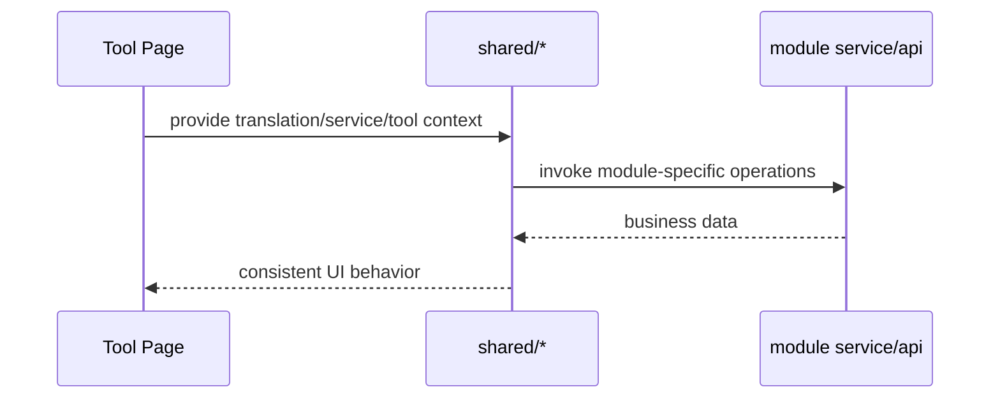

# Coding Shared 前端模块说明

## 一句话职责

- `shared/` 提供多个 coding 页面共用的前端语义层，不拥有独立业务主数据，但封装了跨模块必须一致的交互规则。

## Source of Truth

- `shared/` 中的大多数组件只是消费各模块自己的 service/store，不能反过来成为业务事实源。
- 根目录来源、prompt 列表、session 数据、favorite provider、provider 诊断等真实数据都在各自 owning module 或后端命令。
- `shared/` 真正需要维护的是“相同概念在不同页面的统一解释”，例如 root path source、favorite provider storage key、session tool API 形态。

## 核心设计决策（Why）

- `useRootDirectoryConfig` + `RootDirectoryModal` 把 Claude/Codex 的根目录编辑语义统一起来，避免两个页面对 `custom/env/shell/default` 的解释漂移。
- Claude/Codex/Gemini CLI 复用共享根目录交互，而 OpenCode/OpenClaw 继续使用各自的配置文件路径弹窗；这是“根目录模块”和“文件路径模块”的前端分层，不要为了复用把两类语义硬揉到一个 modal 里。
- `favoriteProviders.ts` 用 source 前缀和 payload 约定把 OpenCode/Claude/Codex/OpenClaw 的收藏 provider 统一建模，避免不同页面各存一套不兼容 key。
- `GlobalPromptSettings`、`SessionManagerPanel`、`ProviderConnectivityTestModal` 等共享组件都要求业务方通过 service/api 注入，不自己硬编码某个模块的存储细节。
- `SessionManagerPanel` 的标题栏可通过 `extra` 注入模块自有动作；动作归 owning page 处理，shared 面板只负责摆放入口，不接管模块业务状态。
- `sessionManager/detail/` 是共享会话详情二级页和 workbench。它只消费后端 normalized message/block 契约，并通过 domain helpers 做搜索、过滤、导航、工具块配对和工具展示归一化；不要在 renderer 组件里直接读取某个 CLI 的 raw message shape。
- `allApiHub` 共享 modal 和模型缓存属于“共享交互层”，不是某个页面的私有实现。
- `gateway/providerProfiles.ts` 是前端 Gateway 内置供应商 profile 的共享内存态，启动时从后端缓存/bundled defaults 加载，再由远端刷新更新。它只提供 catalog、订阅和 endpoint 推断 helper，不持久化业务 provider。
- `management/` 下的控件和 `VirtualGrid` 只提供高密度管理页的纯 UI 行为，例如原生按钮、菜单、搜索、分段控件、空/加载态和可视区渲染；它们不保存业务选择、搜索、分组、排序或同步状态。
- `magicContext/` 是 OpenCode 和 Pi 共用的 CortexKit 用户级配置管理入口。它只消费后端 `magic_context` 文件命令和调用方传入的安装状态，不拥有插件安装、扩展安装、项目级配置或配置主数据。

## 关键流程

## 易错点与历史坑（Gotchas）

- 不要把 `shared/` 写成新的业务层。它应该统一交互语义，而不是偷存一份自己的持久化状态。
- 改 root directory、favorite provider、session manager 这类共享能力时，要先确认是不是所有消费页面都要同步调整，而不是只修当前页面。
- `RootDirectoryModal` 只对 `source === custom` 的值做输入框回填；不要把 env/shell/default 的当前生效路径直接塞回输入框，否则用户会误以为那是显式保存的自定义路径。
- Claude/Codex/Gemini CLI 的根目录保存最终会走各自 common config 保存命令。Gateway 接管期间必须像通用配置保存一样锁住根目录保存和恢复默认，否则会绕过 provider 卡片的代理中编辑保护并触发 runtime auto-apply。
- `favoriteProviders.ts` 的 key/payload 规则会影响多个模块的数据迁移和去重；这里不能随意改前缀或 payload 结构。
- 对 OpenCode/Claude/Codex/OpenClaw 这些页，“favorite provider” 的语义更接近“历史库 + 诊断缓存”，不是当前配置快照。改共享 helper 时不要把它偷偷重定义成当前配置镜像。
- `SessionManagerPanel` 依赖 `tool + sourcePath` 契约，不能把 `sourcePath` 当作纯展示字段。
- 改会话详情展示时，要优先维护 `sessionManager/detail/domain/` 的纯函数，再让组件消费这些结果。搜索、过滤、导航和工具卡片预览必须基于同一套 normalized blocks，否则多 CLI 会出现同一消息在不同入口表现不一致的问题。
- 会话详情视觉结构参考 `D:\GitHub\claude-code-history-viewer`，但不要引入左侧 ProjectTree。普通 user/assistant 文本使用轻量 meta 行 + 聊天气泡，不放消息右下角的长文本“展开/收起”；tool/thinking/system/summary/image/unknown 等结构化 block 使用紧凑 Renderer 卡片，卡片默认收起并通过 header 展开。不要把每条消息重新包成带编号 rail、Tag header、整块 border 的日志卡片，也不要把工具卡嵌在普通文本气泡里。
- 会话详情顶部过滤 chip 是独立“显示/隐藏”开关，不是单选 Tab。用户/助手、文本/思考过程/工具调用/命令都应分别维护布尔可见状态；点击某个类型只切换该类型，不能影响其他类型。关闭内容类型时还要在 renderer 层隐藏对应 block，而不是只做整条消息级过滤。
- 会话详情右侧 `MessageNavigator` 要按参考项目侧栏处理：标题显示“消息”、带总数、用户过滤按钮、收起/展开按钮、本地“筛选消息...”输入框，条目使用彩色点 + `#turnIndex` + 工具标记 + 时间 + 两行预览。不要把 `(assistant message)`、`unknown` 或纯占位工具消息放进 navigator；二级页外层上下左右只保留很小一致间距，workbench 需要填满页面主体，不能再用内部 `vh` 限高制造底部空白。
- 会话详情右侧 navigator 点击定位依赖消息/工具 target refs。targetId 必须由 normalized `message.id` 通过 `sessionManager/detail/domain/messageTargets.ts` 统一派生；后端各 CLI parser 对缺失 id 的消息必须补稳定 fallback id，前端不要再按某个 CLI 或 render index 分叉生成定位规则。React ref 会在 commit 阶段注册，随后才执行父组件 `useEffect`；不要在 `detail.meta.sourcePath` 这类普通 effect 里 `clear()` refs，否则首次渲染后会把刚注册的 refs 清空，导致 Claude/Codex/Gemini/OpenCode 共享详情页都无法定位。refs 应靠节点 unmount 回调删除，或仅在 workbench 卸载时清理。
- 会话详情里的 Markdown 文本必须复用全局提示词同款 `MarkdownPreview`，不要再单独用裸 `ReactMarkdown` 造一套样式。超过 5 行的 Markdown 默认收起；“展开更多...”按钮样式参考 `D:\GitHub\claude-code-history-viewer\src\components\messageRenderer\MessageContentDisplay.tsx`，使用小号 chevron + 浅色文字的轻量文本操作，不要做成有边框的块状按钮。
- 会话详情滚动按钮参考 `D:\GitHub\claude-code-history-viewer\src\components\MessageViewer\MessageViewer.tsx`：控件必须浮在消息视图区内部右下角，使用纵向半透明圆形按钮，并根据当前滚动位置隐藏无效方向；不要挂在 workbench 根节点后再按右侧 navigator 宽度计算偏移。
- SubAgent 会话在详情页里是独立导航，不是父时间线的一段消息。父会话只展示后端发现的 SubAgent 摘要列表，点击后加载子会话详情并显示返回父会话 breadcrumb；父时间线必须排除 `isSidechain` 消息，不能靠前端从 Agent tool block 推断 `messageIndex` 后滚动到父消息。
- 会话详情必须走隐藏二级路由页面，不再用大 Modal 承载。列表页只负责 `tool + sourcePath` 跳转；详情页通过 URL query 编码 `sourcePath` / `subagentSourcePath`，并复用 `SessionDetailWorkbench` 展示内容。二级页必须通过 `routeConfig.chrome` 声明 `mode: 'secondary'` 和所属 `ownerTabKey`，再复用 `SecondaryPageShell` 作为页面骨架；`MainLayout` 只能消费路由 chrome 元数据，不能按业务路径后缀判断。进入详情二级页时，`MainLayout` 的主 Header / CLI 顶部 Tabs / 右侧全局动作都必须隐藏，内容区不再预留 Header 高度，只保留详情页自身返回入口；SubAgent 使用返回父会话 breadcrumb，避免同一视图出现多个关闭/返回 `X`。
- Bash/terminal 类工具应优先展示 description、深色 command block、stdout/stderr/result 分区和状态 badge；Read/Write/Edit/Todo/Web/MCP 等工具应走工具 catalog + normalized block 的中间层，避免各 CLI renderer 直接读取 raw message shape。
- `SessionManagerPanel` 如果加批量操作，选择范围必须和当前已加载列表严格一致；搜索词、目录筛选或 reload 改变列表后，要同步清理旧选择，不能保留“用户当前看不见但仍会被删”的隐式选中态。
- `SessionManagerPanel` 运行在 KeepAlive 页面里，工具页切走后组件通常不会卸载，只会隐藏。任何异步操作完成后的 `message.success/error`、loading 收尾或详情回写，都必须先判断当前页面是否仍处于可见上下文；不要让 OpenCode 等隐藏页的旧请求在用户切到 Codex/Claude/OpenClaw 后继续向全局 UI 吐成功或错误提示。
- `SessionManagerPanel` 在 KeepAlive 隐藏页里即使放弃提示或结果回写，也不能漏掉本地 loading 收尾。尤其是列表请求失败后，路径筛选器这类局部 loading 必须按请求代次自行复位，不能完全绑在“当前页面仍可见”这个条件上。
- `SessionManagerPanel` 做整页 reload 时，不要把“刷新列表”和“刷新路径下拉”拆成两次 `forceRefresh` 请求去重扫同一份会话索引。优先复用同一次列表结果里派生出的 path options，避免一次删除/导入/手动刷新触发两轮整库扫描。
- `SessionManagerPanel` 的产品理念是“先让用户看到最近会话，再后台补齐完整事实源”，不是分页列表。首屏 `cache-first` 只是快速快照，不代表第一页；后台 `full` 完成后必须一次性替换成完整列表；`hasMore` 只能作为旧 API 兼容字段，不能驱动 UI。
- `SessionManagerPanel` 禁止出现“加载更多”按钮或滚动翻页 sentinel。首屏加载时，如果还没有任何可展示列表，可以显示内容区全局 loading；首屏已有快照后，后台完整补全只能在列表底部显示轻量 loading 文案，不能遮罩已展示内容；`full` 完成后底部 loading 必须消失，也不能再显示任何“更多”入口。
- `SessionManagerPanel` 的用户主动刷新和后台补全必须区分。用户点击标题右侧刷新按钮时才进入可感知的完整刷新，可以显示标题刷新状态和内容区 loading；自动后台 `full`、正文深搜、导入/删除后的静默收敛不能把已显示列表盖住。折叠关闭时要清理刷新 nonce/loading，避免下次普通展开重放旧的手动刷新。
- `SessionManagerPanel` 的首屏加载 effect 必须按 `tool/sourceMode/query/pathFilter/refreshNonce` 这类真实请求条件去重，不能只依赖一个会被父组件状态、i18n 或列表结果重建的 callback。后台 `full` 返回 `availableSources`、路径选项或完整列表后，不能因此重新触发同条件 `cache-first` 并打开全局 loading。
- `SessionManagerPanel` 的后台 `full` 必须等首屏 `cache-first` 请求已经落地后才能启动；初次展开时不能同时出现内容区全局 loading 和底部“正在加载完整会话”。如果已有完整 `all` 列表快照，切换本机/WSL 应从这份快照本地派生并作废旧请求，不能再发起后台完整刷新。
- `SessionManagerPanel` 的搜索先用已加载或缓存 metadata 立即响应，包括 `session_id`、标题、摘要、项目目录、`sourcePath`、runtime source/distro。完整 `session_id` 匹配必须短路。只有后台 `full/refresh` 才继续做正文深搜；正文深搜期间用搜索区域状态提示用户等待，不使用全局 loading，也不把 `cache-first` 放大成全库正文扫描。
- 高密度管理列表可复用 `management/VirtualGrid`，但拖拽排序模式不要和虚拟化混用。排序应继续渲染完整可排序集合，普通浏览/分组展开才使用虚拟网格，避免 dnd 命中区域和虚拟占位高度漂移。
- `management/ManagementMenu` 是按需 portal 渲染的轻量菜单。不要为了每张卡片重新引入常驻 overlay 菜单或 tooltip；几百项列表里这会明显放大 DOM 和事件监听成本。
- `management/ManagementMenu` 的 portal 弹层必须按实际菜单尺寸收敛到视口内，不能只靠 `transform` 做左右对齐；卡片工具行为空或接近右侧边缘时，触发按钮可能贴近窗口边界。
- `shared/gateway/GatewayFailoverButton` 主要负责已进入 single/failover 后的故障转移开关；single 的“网关代理”入口和常规“恢复直连”动作属于各 CLI 的已应用 provider 卡片。进入或退出 single/failover 后要刷新系统托盘，因为托盘 provider 菜单也必须随 Gateway 接管状态锁定/解锁。但弹窗内必须保留基于 `status.can_restore_direct` 的兜底恢复入口，避免 provider 被删除、解析失败或列表为空时用户无法解除接管。
- `providerBilling/` 只封装 provider 表单里的供应商级计费 UI 和 meta 读写语义。计费开关关闭时必须从 meta 删除 `costMultiplier` 与 `pricingModelSource`；UI 的“继承全局默认”也不写 `pricingModelSource`。后端现有存储值是 `requested` / `upstream`，不要把 UI 文案里的“请求模型/返回模型”保存成 `request` / `response`。渠道表单中的高级设置、计费配置和备注应使用共享的自绘折叠区样式，不要混用 AntD Collapse/Switch/Select。
- 内置供应商 profile 的 endpoint 是 `providerType`、API 格式、默认 URL 和默认模型/模型目录的事实源；消费页面保存 provider 时必须根据 `providerProfileId + providerEndpointId` 重新查 endpoint 写入 `meta.providerType` / `meta.apiFormat` 和默认模型语义，但 Base URL 允许用户在表单中覆盖，保存时必须使用用户当前输入值而不是无条件写回 endpoint 默认 URL。
- Codex 消费内置 profile 时，显式 `modelCatalog` 优先；Anthropic/Claude 协议 endpoint 如果没有目录，前端可从同一 profile 的 Claude endpoint `models` 派生添加供应商表单的初始映射，避免协议切换时模型映射丢失。不要把这个派生规则反过来写成共享 profile JSON 的新必填字段。
- Magic Context 配置卡片只在调用方确认插件/扩展已安装时展示；OpenCode 由页面检查 `config.plugin`，Pi 由扩展列表检查 `@cortexkit/pi-magic-context`。不要在 shared 组件里重复实现安装扫描。

## 跨模块依赖

- 被 `claudecode/`、`codex/`、`geminicli/`、`opencode/`、`openclaw/` 多个页面共同依赖。
- 依赖各 owning module 的 service/api，而不是直接操作数据库。
- 与后端 `session_manager/`、各工具 commands、favorite provider 后端服务形成跨模块契约。

## 典型变更场景（按需）

- 改共享 root directory 逻辑时：
  同时检查 Claude/Codex/Gemini CLI 三页 modal 回填、source label 和 reset/save 语义。
- 改 favorite provider 规则时：
  同时检查 storage key、source payload、去重、迁移和多页面导入逻辑。
- 改 session manager 共享面板时：
  同时检查 list/detail/import/export/rename/delete API 契约。

## 最小验证

- 至少验证：一个共享改动在两个以上消费页面中仍表现一致。
- 至少验证：favorite provider 和 session manager 的 key/sourcePath 契约未被破坏。
