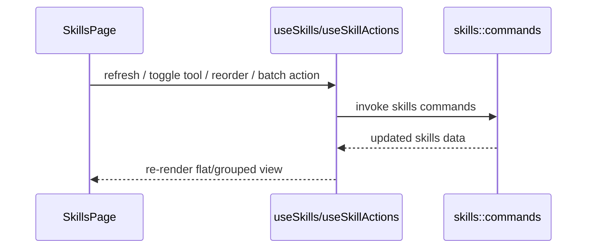

# Skills 前端模块说明

## 一句话职责

- `skills/` 页面负责技能列表、中央仓库视角下的来源展示、导入安装、批量启停和同步相关交互。

## Source of Truth

- 技能主数据以后端 Skills 中央仓库和数据库记录为准，不以前端当前排序或分组结果为准。
- grouped/flat 视图、搜索、批量选择都是纯 UI 衍生状态，不能反向当成业务事实。
- 技能来源标签展示的是中心存储的 `source_type/source_ref` 语义，不是工具运行时目录扫描结果本身。
- `user_group/user_note` 是 AI Toolbox 内部的用户管理元数据，事实源是后端 `skill` 记录，不是 `SKILL.md` 或工具运行时目录。

## 核心设计决策（Why）

- 页面默认站在“中央仓库”视角组织技能，而不是站在某一个工具目录视角，因为真正的 source of truth 是中央仓库。
- grouped view 按来源分组，flat view 按单个 skill 操作；两种视图服务不同任务，不能强行合并成一种。
- 自定义分组只影响页面组织和搜索，不改变中央仓库目录结构，也不改变同步到各工具的目标路径。
- 批量操作和拖拽排序是相邻高频场景，因此交由 `useSkillActions` 集中处理，避免页面里散落大量 mutation 逻辑。

## 关键流程

## 易错点与历史坑（Gotchas）

- 不要把工具当前 skills 目录当成源目录。页面展示和操作都应默认以中央仓库为中心。
- 不要把自定义分组和来源分组混为同一个业务概念；来源分组来自 `source_type/source_ref`，自定义分组来自 `user_group`。
- grouped view 的展开状态、搜索过滤和选择集都是 UI 派生状态，刷新时只能做裁剪，不能把它们误当成业务配置保存。
- 组工具模式只是自定义分组视图里的前端批量控制模式。开启时可按组内工具并集补齐各 Skill，但不能新增配置组/Profile 事实源，也不能应用到来源分组、未分组或搜索后的局部结果；卡片工具列表仍展示，但卡片内工具添加/移除入口应只读禁用，点击时提示用户到分组标题后操作。
- 批量操作改动较大时，别忘了刷新列表，否则 grouped/flat 两种视图很容易出现旧状态残留。
- Skills 管理页面向几百个条目时应优先使用 shared `management/VirtualGrid` 和按需菜单；普通浏览/分组展开可以虚拟化，拖拽排序模式保持完整列表渲染，避免虚拟化与 dnd-kit 排序语义冲突。
- Skills 管理页、列表、分组和卡片的主交互面应保持轻量原生控件风格，不要重新把 AntD `Button/Input/Segmented/Dropdown/Tooltip/Collapse/Empty/Spin/Tag/Checkbox` 引回这些高频列表 surface；复杂 modal 表单可另行按 modal 规则处理。

## 跨模块依赖

- 依赖后端 `skills::commands` 和 `skills` 模块已有的中央仓库、同步引擎语义。
- 依赖 `useSkillsStore`、`useSkills`、`useSkillActions` 和多个 modal 组件。
- 与 `wsl/`、`ssh/`、`skills/` 后端紧密相关，但前端自身不负责决定同步目标路径。

## 典型变更场景（按需）

- 改分组逻辑时：
  先确认是在改展示分组，还是在改业务来源语义；这两者不要混。
- 改批量操作时：
  同时检查 selection 清理、分组视图和 refresh 行为。

## 最小验证

- 至少验证：搜索、平铺/分组切换、批量选择、批量刷新/删除仍一致工作。
- 至少验证：导入或安装新 skill 后列表能回到中央仓库视角正确展示。
