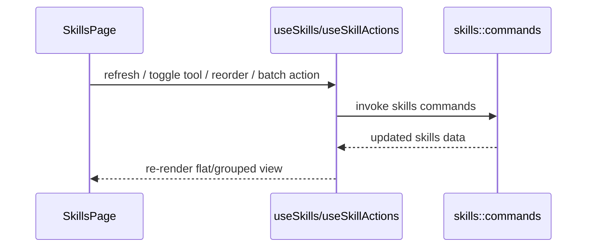

# Skills 前端模块说明

## 一句话职责

- `skills/` 页面负责技能列表、中央仓库视角下的来源展示、导入安装、批量启停和同步相关交互。

## Source of Truth

- 技能主数据以后端 Skills 中央仓库和数据库记录为准，不以前端当前排序或分组结果为准。
- grouped/flat 视图、搜索、批量选择都是纯 UI 衍生状态，不能反向当成业务事实。
- 技能来源标签展示的是中心存储的 `source_type/source_ref` 语义，不是工具运行时目录扫描结果本身。
- 手动分组事实源是后端 `skill_group` 表和 `skill.group_id`；`user_group` 只是旧数据/展示兼容字段，不要再把 group name 当业务身份。
- `user_note`、`management_enabled`、`disabled_previous_tools` 是 AI Toolbox 内部用户管理元数据，事实源是后端 `skill` 记录，不是 `SKILL.md` 或工具运行时目录。
- Skill description 只来自后端对中央仓库 `SKILL.md` frontmatter 的缓存解析；前端不能把 description 写回 DB，也不能塞进 Inventory JSON。

## 核心设计决策（Why）

- 页面默认站在“中央仓库”视角组织技能，而不是站在某一个工具目录视角，因为真正的 source of truth 是中央仓库。
- grouped view 按来源分组，flat view 按单个 skill 操作；两种视图服务不同任务，不能强行合并成一种。
- 自定义分组只影响页面组织和搜索，不改变中央仓库目录结构，也不改变同步到各工具的目标路径。
- 手动分组是 first-class registry，用稳定 `group_id` 维护归属；应用内重命名 group 只改分组记录，组内 skill 归属保持不变。
- Inventory JSON 是完整管理清单覆盖语义，不是局部 patch，也不是 skill 内容备份；导入导出只改管理元数据和工具同步状态，不改写中央仓库内容。
- 批量操作和拖拽排序是相邻高频场景，因此交由 `useSkillActions` 集中处理，避免页面里散落大量 mutation 逻辑。

## 关键流程

## 易错点与历史坑（Gotchas）

- 不要把工具当前 skills 目录当成源目录。页面展示和操作都应默认以中央仓库为中心。
- 不要把自定义分组和来源分组混为同一个业务概念；来源分组来自 `source_type/source_ref`，手动分组来自 `skill_group` + `group_id`，`user_group` 只用于兼容展示。
- grouped view 的展开状态、搜索过滤和选择集都是 UI 派生状态，刷新时只能做裁剪，不能把它们误当成业务配置保存。
- 组工具模式只是自定义分组视图里的前端批量控制模式。开启时可按组内工具并集补齐各 Skill，但不能新增配置组/Profile 事实源，也不能应用到来源分组、未分组或搜索后的局部结果；卡片工具列表仍展示，但卡片内工具添加/移除入口应只读禁用，点击时提示用户到分组标题后操作。
- 组工具模式里的“统一并开启”和分组标题 `+` 添加工具，都是用户已确认的分组级写入路径；补齐缺失工具时应显式覆盖工具目录中同名但未被当前 DB `sync_details` 记录的目标，避免裸 `TARGET_EXISTS|...` 中断。普通单项/批量同步仍保留默认非覆盖防护。
- 批量操作改动较大时，别忘了刷新列表，否则 grouped/flat 两种视图很容易出现旧状态残留。
- `management_enabled=false` 的 skill 仍保留在原分组内；禁用筛选只是 UX 派生状态。禁用入口不能让“重新启用”菜单也被禁用，否则用户无法恢复。
- `management_enabled=false` 的 skill 不能被批量添加工具、组工具模式补齐、新工具同步等前端批量入口重新同步；这些入口应跳过禁用项，后端 `skills_sync_to_tool` 仍是最终保护线。
- 重新启用 skill 时要用后端返回/记录的 `disabled_previous_tools` 让用户确认恢复哪些工具，再复用现有 `skills_sync_to_tool`；不要在前端新增一套 Inventory 导入时的工具可用性阻断逻辑。
- Inventory JSON 导出必须始终导出完整清单，包括当前被筛选隐藏或禁用的 skill；JSON 不包含内部 `group_id` 和 `description`，skill 通过 group name 引用分组。主交互采用文件导出/文件导入，不在 modal 中粘贴大段 JSON。
- Inventory JSON 导入是完整 desired-state 覆盖：`enabled_tools` 需要真正对齐工具同步状态；未出现在清单里的本地 skill 默认禁用时不要保留旧 `group_id/user_group`，否则会重新冒出不在 registry 里的 legacy 分组。
- “复制给 AI 整理”应复制面向文件工具的 prompt：先确保有导出的 `~/skill-group-{timestamp}.json` 路径，再要求 agent 读取该文件并输出/写入可导入 JSON 文件，避免聊天框承载巨型 JSON。
- Skill 卡片里的打开路径交互必须以中央仓库 `central_path` 作为稳定 fallback：本地来源 `source_ref` 可能已经不存在；打开目录用 Tauri opener 的 `openPath` 更稳，定位 `SKILL.md` 时不要硬编码 `\\SKILL.md`，应保留当前路径风格拼接分隔符。
- 单项/批量输入不存在的分组名时，应先调用 `skills_save_group` 创建 first-class group，再把 skill 绑定到返回的稳定 id；不要静默保存成未分组。
- Skills 管理页面向几百个条目时应优先使用 shared `management/VirtualGrid` 和按需菜单；普通浏览/分组展开可以虚拟化，拖拽排序模式保持完整列表渲染，避免虚拟化与 dnd-kit 排序语义冲突。
- Skills 管理页、列表、分组和卡片的主交互面应保持轻量原生控件风格，不要重新把 AntD `Button/Input/Segmented/Dropdown/Tooltip/Collapse/Empty/Spin/Tag/Checkbox` 引回这些高频列表 surface；复杂 modal 表单可另行按 modal 规则处理。

## 跨模块依赖

- 依赖后端 `skills::commands` 和 `skills` 模块已有的中央仓库、同步引擎语义。
- 依赖 `useSkillsStore`、`useSkills`、`useSkillActions` 和多个 modal 组件。
- 与 `wsl/`、`ssh/`、`skills/` 后端紧密相关，但前端自身不负责决定同步目标路径。

## 典型变更场景（按需）

- 改分组逻辑时：
  先确认是在改展示分组，还是在改业务来源语义；这两者不要混。
- 改 Inventory JSON 时：
  同时检查文件导出、文件选择、preview、apply、确认弹窗和重新读取列表；特别确认未匹配本地 skill 的默认禁用数量会展示给用户。
- 改禁用/恢复逻辑时：
  同时检查卡片菜单可用性、历史工具恢复确认、group 归属是否保持不变，以及工具同步入口是否仍复用后端既有错误处理。
- 改批量操作时：
  同时检查 selection 清理、分组视图和 refresh 行为。

## 最小验证

- 至少验证：搜索、平铺/分组切换、批量选择、批量刷新/删除仍一致工作。
- 至少验证：导入或安装新 skill 后列表能回到中央仓库视角正确展示。
- 涉及 Inventory JSON 或禁用状态时，至少验证：导出完整清单文件、复制整理 prompt、选择 JSON 文件预览导入、确认默认禁用数量、apply 后刷新列表、禁用 skill 仍留在原分组、重新启用可恢复历史工具。
