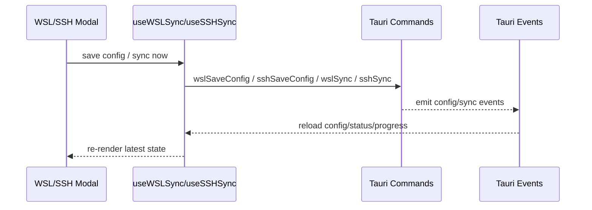

# Settings 前端模块说明

## 一句话职责

- `web/features/settings/` 负责应用设置页、WSL Sync、SSH Sync 以及备份恢复相关前端交互。

## Source of Truth

- 设置页的持久化数据主来源是后端 Tauri 命令和 SurrealDB，不允许前端自己持久化到 localStorage。
- WSL/SSH 设置页中的 `moduleStatuses` 来自后端统一计算，不是前端基于路径字符串自己推导。
- WSL 与 SSH 虽然都会消费 `moduleStatuses`，但 skip 规则不同：WSL 会基于 `isWslDirect` 构造 `skipModules`，SSH 只会按可见模块构造 `skipModules`，不会因为 `isWslDirect` 禁用模块。
- 同步结果、进度和警告都来自事件：`wsl-config-changed`、`wsl-sync-completed`、`wsl-sync-progress`、`ssh-config-changed`、`ssh-sync-completed`、`ssh-sync-progress`。

## 核心设计决策（Why）

- WSL 和 SSH 前端看起来相似，但产品语义不同：WSL 有自动同步和 WSL Direct 跳过逻辑；SSH 当前以手动同步为主。
- 默认 mappings 的初始化放在 hook 里做一次性补全，避免后端返回空映射后页面无法操作。
- WSL/SSH 模块 tab 的可见性依赖 `visibleTabs`，这样同步 UI 和主功能页的启用范围保持一致。

## 关键流程

## 易错点与历史坑（Gotchas）

- WSL 设置页里 `isWslDirect` 模块需要禁用相关映射编辑和手动同步入口；SSH 设置页不要照抄这套禁用逻辑。
- SSH 设置页可以显示 WSL UNC 本地路径，但这只是展示优化，不代表 SSH 模块也具备 WSL 那套自动同步语义。
- `skipModules` 在两个页面里的来源不同。WSL 的 `skipModules` 包含 WSL Direct 模块，SSH 的 `skipModules` 只反映当前不可见模块；不要把一边的 hook 逻辑复制到另一边。
- `visibleTabs` 现在可能包含 `image`。它只控制顶栏 `Image` 入口是否显示，不是可同步 runtime 模块；WSL/SSH 的 `skipModules`、模块状态和 mappings 仍只围绕 4 个 coding runtime + WSL/SSH 自身语义，不要把 `image` 塞进去。
- 同步文案翻译要走 `syncMessageTranslator`，不要在组件里硬编码后端错误文本。

## 跨模块依赖

- 依赖 `@/services/wslSyncApi`、`@/services/sshSyncApi` 和对应 hooks。
- 依赖 `useSettingsStore().visibleTabs` 来决定哪些模块应出现在同步 UI 中。
- 与 4 个 coding 页面共享 `moduleStatuses` 语义，但不共享同一状态对象实例。

## 典型变更场景（按需）

- 改 WSL/SSH 交互时：
  先确认是状态语义变化还是纯 UI 调整，避免把 WSL 行为误复制到 SSH。
- 改 `moduleStatuses` 消费时：
  同时检查 WSL modal 的置灰、tooltip、`skipModules`，以及 SSH modal 的 UNC 展示是否仍符合当前产品语义。
- 新增同步事件时：
  同时更新 hook 监听和结果提示翻译。

## 最小验证

- 至少验证：打开设置页能正常加载 config、status 和默认 mappings。
- 至少验证：WSL Direct 模块在 WSL 设置页被置灰，但在 SSH 设置页仅改变本地路径显示。
- 至少验证：手动点击 Sync Now 时能看到进度和完成状态更新。
