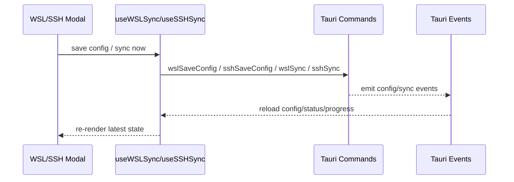

# Settings 前端模块说明

## 一句话职责

- `web/features/settings/` 负责应用设置页、WSL Sync、SSH Sync 以及备份恢复相关前端交互。

## Source of Truth

- 设置页的持久化数据主来源是后端 Tauri 命令和 SQLite JSONB，不允许前端自己持久化到 localStorage。
- WSL/SSH 设置页中的 `moduleStatuses` 来自后端统一计算，不是前端基于路径字符串自己推导。
- WSL 与 SSH 虽然都会消费 `moduleStatuses`，但 skip 规则不同：WSL 会基于 `isWslDirect` 构造 `skipModules`，SSH 只会按可见模块构造 `skipModules`，不会因为 `isWslDirect` 禁用模块。
- 同步结果、进度和警告都来自事件：`wsl-config-changed`、`wsl-sync-completed`、`wsl-sync-progress`、`ssh-config-changed`、`ssh-sync-completed`、`ssh-sync-progress`。
- Skills 同步警告有两条展示路径：`wsl-sync-warning` / `ssh-sync-warning` 事件在同步过程中实时展示在弹窗（`syncWarning`，可关闭）；Skills 链路结束后持久化的 `status.lastSyncWarnings` 在 WSL/SSH 弹窗内常驻展示（warning Alert 列表）。警告文案经 `syncMessageTranslator` 的 `skills*` 正则模式翻译，新增后端警告格式时必须同步补翻译模式和 i18n key。

## 核心设计决策（Why）

- WSL 和 SSH 前端看起来相似，但产品语义不同：WSL 有自动同步和 WSL Direct 跳过逻辑；SSH 当前以手动同步为主。
- 默认 mappings 的初始化放在 hook 里做一次性补全，避免后端返回空映射后页面无法操作。
- WSL/SSH 模块 tab 的可见性依赖 `visibleTabs`，这样同步 UI 和主功能页的启用范围保持一致。

## 关键流程

```mermaid
sequenceDiagram
  participant Modal as WSL/SSH Modal
  participant Hook as useWSLSync/useSSHSync
  participant Cmd as Tauri Commands
  participant Events as Tauri Events

  Modal->>Hook: save config / sync now
  Hook->>Cmd: wslSaveConfig / sshSaveConfig / wslSync / sshSync
  Cmd-->>Events: emit config/sync events
  Events-->>Hook: reload config/status/progress
  Hook-->>Modal: re-render latest state
```

## 易错点与历史坑（Gotchas）

- 数据目录设置区必须分别呈现本进程 `effective/is_custom` 与下次启动 `next_start/restart_required`；不能用保存的 override 标记当前目录，也不能把“稍后重启”说成撤销保存。待生效状态常驻提供重启和撤销入口。目录选择、保存和重置须互斥；后端保存成功响应直接返回最新状态，失败保留当前路径并呈现具体错误。
- 自定义数据目录只切换应用自己的数据根目录，不自动迁移数据，不覆盖外部 CLI/独立 Skills 路径。迁移引导要先恢复 Gateway 直连，并明确备份范围；重启失败要保留待生效状态且可重试。

- WSL 设置页里 `isWslDirect` 模块需要禁用相关映射编辑和手动同步入口；SSH 设置页不要照抄这套禁用逻辑。
- dsh/Hermes 也消费同一 `moduleStatuses`，不能因工具自行解析配置目录而漏掉 Direct 状态。保存/清除目录会发出 `wsl-config-changed` 刷新设置页；后端在同步开始时仍会重读 Direct 集合，首次启用不能依赖 UI 快照。
- SSH 设置页可以显示 WSL UNC 本地路径，但这只是展示优化，不代表 SSH 模块也具备 WSL 那套自动同步语义。
- `skipModules` 在两个页面里的来源不同。WSL 的 `skipModules` 包含 WSL Direct 模块，SSH 的 `skipModules` 只反映当前不可见模块；不要把一边的 hook 逻辑复制到另一边。
- `visibleTabs` 现在可能包含 `gateway` 和 `image`。它们只控制顶栏 `网关` / `Image` 入口是否显示，不是可同步 runtime 模块；WSL/SSH 的 `skipModules`、模块状态和 mappings 仍只围绕 coding runtime（OpenCode / Claude Code / Codex / Grok CLI / OpenClaw / Gemini CLI）+ WSL/SSH 自身语义，不要把 `gateway` 或 `image` 塞进去。
- 同步文案翻译要走 `syncMessageTranslator`，不要在组件里硬编码后端错误文本。
- Skills 目标既可能是链接，也可能是带归属标记的复制目录；警告统一称“同步目标”，翻译解析仍兼容已持久化的旧“链接”警告。
- Skills 警告需要先按完整文案解析，再处理通用的 `; ` 错误拼接；技能名/路径本身允许分号和引号，命令诊断可能包含换行，不能先拆分或使用不匹配换行的表达式。`lastSyncWarnings` 表示最近一次 Skills 同步，普通文件/MCP 同步不清空它；开始新的手动同步或 Skills 阶段时清理旧实时警告，状态读回已有同条常驻警告时移除重复实时提示。
- 设置项如果同时有数据库偏好和系统副作用（例如开机自启），用户偏好必须先落库，系统调用失败不能阻止偏好保存。一个用户动作需要联动多个字段时，应构造一次 settings payload 保存，避免多个异步全量保存互相覆盖。
- 防休眠开关的完整“读取偏好 → 保存 → 应用系统状态”流程必须串行执行。`save_settings` 保存后会等待托盘刷新，而合并刷新可能让后发请求先返回；不能只依靠后端系统调用互斥来保证最后一次操作生效。操作期间显示 loading/disabled，失败后解除忙碌状态并允许重试。
- 防休眠开关显示持久化偏好；系统应用失败时保留已保存的偏好，单独显示可访问的行内错误，不能让 rejected Promise 静默消失，也不能把尚未保存的值显示成已保存。启动恢复失败必须记录后端日志；系统资源的线程归属遵守根文档的 Async Runtime Safety 规则。
- Gateway 设置页会按 `appProxyConfigKeys` 判断每 CLI 的 `app_configs` 是否为空。后续给 `AppProxyConfig` 增加字段时必须同步更新这个 key 集合，否则设置页清空超时/重试字段时可能误删相邻功能保存的配置。
- Gateway 的“数据脱敏”分区委托 gateway 模块组件处理，使用独立 privacy 配置命令；不能放进此页普通 settings 的全量自动保存 payload。开关和规则分别更新，本地预览不启用实际流量处理，详细规则见 `web/features/coding/gateway/AGENTS.md`。
- Gateway 设置页的 `ProxyGatewaySettings` 运行态开关必须和后端字段同步暴露；例如 `lossy_rejection_enabled` 是用户控制“有损转换是否直接 400”的开关，默认关闭，UI 放在“转发与容错 / 请求整流”里 `Thinking budget 修正` 下方。
- Codex WebSocket 总开关位于“转发与容错 / 传输方式”，默认关闭，沿用普通网关 settings 的自动保存；保存期间禁用操作，后端保存响应作为持久化状态。说明需保留“关闭后新连接走 HTTP/SSE、已有连接空闲后关闭；开启后新建 Codex 会话或重启客户端重试”的边界，不能把开关开启描述成所有请求强制 WS，也不能通过切换开关改写 CLI 接管配置。
- Gateway 的 Claude Thinking 整流和 OpenAI Responses `encrypted_content` 恢复是两个独立运行态开关：前者只控制 `thinking_rectifier_enabled`，后者只控制 `responses_encrypted_content_rectifier_enabled`。新增恢复策略时不能借用名称或说明仅覆盖其他协议的既有开关。
- 本地/WebDAV restore 成功后，前端内存 store、路由可见性和模块缓存都可能与新数据库不一致；成功弹窗必须强制用户重启/刷新应用，不能提供可关闭后继续使用旧内存态的路径。

## 跨模块依赖

- 依赖 `@/services/wslSyncApi`、`@/services/sshSyncApi` 和对应 hooks。
- 依赖 `useSettingsStore().visibleTabs` 来决定哪些模块应出现在同步 UI 中。
- 与 coding runtime 页面共享 `moduleStatuses` 语义，但不共享同一状态对象实例。

## 典型变更场景（按需）

- 改 WSL/SSH 交互时：
  先确认是状态语义变化还是纯 UI 调整，避免把 WSL 行为误复制到 SSH。
- 改 `moduleStatuses` 消费时：
  同时检查 WSL modal 的置灰、tooltip、`skipModules`，以及 SSH modal 的 UNC 展示是否仍符合当前产品语义。
- 新增同步事件时：
  同时更新 hook 监听和结果提示翻译。

## 最小验证

- Skills 警告翻译回归位于 `web/test/features/settings/utils/syncMessageTranslator.test.ts`；同步 UI 需验证有警告完成后的单次展示，以及下一次无警告同步后提示清空。
- 防休眠改动验证 `web/test/stores/keepAwakeSettings.test.ts` 和 Rust `keep_awake::tests` / `keep_awake_preference_round_trips_and_old_records_default_to_disabled`；覆盖连续开关、保存失败、系统失败后重试、跨线程释放和旧配置的默认值。
- 至少验证：打开设置页能正常加载 config、status 和默认 mappings。
- 至少验证：WSL Direct 模块在 WSL 设置页被置灰，但在 SSH 设置页仅改变本地路径显示。
- 至少验证：手动点击 Sync Now 时能看到进度和完成状态更新。
